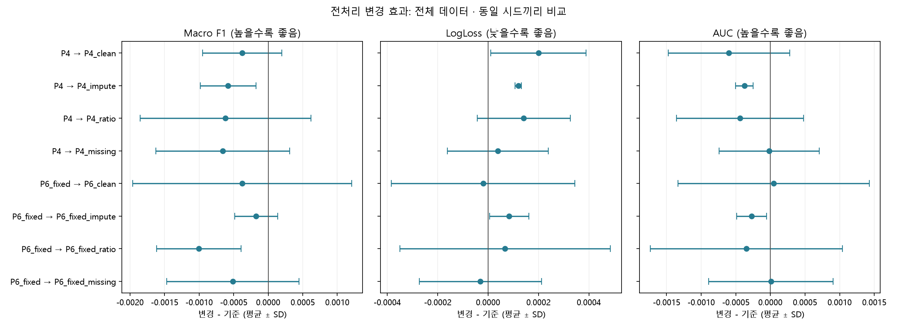
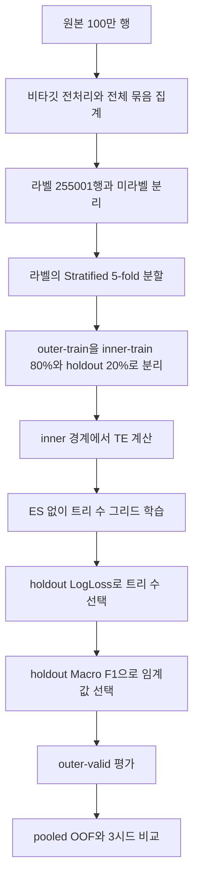

# 항공편 지연 분류와 데이터 전처리

**이 README가 프로젝트 전체 설명과 최신 상태의 기준 문서입니다.** 발표는 1~6절 순서로 진행하고, 세부 수치·실행 코드는 마지막 문서 안내에서 확인할 수 있습니다.

작성: Peter-jackson12 TF · 갱신: 2026-09-18 · 문서 버전: v0.22

> **현재 결론:** 불확실한 결측 대치와 시간 피처의 의미를 바로잡고, 검증 라벨이 모델 선택에 유입되지 않도록 파이프라인을 수정했습니다. P4/P6 및 개별 변경 조건을 전체 데이터에서 3시드로 재학습한 결과, 새 전처리의 성능 향상은 확인되지 않았습니다. 확률 보정기를 outer-train 내부에서 적합해 독립 outer-valid에서 비교한 결과, 확률의 계통 오차는 줄었지만 분류 성능(Macro F1)의 향상은 확인되지 않았습니다. 데이터 처리의 타당성, 확률의 정확성, 분류 성능은 각각 따로 평가합니다.

**로컬 재현 상태(2026-09-18):** 최신 코드 `6806551`에서 전체 테스트를 다시 실행한 결과 **379개 통과·23개 실패**입니다. 실패는 모두 Git 추적 제외된 HOMR/IEM 원본 캐시 누락에 따른 관측소 검사입니다. 아래의 과거 402개 통과 기록과 구분하며, 필요한 캐시·재현 방법은 7절에 적었습니다.

| 완료한 일 | 현재 범위 |
|---|---|
| 원본 품질 검사 | 실제 100만 행의 결측·중복·매핑·시간 정보 점검 |
| 전처리 개선 | 유일 대응 대치, 안전한 시간차 비율, 원래 결측 이력 보존 |
| 검증 구조 수정 | inner 경계 TE, nested 트리 수 선택, 내부 임계값 선택 |
| 성능 재검증 | P4/P6와 개별 변경: 10조건 × 3시드 × 5-fold |
| 라벨 대표성 진단 | 라벨·미라벨의 구성비·결측률 비교 |
| 행별 OOF·오분류·확률 진단 | P6_fixed/P6_clean × 3시드, 원본 결측별 성능·반복 오류·보정 상태 분석 |
| 오분류 기술 분석 | 약한 그룹과 반복 오류의 원본 특성·확률 분포 기술. 재학습 없음 |
| 확률 보정 실험 | 보정기를 outer-train 내부에서 적합, 독립 outer-valid로 2조건 × 3시드 × 2방식 비교 |
| 날짜 달력 구조 확인 | 미국 공휴일과 부합하는 신호와 추수감사절 후보 급감 쌍 두 곳을 관측. 실제 연도는 미확정 |
| 기록 정합성 검사 | 노선·기체·공항·운항사 필드의 정합성을 검사. 실제 운항편과의 동일성은 외부 대조 필요 |
| 행별 날짜 귀속 규칙 고정·적용 | 2018·2019년 Marketing Carrier 12개월 전체 대조 기반, 완전 지문 706,759행(70.68%) 채택·나머지 293,241행 보류 |
| 예측 시점·날씨 가용성 규칙 고정·검증 | 예정 출발 60분 전 계약 고정, 21행 경계 검증(20/21 결합) + 375개 공항 매핑·수집 범위 산정 + 300행 확대 표본 실수집·지연 민감도 검증(수집 가능 271행 중 10분 가정 기준 99~100% 결합) |
| 확대 검증 구현 결함·증거 과장·집계 오류 수정 | 수집 예산·재개, 결합 전 매핑 게이팅, 매핑 등급-역사적 유효성 분리, 300행 선정 편향, 기존 캐시 재진단·비용 재추정을 코드·서술로 수정(298개 테스트) |
| 재개 검증·예산 경계 마무리, 실제 캐시 재결합, 수집 범위 재산정 | 체크포인트 재검증·`plan_fingerprint`·요청 사전 예약, 21/300행 실제 재결합 비교(21행 완전 동일, 300행 의미 차이 0건), station별 구간 병합·차감 기반 재산정(531~1,049MB 시나리오 범위), 미결합 사유 3분리(323개 테스트) |
| 미측정 바이트 예산 우회·재결합 판정 모호성 수정 | 중단된 시도의 바이트도 사전 예약·정산해 누적 상한을 보장, 재결합 비교를 구조 검사+승인된 station 마스킹 예외만 통과시키는 명시적 PASS/FAIL로 교체, 산정·타이밍 표현 정정(341개 테스트, `..._recombination_fix_20260918` 재검증 PASS) |
| 체크포인트 스키마 경계·재결합 구조 우회·입력 지문 누락 수정 | 회계 의미가 바뀐 체크포인트 스키마를 버전 2로 분리해 구버전을 네트워크 호출 전에 명시적으로 거부, 바이트 동일 경로에서도 구조 검사(ID 존재·유일성·행수·순서·열 집합)를 먼저 수행하도록 재배치, 재결합이 읽는 selection_with_prediction_at.csv 2개·mapping_table.csv의 SHA-256과 재결합 코드 지문 범위를 새 manifest에 연결(354개 테스트, `..._recombination_provenance_20260918` 재검증 PASS) |
| 우선 조사 대상 20개 공항의 역사적 매핑을 공식 자료로 대조 | NOAA/NCEI HOMR(Historical Observing Metadata Repository) 대조로 ISN→XWA 시설 이전·YUM의 두 별개 관측소 확인, 9개 식별자 불일치 중 8개는 IEM 현재 목록의 실제 사용 ID(예: FCA→GPI 2005-10-25 개명)로 해소, STT/STX 시간대 충돌은 미해결 유지, SPN은 파이프라인 수집 공백으로 재확인 |
| 위 20개 조사의 증거 해석·연결 재검토 | 335→355개 표기 오류 정정, WRG·PSG를 COOP 전용 레코드(ASOS/AWOS 항목 없음)로 재확인해 `unconfirmed_program_linkage_insufficient`로 하향, YUM을 HOMR·IEM 자체 캐시 간 좌표 불일치가 남은 `identifier_mismatch_partially_resolved_source_conflict`로 하향(2021-12-16 ASOS 메타데이터 추가일을 설치일로 단정하지 않음), AZA의 실제 사용 ncdcStnId(AWOS 10000826, NEXRAD 30001870 제외)를 명시, 캐시 전용 재현·기존 캐시 재사용·새 출력명을 지원하도록 `verify_priority_station_identity.py` 수정(374개 테스트, 새 [증거표](output/baseline_recovery_v2_station_identity_review_20260918_evidence.csv)) |
| 위 20개 조사의 현재 매핑/역사적 연속성 분리, 원자료 검증을 생성 경로에 연결 | IMT·SDF·SIT를 KTN(날짜 명시 1997년 사건 보유)과 분리해 `current_facility_confirmed_historical_continuity_unconfirmed_...`로 하향, 식별자 불일치 8곳의 `inference_and_unresolved`를 "none"에서 근거 종류별(날짜 명시 FCA/PBI vs remark 부재 5곳 vs 날짜 불명 AZA)로 구체화, `main()`이 fetched HOMR JSON에서 각 판단이 인용하는 ncdcStnId·platforms를 실제로 선택·대조하고(AZA 2레코드·YUM 2파일 포함) 불일치·필수 IEM feature 누락 시 `RuntimeError`로 증거표 작성 자체를 막도록 수정(395개 테스트, 새 [증거표](output/baseline_recovery_v2_station_identity_verification_20260918_evidence.csv)) |
| PBI의 원자료 귀속 오류·식별자 검증 공백·manifest 모순 수정 | PBI의 "개명이 연구기간 이후"라는 서술이 원자료 remark가 아니라 작성자의 배경지식이었음을 확인해 `rename_confirmed_by_current_ids_undated_in_record`로 정정(FCA·KTN의 실제 날짜 명시 remark는 불변), `EXPECTED_IDENTIFIERS`로 선택된 레코드의 FAA/ICAO/NWSLI/NEXRAD 식별자를 `main()` 생성 경로에서 실제로 대조(식별자 삭제·변경 시 증거표 작성 전 `RuntimeError`), manifest limitations의 "IMT/KTN/SDF/SIT retain facility_continuity_confirmed" 모순 서술 정정(402개 테스트, 새 [증거표](output/baseline_recovery_v2_station_identity_verification_fix_20260918_evidence.csv)) |
| 미완료·범위 밖 | 독립 미래 테스트, 최종 모델 서빙, 전체 Phase의 최신 프로토콜 성능 비교, 706,759행 전체 날씨 결합·재학습, `confirmed_period` 355개 공항 공식 자료 기반 역사적 신원 확인(우선 조사 20개는 조사 완료했으나 미확인·충돌로 남은 항목이 있어 "역사적 신원 확인 완료"와는 구분됨), 새 stratafix 표본 실제 수집 |

**목차:** [1. 목적](#1-목적과문제정의) · [2. 데이터](#2-데이터와분석범위) · [3. 전처리](#3-전처리결정과근거) · [4. 파이프라인](#4-현재파이프라인) · [5. 결과](#5-최신검증결과) · [6. 한계](#6-한계와다음단계) · [7. 재현](#7-코드구조와재현) · [8. 문서안내](#8-문서안내)

<a id="1-목적과문제정의"></a>
## 1. 목적과 문제 정의

주어진 항공편 레코드의 `Delay`를 이진 분류하고, 데이터에서 무엇을 알 수 있는지와 알 수 없는지를 구분하는 재현 가능한 분석을 만드는 프로젝트입니다. 장기적으로는 운항 대응을 지원하는 예측을 지향하지만, 현재 확인한 것은 정적 데이터에서의 교차검증 결과입니다. 실제 출발 전 정보 가용성이나 운영 효과까지 검증한 것은 아닙니다.

- **분석 단위:** CSV의 한 행. ID가 유일하더라도 실제 운항편의 유일성을 보장하지는 않습니다.
- **타깃:** `Not_Delayed=0`, `Delayed=1`. 정답 미상은 음성과 구분합니다.
- **평가:** Macro F1·LogLoss, 보조 ROC-AUC. 트리 수는 내부 LogLoss, 분류 임계값은 내부 Macro F1으로 선택합니다.
- **이번 전처리의 목적:** 결측을 최대한 없애는 것이 아니라, 근거가 있는 값만 채우고 추정·미상을 구분하는 것입니다.

## 2. 데이터와 분석 범위

<a id="2-데이터와분석범위"></a>

| 항목 | 확인한 값 |
|---|---:|
| 원본 `data/train.csv` | 1,000,000행 × 19열 |
| 라벨 / 미라벨 | 255,001 / 744,999행 |
| 라벨 중 정상 / 지연 | 210,001 / 45,000행 |
| 라벨 중 지연율 | 17.6470% |
| ID 중복 / 완전 행 중복 | 0 / 0건 |

핵심 입력은 월·일, 출발/도착 시각, 공항, 항공사, 기체번호, 거리입니다. 원본 컬럼별 타입과 결측 수는 [스키마 전수표](output/label_coverage/schema.csv)에 있습니다. `Cancelled`와 `Diverted`는 관측 데이터에서 전부 0이므로 정보가 없는 상수로 제거합니다.

`Month`와 `Day_of_Month`는 있지만 연도·시간대는 파일만으로 확정할 수 없습니다. 수집기간·시각 규약·거리 단위·원천 이용 조건은 원 자료로 확인해야 합니다. 따라서 월별 비교를 연속 시계열 분석이라고 부르지 않으며, 시각차를 실제 비행시간으로 단정하지 않습니다.

### 날짜는 실제 달력이지만 한 해가 아닙니다

원본만으로 날짜 구조를 확인했습니다. 외부 자료도, 모델 학습도 쓰지 않고 365개 (월, 일) 조합의 행 수만 사용합니다.

- **365일 전부 존재하고 2월 29일은 0행**입니다. 윤년 배치가 아닙니다.
- 행 수의 **81.7%는 월이 설명**합니다. 이는 파일을 만들 때의 표본 추출 결과이며 실제 운항량이 아닙니다. 월 효과를 뺀 뒤 남는 변동의 **36.5%를 7일 주기가 설명**합니다(순열 20,000회 중 관측값 이상 0회, 귀무 99.9% 0.0583).
- 월·요일 효과를 모두 뺀 뒤 **미국의 고정 날짜 공휴일이 그대로 드러납니다**: 크리스마스 z=−4.33, 크리스마스 이브 −3.93, 독립기념일 −3.91, 핼러윈 −3.72, 신정 전야 −3.25. 여행 수요와 무관한 밸런타인데이·재향군인의 날은 z≈0입니다. **`Month`·`Day_of_Month`는 실제 미국 달력 날짜입니다.**
- 추수감사절은 11월 넷째 목요일이라 해마다 날짜가 바뀝니다. 목요일 급감과 다음 날 급감이 함께 나타나는 쌍을 찾으면 **두 개**가 나옵니다 — **11/22–23**(z −4.93, −3.12)과 **11/28–29**(z −3.85, −2.62).

한 해에 추수감사절은 하나뿐이므로, **이 파일은 요일 배치가 다른 최소 두 해가 섞여 있습니다.** 11/22는 1월 1일이 월요일인 평년(2007·2018), 11/28은 화요일인 평년(2013·2019)에 해당합니다. 달력 구조만으로는 같은 요일 배치를 가진 연도들을 구별할 수 없으므로 연도 자체는 확정되지 않습니다. 참고로 과거 날씨 결합이 가정했던 2022년은 추수감사절이 11/24인데 그날 z=+1.87로 급감이 없어, 데이터가 그 가정과 어긋납니다.

**급감 쌍이 관측되는 배치는 두 곳입니다.** 7개 요일 배치 각각의 추수감사절 목·금·수 z를 모두 놓고 보면 목·금 급감 쌍은 두 곳에서만 성립합니다. 이는 섞인 실제 연도가 정확히 둘이라는 증명은 아닙니다.

| 1월 1일 | 추수감사절 후보 | 목 z | 금 z | 전날(수) z | 급감 쌍 |
|---|---|---:|---:|---:|---|
| 월 | 11/22 | **−4.93** | **−3.12** | +1.56 | 성립 |
| 일 | 11/23 | −3.12 | +1.87 | −4.93 | 11/22의 다음 날이라 중복 |
| 토 | 11/24 | +1.87 | +1.31 | −3.12 | 없음 |
| 금 | 11/25 | +1.31 | +1.01 | +1.87 | 없음 |
| 목 | 11/26 | +1.01 | +1.42 | +1.31 | 없음 |
| 수 | 11/27 | +1.42 | −3.85 | +1.01 | 없음(금 급감은 11/28 본체) |
| 화 | 11/28 | **−3.85** | **−2.62** | +1.42 | 성립 |

나머지 네 후보는 급감이 없는 정도가 아니라 z가 **+1.0~+1.9로 오히려 높습니다.** 성립한 두 배치의 전날(수요일)은 +1.56·+1.42로, 추수감사절 전날 이동 수요가 몰리는 모습과 맞습니다.

급감 깊이가 그 배치의 행 비중에 비례한다고 보면 비중은 **11/22 계열 0.5615, 11/28 계열 0.4385**이고, 한 배치만으로 이루어진 파일의 급감 깊이는 z로 약 8.8에 해당합니다. 같은 가정에서 세 번째 배치의 미검출 상한 추정은 **0.1139(약 11.4%)**입니다(검출 기준 z≤1; 기준을 z≤2로 느슨하게 잡으면 0.2278). 비중은 가정 위의 추정이지 측정이 아니고, 상한은 부재의 증명이 아닙니다. **아래 BTS 대조에서 이 비중이 달마다 다르다는 것이 실측됐습니다** — 11월은 0.5838로 위 추정과 가깝지만 2월은 0.3926, 7월은 0.4253입니다. 따라서 이 값을 파일 전체의 비율로 쓰지 않습니다.

노동절은 도구로 쓰지 않았습니다. 연휴가 토~월 사흘에 걸쳐 서로 다른 배치의 급감이 같은 날짜에 겹치므로 귀속이 되지 않습니다. 실제로 9/1(z −3.47)과 9/2(−2.82)가 함께 낮은데, 이는 한 배치의 노동절 주말로도 두 배치의 중첩으로도 설명됩니다.

행 수는 파일의 구성에 대한 증거이지 실제 운항량에 대한 증거가 아니며, 공휴일 신호는 관측된 기술이지 인과의 증명이 아닙니다. 위 z는 요일 주기를 하나만 제거하는 분해에서 나온 값이라, 두 배치가 겹친 이 파일에서는 근사입니다 — 날짜끼리 비교하는 데는 쓸 수 있지만 절대적인 깊이로 읽지 않습니다. [재현 코드](notebooks/analyze_calendar_signature.py), [혼합 분석 코드](notebooks/analyze_calendar_mixture.py), [일별 분해](output/baseline_recovery_v2_calendar_signature_20260917_daily.csv), [추수감사절 후보](output/baseline_recovery_v2_calendar_signature_20260917_thanksgiving.csv), [배치별 비교](output/baseline_recovery_v2_calendar_mixture_20260917_alignments.csv), [실행 지문](output/baseline_recovery_v2_calendar_mixture_20260917_manifest.json)

### 라벨이 전체 데이터를 대표하는가

라벨 유무별로 원본 분포를 전수 비교했습니다.

- 타깃을 제외한 결측률의 최대 절대 차이는 Airline의 **+0.1235%p**(미라벨−라벨)였습니다.
- 월·항공사·출발/도착 공항 중 최대 총변동거리(TV)는 출발 공항의 **0.018086**이었습니다. TV는 두 집단의 구성비 차이를 요약하며, 0이면 관측 분포가 같습니다.
- 라벨에 없는 기체번호가 미라벨 **407행(0.054631%)**에 있었습니다.
- 일부 그룹의 라벨 보유율은 다릅니다. 도착 EUG는 **20.7721%**(226/1,088)로 전체 **25.5001%**보다 낮았습니다.

관측한 주요 주변분포는 대체로 가깝지만, 라벨이 무작위로 선정되었다거나 미라벨의 지연율·예측 성능이 같다는 증거는 아닙니다. 이번 CV 결과의 직접 평가 대상은 라벨 255,001행입니다. [분포 진단과 실행 근거](output/label_coverage_review.md)

### 기록의 필드 정합성을 검사했습니다

모델링은 줄곧 "한 행 = 실제 항공편 하나이고 필드들이 서로 맞는다"를 전제해 왔는데, 이걸 확인한 적이 없었습니다. 진짜 운항 자료라면 지켜져야 할 제약을 원본에서 직접 검사했습니다.

| 검사 | 지켜진 비율 | 예외 |
|---|---:|---|
| 노선당 거리값 1개 | 6,632 / 6,709 (98.85%) | 77개 노선이 1~2마일 차이 (예: ABE→ORD 654 / 655) |
| 기체번호당 운항사 1곳 | 6,250 / 6,424 (97.29%) | 174대 (예: N12163이 ExpressJet·CommutAir 양쪽) |
| 공항당 주 1개 | 374 / 374 (100%) | 없음 |
| 공항코드 ↔ 공항ID | 374 / 374 (100%, 양방향) | 없음 |
| 운항사ID당 항공사명 1개 | 28 / 28 (100%) | 없음 |

거리 차이는 1~2마일이고, 기체 174대는 복수 DOT ID에 대응합니다. 거리 정의 변경이나 기체 이관은 가능한 설명이지만, 이 검사만으로 원인을 확인한 것은 아닙니다. 제약 충족은 필드 정합성을 지지하는 증거이며, 각 행이 실제 운항편 하나와 동일하다는 증명은 아닙니다.

`Carrier_Code(IATA)`에는 AA 10곳, UA 10곳, DL 7곳처럼 여러 항공사명이 대응합니다. **이 절 아래의 BTS 대조에서 판매/운항 항공사 구분으로 확인됐습니다** — `Carrier_ID(DOT)`가 실제 운항사, `Carrier_Code(IATA)`가 판매 항공사입니다. `Carrier_ID(DOT)`와 항공사명은 관측 자료에서 28:28로 1:1이므로, 이 자료의 항공사 그룹 식별에는 DOT ID를 사용합니다.

### 검사한 두 열에서는 달력 구분 기준을 충족하지 못했습니다

섞인 두 달력을 행 단위로 가르려면, 두 달력에서 값이 달라지는 열이 있어야 합니다. 한 달력이 자기 추수감사절에 눌리면 그날은 다른 달력 쪽이 짙어지므로, 달력을 가르는 열이라면 두 날짜에서 **반대 방향으로** 움직여야 합니다.

두 후보를 검사했습니다.

- **운항사(DOT ID) 24곳** — 두 날짜에서 반대 방향으로 각각 |z|≥2인 구분 기준을 충족한 곳이 없습니다. 방향 자체가 반대인 사례는 있으며, 이 결과가 구성의 동일성을 증명하지는 않습니다.
- **거리값이 두 개인 노선의 낮은 값 / 높은 값** — 11/22에 z −0.06 / +0.06, 11/28에 +0.13 / −0.13으로 차이가 없습니다.

즉 **검사한 두 열과 이 기준에서는 행별 연도 귀속 방법을 확보하지 못했습니다.** 다른 열이나 방법으로도 불가능하다는 증명은 아닙니다. 사건별 날씨 결합을 위한 다음 검증은 BTS 원본 대조입니다. [재현 코드](notebooks/analyze_record_integrity.py), [제약 검사](output/baseline_recovery_v2_record_integrity_20260917_constraints.csv), [구성 변화](output/baseline_recovery_v2_record_integrity_20260917_separation.csv)

### BTS 11월 원본과의 첫 대조 (2026-09-17)

사용자가 받은 BTS Reporting Carrier 월별 ZIP 네 개(2007·2013·2018·2019년 11월, 합계 114,104,772바이트)의 CRC와 연도·월을 확인했습니다. 파일은 `data/bts/`에 보관하며 Git 추적에서 제외합니다. 이 절은 앞의 내부 달력 분석과 구별되는 **외부 자료 대조**이며, 모델 재학습과 날씨 결합은 수행하지 않았습니다.

원본 11월 96,710행 중 기체·양 공항·월·일·거리·DOT ID·두 시각이 모두 관측된 **68,283행**을 대상으로, 모든 키가 정확히 일치하는 BTS 행을 찾았습니다. 결측 키가 있는 28,427행은 이번 대조에서 제외했으며 불일치로 세지 않았습니다. 타깃과 지연 필드는 사용하지 않았고, 예정 시각(CRS)과 실제 시각은 별도로 비교했습니다.

| BTS 연도 | 예정 시각 정확 일치 | 대상 68,283행 대비 | 실제 시각 정확 일치 |
|---|---:|---:|---:|
| 2007 | 0 | 0% | 0 |
| 2013 | 0 | 0% | 0 |
| 2018 | 36,605 | 53.61% | 58 |
| 2019 | 26,184 | 38.35% | 30 |

예정 시각 기준으로 **62,777행(91.94%)**이 하나 이상의 후보와 일치했습니다. 이 중 **62,765행은 후보 연도 한 곳**, **12행은 두 연도**에 일치하며 **5,506행은 미일치**입니다. 후보 연도 내부에서 복수 BTS 행에 일치하는 경우는 없었습니다. DOT ID를 제외한 진단용 대조에서도 일치 행 수는 같았습니다. 기존 240개 지문 중 이번 범위인 11월 20개는 모두 일치했습니다(2018년 15개, 2019년 5개). 다른 달 220개는 검사하지 않았습니다.

대조 대상은 26개 DOT ID·5,437개 노선입니다. 2018년 일치는 17개 DOT ID·4,753개 노선, 2019년 일치는 17개 DOT ID·4,565개 노선에 걸칩니다. 일치는 특정 한두 항공편에 한정되지 않으며, 원본 Estimated 시각이 BTS 예정 시각에 대응한다는 강한 증거입니다. 다만 미일치 행의 원인은 보고 범위·열 변환·다른 연도 등으로 나누어 추가 확인해야 합니다. 0건 일치는 해당 연도가 전체 데이터에 전혀 없다는 증명이 아닙니다. 연도가 겹치는 12행, 결측 키 행, 다른 달은 날짜를 확정하지 않았습니다.

재현 코드의 잘못된 날짜·시각·DOT ID 배제, 중복 행 개수, 결측 키, 기체번호 접두사 보존 검사는 **4개 통과**했습니다. 기존 193개 테스트와 별도로 실행했습니다. [대조 요약](output/baseline_recovery_v2_bts_november_20260917_summary.csv), [항공사·노선별 결과](output/baseline_recovery_v2_bts_november_20260917_groups.csv), [입력 해시·범위·한계](output/baseline_recovery_v2_bts_november_20260917_manifest.json). 행별 근거는 `data/bts/baseline_recovery_v2_bts_november_20260917/matches.csv.gz`에 로컬 보관합니다.

### 11월 미일치 5,506행은 자료 범위로 설명됩니다 (2026-09-17)

미일치의 원인을 찾기 위해 대조 키를 단계적으로 완화해 어느 필드에서 어긋나는지 확인했습니다. 완화한 키의 일치는 **진단용 후보**이며 확정된 일치로 다루지 않고 어떤 행에도 연도를 부여하지 않습니다.

**어긋난 것은 필드 값이 아니라 자료의 수록 범위였습니다.** 거리를 빼도, 운항사 ID를 빼도, 두 시각을 모두 빼도 미일치 5,506행에서 새로 생기는 일치는 0행입니다. 날짜·기체·노선만 남겨도 후보가 생긴 행은 2018년 기준 1행뿐입니다. 반대로 날짜·노선만 남기면 65.7%가 후보를 얻습니다. 즉 **이 행들의 노선은 BTS에 있지만 해당 운항편 자체가 파일에 없습니다.**

원인은 운항사입니다. 미일치 5,506행 중 **5,494행(99.78%)**이 네 개 BTS 파일 어디에도 등장하지 않는 **DOT ID 9개**에 속하고, 이 9개는 각각 미일치율이 100%입니다.

| DOT ID | 원본 `Airline` 이름 | 판매 코드 | 주요 출발 공항 | 대상 행 | 미일치 |
|---:|---|---|---|---:|---:|
| 19687 | Horizon Air | AS | SEA, PDX | 968 | 968 |
| 20427 | Capital Cargo International | AA | PHL, CLT | 966 | 966 |
| 20046 | Air Wisconsin Airlines Corp | UA | ORD, IAD | 894 | 894 |
| 21167 | Compass Airlines | AA, DL | LAX, SEA | 768 | 768 |
| 20500 | GoJet Airlines | DL, UA | DTW, ORD | 727 | 727 |
| 20237 | Trans States Airlines | AA, UA | DEN, ORD | 611 | 611 |
| 20445 | Commutair | UA | EWR, IAD | 482 | 482 |
| 20263 | Empire Airlines Inc. | HA | HNL, JHM | 69 | 69 |
| 20225 | Peninsula Airways Inc. | AS | ANC, DUT | 9 | 9 |

아홉 곳 모두 대형 항공사 브랜드로 운항하는 지역 운항사이고, 주요 출발 공항이 그 브랜드의 거점과 일치합니다. **BTS Reporting Carrier 자료는 보고 의무가 있는 운항사가 직접 운항한 편만 담습니다.** 2018년 보고 대상은 18개사였고 기준은 국내 정기 여객 수입의 0.5% 이상입니다(1987년부터 적용되던 1% 기준에서 낮아졌습니다). 받은 파일에 실제로 들어 있는 운항사는 2007년 20곳, 2013년 16곳, 2018년 17곳, 2019년 17곳인데 원본 11월에는 26곳이 있습니다.

보고 대상 운항사에 속하면서 미일치인 행은 **12행**뿐입니다(Envoy 5, Endeavor 3, SkyWest 3, ExpressJet 1). 이 12행은 완화한 키로도 거의 후보가 없어 개별 편 단위의 누락으로 보이며, 원인은 확인하지 못했습니다.

결측 키 행에서도 같은 경계가 그대로 나타납니다. 결측 키 28,427행을 **각 행이 실제로 가진 키만으로** 2018·2019년과 대조하면 다음과 같이 갈립니다.

| 운항사 구분 | 후보 없음 | 후보 1개 | 후보 2개 이상 |
|---|---:|---:|---:|
| 보고 대상 운항사 | 0 | 16,326 | 107 |
| 위 9개 비보고 운항사 | 1,443 | 0 | 0 |
| DOT ID 자체가 결측 | 842 | 9,694 | 15 |

보고 대상 운항사의 결측 키 행은 **하나도 빠짐없이** 후보를 얻었고, 비보고 운항사의 행은 **하나도** 후보를 얻지 못했습니다. 이 분리는 보고 범위 설명을 강하게 지지합니다. 다만 이는 완화한 키의 결과이므로 확정된 일치가 아니며, 완전한 지문 결과와 합산하지 않습니다.

이 결과가 뜻하는 것과 뜻하지 않는 것을 구별합니다. **뜻하는 것**은 91.94%라는 일치율이 자료의 상한에 가깝고, 남은 미일치가 원본의 오류나 열 변환 문제를 가리키지 않는다는 점입니다. **뜻하지 않는 것**은 전체 데이터의 연도 확정입니다. 이번 검사는 11월만, 후보 연도 네 개만 다뤘습니다. [완화 사다리](output/baseline_recovery_v2_bts_november_mismatch_r2_20260917_ladder.csv), [운항사·노선별 미일치](output/baseline_recovery_v2_bts_november_mismatch_r2_20260917_groups.csv), [결측 키 패턴](output/baseline_recovery_v2_bts_november_recovery_r2_20260917_missing_key_patterns.csv), [실행 지문](output/baseline_recovery_v2_bts_november_mismatch_r2_20260917_manifest.json)

### Marketing Carrier 자료로 2·7·11월이 전부 설명됐습니다 (2026-09-17)

위의 보고 범위 설명을 직접 검증하기 위해 BTS **Marketing Carrier On-Time Performance** 2018·2019년 11월 자료를 받아 같은 9개 키로 다시 대조했습니다. 이 자료는 판매 항공사와 실제 운항사를 함께 담고 2018년 1월부터 제공됩니다. 원본의 `Carrier_ID(DOT)`를 BTS의 **운항사** ID에 맞춰 대조했습니다.

**완전한 지문 68,283행이 전부 일치했습니다(100.0000%).**

| | Reporting Carrier | Marketing Carrier |
|---|---:|---:|
| 2018년 일치 | 36,605 | 39,866 |
| 2019년 일치 | 26,184 | 28,429 |
| 합집합 일치 | 62,777 (91.94%) | **68,283 (100%)** |
| 미일치 | 5,506 | **0** |
| 후보 연도 한 곳 | 62,765 | 68,271 |
| 두 연도 모두 | 12 | 12 |

앞 절에서 원인으로 지목한 비보고 운항사 9곳의 5,494행이 **전부** 일치했고, 남아 있던 12행도 일치했습니다. **보고 범위 차이라는 설명이 직접 확인됐습니다.**

운항사 두 열의 의미도 독립적으로 확인됐습니다. 일치한 행 중 원본 `Carrier_Code(IATA)`가 관측된 행에서 그 코드가 BTS 판매 항공사 코드에 들어 있는 비율은 2018년 35,452/35,452, 2019년 25,375/25,375로 **양쪽 모두 100%**입니다. 한 운항편을 여러 항공사가 판매하면 Marketing 자료에 여러 행으로 들어오지만, 운항사 기준 9개 키에서는 중복 일치가 0건이었습니다.

결측 키 28,427행도 각 행이 실제로 가진 키만으로 대조하면 **후보가 없는 행이 0개**입니다(고유 후보 28,299, 복수 후보 128). Reporting Carrier 자료에서는 2,285행이 후보 없음이었고, 그 2,285행은 모두 비보고 운항사이거나 운항사 ID가 결측인 행이었습니다. 이는 완화한 키의 결과이므로 확정된 일치가 아니며 완전 지문 결과와 합산하지 않습니다.

**뜻하는 것과 뜻하지 않는 것**을 구별합니다. 뜻하는 것은 원본 11월의 완전 지문 행이 모두 2018년 11월 또는 2019년 11월에 실재한 운항편이라는 점입니다. 뜻하지 않는 것은 전체 데이터의 연도 확정입니다. 검사한 것은 11월뿐이고, 검사하지 않은 연도에 같은 편이 또 있을 가능성을 배제하지 않았습니다(2007·2013년은 0건으로 확인했습니다). 다른 달은 아직 대조하지 않았습니다. [대조 요약](output/baseline_recovery_v2_bts_november_marketing_20260917_summary.csv), [회복 교차표](output/baseline_recovery_v2_bts_november_marketing_20260917_recovery_crosstab.csv), [판매 코드 일치](output/baseline_recovery_v2_bts_november_marketing_20260917_marketing_code_agreement.csv), [실행 지문](output/baseline_recovery_v2_bts_november_marketing_20260917_manifest.json)

### 2월·7월로 넓혀도 미일치가 없고, 연도 구성은 달마다 다릅니다 (2026-09-17)

11월 결과가 그 달만의 성질인지 확인하기 위해 **2월과 7월**을 같은 방법으로 대조했습니다. 2월은 가장 작은 달이고 윤일 관측을 검증할 수 있으며, 7월은 11월과 계절이 가장 먼 달입니다.

| 월 | 완전 지문 | 일치 | 미일치 | 2018년 | 2019년 | 2018 비중 | 두 연도 모두 |
|---:|---:|---:|---:|---:|---:|---:|---:|
| 2월 | 42,362 | 42,362 (100%) | 0 | 16,627 | 25,725 | 39.26% | 10 |
| 7월 | 54,896 | 54,896 (100%) | 0 | 23,337 | 31,544 | 42.52% | 15 |
| 11월 | 68,283 | 68,283 (100%) | 0 | 39,854 | 28,417 | 58.38% | 12 |
| 합계 | 165,541 | **165,541 (100%)** | **0** | 79,818 | 85,686 | — | 37 |

세 달 모두 미일치가 0행입니다. 결측 키 68,572행도 후보 없음이 0행입니다(고유 후보 68,294, 복수 후보 278). 2월의 최대 일자는 28일이고 29일 행은 0개인데, 2018·2019년은 모두 평년이므로 앞의 내부 관측과 맞습니다.

**연도 구성은 달마다 다릅니다.** 2018년 비중이 2월 39.26%, 7월 42.52%, 11월 58.38%로 움직입니다. 달 안에서는 비교적 고릅니다(일별 표준편차 2월 2.8%p, 7월 2.5%p, 11월 4.9%p). 따라서 **파일 전체에 하나의 연도 비율을 적용하는 방식은 성립하지 않으며, 귀속은 행 단위로 해야 합니다.** 앞 절의 0.5615/0.4385는 11월의 급감 깊이에서 얻은 추정이므로 11월에 대해서는 실측 0.5838과 가깝지만, 파일 전체의 비율로 쓰면 안 됩니다.

**내부 달력 분석의 결론이 외부 자료로 확인됐습니다.** 앞에서 11/22과 11/28을 서로 다른 해의 추수감사절 후보로 지목했는데, 행 단위 귀속이 그 예측을 그대로 재현합니다. 추수감사절은 2018년 11월 22일, 2019년 11월 28일입니다.

| 날짜 | 그해 추수감사절 | 그날의 2018 비중 | 11월 중앙값 | 차이 | 눌린 쪽 |
|---|---|---:|---:|---:|---|
| 11-22 | 2018년 | 45.13% | 58.33% | **−13.20%p** | 2018년 |
| 11-28 | 2019년 | 70.33% | 58.33% | **+11.99%p** | 2019년 |

각 추수감사절이 **자기 해의 비중만** 끌어내렸고 방향이 서로 반대입니다. 급감의 원인이 요일 배치가 다른 두 해의 혼합이라는 설명이 외부 자료로 확인된 셈입니다.

**여전히 확정되지 않은 것**은 나머지 9개월입니다. 검사한 세 달은 전체 1,000,000행의 16.55%입니다. 세 달에서 미일치가 0행이라는 결과는 나머지 달도 같으리라는 기대를 주지만 증명은 아니며, 검사하지 않은 연도에 같은 편이 또 있을 가능성도 배제하지 않았습니다. [월별 요약](output/baseline_recovery_v2_bts_marketing_summary_20260917_months.csv), [일별 구성](output/baseline_recovery_v2_bts_marketing_summary_20260917_daily_composition.csv), [추수감사절 검사](output/baseline_recovery_v2_bts_marketing_summary_20260917_thanksgiving_check.csv), [실행 지문](output/baseline_recovery_v2_bts_marketing_summary_20260917_manifest.json)

### 항공사 이름 열은 신뢰할 수 없습니다 — 과거의 Comair 근거는 성립하지 않습니다 (2026-09-17)

과거 인계에 있던 **"Comair가 2012년에 운항을 종료했으니 이 자료는 2007년이어야 한다"**는 주장을 검증했고, **성립하지 않습니다.**

- 원본에서 `Airline`이 "Comair Inc."인 행의 `Carrier_ID(DOT)`는 **20397**입니다.
- BTS 2018·2019년 11월 파일에서 DOT ID 20397의 보고 코드는 **OH**이고, BTS 항공사 코드표에서 OH는 **PSA Airlines Inc.**입니다.
- DOT ID 20397은 2007년·2013년 파일에 **존재하지 않습니다.**
- 이 DOT ID의 대상 행 2,583개는 **전부 일치**했습니다(2018년 1,479, 2019년 1,104, 2007·2013년 0).
- Comair는 Delta Connection으로만 운항했는데, 원본에서 20397의 판매 코드는 **100% AA**입니다.

네 가지가 같은 방향을 가리킵니다. 20397은 Comair가 아니고, 이 행들은 2018·2019년 자료와 정확히 일치합니다. **이 주장은 근거가 약한 정도가 아니라 방향이 반대였습니다.** 같은 문제가 20427에도 있습니다. 원본 이름은 화물사인 "Capital Cargo International"인데 판매 코드는 100% AA이고 주요 출발 공항은 PHL·CLT입니다.

BTS는 IATA 코드가 시기에 따라 다른 항공사에 재배정될 수 있고 DOT ID가 항공사를 고유하게 식별한다고 명시합니다. 실제로 2007년 파일에서 OH는 DOT ID 20417이고 2018·2019년 파일에서는 20397입니다. **따라서 `Airline` 이름 열은 연도 판정의 근거로 쓰지 않으며, 운항사 식별은 DOT ID로만 합니다.**

원본의 두 운항사 열의 의미도 확인됐습니다. `Carrier_ID(DOT)`는 SkyWest가 AA·AS·DL·UA에, Republic이 AA·DL·UA에 대응하는 식으로 **실제 운항사**이고, `Carrier_Code(IATA)`는 **판매 항공사**입니다. BTS의 Marketing Carrier 자료가 바로 이 두 가지를 함께 담습니다.

### 복수 후보 12행은 관측된 열로 가릴 수 없습니다 (2026-09-17)

예정 시각 기준으로 2018년과 2019년 양쪽에 일치한 12행에 대해, 원본이 가진 **타깃이 아닌 모든 열**로 후보를 가를 수 있는지 확인했습니다.

| 검사한 열 | 두 후보 연도 사이에서 값이 다른 행 |
|---|---:|
| 출발/도착 공항 ID | 0 |
| 출발/도착 주 | 0 |
| Cancelled, Diverted | 0 |
| (참고) BTS 편명 — 원본에 없음 | 4 |

**어느 열도 후보를 가르지 못했습니다.** 두 해에 같은 날짜·같은 기체·같은 노선·같은 예정 시각으로 운항한 편이고, 원본에는 이를 구별할 열이 없습니다. BTS 편명은 12행 중 4행에서 다르지만 원본에 없는 열이라 쓸 수 없습니다. **이 12행은 미확정으로 남깁니다.** Marketing 자료로도 가르지 못했습니다 — 12행 모두 2018년과 2019년의 판매 항공사 코드 집합이 같습니다. [후보 구분 검사](output/baseline_recovery_v2_bts_november_recovery_r2_20260917_tiebreak_fields.csv)

### 행별 날짜 귀속 규칙을 고정하고 12개월 전체에 적용했습니다 (2026-09-18)

앞 절들의 대조 결과를 **읽는 후속 처리**로, 행마다 하나의 상태를 부여하는 규칙을 코드로 고정했습니다([notebooks/assign_row_dates.py](notebooks/assign_row_dates.py)). 기존 대조 스크립트를 다시 쓰지 않고, `verify_bts_marketing.py`가 이미 저장한 `matches.csv.gz`·manifest를 읽어 완전 지문 판정을 재사용합니다. 결측 키 행만 새로 행별 후보를 계산합니다 — 기존에는 월별 패턴 집계(`*_missing_key_patterns.csv`)만 있었고 행 단위 파일이 없었습니다.

**날짜(월·일)는 모든 대상 행에서 이미 알려져 있습니다.** `Month`·`Day_of_Month`는 원본 100만 행 전체에서 결측이 0건이고([스키마 전수표](output/label_coverage/schema.csv)), 실제로 결측될 수 있는 키는 `Carrier_ID(DOT)`·`Estimated_Departure_Time`·`Estimated_Arrival_Time` 세 개뿐입니다. 이 규칙이 판정하는 것은 **연도**이며, 결측 키 행에서는 남은 키만으로 찾은 후보를 얼마나 신뢰할지입니다.

**날짜를 채택(귀속)하는 상태는 하나뿐입니다.**

| 상태 | 정의 | 날짜 귀속 |
|---|---|---|
| `complete_single_candidate_year` | 9개 키 모두 관측, 후보 연도 정확히 1개 | **채택** |
| `complete_multi_candidate_year` | 9개 키 모두 관측, 2018·2019 양쪽에 후보 | 보류 |
| `complete_checked_no_candidate` | 9개 키 모두 관측, 양쪽 다 후보 없음 | 보류 |
| `missing_key_single_candidate_year` | 결측 키 있음, 남은 키 기준 BTS 행이 정확히 1개 | 보류 |
| `missing_key_multi_candidate_year` | 결측 키 있음, 남은 키 기준 BTS 행이 2개 이상 | 보류 |
| `missing_key_checked_no_candidate` | 결측 키 있음, 후보 없음 | 보류 |
| `not_checked_month_unavailable` | 해당 월의 Marketing 대조가 아직 없음 | 보류 |

`missing_key_single_candidate_year`는 **완전 지문 일치와 동급으로 다루지 않습니다.** 9개 키가 모두 있으면 마케팅 코드 대조로 복수 매치가 공동운항임을 이미 확인했지만(2절), 키가 줄면 그 보장이 사라집니다. 그래서 결측 키 쪽은 "일치한 연도 수가 1개"가 아니라 **"남은 키로 찾은 BTS 행 수가 정확히 1개"**일 때만 단일 후보로 셉니다 — `verify_bts_marketing.py`가 이미 채택한 기준과 같습니다. 이 기준으로 재계산한 결측 키 행별 수치는 기존에 저장된 2·7·11월 집계(고유 후보 68,294 / 복수 후보 278 / 후보 없음 0)와 코드 내부 검증으로 정확히 일치합니다.

**12개월 전체에 적용한 결과**입니다. 상태별 합계가 원본 100만 행 전체와 일치함을 코드에서 검증합니다.

| 항목 | 행 수 | 비고 |
|---|---:|---|
| 완전 지문 | 707,317 | |
| ─ 후보 연도 1개 (채택) | 706,759 | 2018년 353,725 · 2019년 353,034 |
| ─ 후보 연도 2개 (보류) | 141 | |
| ─ 후보 없음 (보류) | 417 | 1월 6 + 8월 411 |
| 결측 키 | 292,683 | |
| ─ 남은 키 기준 BTS 행 1개 (보류) | 291,308 | |
| ─ 남은 키 기준 BTS 행 2개 이상 (보류) | 1,210 | |
| ─ 후보 없음 (보류) | 165 | 1월 2 + 8월 163 |
| **귀속(채택) 합계** | **706,759 (70.68%)** | |
| **보류 합계** | **293,241 (29.32%)** | |

타깃·지연·모델 예측·날씨는 이 판정 어디에도 쓰지 않았습니다. 원본 CSV는 읽기만 하며 결측을 채우지 않습니다. [행별 상태 집계](output/baseline_recovery_v2_row_date_attribution_20260918_status_summary.csv), [실행 manifest](output/baseline_recovery_v2_row_date_attribution_20260918_manifest.json). 행별 원본 파일은 `data/bts/baseline_recovery_v2_row_date_attribution_20260918/row_dates.csv.gz`에 로컬 보관하며, 원본 ID·행 위치·사용한 키·결측 키 패턴·검사한 연도와 자료 계열·후보 개수·후보 연도·날짜 유일성과 운항편 유일성의 구분·귀속 상태와 사유·근거가 된 실행명을 행마다 보존합니다.

### 결측 키 단일 후보를 완전 지문 키로 가려 봤습니다 (2026-09-18)

결측 키 행의 "유일 후보"를 얼마나 믿을 수 있는지 확인하기 위해, 실제로 결측될 수 있는 세 키(`Carrier_ID(DOT)`, 출발·도착 예정 시각)의 0이 아닌 부분집합 7가지로 **완전 지문이 이미 확정한 706,759행의 키를 인위적으로 가리고** 같은 방식으로 재매칭했습니다.

| 가린 키 | 그대로 맞음 | **틀린 연도로 확정** | 모호(2개 연도)로 바뀜 | 후보 0개로 바뀜 |
|---|---:|---:|---:|---:|
| DOT ID만 | 706,759 | 0 | 0 | 0 |
| 출발 예정 시각만 | 706,630 | 0 | 129 | 0 |
| 도착 예정 시각만 | 706,279 | 0 | 480 | 0 |
| DOT ID + 출발 시각 | 706,630 | 0 | 129 | 0 |
| DOT ID + 도착 시각 | 706,277 | 0 | 482 | 0 |
| 출발 + 도착 시각 | 685,140 | 0 | 21,619 | 0 |
| 세 키 모두 | 685,055 | 0 | **21,704 (3.07%)** | 0 |

7가지 경우 **전부에서 틀린 연도로 확정된 사례는 0건**입니다. 실패 양상은 항상 "유일했던 후보가 모호(2개 연도)해짐"이지 "틀린 연도를 자신 있게 고름"이 아닙니다. 세 키를 모두 가려도 706,759행 중 96.93%는 여전히 올바르게 유일합니다.

**이 결과가 뜻하지 않는 것**을 분명히 합니다. 이 검사는 완전 지문 행의 키를 인위적으로 가린 것이며, 실제 결측 키 행이 이 706,759행과 같은 항공사·노선·시기 분포를 가진다는 보장은 없습니다. 이 결과는 "결측 키 단일 후보를 신뢰할 때의 위험 상한을 가늠"하는 용도이며, **실제 결측 키 행의 정확도를 보증하지 않습니다.** 그래서 `missing_key_single_candidate_year`는 이 결과와 무관하게 계속 보류로 남깁니다. [마스킹 진단 전체 결과](output/baseline_recovery_v2_row_date_attribution_20260918_masking_diagnostic.csv)

### 12개월로 넓히며 새로 나타난 두 미일치를 진단했습니다 (2026-09-18)

세 달(2·7·11월)은 미일치가 0행이었지만, 남은 9개월을 대조하자 **1월 6행, 8월 411행**의 완전 지문 미일치가 새로 나타났습니다. 규칙을 일치율에 맞춰 완화하지 않고, 자료 범위 → 키 의미 → 변환 → 다른 연도 순서로 원인을 확인했습니다.

**8월 411행 — 직접 확인한 사실과 해석을 구분합니다.** 미일치 411행 전부가 DOT ID 19690(하와이안 항공)이고, 이 항공사의 8월 행 711개 중 57.8%에 해당합니다. **직접 확인한 사실**은 2018년 8월 Marketing Carrier 파일에 하와이안이 **운항사로 등장하는 행이 0건**이라는 것입니다(판매 항공사로는 753건 등장하며, 같은 항공사가 2019년 8월 파일에는 운항사로 7,364행 있습니다). 결측 키 163행도 같은 항공사에 집중돼 이 관측과 일치합니다. **여기까지가 관측이고, 왜 없는지는 확인하지 않았습니다.** 자료 범위(해당 배포분의 결손·보고 지연 등)로 보는 것이 가장 가능성 있는 해석이지만 — 앞서 11월에서 확인한 "보고 의무 미달 운항사" 문제와는 다릅니다, 하와이안은 대형 정기 항공사라 보고 의무 대상이기 때문입니다 — 원인 자체를 BTS 측 자료로 확인한 것은 아닙니다. 이 411행은 실제로 2018년 항공편일 가능성이 있지만 **이번 자료로는 확인할 수 없으므로 귀속하지 않고 보류**합니다. BTS Reporting Carrier 8월 파일로 교차 확인하면 원인과 복구 가능성을 더 확인할 수 있으나, 이번 작업 범위에서는 수행하지 않았고 별도 후속 작업으로 남깁니다.

**1월 6행 — 원인은 확인하지 못했고, "개별 누락"으로 확정하지 않습니다.** 5행이 Compass Airlines(DOT 21167), 1행이 Empire Airlines(20263)입니다. **직접 확인한 사실**은 두 항공사 모두 1월 내내(31일 포함) 양쪽 연도 파일에 수천 행씩 정상적으로 존재한다는 것뿐이며, 이는 적어도 8월과 같은 "항공사 전체가 통째로 빠짐" 패턴은 아니라는 근거입니다. 11월 대조에서도 보고 대상 운항사이면서 미일치인 12행이 원인 미확인으로 남았습니다(2절). 1월의 이 6행이 그 12행과 같은 원인인지는 확인하지 않았고, 둘 다 원인 미확인 상태로만 남겨 둡니다.

**2018년 8월 Marketing Carrier 파일에는 별도의 인코딩 결함도 있었습니다.** 행 하나의 두 필드(`Operated_or_Branded_Code_Share_Partners`, `IATA_Code_Marketing_Airline`, 둘 다 9개 매칭 키에 없음)에 잘못된 UTF-8 바이트가 있어 기존 방식으로는 파일을 읽을 수 없었습니다. [verify_bts_marketing.py](notebooks/verify_bts_marketing.py)의 `pd.read_csv`에 `encoding_errors='replace'`를 추가해 해결했고, 이미 커밋된 11월 결과를 같은 코드로 재실행해 **압축을 푼 내용이 바이트 단위로 동일함**을 확인했습니다(`.gz` 파일 자체의 해시는 압축 메타데이터 때문에 다릅니다 — 위 11월 절에 적은 것과 같은 이유입니다).

이로써 **2018·2019년 Marketing Carrier 12개월 전체 대조가 끝났고, 추가로 받아야 할 ZIP은 없습니다.** [1월 대조](output/baseline_recovery_v2_bts_marketing_m01_20260918_manifest.json), [8월 대조](output/baseline_recovery_v2_bts_marketing_m08_20260918_manifest.json), [12개월 요약](output/baseline_recovery_v2_bts_marketing_summary_20260918_manifest.json)

### 예측 시점·날씨 가용성 규칙을 고정하고 실제 자료 21행으로 검증했습니다 (2026-09-18)

행별 연도 귀속이 끝났으므로, 다음 조건이던 "예측 시점 정의 → 사건별 날씨 결합"으로 넘어갔습니다. 이번에는 **채택된(귀속 확정) 706,759행 중 작은 표본만** 실제 공개 기상 관측과 결합해 규칙과 코드를 검증했고, 전체 결합이나 재학습은 하지 않았습니다.

**예측 시점 계약(고정, 성능을 보고 바꾸지 않음):** `예측 시점 = 예정 출발(현지) − 60분`. 출발 공항의 현지 날짜(`Month`/`Day_of_Month` + 귀속된 연도)와 `Estimated_Departure_Time`(HHMM, 이전 대조에서 BTS CRS와 일치 확인됨)을 IANA 시간대로 변환해 UTC로 만든 뒤 60분을 뺍니다. 출발·도착 양쪽 관측을 쓸 경우 **둘 다 이 동일한 예측 시점까지 이용 가능한 관측만** 사용하며, 도착 시각 자체나 그 이후에 관측된 날씨는 입력에 넣지 않습니다(도착 시각 예보는 이번 범위에서 다루지 않았습니다).

**기존 `src/weather.py`를 수정 없이 재사용했습니다.** `local_hhmm_to_utc`는 두 가지를 구분합니다. **`2400`은 명확한 값**이라 다음 날 자정으로 변환합니다(모호함이 없습니다). **서머타임으로 시계가 건너뛰거나(봄, 예: 02:00–02:59 자체가 존재하지 않음) 중복되는(가을, 같은 01:00대가 두 번 있음) 시각은 값 자체가 정의되지 않으므로** `NaT`로 남기고 앞뒤 시각으로 임의 보정하지 않습니다. 이 두 경우를 같은 취급으로 섞지 않습니다. `join_weather_asof`(관측 시각 `observed_at`과 이용 가능 시각 `available_at`을 구분해 예측 시점까지 이용 가능한 마지막 보고만 backward 결합, 관측 나이 상한, 중복 보고 거부)는 2026-09-16에 이미 구현·단위 테스트된 모듈입니다. 이번에 처음으로 **출발·도착 두 공항을 같은 예측 시점에 동시에** 묻는 실제 다공항 자료로 실행했고, 코드 수정 없이 요구된 동작을 그대로 보였습니다. 검증 과정에서 실제 결함 하나를 발견했지만 **`src/weather.py`가 아니라 이번에 새로 작성한 검증 스크립트 쪽의 버그**였습니다 — 요청에 그대로 echo되는 `station` 열(요청한 관측소 이름)을 결합 성공 여부로 오인했었고, 실제 결합 여부는 `observed_at`의 결측 여부로 판정하도록 고쳤습니다.

**공항→시간대→관측소 매핑은 8개 공항만, 출처를 밝혀 개별 확인했습니다.** 374개 공항 전체에 자동 매핑을 적용하지 않고, IANA 시간대가 서로 다른 8개 공항(ATL·ORD·DEN·LAX·PHX·ANC·LAS·AUS, 6개 시간대: New_York/Chicago/Denver/Los_Angeles/Phoenix/Anchorage)만 골라 [mwgg/Airports](https://github.com/mwgg/Airports)(공개 데이터셋, 커밋 해시 대신 파일 SHA256으로 고정: `f369eaa1c2944280d9678a96d5b477cedea0417f3c12a333c39834bf1c035739`)에서 시간대를 가져오고, 알려진 사실(ATL=America/New_York 등)과 대조해 확인했습니다. IEM ASOS 관측소 ID도 실제 조회로 확인했는데, **ANC는 IATA 코드가 아니라 ICAO 코드 `PANC`로만 조회됩니다** — 매핑을 단순 가정했다면 놓쳤을 차이입니다. 매핑표: [output/baseline_recovery_v2_weather_sample_20260918_airport_stations.csv](output/baseline_recovery_v2_weather_sample_20260918_airport_stations.csv).

**표본 21행은 원본 입력과 귀속 상태만으로 골랐습니다.** 규칙은 [notebooks/select_weather_sample.py](notebooks/select_weather_sample.py)에 고정했으며, 결정적(무작위 없음) 규칙입니다: (1) 연도×분기×시간대 조합을 8개 공항을 번갈아 가며 채우고(8행), (2) 자정 부근(현지 출발이 00:00에서 60분 이내) 사례를 연도·시간대별로 하나씩 담고(12행), (3) 실제 서머타임 전환 일요일에 현지 출발이 시계가 실제로 건너뛰거나(봄, 02:00–02:59 존재하지 않음) 중복되는(가을, 01:00–01:59 두 번 존재) 시각대에 걸리는 사례를 담습니다(1행). 타깃·지연·실제 출도착 시각·날씨 값은 표본 선정 코드 어디에서도 읽지 않습니다. 세 번째 규칙에서 걸린 유일한 행은 **`TRAIN_920488`(2019-11-03, LAS 출발 01:40)** — 정확히 서머타임 종료로 그 시각이 실제 두 번 존재하는 순간이라, `local_hhmm_to_utc`가 기존 정책대로 이 행의 예정 출발 자체를 `NaT`로 처리했습니다. **이 결과를 임의로 보정하지 않았고**, 이 행은 날씨 결합에서 통째로 제외됩니다(아래).

**실제 데이터 수집 규모:** 8개 IEM ASOS 관측소, 관측소·일자별로 묶은 40건의 요청(각 요청은 약 8~10시간 창), 실제 다운로드한 관측 행 370개. 각 요청의 URL·응답 SHA256·행 수를 [fetch manifest](output/baseline_recovery_v2_weather_sample_20260918_fetch_manifest.json)에 남겼고, 원본 응답 CSV는 `data/weather_probe/sample/`에 로컬 보관합니다(추적 제외). 겹치는 조회 구간에서 재수집된 완전히 동일한 보고는 제거하도록 했지만 이번 40건에서는 0건이었고, **같은 관측소·같은 시각에 내용이 다른 보고(진짜 정정)가 있었다면 조용히 넘기지 않고 예외를 던지도록** 했습니다(이번 표본에서도 발생하지 않았습니다).

**결합 결과.** 21행 중 **20행(95.2%)이 출발·도착 양쪽에서 결합**됐고, 나머지 1행(`TRAIN_920488`)은 예측 시점 자체가 없어 출발·도착 어느 쪽도 결합하지 않았습니다. **이 행은 표본에서 삭제된 것이 아닙니다** — 21행 모두 결과 파일에 그대로 남아 있고, 이 행만 날씨 열이 결측(공란)입니다. 결합된 관측의 나이는 출발 측 중앙값 48분·최대 67분, 도착 측 중앙값 44.5분·최대 68분으로 관측 나이 상한 90분을 넘지 않았습니다. `available_at`은 **원본 아카이브에 실제 수신·발표 이력이 없어** 관측 시각(`observed_at`) + 10분이라는 **가정**을 적용했습니다(2026-09-16 probe와 동일한 가정, 검증되지 않음). 따라서 이 결과는 **"가정된 지연 아래에서의 과거 결합"**이며, 실제 운영 시점의 정확한 재현으로 해석하지 않습니다.

**검증한 경계 조건**(모두 코드 내 assertion으로 확인, 위반 시 예외):

| 조건 | 결과 |
|---|---|
| 입력 21행의 ID·행수·순서 보존 | 통과 |
| 관측 시각 ≤ 예측 시점 | 통과(20/20 결합행) |
| 이용 가능 시각 ≤ 예측 시점 | 통과(20/20 결합행) |
| 관측 나이 90분 초과 시 미결합 | 통과(최대 68분, 초과 사례 없음) |
| 출발·도착 관측소 혼동 없음 | 통과(각 결합 결과의 관측소가 해당 공항 매핑과 정확히 일치) |
| 서머타임 중복/미존재 시각의 명시적 처리 | 통과(`TRAIN_920488`이 `NaT`로 남고 양쪽 다 미결합) |
| 타깃·지연·실제 출도착 시각이 표본 선정·결합에 미사용 | 통과(코드가 해당 열을 아예 읽지 않음, 테스트로 고정) |

근거: [표본 선정 manifest](output/baseline_recovery_v2_weather_sample_20260918_selection_manifest.json), [결합 manifest](output/baseline_recovery_v2_weather_sample_20260918_join_manifest.json), [결합 요약](output/baseline_recovery_v2_weather_sample_20260918_join_summary.csv), [공항·연도별 커버리지](output/baseline_recovery_v2_weather_sample_20260918_join_coverage_by_airport_year.csv), [재현 코드](notebooks/select_weather_sample.py) · [notebooks/fetch_weather_sample.py](notebooks/fetch_weather_sample.py) · [notebooks/join_weather_sample.py](notebooks/join_weather_sample.py). 행별 결합 결과(날씨 값 포함)는 `data/weather_probe/baseline_recovery_v2_weather_sample_20260918_joined/joined_sample.csv`에 로컬 보관합니다.

**뜻하는 것과 뜻하지 않는 것.** 뜻하는 것은 예측 시점·시간대·관측 가용성 규칙이 실제 다공항·다시간대 자료에서 코드 그대로 작동하고, 서머타임 경계 같은 실제 엣지 케이스를 임의 보정 없이 처리한다는 점입니다. **뜻하지 않는 것**은 전체 706,759행에 대한 날씨 결합이나 모델 성능입니다. 이번 21행은 8개 공항으로 제한된 표본이며, 결측 키 기반 291,308행 등 보류 상태 행은 건드리지 않았습니다. 앞으로 날씨 유무 성능을 비교하려면 **같은 평가 행 집합**에서 비교해야 하며, 채택 비율 70.68%를 전체 데이터 성능으로 일반화해서는 안 됩니다.

### 전체 채택 집단(706,759행)의 날씨 수집 범위를 먼저 산정했습니다 (2026-09-18)

21행 검증 다음 단계로, **전체 결합을 실행하기 전에** 그 규모부터 쟀습니다. 대상은 채택된 706,759행 전체이며, 타깃·지연·실제 출도착 시각·날씨 값은 이 산정 어디에서도 읽지 않습니다.

**공항→시간대→관측소 매핑을 706,759행에 등장하는 공항 375개 전부로 확장해 검증했습니다.** 기존 21행 표본의 8개 공항 상수에 머무르지 않고, [notebooks/map_weather_stations.py](notebooks/map_weather_stations.py)가 각 공항을 IEM의 공식 관측소 메타데이터([mesonet.agron.iastate.edu/geojson/network](https://mesonet.agron.iastate.edu/geojson/network/GA_ASOS.geojson) 등, 주(state)·준주별 53개 네트워크를 실제로 조회)와 대조합니다. IEM 메타데이터는 관측소 ID·IANA 시간대(`tzname`)·**기록 보유 기간**(`archive_begin`/`archive_end`)을 함께 주므로, "현재 지도에 있다"와 "2018~2019년에 그 관측소가 그 자리에 있었다"를 구분할 수 있습니다.

| 확인 수준 | 공항 수 | 의미 |
|---|---:|---|
| `confirmed_period` | 355 | 관측소 존재 확인 + 시간대 일치 + 기록 보유 기간이 2018-01-01~2019-12-31을 덮음 |
| `confirmed_current_only` | 3 | 관측소·시간대는 확인되지만 기록 보유 기간이 2018~2019년을 덮지 못함 |
| `tz_conflict_needs_resolution` | 8 | IEM과 mwgg 두 출처의 시간대가 서로 다름 — 해결 전에는 확인된 것으로 세지 않음 |
| `unconfirmed` | 9 | 추정한 관측소 ID가 해당 주/준주 네트워크에서 발견되지 않음 |

**`confirmed_current_only` 3곳은 실제 역사적 사건입니다.** 노스다코타 윌리스턴은 2019년 10월 기존 공항(ISN, 기록보유 ~2019-10-18까지)을 폐쇄하고 새 공항(XWA, 기록보유 2019-10-12부터)으로 이전했습니다 — 정확히 이 프로젝트가 다루는 2018~2019년 한가운데서 벌어진 일입니다. 유마(YUM)는 현재 지도에 있는 관측소의 기록이 2007년에 끝나 있어, 오늘날의 매핑을 그대로 2018~2019년에 적용할 수 없습니다. 이 셋은 "현재 지도가 있다"와 "그 지도가 당시에도 맞았다"가 다르다는 것을 실제로 보여줍니다.

**시간대 자체가 출처마다 다른 8곳은 확인된 것으로 세지 않습니다.** 예를 들어 세인트토마스·세인트크로이(미국령 버진아일랜드, STT/STX)를 IEM은 `Atlantic/Bermuda`(서머타임 적용)로, mwgg는 `America/St_Thomas`(서머타임 미적용)로 서로 다르게 기록합니다. 두 시간대는 서머타임 기간에 실제 시각이 달라지므로, 이 불일치를 해결하지 않고 아무 쪽이나 채택하면 예측 시점 자체가 틀릴 수 있습니다. 나머지 6곳(IMT, KTN, PSG, SDF, SIT, WRG)은 미국 시간대 역사상 이름만 다르고 실질 규칙은 1980년대 이후 동일해진 경우들이지만, 코드가 임의로 "실질적으로 같다"고 판단하지 않고 전부 같은 `tz_conflict_needs_resolution` 상태로 남겼습니다. **`unconfirmed` 9곳**(AZA·BKG·FCA·HHH·MQT·PBI·SCE·SPN·USA)은 추정한 관측소 ID를 그 지역 네트워크에서 찾지 못한 경우이며, 가까운 관측소로 조용히 대체하지 않았습니다.

전체 공항 매핑표: [output/baseline_recovery_v2_weather_scope_20260918_mapping_table.csv](output/baseline_recovery_v2_weather_scope_20260918_mapping_table.csv), [매핑 실행 manifest](output/baseline_recovery_v2_weather_scope_20260918_mapping_manifest.json).

**이 매핑을 706,759행에 적용한 결과입니다.** 한 행은 출발·도착 공항 중 더 나쁜 쪽 확인 수준을 따릅니다.

| 상태(출발·도착 중 더 나쁜 쪽) | 행 수 | 비율 |
|---|---:|---:|
| `confirmed_period` (양쪽 다) | 691,386 | 97.83% |
| `confirmed_current_only` | 586 | 0.08% |
| `tz_conflict_needs_resolution` | 6,273 | 0.89% |
| `unconfirmed` | 8,514 | 1.20% |

서머타임 중복/미존재로 예측 시점 자체가 없는 행은 **1건**(21행 표본에서 이미 확인한 `TRAIN_920488`과 같은 종류)뿐이며, 전체 706,759행 중 이 하나뿐이라는 것도 이번에 확인했습니다.

**전체(`confirmed_period` 691,385행) 수집 규모를 21행 표본의 실측치로 추정했습니다.** 관측소·UTC일 단위로 묶으면(21행 표본과 같은 예측 시점 앞 6시간·뒤 2시간 창) **142,574개의 관측소·일 조합**, **관측소 355곳**이 필요합니다. 21행 표본의 실측 평균(요청당 2,441바이트, 요청당 3.21초 — 검증된 요청별 타이밍 로그가 아니라 파일 캐시 생성 시각 간격으로부터 사후에 재구성한 과거 추정치)을 그대로 곱하면 **약 348MB**, **순차 실행 시 약 457,663초(약 127시간, 5.3일)**입니다. **이 값은 21행 표본을 707배로 외삽한 추정치이며 이 규모의 새 실측이 아닙니다.** 매핑 미확인·시간대 충돌 15,373행(2.09%)은 이 추정에서 제외했고, 그 이유는 숨기지 않고 위 표에 그대로 남겼습니다.

근거: [범위 산정 manifest](output/baseline_recovery_v2_weather_scope_20260918_scope_manifest.json), [연도·계절·지역·시간대별 집계](output/baseline_recovery_v2_weather_scope_20260918_scope_coverage.csv), [재현 코드](notebooks/scope_weather_collection.py)

### 확대 표본(300행, 8→많은 공항)으로 대표성을 확인했습니다 (2026-09-18)

기존 21행 표본은 경계 조건 회귀검사용으로 그대로 보존합니다. 대표성 확인은 **별도의 새 표본**으로 수행했고, 두 결과를 합쳐 하나의 "결합률"로 보고하지 않습니다.

**층화 규칙(결정적, 시드 없이 재현 가능):** 연도(2)×계절(기상학적 정의: 12–2월 겨울, 3–5월 봄, 6–8월 여름, 9–11월 가을)×지역/시간대 묶음×출발 공항 규모(3분위)로 나눈 341개 층에서, 층마다 `sha256(ID)` 순으로 최대 2행을 breadth-first로 뽑아 300행 상한을 채웁니다. 지역은 미국 통계청(Census Bureau) 4대 권역(Northeast/Midwest/South/West)에 알래스카·하와이·비본토 준주(괌·사이판·푸에르토리코·버진아일랜드·아메리칸사모아 등, 채택 집단에 실제로 존재)를 별도 범주로 더했습니다. **매핑 미확인 공항의 행도 선정 대상에서 빼지 않았습니다** — 뽑히면 "수집 불가" 사유와 함께 표본에 그대로 남습니다.

| 항목 | 값 |
|---|---:|
| 대상 층 | 341 |
| 뽑힌 행 | 300 (모든 층에서 최소 1행) |
| 수집 가능(`confirmed_period` 양쪽) | 271 |
| 수집 불가 | 29 (`tz_conflict` 18, `unconfirmed` 10, `confirmed_current_only` 1) |

근거: [선정 manifest](output/baseline_recovery_v2_weather_expanded_20260918_selection_manifest.json), [층별 인구·표본 대조](output/baseline_recovery_v2_weather_expanded_20260918_strata.csv), [모집단 구성](output/baseline_recovery_v2_weather_expanded_20260918_population_composition.csv), [표본 구성](output/baseline_recovery_v2_weather_expanded_20260918_sample_composition.csv), [재현 코드](notebooks/select_weather_sample_expanded.py)

**300행을 실제로 수집·결합한 결과입니다.** 수집 가능한 271행에 필요한 관측소·일 조합은 **534개**였고, 이 중 기존 21행 표본과 겹치는 부분을 제외한 **275건을 새로 요청**해 **약 690KB**를 내려받았습니다(600건·200MB·3600초 상한 안에서, 실제로는 275건·690KB·약 1,209초 사용). 요청 중 실패는 0건입니다. 겹치는 조회 구간의 완전 동일 재수집도 0건이었습니다.

가용성 지연은 수집 전에 **0·10·30·60분 네 가지로 고정**했고 전부 미검증 가정으로 표시합니다(관측 나이 상한은 네 시나리오 모두 90분으로 동일). 같은 관측 자료에 지연 가정만 바꿔 네 번 결합했습니다.

| 지연 가정 | 출발 결합률(수집 가능 271행 중) | 도착 결합률 | 출발 관측 나이 중앙값·최댓값 |
|---:|---:|---:|---:|
| 0분 | 99.26% | 100.00% | 27분·59분 |
| 10분(21행 표본과 동일 가정) | 99.26% | 100.00% | 37분·69분 |
| 30분 | 98.89% | 100.00% | 57분·89분 |
| **60분** | **56.83%** | **58.30%** | 72분·90분 |

**지연 가정이 관측 나이 상한(90분)에 가까워질수록 결합률이 무너집니다.** 60분 지연을 가정하면 예측 시점(출발 60분 전)까지 "이용 가능"하다고 인정되는 가장 최근 보고가 이미 90분 상한에 가깝거나 넘는 경우가 많아지기 때문입니다. **어느 지연값도 "맞는 값"으로 선택하지 않았습니다** — 10분(21행 표본과 동일)을 대표값으로 보고하되, 이 표 전체가 결과라는 점을 분명히 합니다. 관측 나이 0~90분 경계, 출발·도착 동일 예측 시점, 관측소 혼동 없음, 매핑 미확인 행의 무결합, 네 시나리오에서 ID·분모가 동일함을 전부 코드로 검증했습니다.

근거: [결합 manifest](output/baseline_recovery_v2_weather_expanded_20260918_join_manifest.json), [결합 요약](output/baseline_recovery_v2_weather_expanded_20260918_join_summary.csv), [지연 민감도 전체 표](output/baseline_recovery_v2_weather_expanded_20260918_latency_sensitivity.csv), [연도·계절·지역별 커버리지](output/baseline_recovery_v2_weather_expanded_20260918_join_coverage_by_year_season_region.csv), [재현 코드](notebooks/fetch_weather_sample_expanded.py) · [notebooks/join_weather_sample_expanded.py](notebooks/join_weather_sample_expanded.py). 시나리오별 행별 결과는 `data/weather_probe/baseline_recovery_v2_weather_expanded_20260918_joined/joined_latency{0,10,30,60}min.csv`에 로컬 보관합니다.

**실제 결함 하나를 이번에도 발견해 고쳤습니다.** `urllib.request.urlopen`이 이 실행 환경에서 일부 요청에 대해 `timeout` 인자와 프로세스 전역 `socket.setdefaulttimeout()`을 모두 무시하고 무기한 멈추는 현상을 확인했습니다(동일 요청을 `curl`로는 3.7초에 완료). `notebooks/fetch_weather_sample.py`의 다운로드를 `curl` 서브프로세스 호출로 교체했고, 이미 캐시된 21행 표본의 40개 요청은 재요청 없이 그대로 재사용되므로 **기존 결과의 재현성에는 영향이 없습니다**(재실행해 `총 40건·370행`이 동일하게 나옴을 확인했습니다).

### 확대 검증의 구현 결함·증거 과장·집계 오류를 수정했습니다 (2026-09-18, 2차 검증)

706,759행 전체 결합을 시작하기 **전에**, 위 두 절(수집 범위 산정·300행 확대 표본)의 구현·서술을 다시 검토했습니다. 전체 수집·재학습은 이번에도 하지 않았습니다. 기존 21행·300행 결과와 산출물은 그대로 보존하며, 아래 수정은 전부 새 실행명(`_fix`/`_stratafix`/`_diagnostic`)으로 저장했습니다.

**1) 수집 한도·재개 로직의 결함을 고쳤습니다.** 기존 `execute_with_caps`는 실패·재시도 HTTP 시도를 요청 예산에서 빼먹었고(성공한 새 `fetch_window` 호출만 계상), 바이트는 다운로드가 끝난 뒤에만 늘었으며, 시간 한도는 새 그룹을 시작하기 전에만 확인했습니다. `notebooks/fetch_weather_sample.py`·`notebooks/fetch_weather_sample_expanded.py`를 다시 작성해 다음을 구현했습니다: HTTP **시도마다**(성공·실패·재시도 모두) 요청 예산을 차감하고, 시도 하나의 바이트·시간을 그 시도가 끝나는 즉시 누적하며(실패해도 실제 받은 바이트가 있으면 계상하고, 측정할 수 없는 시도는 "0바이트"가 아니라 별도 `unmeasured_byte_attempts`로 남깁니다), 각 시도의 timeout·backoff은 **남은 시간**에 맞춰 줄어들고, 모든 시도 뒤에 체크포인트(`<name>_fetch_checkpoint.json`)를 원자적으로 저장해 같은 `--name`으로 재개해도 누적 예산이 초기화되지 않습니다. 캐시로 즉시 해결되는 그룹은 예산을 전혀 쓰지 않고, 캐시 재사용 전에는 스키마·관측소 일치를 검증하며 체크포인트에 기록된 해시와 다르면 예외를 던져 기존 증거를 조용히 덮어쓰지 않습니다. 네트워크 없이(가짜 HTTP 함수·가짜 시계로) 재시도 후 성공, 반복 실패, 부분 응답의 바이트 계상, 크기 초과, 남은 시간 부족, 중단 후 재개, 한도 이후 캐시 우선 사용을 검증하는 테스트 18개를 추가했습니다([tests/test_weather_expanded_pipeline.py](tests/test_weather_expanded_pipeline.py)). 이 수정은 코드 구조를 바꿨을 뿐, 이미 완료된 21행·300행 수집을 다시 실행하지 않았습니다 — 과거에 실제로 몇 번 시도했고 얼마나 걸렸는지는 로그가 없어 **알 수 없음**으로 남깁니다(아래 7번).

**2) 결합 전 매핑 자격을 결합 함수 호출 전에 명시적으로 차단했습니다.** 기존 `join_weather_sample_expanded.py`는 수집 불가(매핑 미확인·시간대 충돌·현재만 확인) 행에도 `station`을 채운 채 `join_weather_asof`를 호출하고, 사후 assertion으로만 오결합을 막았습니다 — 다른 행 때문에 같은 관측소·UTC일에 진짜 관측이 캐시에 있으면 우연히 결합되어 assertion이 실행을 중단시킬 수 있는 구조였습니다. `build_requests()` 함수로 분리해, 수집 불가 행과 예측 시점이 없는(NaT) 행은 `station` 자체를 결측으로 두어 `join_weather_asof`의 결합 후보에서 **애초에** 제외되도록 고쳤습니다. "수집 불가 행과 같은 station/시각의 진짜 관측이 캐시에 있어도 결합되지 않음"을 회귀 테스트로 고정했습니다. 이 과정에서 시간대가 전부 미상이거나(모든 `prediction_at`이 NaT) 관측이 아예 없는 경우를 검증하다가 `src/weather.py`의 실제 결함 두 가지를 새로 발견했습니다 — `join_weather_asof`가 빈 관측 집합이나 전부 결측인 요청에 대해 pandas의 문자열/시각 dtype 추론 차이로 `MergeError`를 던졌습니다(정상적인 "결합 대상 없음" 입력인데 예외가 났던 것). `_utc()`가 UTC 변환 뒤 dtype을 `datetime64[ns, UTC]`로, `station` 컬럼을 병합 직전 `object`로 고정해 해결했고, `notebooks/join_weather_sample.py`의 `load_observations`도 수집 그룹이 전부 실패했을 때 `pd.concat([])`으로 죽던 것을 고쳐 빈 관측 프레임을 반환하도록 했습니다. `src/weather.py`는 이전 절들에서 "수정 없이 재사용"이 강점으로 서술됐는데, 이번에 실제로 두 줄을 고쳤다는 사실을 숨기지 않습니다 — 21/300행 표본처럼 관측이 존재하는 입력에는 동작이 바뀌지 않았고(전체 회귀 테스트로 확인), 바뀐 것은 빈 입력이라는 이전에 다루지 않았던 경계뿐입니다.

**3) 매핑 등급과 역사적 유효성을 분리했습니다.** `classify()`가 실제로 확인하는 것은 관측소 ID가 IEM의 **현재** 네트워크 목록에 있는지, 그 기록 보유 기간이 2018~2019를 덮는지, IEM·mwgg의 시간대 **문자열**이 같은지 세 가지뿐입니다 — 당시 공항의 위치·동일성·이전 이력은 확인한 적이 없습니다. `EVIDENCE_BASIS` 상수로 이 범위를 코드·manifest에 명시하고, 별도 필드 세 개를 추가했습니다: `location_distance_km`(mwgg·IEM 좌표 간 대권거리, 신원 확인이 아니라 이상 신호), `valid_subperiod_start/end`(기록 보유 기간과 2018~2019의 교집합 — 기간 전체를 못 덮는 관측소도 그 부분 기간의 개별 행에는 유효할 수 있음을 반영), `utc_offset_equivalent_2018_2019`(시간대 **문자열**이 다르다는 사실과 실제 **UTC 오프셋**이 다르다는 사실을 `zoneinfo`로 2018-01-01~2019-12-31 전체를 하루 4시점씩 표본 비교해 구분 — 문자열이 달라도 등급은 여전히 `tz_conflict_needs_resolution`으로 보수적으로 유지합니다). 우선 조사 대상이던 tz_conflict 8곳·unconfirmed 9곳·confirmed_current_only 3곳(20개 공항)을 실제로 재계산한 결과가 [output/baseline_recovery_v2_weather_scope_fix_20260918_mapping_priority_investigation.csv](output/baseline_recovery_v2_weather_scope_fix_20260918_mapping_priority_investigation.csv)에 있습니다. IMT·KTN·PSG·SDF·SIT·WRG 6곳은 `utc_offset_equivalent_2018_2019=True`로 **확인**됐습니다 — 문자열은 다르지만 2018~2019년 내내 실제 UTC 오프셋은 IEM·mwgg 양쪽이 완전히 같았습니다(예: SDF는 IEM `America/New_York`, mwgg `America/Kentucky/Louisville` — 이름은 다르지만 동일 규칙). STT·STX 2곳은 `False`로 확인됐습니다 — Atlantic/Bermuda(서머타임 있음)와 America/St_Thomas(서머타임 없음)는 실제로 오프셋이 다릅니다(기존 서술과 일치, 이번엔 계산으로 증명). 다만 이 발견도 등급을 승격시키지 않습니다 — 8곳 전부 `tz_conflict_needs_resolution`으로 남습니다. 좌표가 있는 20곳 모두 `location_distance_km`이 1km 미만이라 같은 물리적 위치일 가능성을 지지하지만, 동일 시설·이전 이력을 확인한 것은 아닙니다. YUM은 `valid_subperiod`가 **없음**(archive_end 2007-01-05가 2018~2019 이전)으로 나와, 확인된 부분기간이 있는 ISN·XWA와 구분됩니다. **355곳 전체의 공식 자료(예: FAA 시설 이력) 기반 역사적 신원 확인은 이번에도 하지 않았고, 그럴 근거가 없으면 미확인으로 남깁니다.** [수정된 매핑 코드](notebooks/map_weather_stations.py), [전체 매핑표](output/baseline_recovery_v2_weather_scope_fix_20260918_mapping_table.csv) — 등급 분포는 기존과 동일(confirmed_period 355·confirmed_current_only 3·tz_conflict 8·unconfirmed 9)하며 새 네트워크 조회 없이 기존 캐시로만 재계산했습니다.

**4) 300행 확대 표본의 선정 편향을 고쳤습니다.** 기존 코드는 정렬된 341개 층을 알파벳 순(사실상 연도가 최우선 정렬 키)으로 순회하다 300행에서 멈춰, 뒤쪽 41개 층이 통째로 빠졌습니다(실제로는 2019년 겨울 여러 지역). 두 번째 순회(pass)도 이미 뽑은 행을 제거한 뒤 `iloc[pass_no]`를 써서, pass 1에서는 원래 2순위였던 행을 건너뛰고 3순위 행을 뽑는 결함이 있었습니다. `notebooks/select_weather_sample_expanded.py`에 `broad_inclusion_order()`를 추가해 연도 → 계절 → 지역/시간대 → 공항 규모 순으로 중첩 라운드로빈 정렬을 적용했고(각 단계는 결정적으로 정렬된 키), `iloc[pass_no]` 버그도 `iloc[0]`으로 고쳤습니다(해당 층에서 이미 뽑은 행을 뺀 나머지 중 0번째가 항상 다음 순위 행입니다). 라운드로빈 테스트 4개를 추가했습니다. **같은 max-rows=300 상한으로 새 실행명**(`baseline_recovery_v2_weather_expanded_stratafix_20260918`, 기존 매핑 재사용, 신규 네트워크 조회 없음)을 실행한 결과, 여전히 341개 층 중 41개는 300행 안에 못 들어갑니다(300행으로 모든 층을 덮을 수 없다는 것은 구조적 제약이지 버그가 아닙니다) — 다만 **제외된 41개 층은 전부 `origin_size_tier=small`**(연도·계절·지역/시간대 각각 여러 조합에 걸쳐 고르게 분산: 2018·2019년 둘 다, fall/spring/summer/winter 전부, South:New_York·South:Chicago·West:Boise·West:Denver·West:Los_Angeles·West:Phoenix 6개 지역/시간대)이고, 모집단 706,759행 중 **3,077행(0.44%)**에 해당합니다 — 이전처럼 특정 연도·계절의 지역 여러 곳이 통째로 빠지는 편향은 사라졌습니다. 결과·타깃·날씨 결합률은 이 선정 어디에도 쓰지 않았습니다. **이번에는 새 표본의 실제 수집·결합으로 이어가지 않았습니다** — 선정만 새로 했고, 기존 300행은 코드 수정 전후 비교 기준으로 계속 사용합니다. [새 선정 manifest](output/baseline_recovery_v2_weather_expanded_stratafix_20260918_selection_manifest.json)(제외된 41개 층 라벨 전체 포함), [새 층 목록](output/baseline_recovery_v2_weather_expanded_stratafix_20260918_strata.csv)

**5) 기존 캐시만으로 진단·비용 추정을 보완했습니다.** 새 수집 없이 `notebooks/diagnose_weather_expanded_cache.py`가 기존 300행 실행(`baseline_recovery_v2_weather_expanded_20260918`)의 574개 캐시 파일과 네 지연 시나리오 결합 결과를 다시 읽어 계산했습니다.

| 항목 | 값 |
|---|---:|
| 분모(고정 300행 / 수집 가능) | 300 / 271 |
| 10분 조건 결합(전체 300행 기준) | 출발 269(89.67%) · 도착 271(90.33%) |
| 10분 조건 결합(수집 가능 271행 기준) | 출발 99.26% · 도착 100% |
| 60분 조건 미결합 사유 | 매핑 미확인 29 + 관측 나이 초과("no_report_within_max_age") 출발 117·도착 113 |
| 60분 조건 수집 실패로 인한 미결합 | **0**건(이 실행은 실패 그룹 자체가 0건이었으므로) |

출발·도착 관측 나이의 구간별 분포(p10/p25/중앙값/p75/p90/최대), 연도·계절·공항별 결합 건수는 [연도·계절·공항별 표](output/baseline_recovery_v2_weather_expanded_diagnostic_20260918_diagnostic_year_season_airport.csv)와 [연령 분포표](output/baseline_recovery_v2_weather_expanded_diagnostic_20260918_diagnostic_age_distribution.csv)에 남겼습니다. **필드별 결측·trace·품질 표식**(실제 관측 5,336행 기준)도 처음으로 확인했습니다 — `gust` 89.09%, `snowdepth` 100%, `wxcodes` 77.02%가 결측(`M`)이고, `p01i`(강수량)에는 결측과 별개로 **trace 강수 코드 `T`가 449건** 있습니다 — `T`는 "0"도 "결측"도 아닌 별개 값이며, 이를 0으로 채우거나 결측으로 처리하는 것은 각각 검증되지 않은 별도의 모델링 선택입니다. `skyc1`·`wxcodes`는 자유 텍스트 코드라 숫자 변환 검사를 적용하지 않았습니다. [필드 품질표](output/baseline_recovery_v2_weather_expanded_diagnostic_20260918_diagnostic_field_quality.csv)

**수집 규모 재추정.** 기존 산정은 21행 표본(짧은 창)의 요청당 평균 바이트를 706,759행 전체(긴 창이 필요할 수 있는 그룹 포함)에 그대로 곱했습니다. 이번에는 실제로 수집된 534개 그룹(21행 표본 규모 포함) 각각의 **실제 창 길이(시간)**로 관측소·시간당 바이트(318.78바이트/시간)를 다시 구했고, 이 값과 300행 실행의 그룹당 평균 창 길이(8.10시간, 21행보다 더 다양한 342 표본 기반)를 기존 산정의 142,574개 관측소·일 조합에 곱해 **약 368MB**로 재추정했습니다(기존 348MB와 비슷한 규모지만, 이번 값은 실측 창 길이 기반이고 여전히 새 실측이 아닌 외삽입니다 — 근거를 명시). 원본(raw) CSV 바이트(관측 행당 258.4바이트)와 pandas 정규화 후 메모리 사용량(관측 행당 771.3바이트)도 구분해 남겼습니다. 파일 생성 시각 대신 fetch manifest에 기록된 실제 요청 창(`window_start_utc`/`window_end_utc`)을 사용했습니다 — 과거 시간 추정과 실제 요청 로그를 구분한 것입니다. **무조건적 병렬화나 새 대량 수집은 하지 않았습니다.** [진단 manifest](output/baseline_recovery_v2_weather_expanded_diagnostic_20260918_diagnostic_manifest.json), [재현 코드](notebooks/diagnose_weather_expanded_cache.py)

**6) 사실 정정.** Codex가 직접 확인한 값을 다시 검증하고 서술을 바로잡습니다.

- 300행 실행의 최종 fetch manifest는 534그룹·성공 534·실패 0, 이번 실행 신규 성공 275·캐시 적중 259건 — **직접 재확인함**.
- 21행 표본과 300행 실행의 `cache_file` 경로 **교집합은 0개**(40개 대 534개 비교로 재확인). 따라서 **259건의 캐시 적중을 "기존 21행과의 중복"이라고 쓰지 않습니다.** 이전 중단된 실행에서 채워졌을 가능성은 있지만 그 실행의 로그가 없어 **출처 미확인 캐시**로만 기록합니다.
- 275건·약 690KB·약 1,209초는 **이번 300행 실행 한 번의 신규 네트워크 비용**이며, "전체 재시작 과정의 누적 비용"이 아닙니다 — 이번에 새로 만든 체크포인트 구조(항목 1)는 재개 시 이 값들을 덮어쓰지 않고 누적하지만, 이번 300행 실행 자체는 단일 실행이었으므로 지금 시점에 누적치와 신규치가 같습니다.
- "실패 그룹 0"은 **관측소·일 단위 그룹**의 실패 수이며, 이를 "실패 HTTP 시도 0"으로 확대하지 않습니다 — 항목 1의 새 코드부터는 그룹 성공 뒤에 숨어 있던 재시도·실패 시도 수 자체를 별도로 셀 수 있지만, 이번 300행 실행은 그 새 코드로 재실행하지 않았으므로(캐시 보존 목적) 시도 단위 값은 **알 수 없음**으로 남깁니다.
- 10분 조건 결합은 위 진단으로 **재확인**: 출발 269/300, 도착 271/300.
- 매핑 등급상 양쪽 `confirmed_period` 691,386행, UTC 예측 시점 미해결 1행 제외 후 수집량 산정 대상 691,385행 — **재확인**. 나머지 15,373행(unconfirmed 8,514 + tz_conflict 6,273 + confirmed_current_only 586)은 전체 채택 706,759행의 2.18%로 **재확인**.
- 기존 manifest(`baseline_recovery_v2_weather_scope_20260918_*`, `baseline_recovery_v2_weather_expanded_20260918_*`)는 **사후 수정하지 않았습니다** — 위 정정·재검증은 전부 새 실행명(`_fix`/`_stratafix`/`_diagnostic`)으로 저장하고 이 절에서 원본과 연결합니다.

이 수정 관련 새 테스트는 **36개**(항목별 상세 목록은 아래 재현 절)이며, 기존 262개에 더해 전체 회귀 테스트가 **298개 통과**합니다. 매핑 등급 분포·10분 조건 결합률(269/300, 271/300)·양쪽 confirmed_period 행 수(691,386)·2.18% 등 기존 21/300행 결과의 핵심 수치는 이번 수정 전후로 **바뀌지 않았음을 재확인**했습니다 — 바뀐 것은 구현의 견고성(재개·결합 차단·빈 입력 처리)과 서술의 정확성(매핑 증거 범위, 캐시 출처, 비용 산정 근거)이지 이미 보고된 결합률·매핑 등급 수치가 아닙니다.

### 재개 검증·예산 경계 마무리, 실제 캐시 재결합, 수집 범위 재산정, 진단 표현 정리 (2026-09-18, 3차 검증)

앞 절(2차 검증)이 남긴 두 가지 빈틈을 마무리했습니다. 새 날씨 다운로드·전체 결합·재학습·새 stratafix 표본 수집은 이번에도 하지 않았고, 기존 21행·300행 캐시와 manifest만 사용했습니다.

**1) 재개 시 "이미 수집됨" 체크포인트를 더 이상 무조건 신뢰하지 않습니다.** 기존 `execute_with_caps`는 `prior.status == 'fetched'`이면 캐시 파일을 다시 확인하지 않고 즉시 그 값을 썼습니다 — 캐시 파일이 지워지거나 변조돼도, 또는 선정·매핑이 바뀌어 같은 station/day에 다른 조회 구간이 필요해져도 감지되지 않았습니다. [notebooks/fetch_weather_sample_expanded.py](notebooks/fetch_weather_sample_expanded.py)를 고쳐, "fetched" 기록을 재사용하기 전에 매번 (a) 현재 계획의 조회 구간이 기록된 구간과 같은지, (b) 캐시 파일이 실제로 존재하고 스키마를 통과하는지, (c) 내용 해시가 기록과 일치하는지를 다시 확인합니다. 셋 중 하나라도 어긋나면 조용히 재수집하거나 기존 증거를 덮어쓰지 않고 예외로 중단합니다. 체크포인트 전체는 이제 입력 선정 파일·매핑 테이블·정규화된 station/day별 조회 구간·요청 옵션(패딩 시간, 상한, 유예·대기초)을 묶은 `plan_fingerprint`에 연결되어 있어, 같은 `--name`을 다른 계획으로 재개하면 즉시 중단됩니다. 캐시 파일 삭제·내용 변조·같은 station/day의 다른 조회 구간·바뀐 선정/매핑/옵션 네 가지 모두를 상태 변경 없이 재현하는 테스트를 추가했습니다.

**2) 요청 예산을 네트워크 호출 "이전"에 예약합니다.** 기존 코드는 `attempt_fn` 반환 후에만 `requests_used`를 늘려, 요청 도중 프로세스가 죽으면 그 시도가 예산에서 빠질 수 있었습니다. 이제 매 시도 직전에 요청 수를 증가시키고 `in_flight` 표식과 함께 체크포인트를 원자적으로 저장한 뒤 호출합니다. 재개 시 `recover_interrupted_attempts`가 남아 있는 `in_flight` 표식을 찾아 "결과를 알 수 없는 시도 1회"로 확정합니다 — 이미 차감된 요청 수는 그대로 유지하고(공짜 재시도로 만들지 않음), 실제 걸린 시간을 복구할 수 없으므로 그 시도에 예약됐던 timeout 전체를 보수적으로 시간 예산에 더합니다. 바이트 역시 미측정으로 남기며 0으로 가정하지 않습니다. "정확히 한 번" 전달을 보장한다고 쓰지 않았습니다 — 죽은 시도가 실제로 서버에 도달했는지는 알 수 없고, 보장하는 것은 예산 회계와 증거 보존뿐입니다.
- 남은 시간이 1초 미만이어도 더 이상 `max(1.0, remaining)`으로 늘리지 않습니다. 대신 `attempt_overhead_seconds`(subprocess의 강제 종료 유예, 기본값을 curl 경로의 5초로 지정)를 남은 시간에서 미리 빼, 한 시도의 최악 소요 시간이 `max_seconds`를 넘지 못하게 합니다.
- 전송 중 크기 상한을 `min(요청당 MAX_RESPONSE_BYTES, 남은 전체 바이트)`로 통일했습니다 — 이전에는 curl의 `--max-filesize`는 남은 전체 바이트로, 사후 검증은 고정 2MB 상수로 서로 다른 기준을 썼습니다.
- expanded 경로가 `fetch_attempt`를 직접 호출해 기존 `fetch_window`의 성공 후 대기(3초)를 건너뛰던 문제를 고쳐, 새로 성공한 요청마다 동일한 대기를 적용하고 그 시간도 예산에 포함시켰습니다(`success_pause_seconds`, 캐시 적중에는 적용 안 함).
- 시도별 로그(`attempts_detail`)를 성공한 그룹의 최종 기록에도 남겨, 회전 로그(`attempts_log`, 최근 500건 절단)가 잘려도 그룹별 누적 회계의 근거가 사라지지 않게 했습니다.

네트워크 없는 장애 주입 테스트로 요청 직전/도중 중단 후 재개, 남은 시간이 1초 미만인 경우, 요청당 크기 상한의 이중 기준 통일, 성공 후 대기의 예산 반영, 재개된 fetched 체크포인트의 4가지 불일치를 검증했습니다. `tests/test_weather_expanded_pipeline.py`에 **20개**, `tests/test_weather_expanded_diagnostics.py`에 **5개** 테스트를 추가해 전체 회귀 테스트가 298개에서 **323개 통과**로 늘었습니다.

**3) 수정된 코드로 기존 21행·300행 캐시를 실제로 다시 결합해 비교했습니다.** `diagnose_weather_expanded_cache.py`의 재집계는 이미 결합된 CSV를 다시 읽을 뿐, 수정된 `src/weather.py`·`build_requests`가 실제 데이터에서 같은 결과를 낸다는 증거가 아니었습니다. 새 [notebooks/reconcile_weather_cache_recombination.py](notebooks/reconcile_weather_cache_recombination.py)가 `baseline_recovery_v2_weather_recombination_20260918` 실행명으로:
- 21행·300행의 캐시 파일과 기존 결합 결과 CSV의 해시를 전부 재확인(579건, 실패 시 즉시 중단)
- `subprocess.run`·`urllib.request.urlopen`을 감시해 네트워크 함수가 호출되면 즉시 실패하도록 구성한 뒤, 캐시만으로 21행을 재결합하고 300행을 0·10·30·60분 네 조건 모두 재결합
- 새 결과를 원본 결합 코드와 동일한 `to_csv`/`read_csv` 왕복을 거쳐 바이트 단위로 비교하고, 차이가 있는 열만 정규화(시각→UTC, 수치→허용오차 비교)해 포맷 차이와 의미 차이를 분리

**21행 표본은 원본과 바이트 단위로 완전히 동일했습니다.** 300행 확대 표본은 네 조건 전부에서 원본과 바이트가 달랐지만, 실제 열별 비교 결과 **날씨 값·관측 시각·관측 나이·결합 여부에는 의미 차이가 전혀 없었습니다.** 유일한 의미 차이는 `origin_station`/`destination_station` 열로, 수집 불가(매핑 미확인 등) 29행에서 원본(2차 검증 이전 코드로 만들어진 커밋된 CSV)은 실제 관측소 코드를 잘못 채운 채였고, 수정된 코드는 이를 올바르게 결측으로 둡니다 — 이는 2차 검증에서 고친 결함(수집 불가 행에 station을 채우지 않도록 한 변경)이 실제 데이터에서도 그대로 작동함을 보여주는 **의도된** 차이이며 회귀가 아닙니다. 이 29행 자체가 실제로 우연히 결합됐는지도 함께 검증했으나(같은 관측소·시각에 진짜 관측이 있었다면 결합됐을 것), 이번 캐시에서는 해당 29행의 관측 시각·나이 열 모두 원본·재결합 양쪽에서 결측으로 일치해 **우연한 오결합은 발생하지 않았습니다.** 나머지 raw 텍스트 차이(예: `not_collectible_reason`, 관측 나이 등 일부 결측 표현)는 개별 파일을 독립적으로 CSV 왕복하며 pandas가 결측값을 다르게 문자열화한 포맷 차이로 확인했고 의미 차이는 0건입니다. [비교 결과](output/baseline_recovery_v2_weather_recombination_20260918_reconciliation_comparisons.json), [실행 manifest](output/baseline_recovery_v2_weather_recombination_20260918_reconciliation_manifest.json), [재현 코드](notebooks/reconcile_weather_cache_recombination.py)

**뜻하는 것과 뜻하지 않는 것.** 이번 재결합은 이미 캐시된 574개 요청에 대해서만 수정 코드를 다시 실행한 것이며, 전체 706,759행 결합이나 새 네트워크 수집이 아닙니다. 269/300·271/300 등 기존에 보고된 10분 조건 결합 수치는 그대로 유효합니다.

**4) 전체 조회 구간을 실측 병합·차감 기준으로 다시 산정했습니다.** 기존 348MB/368MB 추정식 `(표본 총 바이트/표본 총 시간) × (표본 총 시간/표본 그룹 수) × 전체 그룹 수`는 대수적으로 "표본 평균 바이트/그룹 × 전체 그룹 수"와 같아, 짧은 창(21행)과 긴 창(전체)의 차이를 실제로 풀어낸 적이 없습니다. 새 [notebooks/scope_weather_collection_refined.py](notebooks/scope_weather_collection_refined.py)가 `baseline_recovery_v2_weather_scope_refined_20260918` 실행명으로 다음을 실측·계산합니다.

| 분모 | 행 수 |
|---|---:|
| 전체 채택 행 | 706,759 |
| 매핑 자격 충족(양쪽 confirmed_period) | 691,386 |
| UTC 시각까지 해결됨(수집 대상) | 691,385 |

이 691,385행에서 station별로 필요한 고정 패딩 구간(`prediction_at`−6시간 ~ +2시간)을 개별로 나열한 뒤 **station별로 겹치는 구간을 병합**했습니다.

| 구간 | 시간 합계 |
|---|---:|
| 원래(패딩 그대로, 병합 전) | 11,062,160시간 |
| station별 합집합(병합 후) | 2,206,880.1시간 |
| 기존 21행·300행 캐시로 이미 충족(구간 실측 차감) | 4,645.0시간 |
| **신규로 필요한 구간** | **2,202,235.1시간** |

캐시 충족분은 "같은 station/day 키가 있으면 그날 전체가 캐시됐다"고 가정하지 않고, 기존 fetch manifest에 기록된 실제 `window_start_utc`~`window_end_utc`와의 **실제 겹침**만큼만 뺐습니다(구간 차감, 키 매칭 아님). `MAX_RESPONSE_BYTES` 2MB는 **이 프로젝트가 이번 검증 단계의 자원 경계로 정한 응답 상한**이며, IEM이 공식적으로 부과하는 제한이라는 근거는 없습니다. 신규 필요 구간을 이 상한에 맞춰 분할하는 계획을 세우기 위해, 실측 관측소·시간당 바이트의 중앙값으로 "요청당 최대 약 7,392시간"을 역산했습니다 — 이는 **분할 계획을 세우기 위한 추정치일 뿐, 그 길이로 요청하면 응답이 2MB 이내로 들어온다는 보장이 아닙니다**(중앙값보다 전송률이 높은 station/구간에서는 실제 응답이 상한을 넘어 재분할이 필요할 수 있습니다). 이 추정 길이로 분할하면 **요청 132,783건**이 필요합니다(기존의 "station-day 1건당 1요청" 가정 142,574건과 다른 값이며, 병합 덕분에 하루 단위로 쪼개지 않는 만큼 줄고 초장기 병합 구간의 분할만큼 늘어난 순효과입니다).

바이트는 두 기존 실행(21행+300행)의 실측 574개 그룹(30분 미만인 극단값 제외)에서 얻은 **하나의 station 공통 bytes/시간 분포**(p10~p90)를 신규 필요 시간 전체에 곱한 **시나리오 범위**로 제시합니다: **약 531MB(p10)~1,049MB(p90), 중앙값 약 596MB**. 이 범위는 신뢰구간이 아니고, 531MB·1,049MB가 실제로 도달할 최소·최대라는 보장도 아닙니다 — 표본 그룹들의 bytes/시간 분포 위 두 백분위수를 필요 시간에 곱한 값일 뿐입니다. 현재 산정 코드는 station마다 다른 실측 비율을 쓰지 않고 **이 하나의 공통 비율을 신규 필요 시간 전체(355곳 모두)에 동일하게 적용**합니다 — 새로 필요한 355곳 중 **185곳은 이번 캐시에 실측 표본이 전혀 없어** 이 공통 비율을 뒷받침하는 실측치를 하나도 기여하지 못했다는 뜻이며, 나머지 170곳이 station별 개별 비율로 산정됐다는 뜻은 아닙니다(이전 348MB/368MB 추정과 마찬가지로 더 큰 범위입니다). 디스크 원본 바이트(관측 행당 약 258.7바이트)와 pandas 메모리 사용량(행당 약 771.3바이트)은 구분해 보고합니다. 실행 시간은 검증된 요청별 타이밍 로그가 이 규모에서 없으므로, 21행 프로브에서 사후에 재구성한 3.21초/요청 추정치를 기준으로 대기 정책 미포함 시 약 42.6만 초, 성공 후 3초 대기를 포함하면 약 82.5만 초의 **가정 기반 범위**로만 남깁니다. 이 단계는 로컬 범위 산정이며 전체 날씨 수집을 수행하지 않았습니다. [재현 코드](notebooks/scope_weather_collection_refined.py), [station별 상세](output/baseline_recovery_v2_weather_scope_refined_20260918_refined_scope_per_station.csv), [실행 manifest](output/baseline_recovery_v2_weather_scope_refined_20260918_refined_scope_manifest.json)

**5) 진단 표현을 실제 데이터로 세분화했습니다.** 기존 `diagnose_weather_expanded_cache.py`의 `no_report_within_max_age`는 관측이 없는 경우와 지연 가정상 아직 미가용인 경우를 한 항목에 섞었고, 수집 실패도 station 단위로만 연결해 다른 날짜까지 실패로 몰 위험이 있었습니다. 두 가지를 고쳤습니다.
- 실패는 이제 `(station, day)` 단위로만 연결됩니다 — 같은 station의 다른(성공한) 날짜까지 실패로 전파되지 않습니다.
- 나머지 미결합 행은 실제 캐시 관측을 다시 조회해 **관측 존재·가용 시각·관측 나이**를 확인 후 세 가지로 분리합니다: `no_report_observed_before_prediction_time`(그 시각까지 보고 자체가 없음), `not_yet_available_under_latency_assumption`(보고는 있고 나이도 상한 이내지만, 이번 지연 가정으로 계산한 가용 시각이 예측 시점보다 늦음 — 가정의 산물), `stale_beyond_max_age`(보고는 가용하지만 나이가 90분을 넘음). 세 조건을 모두 만족하는데도 미결합인 경우는 `unexpected_unmatched_despite_available_report`로 별도 표시해(발생 시 코드 결함 신호) 조용히 다른 범주에 묻히지 않게 했습니다.

새 실행명 `baseline_recovery_v2_weather_expanded_diagnostic_v2_20260918`으로 기존 300행 캐시를 재진단한 결과, 10분 조건에서 미결합 원인은 origin 2건 모두 `stale_beyond_max_age`(진짜 노후)였고, 60분 조건에서는 origin 115건·destination 113건이 `not_yet_available_under_latency_assumption`으로 재분류됐습니다 — 즉 지연을 늘릴수록 결합률이 떨어지는 원인은 대부분 데이터 부재가 아니라 지연 가정 자체임이 실측으로 확인됐습니다. `no_report_observed_before_prediction_time`과 `unexpected_unmatched_despite_available_report`는 0건이었습니다. 269/300·271/300 등 기존 10분 조건 결합 수치는 바뀌지 않았습니다. 데이터 정합성 검사(ID·행수·순서 일치)도 실패 시 더 이상 `False`만 기록하고 정상 종료하지 않고 즉시 예외를 던지도록 고쳤습니다. 매핑의 역사적 유효성 미완료, stratafix 표본 선정만 완료, 지연 가정 전부 미검증이라는 기존 경계는 그대로 유지하며, 이번에 공항 조사 범위를 추가로 넓히지 않았습니다. [세분화된 미결합 사유표](output/baseline_recovery_v2_weather_expanded_diagnostic_v2_20260918_diagnostic_unmatched_reasons.csv), [실행 manifest](output/baseline_recovery_v2_weather_expanded_diagnostic_v2_20260918_diagnostic_manifest.json)

### 미측정 바이트 예산 우회·재결합 판정 모호성 수정 (2026-09-18, 4차 검증)

3차 검증이 남긴 결함 두 가지를 닫았습니다. 새 날씨 다운로드·전체 결합·재학습·새 stratafix 표본 수집은 이번에도 하지 않았고, 기존 21행·300행 캐시만 사용했습니다.

**1) 중단된 시도의 미측정 바이트가 누적 상한을 우회할 수 있었습니다.** `recover_interrupted_attempts`는 중단된 시도를 `unmeasured_byte_attempts`에만 기록하고 `bytes_used`에는 아무것도 더하지 않았습니다 — 다음 요청은 여전히 `max_bytes - bytes_used` 전체를 요청 가능 범위로 받아, 반복적으로 중단(또는 바이트를 알 수 없는 일반 실패)이 나면 누적 바이트 상한이 사실상 무제한이 됐습니다. 시간 예산도 예약된 `timeout`만 복구에 더했고 subprocess 종료 유예(`SUBPROCESS_TERMINATION_GRACE_SECONDS`)는 빠져 있었습니다. [notebooks/fetch_weather_sample_expanded.py](notebooks/fetch_weather_sample_expanded.py)를 고쳐, 매 시도가 네트워크 호출 **이전에** `min(요청당 상한, 남은 전체 바이트)`를 `bytes_used`에 먼저 예약하고 체크포인트에 함께 저장합니다. 결과가 측정되면(`bytes_received`가 있음) 예약을 실제 값으로 정산하고, 측정 불가능하면(중단·`bytes_received=None`인 일반 실패 모두 동일하게) 예약을 그대로 둡니다 — 0으로 되돌리지 않습니다. 실측값은 별도 필드 `bytes_measured`에, 예산 차감에 실제로 쓰이는 보수적 값은 기존 `bytes_used`에 남겨 둘을 구분했습니다. 시간 복구도 `timeout + attempt_overhead_seconds`(subprocess 종료 유예 포함)로 고쳤습니다. 여러 번 중단·재개해도 예약이 중복 차감되거나 빠지지 않음을 코드로 확인했습니다.

네트워크 없는 장애 주입 테스트로 (a) 전체 잔여 바이트에 가까운 요청 도중 강제 중단 후 재개 시 다음 요청의 남은 예산이 줄어 있음, (b) 미측정 일반 실패 뒤 다음 요청의 남은 예산이 줄어 있음, (c) 같은 그룹을 두 번 중단·재개해도 예약이 정확히 두 번만 차감됨, (d) 복구 시 timeout과 종료 유예가 함께 시간 예산에 반영됨, (e) 요청 상한에 걸려 신규 네트워크 시도가 막힌 뒤에도 이미 검증된 캐시 그룹은 계속 처리됨을 검증했습니다. `tests/test_weather_expanded_pipeline.py`에 신규/수정 테스트를 추가했습니다.

**2) 재결합 비교가 통과/실패를 명시적으로 판정하지 않았습니다.** 기존 `compare_to_original`은 행수·ID 순서가 다르면 `column_diffs`에 문자열 사유만 남기고 조용히 반환했고, `old.columns`만 순회해 새 결과에만 추가된 열은 검출하지 못했습니다. `main()`의 `any_meaning_diff`도 이 문자열 케이스를 검사하지 못한 채 리스트 형태만 봤습니다. [notebooks/reconcile_weather_cache_recombination.py](notebooks/reconcile_weather_cache_recombination.py)를 고쳐 다음을 명시적으로 실패시킵니다: 행수 불일치, ID 중복(원본·새 결과 양쪽), ID 순서 불일치, 열 집합 불일치(양방향 — 새로 사라진 열과 새로 추가된 열 모두). 구조 검사를 통과한 뒤에도, 셀 단위 의미 차이는 **딱 하나의 승인된 정책 변경**(수집 불가(`collectible=False`) 행의 `origin_station`/`destination_station`이 값에서 결측으로 바뀌고, 그 행의 날씨 값·관측 시각이 원본·새 결과 양쪽에서 모두 결측인 경우)만 `expected_policy_change_cells`로 분류하고, 나머지는 전부 `unexpected_meaning_mismatch_cells`로 집계합니다. 수집 가능 행의 station 변경, 실제 날씨 값·관측 시각 변경, 구조 검사 실패는 모두 이 예외에 해당하지 않아 회귀로 잡힙니다. `any_meaning_level_difference_found`는 승인된 변경과 미승인 차이를 합쳐서 계속 `true`로 남기며(숨기거나 `false`로 되돌리지 않음), 최종 판정은 별도의 `final_regression_verdict`(`PASS`/`FAIL`)로 기록합니다. 구조 검사 실패 또는 미승인 의미 차이가 하나라도 있으면 manifest·comparisons 파일을 저장한 뒤 프로세스가 예외로 비정상 종료합니다. 임시 비교 파일을 쓰고 지우는 대신 재결합 결과를 `data/weather_probe/<name>_rejoined/`에 그대로 보존하고 경로·해시를 manifest에 남깁니다.

새 테스트 파일 [tests/test_weather_reconciliation.py](tests/test_weather_reconciliation.py)(12개)가 행 삭제, ID 재정렬, 중복 ID, 열 추가/삭제(양방향), 실제 날씨 값 변경, 승인된 station 마스킹(통과), 수집 가능 행의 station 변경(실패), 날씨가 결측이 아닌 수집 불가 행의 station 마스킹(실패)을 각각 개별 케이스로 검증합니다.

**기존 21/300행 캐시로 재검증한 결과는 그대로입니다.** 고쳐진 비교 로직으로 `baseline_recovery_v2_weather_recombination_fix_20260918` 실행명으로 21행·300행(0/10/30/60분 네 조건)을 네트워크 차단 상태에서 다시 재결합·비교했습니다 — 입력·캐시·원본 결과 해시 579건을 먼저 재확인했고, 재결합 결과 5개 파일을 `data/weather_probe/baseline_recovery_v2_weather_recombination_fix_20260918_rejoined/`에 보존했습니다. **구조 검사 전부 통과, 승인된 정책 변경 232셀(300행의 4개 지연 조건 × 29행 × 2열), 미승인 의미 차이 0건, 최종 판정 PASS**입니다 — 3차 검증이 보고한 "21행 완전 동일, 300행은 station 마스킹만 다르고 의미 차이 0건"이라는 결론을 명시적 판정 기준으로 재확인했을 뿐, 수치 자체는 바뀌지 않았습니다. [실행 manifest](output/baseline_recovery_v2_weather_recombination_fix_20260918_reconciliation_manifest.json), [비교 결과](output/baseline_recovery_v2_weather_recombination_fix_20260918_reconciliation_comparisons.json). 기존 `baseline_recovery_v2_weather_recombination_20260918_*` 파일은 3차 검증 당시(고쳐지기 전 판정 로직) 결과로 덮어쓰지 않고 그대로 보존했습니다.

**산정·타이밍 표현도 정정했습니다.** `MAX_RESPONSE_BYTES` 2MB는 이 프로젝트가 정한 검증 단계의 자원 경계이며, IEM이 공식적으로 부과하는 제한이라는 근거는 없습니다. 중앙 bytes/시간으로 역산한 "요청당 최대 약 7,392시간"은 분할 계획을 세우기 위한 추정치일 뿐 응답 크기 보장이 아닙니다. 531~1,049MB는 표본 그룹의 bytes/시간 분포 p10~p90을 신규 필요 시간 전체에 적용한 시나리오 범위이며 신뢰구간도 보장된 최소·최대도 아닙니다. 이 산정은 station별 실측 비율이 아니라 하나의 공통 비율을 355곳 전체에 동일하게 적용하며, 185곳은 그 공통 비율에 실측 근거를 전혀 기여하지 못한 것이지 나머지가 개별 실측 비율을 쓴 것이 아닙니다. 3.21초/요청은 검증된 요청별 타이밍 로그가 아니라 21행 프로브의 파일 생성 시각 간격으로 사후에 재구성한 과거 추정치이며, 확정 실측으로 표현하지 않습니다. 이번에 산정 코드를 다시 실행하지 않았고(별도 결함이 확인되지 않아 3차 검증의 531~1,049MB·132,783건 수치는 그대로 유효합니다), 위 서술만 코드가 실제로 하는 계산과 일치하도록 정리했습니다.

이번 수정의 코드 검증은 위 323개에 **18개를 더한 341개 테스트 한 번의 실행에서 전부 통과**합니다.

```powershell
.venv/Scripts/python.exe -u -m notebooks.reconcile_weather_cache_recombination --name baseline_recovery_v2_weather_recombination_fix_20260918
.venv/Scripts/python.exe -u -m pytest -q
```

### 체크포인트 스키마 경계·재결합 구조 우회·입력 지문 누락 수정 (2026-09-18, 5차 검증)

4차 검증이 남긴 결함 세 가지를 닫았습니다. 이번에도 새 날씨 다운로드·전체 결합·재학습·새 stratafix 표본 수집은 하지 않았고, 기존 21행·300행 캐시와 manifest만 사용했습니다.

**1) 체크포인트 스키마 버전이 회계 의미 변경을 실제로 막지 못했습니다.** 3차 검증에서 도입한 사전 예약 회계(`bytes_reserved`·`attempt_overhead_seconds`를 네트워크 호출 전에 `in_flight`에 기록)와 4차 검증에서 추가한 `bytes_measured`는 모두 `CHECKPOINT_SCHEMA_VERSION = 1`인 채로 도입됐습니다 — 즉 이 필드들이 없는 더 이전 체크포인트도 같은 버전 번호를 갖고 있어, `load_checkpoint`의 기존 버전 비교가 이 회계 의미 변경을 전혀 걸러내지 못했습니다. 구버전 `in_flight`에는 `bytes_reserved`·`attempt_overhead_seconds`가 없는데도 새 복구 함수(`recover_interrupted_attempts`)는 이 값들이 존재한다고 가정하고, `load_checkpoint`의 `bytes_measured=0` 기본값도 과거 실측량을 정확히 복원하지 못합니다. [notebooks/fetch_weather_sample_expanded.py](notebooks/fetch_weather_sample_expanded.py)를 고쳐 `CHECKPOINT_SCHEMA_VERSION = 2`로 분리하고, `load_checkpoint`가 스키마 버전이 다른 체크포인트를 네트워크 호출 전에 즉시 거부하도록 했습니다 — 원본 체크포인트·캐시는 그대로 두고, 자동 이관이나 누계 초기화 없이 새 `--name`을 요구합니다. 이미 버전 2를 자처하는 체크포인트라도 필수 회계 필드(`bytes_measured`, `plan_fingerprint` 등 최상위 필드와 `in_flight`의 `bytes_reserved`·`attempt_overhead_seconds`)가 빠져 있으면 `validate_checkpoint_schema`가 조용히 기본값을 채우지 않고 예외로 거부합니다. 구버전의 정상 완료·in_flight·미측정 실패 세 가지 형태 모두에 대해 거부·원본 보존·네트워크 호출 0회를, 그리고 새 스키마의 반복 중단·재개에서 예약과 종료 유예가 중복·누락 없이 반영됨을 네트워크 없는 회귀 테스트로 확인했습니다.

**2) 재결합 구조 검사가 바이트 동일 경로에서 우회됐습니다.** 기존 `compare_to_original`은 `raw_identical`이면 구조 검사(ID 존재·유일성, 행수·순서, 열 집합)를 실행하기도 전에 `structural_pass=True`를 고정값으로 반환했습니다 — 두 파일이 바이트 단위로 완전히 같으면서도 양쪽 모두 같은 중복 ID를 갖거나 양쪽 모두 ID 열이 없는 것처럼 상위 파이프라인이 망가진 경우를 구분하지 못했습니다. [notebooks/reconcile_weather_cache_recombination.py](notebooks/reconcile_weather_cache_recombination.py)를 고쳐 구조 검사를 바이트 동일 여부와 관계없이 항상 먼저 수행하고, 구조 검사를 통과한 뒤에만 바이트 동일 결과가 셀 단위 의미 비교를 생략하도록 순서를 바꿨습니다. 양쪽 파일이 같은 중복 ID를 가진 경우와 양쪽 모두 ID 열이 없는 경우가 (바이트 동일임에도) 실패로 잡히는지, 정상적인 바이트 동일 결과는 여전히 통과하는지를 회귀 테스트로 추가했습니다.

**3) 579건 해시 검사에 실제 선정·매핑 입력이 빠져 있었습니다.** 4차 검증까지의 `manifest_hash_checks_passed=579`는 21행·300행의 캐시 파일 574개와 원본 결합 결과 CSV 5개만 검사했을 뿐, 재결합이 실제로 읽는 두 실행의 `selection_with_prediction_at.csv`와 300행 실행이 쓴 `mapping_table.csv`는 포함하지 않았습니다. 새 `verify_input_provenance`가 이 세 파일의 경로·SHA-256을 별도 `input_provenance_checks` 목록으로 manifest에 연결합니다. `mapping_table.csv`와 (prediction_at 추가 전) 300행 `selection.csv`는 원래 `fetch_weather_sample_expanded.py`의 `plan_fingerprint` 메커니즘에 해시가 내재돼 있어, 이 값이 실제로 기록돼 있으면 현재 파일로 다시 계산한 지문을 그 기록값과 대조합니다 — **다만 이번 300행 실행의 실제 `fetch_manifest.json`은 `plan_fingerprint` 메커니즘이 도입되기 전에 만들어져 이 필드가 아예 없습니다.** 이 경우 근거 없이 대조한 것처럼 표시하지 않고, `checked_against_prior_recorded_expectation=false`와 그 이유를 명시한 채 현재 해시만 기록합니다. 두 실행의 `selection_with_prediction_at.csv`는 애초에 이 파일 자체를 독립적으로 기록한 이전 지문이 어디에도 없어(21행 경로는 애초에 지문 메커니즘이 없고, 300행의 `plan_fingerprint`도 prediction_at 추가 **이전** 파일만 다룸) 마찬가지로 현재 지문만 기록하고 과거 동일성은 주장하지 않습니다. 재결합에 실제로 쓰이는 코드(`reconcile_weather_cache_recombination.py` 자신뿐 아니라 `join_weather_sample[_expanded].py`, `select_weather_sample.py`, `fetch_weather_sample[_expanded].py`, `src/weather.py`)의 SHA-256도 `code_fingerprints`로 manifest에 남겨, 기존 `code_sha256`이 이 스크립트 자신만 가리킨다는 확인 범위를 드러냈습니다.

**세 수정 후 `baseline_recovery_v2_weather_recombination_provenance_20260918` 실행명으로 21행·300행(0/10/30/60분)을 캐시만으로 다시 재결합·비교했습니다.** `manifest_hash_checks_passed=579`(기존과 동일한 574캐시+5원본), `input_provenance_checks_passed=4`(신규), **구조 검사 전부 통과, 21행은 원본과 바이트 단위로 완전히 동일, 300행 네 조건 합계 승인된 station 마스킹 232셀, 미승인 의미 차이 0건, 최종 판정 PASS**입니다 — 이전 검증들이 보고한 수치는 바뀌지 않았습니다. 새 출력 디렉터리(`data/weather_probe/baseline_recovery_v2_weather_recombination_provenance_20260918_rejoined/`)만 새로 만들었고, 기존 `..._recombination_fix_20260918_*` 등 이전 실행의 결과는 덮어쓰지 않고 그대로 보존했습니다. [실행 manifest](output/baseline_recovery_v2_weather_recombination_provenance_20260918_reconciliation_manifest.json), [비교 결과](output/baseline_recovery_v2_weather_recombination_provenance_20260918_reconciliation_comparisons.json)

이번 수정의 코드 검증은 위 341개에 **13개를 더한 354개 테스트 한 번의 실행에서 전부 통과**합니다.

```powershell
.venv/Scripts/python.exe -u -m notebooks.reconcile_weather_cache_recombination --name baseline_recovery_v2_weather_recombination_provenance_20260918
.venv/Scripts/python.exe -u -m pytest -q
```

### 우선 조사 대상 20개 공항의 매핑: 최신 판정과 근거 (2026-09-18)

**현재 기준은 4회차 [증거표](output/baseline_recovery_v2_station_identity_verification_fix_20260918_evidence.csv)와 [manifest](output/baseline_recovery_v2_station_identity_verification_fix_20260918_manifest.json)입니다.** 아래는 저장된 증거표·코드의 최신 판정을 통합한 설명입니다. 이번 문서 정리 환경에는 원본 HOMR/IEM 캐시가 없어 원자료 내용 자체를 다시 검증하지 못했습니다. 이전 회차의 해석이 이후에 바뀐 경우 최신 판정을 따릅니다.

**조사 범위와 확인 경계.** 전체 375개 공항 중 우선 조사 20개(`confirmed_current_only` 3 + `tz_conflict_needs_resolution` 8 + `unconfirmed` 9)를 NOAA/NCEI HOMR과 기존 IEM 네트워크 캐시로 대조한 기록입니다. 나머지 `confirmed_period` 355개는 이 조사 범위 밖이며, 그 등급은 IEM 메타데이터의 좌표·시간대·자료 보유 기간 기준이지 공식 자료로 역사적 신원을 확인했다는 뜻이 아닙니다. 20개 모두 조회한 기록이 있다는 것과 20개 모두 2018~2019년 적용이 확인됐다는 것은 다릅니다.

**현재 식별자 대응과 역사적 적용기간은 별도입니다.**

- **AZA→IWA, BKG→BBG, FCA→GPI, HHH→HXD, MQT→SAW, PBI→DJT, SCE→UNV, USA→JQF:** 최신 증거표는 8곳을 현재 식별자 대응이 해소된 것으로 분류합니다. FCA에는 2005-10-25 개명 remark가 있지만 이후 2018~2019년 전체의 무변경을 독립적으로 입증하지는 않습니다. AZA의 개명 remark는 날짜 불명이고, BKG·HHH·MQT·SCE·USA는 이전 remark 부재에 의존하므로 해당 기간 연속성이 별도 확인된 것은 아닙니다. 이 대체 ID들은 아직 production 매핑 코드에 반영하지 않았습니다.
- **PBI:** 현재 FAA=DJT, ICAO=KDJT, NWSLI=PBI 대응과 개명 시점은 구분합니다. 최신 판정은 `rename_confirmed_by_current_ids_undated_in_record`입니다. 과거 README가 원자료에 귀속했던 “개명이 연구 기간 이후”라는 시점 주장은 철회했습니다. 기록의 enteredDate는 메타데이터 편집일이며 실제 개명일 근거로 쓰지 않습니다. 외부 근거를 확보하지 않은 개명 연도도 여기서 확정하지 않습니다.
- **IMT·SDF·SIT와 KTN:** IMT·SDF·SIT는 현재 ASOS 시설 연결과 2018~2019년 연속성 미확인을 구분합니다. KTN의 1997년 이동 사건은 날짜가 있는 간접 근거지만 연구 기간보다 앞선 사건으로, 해당 기간 전체의 직접 확인은 아닙니다.
- **ISN·XWA:** 최신 증거표는 날짜가 있는 이전·신규 관측소 개시 기록을 근거로 연구 기간 일부만 뒷받침하는 것으로 분류합니다. IEM archive 날짜, HOMR 기록 경계, 실제 시설 폐쇄일은 같은 의미가 아니며 경계 날짜 차이가 남아 있습니다.
- **YUM:** HOMR의 FAA:YUM과 ICAO:KNYL 레코드뿐 아니라 IEM의 YUM·NYL 항목도 함께 봐야 합니다. IEM YUM 좌표가 HOMR의 폐쇄 YUM 레코드와 충돌하므로 `identifier_mismatch_partially_resolved_source_conflict`로 유지합니다. 2021-12-16의 ASOS 메타데이터 추가일을 설치일로 쓰거나 COOP 기록 보유 기간을 ASOS 전체 운영기간으로 쓰지 않습니다.
- **WRG·PSG:** 인용된 HOMR 레코드는 COOP 전용이며 ASOS/AWOS 플랫폼 연결이 부족합니다. `unconfirmed_program_linkage_insufficient`이고, 이전의 “ASOS가 별개로 계속 운영됐다”는 단정은 철회했습니다.
- **STT·STX:** 시간대 충돌과 2018~2019년 연속성 미확인을 유지합니다. 현재 시설 정보만으로 역사적 시간대 정책이나 production 결합 자격을 확정하지 않습니다.
- **SPN:** 기존 GU_ASOS 캐시에 PGSN·SPN·GSN이 없다는 수집 경로 공백입니다. 다른 IEM 네트워크에서도 제공되지 않는다거나 관측소 자체가 없다는 결론은 아닙니다.

**생성 경로의 검증.** [재현 코드](notebooks/verify_priority_station_identity.py)의 `main()`은 20개 공항에 대해 22개 레코드 검사 조건을 적용합니다. 실제 JSON에서 `ncdcStnId`를 선택하고 필요한/금지된 `platforms`, `EXPECTED_IDENTIFIERS`의 FAA/ICAO/NWSLI/NEXRAD 식별자 쌍을 대조합니다. AZA의 AWOS·NEXRAD 두 레코드와 YUM의 두 조회 파일은 각각 검사합니다. SPN을 제외한 필수 IEM feature도 있어야 하며, 불일치하면 증거표·manifest 작성 전에 실패합니다. 조회 키와 현재 식별자가 다른 경우(PBI)는 허용합니다. 이 검사는 선택된 레코드의 구조·식별자 일치 확인이며, 고정된 `FINDINGS`의 모든 remark 해석·좌표·역사적 기간을 자동 입증하는 검사는 아닙니다.

**보존된 변경 이력.** 1회차는 공식 자료 조회, 2회차는 WRG/PSG·YUM의 과도한 확정 해석과 증거 연결 정정, 3회차는 현재 대응/역사적 연속성 분리와 레코드 검증 연결, 4회차는 PBI 귀속 오류·식별자 검사·manifest 모순 정정입니다. 이전 라운드의 테스트 수와 이번 실행 결과는 구분하며, 4회차에서 보고한 402개 통과는 당시 환경의 결과입니다. 과거 산출물은 덮어쓰지 않았습니다: [1회차 증거표](output/baseline_recovery_v2_station_identity_investigation_20260918_evidence.csv)/[manifest](output/baseline_recovery_v2_station_identity_investigation_20260918_manifest.json), [2회차 증거표](output/baseline_recovery_v2_station_identity_review_20260918_evidence.csv)/[manifest](output/baseline_recovery_v2_station_identity_review_20260918_manifest.json), [3회차 증거표](output/baseline_recovery_v2_station_identity_verification_20260918_evidence.csv)/[manifest](output/baseline_recovery_v2_station_identity_verification_20260918_manifest.json).

**이번 환경의 검증(2026-09-18).** GitHub와 로컬이 `6806551`로 일치한 상태에서 전체 테스트를 실행한 결과 **379개 통과·23개 실패**였습니다. 실패한 23개는 모두 `tests/test_verify_priority_station_identity.py`의 실제 캐시 의존 검사이며, HOMR 원본 디렉터리와 IEM 네트워크 파일이 없어 실패했습니다. 따라서 기존 “402개 통과”를 이번 환경에서 재현하지 못했고, 20개 증거표도 캐시 기반으로 재생성하지 못했습니다. `data/train.csv`는 있으나 이것만으로 관측소 검증에 필요한 캐시가 충족되지는 않습니다. 추적된 입력 CSV 2개(우선 조사 목록·stratafix 선정)의 SHA-256은 최신 manifest와 일치했습니다. 코드 파일은 Windows CRLF 원시 바이트 해시가 달랐으나 LF로 정규화하면 저장된 `code_sha256`과 일치했습니다. 원자료 캐시의 해시는 파일이 없어 대조하지 못했습니다. 코드·production 매핑·수집 자격·표본·모델은 이번 문서 정리에서 변경하지 않았습니다.

```powershell
.venv/Scripts/python.exe -u -m pytest -q -p no:cacheprovider --basetemp=output/pytest_latest_verification_20260918
```

## 3. 전처리 결정과 근거

<a id="3-전처리결정과근거"></a>

다음은 `P4_clean`·`P6_clean`에 적용한 규칙입니다. 과거 조건은 비교를 위해 별도 이름으로 보존했습니다.

| 문제 | 변경한 규칙 | 실제 확인 결과 |
|---|---|---|
| 동일 항공사 코드에 여러 항공사명이 대응 | 관측 대응이 하나인 키만 대치 | Airline 대치 97,056→30,608건. 모호한 대치 66,448건 중단 |
| 첫 관측값 선택이 행 순서에 의존 | 유일 대응 사전 사용 | 원본 순서 반전 시 변경 27,536행→clean 0행 |
| 0분 시간차에 작은 수를 더해 나눔 | 유한한 양수 분모에서만 계산, 나머지는 NaN·플래그 | 비율 최대 75,800,000→581. 0분 370행 자체는 보존 |
| 현지 시각차를 비행시간·속도로 표현 | `Local_Time_Gap_Minutes`, `Distance_Per_Local_Minute`로 명명 | 시간대 미보정이라는 의미를 드러냄 |
| P6의 남은 미상 시각을 정오로 순환 인코딩 | NaN과 결측 플래그 사용 | 11,688행을 실제 정오와 구분 |
| 시간 복원 후 원래 결측 여부 소실 | 원래 출발·도착·시간차 결측 플래그 추가 | 관측값과 추정값의 이력 보존 |

**실제 예시:** `TRAIN_000007`은 코드가 UA이고 Airline은 원래 결측입니다. 기존 규칙은 SkyWest Airlines Inc.를 채웠지만, clean은 관측 대응이 모호하므로 결측을 유지합니다. 결측률이 늘어도 불확실한 값을 사실처럼 채우지 않는 것이 목적입니다. [실제 대치 전후 행](output/current_imputation_examples.csv)

### 유지한 처리와 해석

- **시각:** HHMM을 시·분으로 나누고 도착 시각이 작으면 1,440분을 더해 현지 시각차를 만듭니다. 시간대나 실제 경과시간은 복원하지 않습니다.
- **P6 결측 복원:** 노선 중앙값→전역 중앙값으로 시간차를 대치하고, 한쪽 시각이 있는 경우 다른 쪽을 추정합니다. 양쪽이 미상인 시각을 알아낸 것은 아닙니다.
- **Traffic:** 월·일·공항·시간대별 표본 행 수입니다. 미상 시간대는 제외하며 실제 공항 전체 혼잡도로 해석하지 않습니다.
- **범주형·TE:** 원본 범주형과 평활 타깃 인코딩을 함께 사용합니다. TE는 뒤에서 설명하는 inner 분할 경계를 지킵니다.
- **행·열 처리:** 극단값이나 0분이라는 이유만으로 행을 삭제하지 않습니다. ID·상수·Phase별 불필요 열을 제거합니다. 트리 모델 경로에서 표준화는 적용하지 않습니다.



그림은 동일 시드끼리 계산한 변경−기준의 평균과 ±1 표본 표준편차입니다. 신뢰구간이 아닙니다. 전처리 의미 개선이 성능 향상으로 이어졌는지는 별도 실험으로 확인했습니다.

## 4. 현재 파이프라인

<a id="4-현재파이프라인"></a>



`outer-valid`는 최종 채점용, `inner-holdout`은 트리 수와 임계값 선택용입니다. 선택용 점수를 최종 성능으로 보고하지 않습니다. 선택한 모델을 그대로 채점하므로 실제 학습량은 전체 라벨의 약 64%(outer-train 80% × inner-train 80%)입니다.

| 항목 | 현행 설정 |
|---|---|
| 모델 | LightGBM 이진 분류, learning_rate=0.05, num_leaves=63, max_depth=8 |
| 트리 수 후보 | `[10, 25, 50, 75, 100, 150, 300, 600]` |
| 조기 종료 / scale_pos_weight | 둘 다 현행 선택 경로에서 미사용 |
| 임계값 후보 | 0.10~0.70, 간격 0.01 |
| 반복 | seed 42 / 1 / 7, 각각 5-fold |
| 집계 | 각 시드의 pooled OOF 지표 → 시드 평균·표본 표준편차 |

### 정보 경계와 수정 이력

기존 7개 스크립트의 8개 학습 루프는 모두 best iteration이 2~3에 머물렀습니다. 목적함수 가중과 비가중 LogLoss의 불일치를 해결한 뒤에도, TE를 미리 계산하면 inner-holdout 라벨이 인코딩에 섞이는 문제가 있었습니다. 현재는 **먼저 분할하고 inner-train 라벨만으로 TE를 계산**합니다.

Honest pseudo-label 경로의 teacher도 student inner-train만 받아 자체 nested grid를 사용합니다. 임계값은 다른 fold의 OOF를 모으는 과거 경로 대신 현재 fold의 내부 holdout에서 결정합니다. 다만 이번 30회 실험에 P5는 포함되지 않았으므로 구조 수정과 P5 성능 검증을 구별합니다.

### 전체 데이터 집계의 사용 가정

노선 중앙값·코드 대응 사전·Traffic·범주 목록은 **원본 전체 묶음의 입력 정보**를 활용합니다. 타깃 라벨을 사용하지 않아도 미래 예측 시점에 해당 정보를 사용할 수 있다는 보장은 없습니다. 현행 결과는 이 정적 묶음 가정에 한정합니다.

미래 예측이 필요해지면 학습에서 통계를 저장하고 새 입력에는 적용만 하는 `fit/transform` 경계를 추가해야 합니다. 특히 Traffic은 예측 시점에 확보 가능한 운항계획 등 출처 정의가 먼저입니다. [상세 데이터 사용 계약](output/pipeline_data_contract.md)

## 5. 최신 검증 결과

<a id="5-최신검증결과"></a>

실제 원본 100만 행을 전처리하고 라벨 255,001행을 채점했습니다. **10조건 × 3시드 × 5-fold = 30회 CV / 150개 outer fold**입니다. P4/P6 전체 변경 외에 대치만·비율만·결측 표현만 바꾼 6개 조건을 포함합니다.

P4는 범주형+TE 조건, P6_fixed는 시간 복원·미상 시간대를 제외한 Traffic을 추가한 비교 조건입니다. `clean`은 위의 세 전처리 변경을 함께 적용한 이름입니다.

| 조건 | Macro F1 평균 ± SD | LogLoss 평균 ↓ | ROC-AUC 평균 ↑ |
|---|---:|---:|---:|
| P4 | 0.574916 ± 0.000964 | 0.448016 | 0.641194 |
| P4_clean | 0.574541 ± 0.000726 | 0.448216 | 0.640596 |
| P6_fixed | 0.576062 ± 0.001491 | 0.447597 | 0.642757 |
| P6_clean | 0.575685 ± 0.001075 | 0.447577 | 0.642804 |

- clean의 평균 F1 차이는 P4 **−0.000375**, P6 **−0.000377**입니다. 성능 향상을 확인하지 못했으며, 작은 차이만으로 통계적 동등성이나 확정적 악화를 주장하지 않습니다.
- P6_clean은 두 시드에서 좋아졌지만 마지막 시드에서는 낮아졌습니다. 단일 실행만 보고 결론 내리지 않습니다.
- 이번 개별 변경 조건 중 기준보다 평균 F1이 높은 조건은 없었습니다.
- 150개 fold의 선택 임계값은 **0.22~0.24**로 탐색 하한 0.10에 걸리지 않았습니다.
- 3시드 SD는 새 데이터에 대한 신뢰구간이 아닙니다. 프로젝트의 0.002 참고값도 통계적 유의수준이 아닙니다.

**성능 비교 기준은 P6_fixed, 전처리 의미 개선을 설명하는 경로는 P6_clean입니다.** P6_clean을 성능 향상 모델이나 검증된 배포 모델로 선언하지 않습니다.

근거: [전체 10조건 결과·짝지은 차이](output/preprocessing_full_evaluation.md), [요약 CSV](output/preprocessing_full_summary.csv), [시드별 결과](output/preprocessing_full_runs.csv). 과거 ES 붕괴 표의 Phase 순위는 이번 P4/P6 재검증으로 유효해지지 않습니다.

### 행별 OOF 재실행과 결측·오분류·확률 보정 진단

`baseline_recovery_v2_oof_20260916_v2`에서 **P6_fixed/P6_clean × seed 42/1/7 × 5-fold**, 총 6회 CV·30개 outer fold를 완료했습니다. 실제 원본 100만 행을 전처리하고, 실행마다 동일한 라벨 255,001행을 한 번씩 채점해 저장했습니다. nested grid·inner 경계 TE·내부 임계값 선택은 유지했습니다. 행별 확률에서 복원한 F1·LogLoss·AUC는 기존 시드별 기록과 소수점 6자리까지 일치합니다. [실행 지문·파일 목록·검증 정의](output/baseline_recovery_v2_oof_20260916_v2_manifest.json), [기존 기록과의 차이](output/baseline_recovery_v2_oof_20260916_v2_historical_deltas.csv)

| 조건 | Macro F1 평균 ± 시드 SD | Brier 평균 ↓ | ECE 평균 (%p) ↓ | 지연 재현율 평균 |
|---|---:|---:|---:|---:|
| P6_fixed | 0.576062 ± 0.001491 | 0.139918 | 0.5068 | 34.44% |
| P6_clean | 0.575685 ± 0.001075 | 0.139904 | 0.4588 | 33.63% |

**전체 성능 향상은 여전히 확인되지 않았습니다.** P6_clean의 ECE와 Brier 평균은 조금 낮지만, 이 차이로 보정 개선의 통계적 유의성을 주장하지 않습니다. 전체 확률 오차가 작다는 것과 지연을 잘 찾아낸다는 것은 다릅니다. 보정 모델은 학습하지 않았습니다.

원본 출발·도착 시각의 결측 조합별 P6_clean 결과는 다음과 같습니다. 지표는 시드별 pooled OOF를 계산한 뒤 3시드 평균을 낸 값이며, 행 수는 매 시드 동일합니다.

| 원본 시각 상태 | 라벨행 수 | 지연율 | Macro F1 | 지연 재현율 |
|---|---:|---:|---:|---:|
| 양쪽 관측 | 202,507 | 17.63% | 0.575507 | 33.82% |
| 출발만 결측 | 24,810 | 17.70% | 0.575808 | 33.55% |
| 도착만 결측 | 24,653 | 17.76% | 0.581288 | 34.95% |
| 양쪽 결측 | 3,031 | 17.12% | 0.508516 | 10.02% |

양쪽 시각이 결측인 그룹에서 지연의 약 90%를 놓쳤습니다. P6_fixed도 이 그룹의 F1이 0.506898, 재현율이 9.31%여서 같은 취약성이 관찰됩니다. 이는 관측 그룹의 차이이며 결측 자체가 오류를 일으켰다는 인과 증거는 아닙니다. 원본 Airline 결측 27,540행과 대치 후 남은 결측도 구별했습니다. 대치 후 결측은 P6_fixed 3,036행, P6_clean 19,876행으로 구성원이 달라 직접 짝지은 성능 비교에서 제외합니다. [전체 그룹별 결과](output/baseline_recovery_v2_oof_20260916_v2_groups.csv), [시드 평균·SD](output/baseline_recovery_v2_oof_20260916_v2_summary.csv), [동일 원본 그룹의 짝지은 차이](output/baseline_recovery_v2_oof_20260916_v2_paired_deltas.csv)

확률 구간에서는 P6_clean의 `[0.2, 0.3)` 평균 예측이 약 23.89%, 실제 지연율이 25.08%로 과소 추정됐고, `[0.4, 0.5)`는 43.39% 대 39.21%로 과대 추정됐습니다(구간별 값의 3시드 평균). 0.6 이상은 구간·시드별 표본이 매우 적으므로 곡선의 큰 흔들림을 확정적 보정 패턴으로 해석하지 않습니다. ECE는 고정 10개 구간에 의존합니다. [구간별 표본 수와 확률](output/baseline_recovery_v2_oof_20260916_v2_calibration_bins.csv)


위 그림의 선은 각 시드, 아래 점과 오차막대는 시드 평균 ± 표본 SD입니다. 신뢰구간이 아니며, 높은 확률 구간은 표본 수와 함께 읽어야 합니다.

P6_clean은 실제 지연 45,000행 중 **24,895행을 세 시드 모두에서 FN**으로, 정상 210,001행 중 **21,567행을 세 시드 모두에서 FP**로 분류했습니다. 세 시드의 같은 행을 서로 다른 독립 표본으로 세지 않습니다. seed 42의 실제 사례로 `TRAIN_722761`은 정상인데 확률 0.727853 ≥ 임계값 0.23으로 FP, `TRAIN_288306`은 지연인데 확률 0.041444 < 임계값 0.22로 FN입니다. 이 사례만으로 오류 원인을 단정하지 않습니다. [FP/FN 사례 120행](output/baseline_recovery_v2_oof_20260916_v2_error_examples.csv), [시드별 반복 오류 집계](output/baseline_recovery_v2_oof_20260916_v2_error_stability_summary.csv)

기존 `current_pipeline_evidence.json`의 코드 해시는 이번 변경 전 파일과도 일치하지 않았고, 줄바꿈 정규화만으로 설명되지 않았습니다. 데이터 해시는 일치했습니다. 과거 명세는 작성 시점의 기록으로 보존하며, 이번 실행은 새 manifest와 각 시드 CSV의 `run_metadata`를 근거로 사용합니다. 점수 재현이 과거 코드의 바이트 동일성까지 입증하지는 않습니다.

### 확률 보정 실험 — outer-train 내부 적합, 독립 outer-valid 비교

`baseline_recovery_v2_calibration_20260917`에서 **P6_fixed/P6_clean × seed 42/1/7 × 5-fold × 2방식**을 실행했습니다(총 12회 CV·60개 outer fold). 보정기는 outer-train 안의 inner-holdout에서만 적합하고, 채점 대상인 outer-valid에는 적용만 합니다. 보정 후 확률의 임계값도 같은 inner-holdout에서 다시 고릅니다. **전체 OOF에 적합한 보정기를 같은 OOF로 평가한 것이 아닙니다.**

두 방식은 보정기가 보는 행만 다릅니다.

| 방식 | 보정기 적합에 쓰는 행 | 성격 |
|---|---|---|
| 공유형 | inner-holdout 전체 | 그 행들은 트리 수·임계값 선택에도 쓰였으므로 확률이 낙관적일 수 있음 |
| 분리형 | inner-holdout의 절반(약 20,400행) | 트리 수·임계값 선택에 쓰이지 않은 조각. 더 엄격한 대조 |

**검증:** 보정기를 쓰지 않은 조건이 기존 파이프라인 결과와 완전히 일치했습니다(P6_clean seed 42: Macro F1 0.576926, LogLoss 0.447225, 혼동행렬·fold별 임계값·트리 수 전부 동일). 따라서 아래 차이는 보정 외의 원인으로 설명되지 않습니다.

**실행 환경과 검증 범위:** 위 표의 수치는 작업 환경(리눅스, Python 3.11 · numpy 2.4.4 · scikit-learn 1.9.1)에서 산출했고, 이후 로컬 환경(Windows, Python 3.14.6 · numpy 2.5.3 · scikit-learn 1.9.0)에서 다시 확인했습니다. 어디까지 확인했는지는 다음과 같습니다.

| 확인 항목 | 범위 | 결과 |
|---|---|---|
| 전체 테스트 | 두 환경 각각 | 193개 통과 |
| 보정 없음 = 기존 파이프라인 | P6_clean · seed 42 · 5-fold | Macro F1·LogLoss·ROC-AUC·혼동행렬·fold별 임계값·트리 수 일치 |
| 세 보정기 결과의 환경 간 재현 | P6_clean · seed 42 · 공유형 (5그룹 × 9지표) | 부동소수점 단위까지 동일 |
| 코드 해시 대 실행 manifest | 커밋한 6개 파일 | 일치 |
| **전체 실험의 환경 간 재현** | **12개 셀 전부 — 2조건 × 3시드 × 2방식 × 3보정기, 60 fold** | **선택·분류 지표 전부 동일. 평균 기반 지표 4개가 1~3 ULP 차이** |

전체 실험을 로컬에서 다시 돌려 기존 결과와 키 단위로 대조했습니다(scores 180키, folds 180키, 한쪽에만 있는 키 0개). `macro_f1`·`roc_auc`·`precision`·`recall`·혼동행렬과 fold별 임계값·트리 수는 **180개 키 전부에서 비트 단위로 동일**했습니다. 순위 통계인 ROC-AUC가 그대로이고 혼동행렬도 그대로이므로, 255,001행 중 임계값을 넘나든 행은 없습니다.

다만 **완전히 같지는 않습니다.** 평균 기반 지표 4개(LogLoss·Brier·ECE·평균확률−실제)에서 720개 셀 중 19개가 **5.55e-17 ~ 1.67e-16(1~3 ULP)** 만큼 다릅니다. 이는 배정밀도 machine epsilon 수준이고 위 표에 싣는 소수점 6자리보다 10자리 아래입니다. 19개 중 14개가 Platt(반복 수치 해법인 `LogisticRegression`)이고 보정 없음 조건에서는 차이가 0인데, 이는 라이브러리 버전 차이로 누산 순서가 달라진 결과라는 해석과 맞습니다. 다만 이 원인 귀속은 **해석이며 별도로 검증하지 않았습니다.** 비교 스크립트는 기본 허용치가 0이므로 이 경우에도 종료 코드 1을 돌려줍니다.

근거: [비교 결과](output/baseline_recovery_v2_calibration_local_20260917_comparison.csv), [로컬 전체 실행](output/baseline_recovery_v2_calibration_local_20260917_scores.csv), [로컬 재검증 실행](output/baseline_recovery_v2_local_verify_calibration_seed42_scores.csv), [로컬 기준선 실행](output/baseline_recovery_v2_local_verify_p6_clean_seed42.csv), [작업 환경 대조 실행](output/baseline_recovery_v2_cloud_parity_p6_clean_seed42.csv)

아래는 P6_clean·공유형의 3시드 평균 수준값입니다. 라벨 255,001행, 동일 nested 평가 프로토콜입니다.

| 보정기 | Macro F1 ↑ | LogLoss ↓ | ROC-AUC ↑ | Brier ↓ | ECE (%p) ↓ | 평균확률−실제 |
|---|---:|---:|---:|---:|---:|---:|
| 없음 | 0.575685 | 0.447577 | 0.642804 | 0.139904 | 0.4588 | −0.002189 |
| Platt | 0.575517 | 0.447519 | 0.642799 | 0.139890 | 0.3477 | −0.000059 |
| Isotonic | 0.575248 | 0.448937 | 0.642120 | 0.139915 | 0.1877 | −0.000077 |

- **확률의 계통 오차는 실제로 줄었습니다.** 보정 전 모델은 지연 확률을 평균 0.22%p 낮게 말했는데, 두 보정기 모두 이 편향을 사실상 0으로 만들었습니다. ECE는 Isotonic이 약 59%, Platt이 약 24% 낮췄습니다. 이 방향은 **2조건 × 2방식 × 3시드 12개 셀 전부에서 같았습니다.**
- **분류 성능은 좋아지지 않았습니다.** Macro F1 차이는 −0.0004~+0.0002로 시드 SD와 같은 자릿수이고 부호도 섞였습니다. 임계값은 평균 0.227에서 Platt 0.231, Isotonic 0.236으로 옮겨갔습니다.
- **Isotonic은 ECE를 가장 많이 줄이지만 대가가 있습니다.** LogLoss가 +0.00136 나빠지고 ROC-AUC가 0.6428에서 0.6421로 내려갑니다. 계단 함수가 확률을 같은 값으로 묶어 순위 정보를 일부 잃기 때문입니다. **Platt은 LogLoss·AUC를 사실상 그대로 두고 편향만 제거합니다.**
- **분리형이 공유형보다 개선 폭이 작습니다**(Isotonic ΔECE −0.27%p → −0.22%p). 공유형의 이득에 낙관 성분이 있다는 뜻이지만, 방향이 뒤집히지는 않았습니다.
- **양쪽 시각 결측 그룹은 보정으로 나아지지 않았습니다.** 이 그룹의 ΔBrier는 오히려 +0.00004~+0.00027이고 ΔMacro F1·Δ재현율은 시드 SD 안에 있습니다. 이 그룹의 낮은 재현율은 확률 보정 문제가 아닙니다.


왼쪽은 구간별 (실제 지연율 − 예측 확률)이고 0이 완벽한 일치입니다. 오른쪽 점 3개는 시드별 ECE, 세로 막대는 시드 평균입니다. 표본 수가 적은 상위 확률 구간에서는 세 조건 모두 확률을 크게 과대 추정하며, 보정도 이를 고치지 못합니다. 곡선은 3시드 표본수 가중 평균이고 오차막대가 아닙니다.

**요약: 보정은 "확률을 얼마나 믿을 수 있는가"를 개선했고, "지연을 얼마나 잘 찾아내는가"는 개선하지 못했습니다.** 확률값 자체를 쓰는 용도라면 Platt을 기본으로 둘 근거가 생겼고, Macro F1이 목표라면 보정은 답이 아닙니다. 이 결과는 라벨 255,001행의 교차검증 범위에 한정되며 12개 셀의 부호 일치는 통계적 유의성 검정이 아닙니다.

근거: [짝지은 차이 요약](output/baseline_recovery_v2_calibration_20260917_report.md), [시드별 짝지은 차이](output/baseline_recovery_v2_calibration_20260917_paired_deltas.csv), [수준값](output/baseline_recovery_v2_calibration_20260917_level_summary.csv), [fold별 임계값·트리 수](output/baseline_recovery_v2_calibration_20260917_folds.csv), [구간별 확률](output/baseline_recovery_v2_calibration_20260917_calibration_bins.csv), [실행 지문](output/baseline_recovery_v2_calibration_20260917_manifest.json)

### 오분류 기술 분석 — 저장된 예측만 사용

`baseline_recovery_v2_error_profile_20260917`은 **모델을 새로 적합하지 않고** 저장된 행별 OOF(P6_clean × seed 42/1/7)를 원본 100만 행과 대조해 약한 그룹의 정체를 기술합니다. 파일 해시·ID·행 위치·정답·결측 플래그를 먼저 대조했습니다.

**1. 양쪽 시각 결측 3,031행은 특별한 집단이 아닙니다.** 월·항공사·출발 공항·거리·일자 어느 축에서도 관측 그룹 대비 비중비가 0.89~1.26에 머뭅니다. 다른 컬럼이 함께 결측인 비율도 10.8~11.4%로 나머지(10.8~10.9%)와 사실상 같아, "레코드 자체가 망가진 행"이라는 설명은 관측되지 않았습니다. 평범한 운항편에서 시각 두 칸만 비어 있는 것입니다.

**2. 대신 이 그룹의 확률이 좁게 눌려 있습니다.** 82.4%가 `[0.10, 0.20)`에 몰려 있어 fold 임계값 0.22~0.23을 넘지 못하고, 최대 확률도 0.4986입니다(양쪽 관측 그룹은 0.7279). 양쪽 관측 그룹은 30.9%가 0.20 이상입니다. 재현율 10%는 모델이 이 행들을 엉뚱하게 판단해서가 아니라 **거의 전원에게 비슷하게 낮은 확률을 주기 때문**입니다. 다만 그룹 안에서도 확률이 오르면 실제 지연율이 12.7% → 22.7% → 24.2%로 올라, 순위 정보가 완전히 사라진 것은 아닙니다.

**3. 모델의 출력은 대체로 그룹의 평균 위험도입니다.** 2,000행 이상 그룹에서 실제 지연율과 평균 예측 확률의 상관은 출발 공항 **0.988**, Carrier_Code 0.973, 항공사 0.961, 월 0.848입니다. 예측 폭은 실제 폭보다 좁습니다(공항: 실제 0.078~0.254 대 예측 0.098~0.221).

**4. 반복 오류는 그 평균 위험도가 개별 결과와 어긋난 자리에 쌓입니다.** 3시드 공통 FN 24,895행(지연의 55.3%)은 지연율이 낮은 맥락에 몰려 있고(9~12월 비중비 2.2~2.5배, SkyWest 4.0배·Delta 3.8배·Alaska 5.4배, 거리 중앙값 612 대 762), 3시드 공통 FP 21,567행은 지연율이 높은 맥락에 몰려 있습니다(5~8월 1.7~1.8배, EWR 4.1배·MDW 4.7배·LGA 2.8배, JetBlue 3.8배·Frontier 3.3배, 거리 중앙값 738 대 590).

**5. 세 시드가 함께 틀리는 행은 임계값에서 멀리 떨어진 행입니다.** 공통 FN의 3시드 평균 확률 중앙값은 0.1551, 시드 간 변동폭은 0.0227로 작습니다. 공통 FP는 0.2841 / 0.0456입니다. 반대로 시드마다 갈리는 행(1~2개 시드만 오류)은 확률이 0.217~0.241로 임계값 근처에 있고 변동폭도 0.058~0.063으로 큽니다. 즉 **오류는 무작위 잡음이 아니라, 맥락이 말해 주는 방향으로 안정적으로 발생**합니다.


**해석과 한계.** 이상을 종합하면 현재 입력이 식별하는 것은 주로 **맥락 단위 위험도**(어느 항공사, 어느 공항, 어느 계절, 어느 거리대)이고, 같은 맥락 안에서 어떤 편이 실제로 지연되는지를 가르는 정보는 거의 없습니다. ROC-AUC 0.64와 전처리 개선이 Macro F1을 움직이지 못한 결과가 이 그림과 일치합니다. 다만 이것은 **관측된 그룹에 대한 기술**이며 인과가 아닙니다. 그룹들은 크기·지연율·구성이 서로 다르고, 상관계수는 유의성 검정이 아닙니다. 또 "정보가 부족하다"는 결론은 **현재 입력 집합과 현재 모델 설정**에 한정되며, 다른 피처나 다른 모델에서도 같다는 증명이 아닙니다.

근거: [분석 요약](output/baseline_recovery_v2_error_profile_20260917_report.md), [그룹 구성 비교](output/baseline_recovery_v2_error_profile_20260917_group_profile.csv), [동반 결측](output/baseline_recovery_v2_error_profile_20260917_missing_cooccurrence.csv), [확률 구간](output/baseline_recovery_v2_error_profile_20260917_probability_bands.csv), [그룹 평균 위험도](output/baseline_recovery_v2_error_profile_20260917_base_rate_tracking.csv), [점수 재현 검증](output/baseline_recovery_v2_error_profile_20260917_score_reproduction.csv), [실행 지문](output/baseline_recovery_v2_error_profile_20260917_manifest.json)

## 6. 한계와 다음 단계

<a id="6-한계와다음단계"></a>

1. **날씨 결합은 현재 모델에서 제외했고, 이번에 장벽이 하나 더 확인됐습니다.** 위 2절의 달력 분석에서 **이 파일이 최소 두 해가 섞인 자료**임이 관측됐습니다. 따라서 "연도 하나를 확정해 전체에 날씨를 붙인다"는 기존 계획은 성립하지 않습니다. 사건별 날씨를 붙이려면 **행마다 연도를 판정**해야 하고, 그러려면 BTS 원본 대조를 후보 연도별로 수행해 행 단위로 귀속시켜야 합니다. 후보는 요일 배치 기준 2007·2018 계열(비중 약 0.56)과 2013·2019 계열(약 0.44) 둘이며, 추가 배치의 미검출 상한은 동일 급감 깊이 가정 아래 약 11.4%입니다. **검사한 두 열은 설정한 달력 구분 기준을 충족하지 못했습니다**(2절). BTS 11월 첫 대조에서 완전한 지문의 91.94%가 2018·2019년 예정 시각 자료에 일치했고, **남은 미일치 5,506행 중 5,494행은 BTS 보고 대상이 아닌 지역 운항사 9곳으로 설명됐습니다**(2절). 즉 11월의 일치율은 이 자료로 도달할 수 있는 상한에 가깝습니다. **과거의 Comair 근거는 검증 결과 성립하지 않으며, 해당 행들은 오히려 2018·2019년과 정확히 일치합니다**(2절). 복수 후보 12행은 원본이 가진 어떤 열로도 가를 수 없어 미확정으로 남겼습니다. **Marketing Carrier 자료로 2·7·11월 완전 지문 165,541행이 전부 일치했고 미일치는 0행입니다**(2절). 보고 범위 설명이 직접 확인됐고, 내부 달력 분석이 지목한 두 추수감사절도 행 단위 귀속으로 재현됐습니다. 다만 **2018년 비중이 달마다 39%~58%로 달라** 파일 전체에 하나의 연도 비율을 적용할 수 없습니다. **현재 상태(2026-09-18 기준)는 다음과 같습니다.**

- **BTS 12개월 전체 대조와 행별 귀속 — 완료.** Marketing Carrier 12개월 전체(부족했던 9개월 18개 ZIP 추가 확보)를 대조했고, 행별 귀속 규칙을 코드로 고정해 완전 지문·후보 연도 1개인 706,759행(70.68%)만 채택하고 나머지 293,241행(29.32%)은 상태를 구분해 보류했습니다. 결측 키 기반 단일 후보(291,308행)는 채택하지 않으며, 이를 완전 지문 키를 인위적으로 가려 재현한 마스킹 진단에서도 틀린 연도 확정은 0건이었지만 이는 실제 결측 행의 정확도를 보장하지 않습니다. 9개월로 넓히며 새로 나타난 미일치(1월 6행, 8월 411행)는 규칙을 완화하지 않고 원인을 확인했습니다 — 8월 411행은 하와이안 항공(DOT 19690)의 운항사 기록이 2018년 8월 Marketing 파일에서 관측되지 않는다는 사실을 확인한 것이며, 그 원인(보고 누락·자료 결손 등)은 확정하지 않았습니다. 1월 6행은 11월에 남았던 12행과 같은 성격의, 원인을 확인하지 못한 개별 불일치입니다. 두 경우 모두 날짜를 귀속하지 않고 보류로 남겼습니다. [행별 귀속 규칙과 결과](#2-데이터와분석범위), [재현 코드](notebooks/assign_row_dates.py)
- **예측 시점·날씨 가용성 규칙 고정과 소규모 실측 검증 — 완료.** 기본 계약을 **예정 출발 60분 전**으로 고정했고(성능을 보고 바꾸지 않음), `src/weather.py`의 기존 `local_hhmm_to_utc`/`join_weather_asof`를 **수정 없이** 재사용해 채택된 706,759행 중 8개 공항(6개 IANA 시간대)으로 제한한 21행 표본에 실제 IEM ASOS 관측을 결합했습니다. 20/21행이 출발·도착 양쪽에서 결합됐고, 나머지 1행(2019-11-03 LAS 01:40 출발)은 그 시각이 서머타임 종료로 실제 두 번 존재하는 시각이라 `local_hhmm_to_utc`의 기존 정책대로 `NaT`가 되어 날씨를 임의로 채우지 않고 결합에서 제외했습니다. 세부 내용은 아래 새 절에서 다룹니다.
- **수집 범위 산정·매핑 검증·확대 표본 검증 — 완료(2026-09-18).** 706,759행 전체를 실제로 결합하기 전에 규모부터 쟀습니다 — 375개 공항 전부의 관측소 매핑을 IEM 공식 메타데이터로 검증(97.83%가 `confirmed_period`, 나머지는 시간대 충돌·미확인·기간 밖으로 구분), 전체 결합 시 필요한 관측소·일 조합 142,574개와 예상 규모(재추정 약 368MB, 아래 참고)를 실측값으로 추정했습니다. 그 다음 **300행 확대 표본**(341개 층, 8개가 아닌 375개 전체 공항 대상)을 결정적으로 선정해 실제 수집·결합했고(534개 관측소·일 조합, 275건 신규 요청, 약 690KB, 실패 0건), 0·10·30·60분 네 가지 지연 가정으로 민감도까지 비교했습니다(10분 기준 수집 가능 271행 중 출발 99.26%·도착 100% 결합, 60분 가정에서는 관측 나이 상한에 걸려 56~58%로 떨어짐). 어떤 지연값도 "맞는 값"으로 선택하지 않았습니다.
- **확대 검증의 구현 결함·증거 과장·집계 오류 수정 — 완료(2026-09-18, 2차 검증).** 전체 수집 전에 위 두 항목의 구현을 다시 검토했습니다: 수집 한도·재개 로직이 HTTP 시도가 아니라 그룹 단위로만 예산을 셌던 결함, 결합 전 매핑 자격을 사후 assertion으로만 걸러 우연한 오결합 위험이 있던 결함, 매핑 등급이 위치·신원·이전 이력을 확인한 것처럼 읽힐 수 있던 서술, 300행 표본 선정이 알파벳 정렬 때문에 특정 연도·계절 지역이 통째로 빠지던 편향, 21행 실측치를 그대로 곱한 수집량 재추정의 한계를 각각 코드·서술로 고쳤습니다. 259건의 캐시 적중을 "21행과의 중복"이라 부르지 않고 출처 미확인으로 재정정했으며, 매핑 등급 분포·10분 조건 결합률(269/300, 271/300)·691,386행 등 기존 핵심 수치는 재확인 결과 바뀌지 않았습니다. 전체 회귀 테스트가 262개에서 **298개**로 늘었습니다. 세부는 위 2절의 새 소절과 아래 재현 절을 참고하세요.
- **재개 검증·예산 경계 마무리, 실제 캐시 재결합, 수집 범위 재산정, 진단 표현 정리 — 완료(2026-09-18, 3차 검증).** 2차 검증이 남긴 빈틈 두 가지를 닫았습니다. (1) 재개 시 "이미 수집됨" 체크포인트를 캐시 삭제·내용 변조·조회 구간 변경·`plan_fingerprint` 불일치에 대해 재검증하고, 요청 예산을 네트워크 호출 전에 예약해 중단된 시도를 공짜 재시도로 만들지 않으며, 남은 시간을 1초 미만에서도 부풀리지 않고, 요청당 크기 상한을 하나로 통일했습니다. (2) `diagnose_weather_expanded_cache.py`의 재집계만으로는 수정된 `src/weather.py`·`build_requests`가 실제 데이터에서 같은 결과를 낸다고 주장할 수 없었으므로, 기존 21행·300행 캐시를 수정된 코드로 실제 재결합해 원본과 비교했습니다 — **21행은 원본과 바이트 단위로 완전히 동일**했고, 300행은 수집 불가 29행의 station 표기(의도된 수정)만 다를 뿐 **날씨 값·결합 여부에는 의미 차이가 0건**이었습니다. 전체 조회 구간도 station별 실제 겹침 병합·차감으로 다시 산정해 **바이트 추정이 약 531~1,049MB(중앙값 약 596MB)로 상향**됐고(기존 348MB/368MB는 표본 평균 바이트 × 전체 그룹 수와 대수적으로 같은 식이었음을 확인), 미결합 사유도 "노후/미가용/부재"로 세분화했습니다. 회귀 테스트가 298개에서 **323개**로 늘었습니다. 세부는 위 2절의 새 소절을 참고하세요.
- **미측정 바이트 예산 우회·재결합 판정 모호성 수정 — 완료(2026-09-18, 4차 검증).** 3차 검증이 남긴 결함 두 가지를 닫았습니다. (1) 중단되거나 바이트를 알 수 없는 일반 실패 시도가 누적 바이트 상한(`bytes_used`)에 전혀 반영되지 않아, 반복하면 상한을 사실상 무제한으로 만들 수 있었던 결함을 고쳐 네트워크 호출 전에 `min(요청당 상한, 남은 예산)`을 먼저 예약하고, 측정되면 실제 값으로 정산하며 측정 불가하면 예약을 그대로 남기도록 바꿨습니다. 실측값(`bytes_measured`)과 예산 차감값(`bytes_used`)을 별도 필드로 분리했고, 시간 복구도 subprocess 종료 유예를 포함하도록 고쳤습니다. (2) 재결합 비교(`compare_to_original`)가 행수·ID 순서 불일치를 문자열로만 남기고 열 추가는 검출하지 못했던 결함을 고쳐, 행수·ID 유일성/순서·열 집합 불일치를 명시적 구조 실패로 만들고, 셀 단위 의미 차이는 승인된 정책 변경(수집 불가 행의 station 마스킹, 날씨 양쪽 결측 확인)과 미승인 차이를 분리해 집계하며 미승인 차이가 있으면 프로세스가 비정상 종료하도록 바꿨습니다. 고쳐진 판정으로 기존 21/300행 캐시를 다시 비교한 `baseline_recovery_v2_weather_recombination_fix_20260918` 실행은 **구조 검사 전부 통과, 승인된 정책 변경 232셀, 미승인 의미 차이 0건, 최종 판정 PASS**였습니다 — 3차 검증의 수치 자체는 바뀌지 않았습니다. 산정·타이밍 서술도 `MAX_RESPONSE_BYTES`가 프로젝트가 정한 경계라는 점, 531~1,049MB가 신뢰구간이 아닌 시나리오 범위라는 점, 3.21초/요청이 검증된 타이밍 로그가 아닌 과거 추정치라는 점을 명확히 했습니다. 회귀 테스트가 323개에서 **341개**로 늘었습니다. 세부는 위 2절의 새 소절을 참고하세요.
- **체크포인트 스키마 경계·재결합 구조 우회·입력 지문 누락 수정 — 완료(2026-09-18, 5차 검증).** 4차 검증이 남긴 결함 세 가지를 닫았습니다. (1) 3·4차에서 바뀐 체크포인트 회계 의미(사전 예약 바이트/시간, `bytes_measured`)가 `CHECKPOINT_SCHEMA_VERSION`을 그대로 1로 둔 채 도입돼 구버전 체크포인트를 걸러내지 못했던 것을 스키마 버전 2로 분리하고, 구버전은 네트워크 호출 전에 명시적으로 거부하며 필수 회계 필드가 빠진 경우 조용히 기본값을 채우지 않도록 고쳤습니다. (2) 재결합 비교가 바이트 동일 경로에서 구조 검사(ID 유일성·열 집합 등)를 건너뛸 수 있었던 것을 고쳐, 구조 검사를 항상 먼저 수행하도록 순서를 바꿨습니다. (3) 기존 579건 해시 검사가 캐시·원본 결과만 다뤄 재결합이 실제로 읽는 `selection_with_prediction_at.csv` 2개와 `mapping_table.csv`가 빠져 있던 것을, 새 `input_provenance_checks`로 경로·SHA-256을 연결하고 기존 `plan_fingerprint` 기록이 있으면 대조·없으면 현재 지문만 기록하도록 구분했습니다. 고쳐진 코드로 다시 비교한 `baseline_recovery_v2_weather_recombination_provenance_20260918` 실행은 **21행 완전 동일, 300행 네 조건 합계 승인된 station 마스킹 232셀, 미승인 의미 차이 0건, 최종 판정 PASS**였습니다 — 이전 검증들의 수치는 바뀌지 않았습니다. 회귀 테스트가 341개에서 **354개**로 늘었습니다. 세부는 위 2절의 새 소절을 참고하세요.
- **현재 관측소 판정과 남은 것.** 우선 조사 20개는 4회차 [증거표](output/baseline_recovery_v2_station_identity_verification_fix_20260918_evidence.csv)·[manifest](output/baseline_recovery_v2_station_identity_verification_fix_20260918_manifest.json)를 기준으로 합니다. YUM의 출처 충돌, SPN의 수집 경로 공백, STT/STX의 시간대 충돌, WRG/PSG의 자동관측 프로그램 연결 부족이 남아 있으며, 이 6곳 이외에도 IMT/SDF/SIT·PBI 등은 역사적 연속성이 미확인입니다. KTN의 1997년 사건이나 FCA의 2005년 개명도 2018~2019년 전체의 독립 확인과 구분합니다. `confirmed_period` 355개는 HOMR 조사 범위 밖이고, 확인한 대체 ID도 production 코드에 반영하지 않았습니다. **우선 할 일은 기존 실행의 HOMR/IEM 원본 캐시 복원과 해시 대조입니다.** 이번 환경에서는 캐시 누락으로 전체 테스트가 379개 통과·23개 실패했고, 원자료 재현이 막혀 있습니다. 그 뒤 미해결 매핑·역사적 적용기간을 보완하고, 선정만 완료된 stratafix 300행의 실제 수집·결합을 진행할 수 있습니다. 채택된 706,759행 전체 날씨 수집·결합·재학습은 아직 수행하지 않았습니다. 나머지 293,241행은 12개월을 검사했지만 날짜 채택 조건을 충족하지 못해 보류한 행이며, 미검사 행이 아닙니다. 매핑 미확인·시간대 충돌 등으로 결합에서 보류된 행은 근거를 보완하기 전까지 기존 경계를 유지합니다.

**다음 비교 설계(모델 재학습 없음, 설계만).** 날씨 유무 성능을 비교할 때는 다음을 지켜야 합니다.
1. **같은 라벨 평가 행·같은 분할·같은 시드·같은 프로토콜**에서 비교합니다 — `src/cv.py`의 기존 nested grid, inner 경계 TE, outer-valid 채점 구조를 그대로 씁니다.
2. 날씨 결측 처리·범주형/TE·트리 수·임계값 선택은 전부 **inner-train 경계 안에서**만 수행하고, outer-valid를 이 선택 어디에도 쓰지 않습니다(기존 프로젝트 규칙과 동일).
3. 날씨가 실제로 결합된 행만 골라 평가 집단을 바꾸지 않습니다 — 결합 성공 여부로 사후에 표본을 선택하면 결과가 왜곡됩니다.
4. **완전 지문 채택 706,759행(전체의 70.68%)은 "두 예정 시각 등이 모두 관측된" 선택된 부분집합입니다.** 이 집단에서 얻는 어떤 결과도 원본 100만 행 전체나 미래 실제 운영 성능으로 일반화하지 않습니다.
2. **미라벨·미래 환경 성능은 미확인입니다.** 라벨의 수집/선정 규칙과 예측 시점의 입력 가용성을 먼저 확인해야 합니다.
3. **확률 보정을 검증했고, 오분류 구조를 기술했습니다.** 보정은 확률의 계통 편향과 ECE를 줄였지만 Macro F1은 개선하지 못했고 양쪽 시각 결측 그룹도 나아지지 않았습니다. 이어진 기술 분석에서 현재 입력이 식별하는 것은 주로 맥락 단위 위험도이고 같은 맥락 안의 개별 편을 가르는 정보는 거의 없다는 점이 관측됐습니다. **다음 단계는 임계값·보정 조정이 아니라 새로운 정보원입니다.** 다만 지금까지 확인한 것은 관측된 그룹의 기술이며, 어떤 피처가 실제로 도움이 되는지는 별도 실험으로 검증해야 합니다.
4. **서빙은 아직 없습니다.** 현재 규모에서는 기존 모듈을 유지합니다. 배포가 실제 요구될 때 저장된 전처리 통계·미관측 범주 처리·모델 로드 계약을 추가합니다.

발표에서는 **데이터 문제 → 처리 근거 → 정보 경계 → 실제 재검증 → 남은 한계** 순서로 설명합니다. 기대 운영 효과나 오래된 피처 중요도를 검증된 성과처럼 제시하지 않습니다.

## 7. 코드 구조와 재현

<a id="7-코드구조와재현"></a>

| 경로 | 역할 |
|---|---|
| `src/features.py` | 결측·시간·범주형·TE·pseudo 관련 공통 함수 |
| `src/cv.py` | fold 분할, nested grid, 임계값, OOF 평가 |
| `src/run_store.py` | 스키마·실험 지문 검사와 원자적 결과 저장 |
| `src/oof.py` | 행별 OOF 계약·원본 결측 이력·그룹별 성능·확률 보정 진단 |
| `src/calibration.py` | 확률 보정기(none/Platt/Isotonic)와 보정 후 임계값 선택 |
| `src/weather.py` | 현지시각→UTC 변환(2400·DST 명시 정책)과 관측/이용가능 시각을 구분하는 asof 날씨 결합 |
| `rerun_all_phases.py` | Phase 정의와 실행 진입점 |
| `notebooks/run_oof_diagnostics.py` | P6 두 조건의 OOF 저장·검증·3시드 분석 실행 |
| `notebooks/run_calibration_experiment.py` | nested 보정 실험 실행. 보고서·그림은 `report_`/`plot_` 스크립트 |
| `notebooks/analyze_oof_error_profile.py` | 저장된 OOF의 오분류 기술 분석. 모델을 적합하지 않음 |
| `notebooks/compare_calibration_runs.py` | 두 보정 실험 결과를 키 단위로 대조. 동일·거의 같음·불일치를 구분해 표기하고 허용치를 넘으면 종료 코드 1 |
| `notebooks/analyze_calendar_signature.py` | 원본 날짜의 달력 구조·공휴일 신호 분석. 외부 자료·모델 학습 없음 |
| `notebooks/analyze_calendar_mixture.py` | 섞인 요일 배치의 개수·비중 추정과 미검출 배치의 상한 |
| `notebooks/analyze_record_integrity.py` | 행 단위 기록 정합성 검사와 달력 구분 열 탐색 |
| `notebooks/verify_bts_november.py` | 수동 확보한 BTS ZIP 네 개와 완전한 11월 지문의 예정·실제 시각 대조 |
| `notebooks/verify_bts_marketing.py` | 월별 Marketing Carrier 대조. 완전 지문 판정과 결측 키 패턴 집계를 저장 |
| `notebooks/assign_row_dates.py` | 위 대조 결과를 읽어 행별 날짜 귀속 상태를 고정하고, 결측 키 행별 후보와 키 마스킹 진단을 추가 계산 |
| `notebooks/select_weather_sample.py` | 채택된 행 중 타깃과 무관한 소규모 날씨 검증 표본 선정, 공항→시간대 매핑 확인 |
| `notebooks/fetch_weather_sample.py` | 표본에 필요한 IEM ASOS 관측만 소량·경계 지정으로 다운로드 |
| `notebooks/join_weather_sample.py` | `src/weather.py`로 표본을 결합하고 예측 시점·관측 나이·시간대 경계 조건을 검증 |
| `notebooks/map_weather_stations.py` | 채택 집단 전체 공항의 IEM 공식 관측소 메타데이터 대조(시간대·기록 보유 기간). `EVIDENCE_BASIS`로 확인 범위를 명시하고 좌표거리·유효 부분기간·UTC 오프셋 동치성을 별도 필드로 분리 |
| `notebooks/scope_weather_collection.py` | 전체 결합 전 수집 범위·비용을 21행 표본 실측치로 산정 |
| `notebooks/select_weather_sample_expanded.py` | 연도·계절·지역/시간대·공항 규모로 층화한 300행 확대 표본 선정. `broad_inclusion_order`로 네 차원을 고르게 우선 포함 |
| `notebooks/fetch_weather_sample_expanded.py` | 확대 표본의 관측소·일 조합을 요청·바이트·시간 상한 안에서 수집. HTTP 시도마다 예산을 차감하고 체크포인트로 재개 |
| `notebooks/join_weather_sample_expanded.py` | 확대 표본을 0/10/30/60분 지연 가정 네 가지로 결합·민감도 비교. `build_requests`가 수집 불가 행을 결합 후보에서 사전 제외 |
| `notebooks/diagnose_weather_expanded_cache.py` | 기존 300행 캐시·결합 결과만으로 분모·연령분포·미결합 사유(노후/미가용/부재 3분리)·필드 품질·수집 규모를 재진단(새 수집 없음) |
| `notebooks/reconcile_weather_cache_recombination.py` | 기존 21행·300행 캐시를 수정된 `src/weather.py`·`join_weather_sample[_expanded].py`로 다시 결합해 원본과 열별로 비교. 구조(행수·ID 유일성/순서·열 집합) 불일치와 승인되지 않은 의미 차이는 명시적 실패로 판정하고 비정상 종료. 재결합 결과를 `data/weather_probe/<name>_rejoined/`에 보존(네트워크 호출 시 실패하도록 감시) |
| `notebooks/scope_weather_collection_refined.py` | station별 실제 조회 구간을 병합·기존 캐시로 차감해 신규 필요 구간·요청 수·바이트 범위를 재산정(표본 평균 곱 방식 대체) |
| `notebooks/verify_priority_station_identity.py` | 우선 조사 대상 20개 공항을 NOAA/NCEI HOMR로 개별 조회해 원자료를 해시와 함께 저장하고, 대체 식별자·시설 이전·연속성 판단을 `verification_tier`와 분리된 `identity_determination` 필드로 기록 |
| `notebooks/` | 재현 가능한 진단·실험 집계·실행 노트북 |
| `tests/` | 정보 경계·전처리·저장 회귀 검사 |
| `output/` | 실행 증거 및 작성 시점별 보고서 |
| 원본 `run_*.py` | 과거 실험 재현용. 현행 권장 실행 경로가 아님 |

### 환경과 빠른 확인

Python 3.14 이상과 `uv`를 사용합니다. 프로젝트 루트에서 실행합니다. 실제 원본 `data/train.csv`는 별도로 필요하며 저장소에 포함되지 않습니다.

```powershell
uv sync --locked
uv run --offline python -u -m pytest -q
```

모델 재학습 없이 결과를 읽으려면 위 결과표와 아래 실행 노트북을 열면 됩니다. 원본의 라벨 분포 진단을 재현하는 명령은 다음과 같습니다. 노트북 생성에는 현재 분석 환경의 `nbformat`, `nbclient`, `nbconvert`, `ipykernel`이 추가로 필요합니다(현재 pyproject 선언에 포함되지 않음).

```powershell
uv run --offline python -u notebooks/build_label_coverage_review.py
```

### 학습 경로 스모크 테스트

다음은 앞 2,000행으로 실행 경로만 점검하는 명령입니다. 전체 데이터 성능으로 인용하지 않습니다. 새 실행 목적에 맞는 출력 이름을 사용합니다.

```powershell
uv run --offline python -u rerun_all_phases.py --sample 2000 --seed 42 --phases P4_clean,P6_clean --output-prefix baseline_recovery_v2_readme_smoke
```

전체 데이터 단일 조건 실행은 `--sample`을 빼고 실행합니다. 예를 들어:

```powershell
uv run --offline python -u rerun_all_phases.py --seed 42 --phases P6_clean --output-prefix baseline_recovery_v2_p6_clean_reproduction_seed42
```

기존 10조건·3시드 실험의 정확한 실행 조합은 [실험 드라이버](notebooks/run_preprocessing_experiments.py)에 있습니다. 이 드라이버는 고정 출력 이름으로 재개하므로 코드·데이터·설정 지문이 달라졌다면 새 이름을 지정하는 실행으로 분리해야 합니다.

결과 CSV는 지문·스키마가 같은 실행만 재개합니다. `--force`로 검증을 우회할 수 없습니다. 같은 출력 경로에 두 프로세스를 동시에 쓰지 않습니다. 기존 README 개편 당시 기록은 **158개 테스트 통과**였으며, 아래 OOF 작업의 검증과 구별합니다.

### 행별 OOF와 결측·확률 보정 진단

`--save-oof`를 지정하면 Phase별 압축 CSV를 `<output-prefix>_oof/`에 저장합니다. 원본의 0부터 시작하는 행 위치·ID, 정답, Phase·seed·0부터 시작하는 fold, 확률, 해당 fold의 내부 선택 임계값, 예측값, 선택 트리 수를 보존합니다. `raw_missing__*`는 대치 전 원본 입력의 `isna()`이며, `feature_missing__*`는 모델 입력의 Airline 미상 토큰(정수 인코딩 매핑으로 추적)과 출발·도착 시간의 미상 상태입니다. 두 종류는 의미가 다릅니다. ID와 타깃은 입력 결측 개수에서 제외합니다.

OOF 파일을 먼저 원자적으로 저장한 뒤 집계표에 파일 경로·해시·컬럼 스키마를 기록합니다. 파일명에 내용 해시가 들어가므로 재실행이 이전 체크포인트의 예측을 덮어쓰지 않습니다. 재개 시 스키마·지문·파일 해시·행 수·ID 중복·fold 설정을 검사하며, 파일 누락·손상은 새 출력 경로로 해결합니다. `--force`로 검사를 우회하지 않습니다. 행별 압축 파일은 로컬에 보관하며 Git 추적에서 제외합니다.

분석은 원본 데이터와 OOF의 ID·행 위치·정답·결측 플래그를 대조하고, OOF로 집계 점수와 혼동행렬을 재현한 뒤 수행합니다.

- **그룹:** 원본 컬럼별 결측/관측, 입력 결측 개수, 출발·도착 시각의 네 가지 결측 조합. 전처리 후 결측 그룹은 별도로 분석합니다.
- **지표:** 표본 수·지연율, Macro F1, LogLoss, AUC, Brier, precision/recall, FP/FN 수, FPR/FNR. 빈 그룹의 지표와 단일 클래스 그룹의 AUC는 미정의로 남깁니다. 그룹별 Macro F1은 두 클래스 `[0, 1]`을 고정합니다.
- **확률 보정:** `[0, 1]`의 고정 10개 구간별 평균 예측확률·실제 지연율·표본 수, ECE, 평균 확률−지연율을 계산합니다. ECE는 구간별 확률 차이의 절댓값을 표본 수로 가중한 값이며 구간 선택에 의존합니다. 보정기는 적합하지 않습니다.
- **오분류:** Phase·seed·FP/FN별로 정답과 확률의 차이가 큰 10행(ID로 동률 해소)을 사례로 저장하고, 전체 행의 시드별 반복 오류 횟수를 별도 압축 파일로 보존합니다. 사례는 대표 표본이나 오류 원인의 증명이 아닙니다.
- **집계:** 시드별 지표를 먼저 계산한 뒤 평균·표본 SD를 냅니다. 동일 행의 3시드 예측을 독립 표본으로 합치지 않습니다. 조건 간 짝지은 차이는 동일 원본 그룹에 한정하며, 전처리 후 결측 그룹은 제외합니다. 그룹 간 지연율·구성 차이도 있어 Brier나 F1 차이를 결측의 인과 효과로 해석하지 않습니다.

축소 실행과 전체 실행은 서로 다른 이름을 사용합니다. 다음 명령은 두 조건 `P6_fixed,P6_clean`을 실행하며, 전체 실행 기본 시드는 `42,1,7`입니다.

```powershell
.venv/Scripts/python.exe -u notebooks/run_oof_diagnostics.py --sample 2000 --seeds 42 --name baseline_recovery_v2_oof_smoke_20260916_v2
.venv/Scripts/python.exe -u notebooks/run_oof_diagnostics.py --name baseline_recovery_v2_oof_20260916_v2
.venv/Scripts/python.exe -u notebooks/run_oof_diagnostics.py --name baseline_recovery_v2_oof_20260916_v2 --analyze-only
```

### 확률 보정 실험

보정기는 학습 데이터 안쪽에서 떼어 둔 inner-holdout에서만 적합합니다. `--arms split`은 그 inner-holdout을 다시 반으로 갈라, 트리 수·임계값 선택에 쓰이지 않은 절반만 보정기에 넘깁니다. 채점 대상인 outer-valid는 두 경로 어디에도 들어가지 않으며, 보정 후 임계값도 inner-holdout에서 고릅니다. 보정 인자를 주지 않으면 기존 학습 경로와 완전히 동일하게 동작합니다.

```powershell
.venv/Scripts/python.exe -u notebooks/run_calibration_experiment.py --sample 2000 --seeds 42 --name baseline_recovery_v2_calibration_smoke_20260917
.venv/Scripts/python.exe -u notebooks/run_calibration_experiment.py --name baseline_recovery_v2_calibration_20260917
.venv/Scripts/python.exe -u notebooks/report_calibration_experiment.py --name baseline_recovery_v2_calibration_20260917
.venv/Scripts/python.exe -u notebooks/plot_calibration_experiment.py --name baseline_recovery_v2_calibration_20260917
```

보정 없음 조건이 기존 파이프라인과 같은 값을 내는지는 다음으로 대조합니다. 두 결과의 Macro F1·LogLoss·혼동행렬·fold별 임계값·트리 수가 모두 일치해야 합니다.

```powershell
.venv/Scripts/python.exe -u rerun_all_phases.py --seed 42 --phases P6_clean --output-prefix baseline_recovery_v2_calibration_equivalence_baseline
.venv/Scripts/python.exe -u notebooks/run_calibration_experiment.py --seeds 42 --phases P6_clean --arms shared --name baseline_recovery_v2_calibration_equivalence_20260917
```

다른 환경에서 전체 실험을 다시 돌려 기존 결과와 대조하려면 새 이름으로 실행한 뒤 비교 명령을 씁니다. 비교는 조건·시드·방식·보정기·그룹을 키로 맞추며, 한쪽에만 있는 키가 있거나 허용치를 넘는 차이가 있으면 종료 코드 1을 돌려줍니다.

```powershell
.venv/Scripts/python.exe -u notebooks/run_calibration_experiment.py --name baseline_recovery_v2_calibration_local_20260917
.venv/Scripts/python.exe -u notebooks/compare_calibration_runs.py --left baseline_recovery_v2_calibration_20260917 --right baseline_recovery_v2_calibration_local_20260917 --out baseline_recovery_v2_calibration_local_20260917
```

비교 출력은 지표마다 `동일`(비트 단위 일치) · `거의 같음`(0이 아니지만 `--near` 이하) · `불일치`로 표기합니다. 이 표기는 읽는 사람을 위한 구분이고 종료 코드를 바꾸지 않습니다. 종료 코드는 `--tolerance`(기본 0)만 따르므로, 마지막 자리 차이만 있어도 1이 나옵니다. 평균 기반 지표는 라이브러리 버전이 다르면 누산 순서 때문에 배정밀도 epsilon 수준의 차이가 날 수 있어 `--near` 기본값을 1e-12로 두었습니다.

이번 보정 작업의 코드 검증은 **193개 테스트 통과**이며, 기존 182개에 보정 경계 검사 11개를 더한 것입니다. 추가 검사는 채점용 outer-valid를 바꿔도 보정 재료·임계값·트리 수·그리드 점수가 움직이지 않음, 보정 조각과 선택 조각의 분리, 보정기 출력이 [0, 1]을 벗어나지 않음, 단일 클래스 표본에서 항등 함수로 물러남, 잘못된 입력·비율의 거부를 포함합니다.

### 날짜 달력 구조 분석

원본 `data/train.csv`만 필요하고 외부 자료도 모델 학습도 없습니다. 순열 검정 횟수는 `--draws`로 조절합니다.

2026-09-17 로컬 재검증에서 기존 테스트 **193개 통과**, 혼합·정합성 분석의 CSV 3개는 LF/CRLF 정규화 후 기존 결과와 일치했습니다. 혼합 manifest의 의존 코드 해시 차이도 `analyze_calendar_signature.py`의 줄바꿈 차이로 확인했습니다. 실행 이름 외의 정합성 manifest 값과 혼합 분석 수치는 동일합니다. [혼합 재검증](output/baseline_recovery_v2_calendar_mixture_verify_20260917_manifest.json), [정합성 재검증](output/baseline_recovery_v2_record_integrity_verify_20260917_manifest.json)

```powershell
.venv/Scripts/python.exe -u notebooks/analyze_calendar_signature.py --name baseline_recovery_v2_calendar_signature_20260917
.venv/Scripts/python.exe -u notebooks/analyze_calendar_mixture.py --name baseline_recovery_v2_calendar_mixture_20260917
.venv/Scripts/python.exe -u notebooks/analyze_record_integrity.py --name baseline_recovery_v2_record_integrity_20260917
```

### BTS 11월 원본 대조

BTS 첫 대조는 아래 명령으로 재현합니다. ZIP 네 개가 `data/bts/`에 있어야 하며, 기존 출력이 있으면 새 이름을 사용합니다. 압축을 미리 풀 필요는 없습니다.

```powershell
uv run --offline python -u notebooks/verify_bts_november.py --name baseline_recovery_v2_bts_november_20260917
```

### BTS 11월 미일치 진단과 결측 키 검토

미일치 원인 진단과 복수 후보·결측 키 검토는 아래로 재현합니다. 같은 ZIP 네 개만 있으면 되고 재학습이 없습니다. 두 스크립트 모두 타깃과 지연 열을 읽지 않으며, 완화한 키의 결과를 확정된 일치로 저장하지 않습니다.

```powershell
uv run --offline python -u notebooks/diagnose_bts_november_mismatch.py --name baseline_recovery_v2_bts_november_mismatch_r2_20260917
uv run --offline python -u notebooks/assess_bts_november_recovery.py --name baseline_recovery_v2_bts_november_recovery_r2_20260917
```

### BTS Marketing Carrier 월별 대조

보고 범위 설명의 직접 검증이고 재학습이 없습니다. `--month`로 달을 고르며, 해당 월의 Marketing ZIP 두 개가 `data/bts/`에 있어야 합니다. 마지막 명령은 이미 만들어진 월별 근거만 읽어 합칩니다.

```powershell
uv run --offline python -u notebooks/verify_bts_marketing.py --month 2  --name baseline_recovery_v2_bts_marketing_m02_20260917
uv run --offline python -u notebooks/verify_bts_marketing.py --month 7  --name baseline_recovery_v2_bts_marketing_m07_20260917
uv run --offline python -u notebooks/verify_bts_marketing.py --month 11 --name baseline_recovery_v2_bts_marketing_m11_20260917
uv run --offline python -u notebooks/summarize_bts_marketing_months.py --name baseline_recovery_v2_bts_marketing_summary_20260917 `
  --runs baseline_recovery_v2_bts_marketing_m02_20260917 baseline_recovery_v2_bts_marketing_m07_20260917 baseline_recovery_v2_bts_marketing_m11_20260917
```

이 스크립트는 원본 `Carrier_ID(DOT)`를 BTS의 **운항사** ID에 대응시킵니다. 판매 항공사 ID로 바꾸면 모든 일치의 의미가 달라지므로 그 대응을 테스트로 고정했습니다.

11월 전용이던 이전 스크립트(`verify_bts_november_marketing.py`, 커밋 `c5e595b`)를 월 인자를 받도록 일반화했습니다. 일반화한 코드로 11월을 다시 실행해 **행별 근거가 기존 커밋된 결과와 바이트 단위로 같음**을 확인했습니다. 이전 실행의 출력 `baseline_recovery_v2_bts_november_marketing_20260917_*`는 그대로 보존합니다.

이 스크립트는 원본 `Carrier_ID(DOT)`를 BTS의 **운항사** ID에 대응시킵니다. 판매 항공사 ID로 바꾸면 모든 일치의 의미가 달라지므로 그 대응을 테스트로 고정했습니다.

2026-09-17 검증 기록입니다. 미일치 진단은 **Python 3.10/pandas 2.3.3와 Python 3.14/pandas 3.0.5 두 환경에서 실행했고 행별 근거의 내용이 바이트 단위로 같았습니다**(`.gz` 파일 해시는 압축 메타데이터 때문에 다르므로 압축을 푼 내용으로 비교합니다). 두 환경에서 `baseline_recovery_v2_bts_november_20260917`의 행별 근거도 그대로 재현됐습니다.

첫 실행에서 두 환경의 운항사별 표 하나가 달랐고, 원인은 **결측 이름 그룹의 처리**였습니다. pandas 2는 결측을 문자열 `nan` 그룹으로 남기고 pandas 3은 그룹에서 제외해, 이름이 결측인 590행이 pandas 3 결과에서 행으로 보이지 않았습니다. 집계 전에 결측을 `(missing)`으로 명시해 두 환경에서 같은 표가 나오도록 고쳤고, 위 `_r2` 실행이 수정 후 결과입니다. 수정 전 탐색 실행은 근거로 쓰지 않으며 `data/bts/_stale/superseded_runs/`에 로컬 보관합니다.

이번 작업의 코드 검증은 **217개 테스트 한 번의 실행에서 전부 통과**입니다. 기존 193개와 BTS 대조 4개에 진단 검사 7개, Marketing 대조 검사 8개, 월별 통합 검사 5개를 더한 것입니다. Marketing 검사는 운항사/판매 항공사 대응 고정, 지연·타깃 열 미사용, 공동운항으로 중복된 판매 기록이 조용히 합쳐지지 않음, 월 인자가 실제 파일 경로에 반영됨을 포함합니다. 월별 통합 검사는 추수감사절 상수가 실제 11월 넷째 목요일과 일치하는지 달력으로 확인하고, 두 연도 모두에 일치하는 행이 어느 쪽에도 배분되지 않고 비중 계산에서 제외되는지 확인합니다. 추가 검사는 완화 사다리의 모든 단계가 타깃·지연 열을 쓰지 않음, 키를 빼면 후보 수가 줄지 않음(단조성), 거리만 다른 행이 거리 제외 단계에서만 후보가 됨, 필드 차이 진단이 가장 가까운 후보를 남김, 행별 결측 키 패턴이 실제 관측된 키와 정확히 일치함을 포함합니다.

### 행별 날짜 귀속 규칙

`verify_bts_marketing.py`가 이미 만든 월별 결과를 읽습니다. 재학습이 없고, 타깃·지연 열을 읽지 않습니다. `--runs`를 생략하면 2·7·11월 세 실행이 기본값입니다. 아래는 12개월 전체를 적용한 실제 명령입니다.

```powershell
.venv/Scripts/python.exe -u -m notebooks.assign_row_dates --name baseline_recovery_v2_row_date_attribution_20260918 `
  --runs baseline_recovery_v2_bts_marketing_m01_20260918 baseline_recovery_v2_bts_marketing_m02_20260917 baseline_recovery_v2_bts_marketing_m03_20260918 `
         baseline_recovery_v2_bts_marketing_m04_20260918 baseline_recovery_v2_bts_marketing_m05_20260918 baseline_recovery_v2_bts_marketing_m06_20260918 `
         baseline_recovery_v2_bts_marketing_m07_20260917 baseline_recovery_v2_bts_marketing_m08_20260918 baseline_recovery_v2_bts_marketing_m09_20260918 `
         baseline_recovery_v2_bts_marketing_m10_20260918 baseline_recovery_v2_bts_marketing_m11_20260917 baseline_recovery_v2_bts_marketing_m12_20260918
```

모듈로 실행하는 이유는 `notebooks.verify_bts_marketing`을 임포트해 재사용하기 때문입니다(`python notebooks/assign_row_dates.py`로 직접 실행하면 저장소 루트가 `sys.path`에 없어 임포트가 실패합니다). 아직 대조하지 않은 월은 `not_checked_month_unavailable`로 남고, 필요한 ZIP 파일명과 다운로드 여부를 manifest에 그대로 기록합니다. 새로 대조할 월이 생기면 `verify_bts_marketing.py --month <M>`을 먼저 실행한 뒤 그 실행명을 `--runs`에 추가합니다.

이 작업의 코드 검증은 **228개 테스트 한 번의 실행에서 전부 통과**입니다(기존 217개에 11개 추가: 채택 상태가 `complete_single_candidate_year` 하나뿐임, 결측 키 상태가 연도 수가 아니라 BTS 행 총수를 기준으로 함, 공동운항과 진짜 충돌을 운항 편명 개수로 구분함, 마스킹 진단이 "틀린 연도"와 "모호해짐"을 구분함, `verify_bts_marketing.read_marketing`이 2018-08의 잘못된 UTF-8 바이트를 허용함을 확인하는 회귀 검사 1개 등).

```powershell
.venv/Scripts/python.exe -u -m pytest -q
```

### 예측 시점·날씨 결합 소규모 검증

`data/train.csv`와 위 12개월 귀속 결과, 그리고 인터넷 접속(공개 시간대 데이터셋과 IEM ASOS 조회)이 필요합니다. 재학습이 없고 타깃·지연·실제 출도착 시각을 읽지 않습니다. 세 단계를 순서대로 실행합니다.

```powershell
.venv/Scripts/python.exe -u notebooks/select_weather_sample.py --name baseline_recovery_v2_weather_sample_20260918
.venv/Scripts/python.exe -u -m notebooks.fetch_weather_sample --name baseline_recovery_v2_weather_sample_20260918
.venv/Scripts/python.exe -u -m notebooks.join_weather_sample --name baseline_recovery_v2_weather_sample_20260918
```

`select_weather_sample.py`는 `data/weather_probe/airports_mwgg.json`(mwgg/Airports 공개 데이터셋 캐시)이 로컬에 있어야 하며, 없으면 안내된 `curl` 명령으로 한 번 받습니다. 뒤의 두 스크립트도 `notebooks.verify_bts_marketing`과 마찬가지로 `-m` 모듈 실행이 필요합니다. `fetch_weather_sample.py`는 이미 캐시된 요청을 다시 받지 않으므로 재실행이 안전합니다.

이 작업의 코드 검증은 위 228개에 **14개를 더한 242개 테스트 한 번의 실행에서 전부 통과**입니다. 추가 검사는 자정까지 거리 계산의 대칭성, 서머타임 전환 시각만 정확히 표시함(가짜 양성 없음, 애리조나처럼 서머타임 미적용 지역은 전환일에도 표시하지 않음), 공항 시간대 출처의 해시·IATA 대응 검증, 예측 시점이 항상 예정 출발 60분 전임, 서머타임 중복 시각은 `NaT`로 전파되고 예외를 던지지 않음, 겹치는 조회 구간의 완전 동일 재수집은 병합하되 같은 시각의 서로 다른 보고는 예외로 거부함, 표본 선정 코드가 타깃·지연 열을 아예 읽지 않음을 포함합니다.

```powershell
.venv/Scripts/python.exe -u -m pytest -q
```

### 수집 범위 산정·매핑 검증·확대 표본 검증

`data/train.csv`, 12개월 귀속 결과, 인터넷 접속(IEM 관측소 메타데이터·ASOS 조회)이 필요합니다. 재학습이 없고 타깃·지연·실제 출도착 시각을 읽지 않습니다. 네 단계를 순서대로 실행합니다.

```powershell
.venv/Scripts/python.exe -u notebooks/map_weather_stations.py --name baseline_recovery_v2_weather_scope_20260918
.venv/Scripts/python.exe -u -m notebooks.scope_weather_collection --name baseline_recovery_v2_weather_scope_20260918 --mapping-name baseline_recovery_v2_weather_scope_20260918 --measured-bytes-per-request 2441.275 --measured-seconds-per-request 3.21
.venv/Scripts/python.exe -u -m notebooks.select_weather_sample_expanded --name baseline_recovery_v2_weather_expanded_20260918 --mapping-name baseline_recovery_v2_weather_scope_20260918 --max-rows 300
.venv/Scripts/python.exe -u notebooks/fetch_weather_sample_expanded.py --name baseline_recovery_v2_weather_expanded_20260918 --mapping-name baseline_recovery_v2_weather_scope_20260918 --max-requests 600 --max-bytes 200000000 --max-seconds 3600
.venv/Scripts/python.exe -u -m notebooks.join_weather_sample_expanded --name baseline_recovery_v2_weather_expanded_20260918 --mapping-name baseline_recovery_v2_weather_scope_20260918
```

`--measured-bytes-per-request`/`--measured-seconds-per-request`는 21행 표본의 실측값(요청 40건의 캐시 파일 크기·생성 시각 간격)이며, 생략하면 산정 결과에서 외삽 항목만 빠지고 나머지 집계는 그대로 나옵니다. 수집·결합 상한(요청 600건·200MB·3600초)은 이번 검증 단계의 자원 경계이며 성능 기준이 아닙니다. 한도에 도달하면 캐시와 진행 상황이 그대로 보존되고 미수행 요청이 manifest에 남으므로, 같은 `--name`으로 다시 실행하면 이어서 진행합니다.

이 작업의 코드 검증은 위 242개에 **20개를 더한 262개 테스트 한 번의 실행에서 전부 통과**입니다. 추가 검사는 주(state)별 IEM 네트워크 후보·알래스카/하와이/준주의 ICAO 코드 사용, 서로 다른 두 출처의 시간대 불일치가 기록 보유 기간과 무관하게 항상 미확인 상태로 남음(윌리스턴 ISN→XWA처럼 기록 보유 기간이 2018~2019년을 덮지 못하는 경우와 구분), 미국 통계청 4대 권역 정의, 층화 선정의 결정적 재현성(`sha256(ID)` 기준), 관측소·일 조합 병합, 요청·바이트·시간 상한 도달 시 중단과 진행 보존, 연속 실패 시 조기 중단, 캐시 적중이 요청 상한에 포함되지 않음, A·A·B·B처럼 서로 다른 관측소가 섞인 상황에서도 동일 관측소·시각의 재수집(허용)과 진짜 충돌(거부)을 구분함을 포함합니다.

```powershell
.venv/Scripts/python.exe -u -m pytest -q
```

### 확대 검증 구현 결함 수정 (2차 검증)

기존 21행·300행 캐시와 매핑 결과가 있으면 재현됩니다. 매핑 재계산은 기존 IEM 네트워크 캐시(53개)를 그대로 쓰므로 새 네트워크 조회가 없고, 새 표본 선정도 네트워크가 필요 없습니다(`uses_external_data: false`). 진단은 기존 300행 실행의 캐시·결합 결과만 다시 읽으므로 마찬가지로 새 수집이 없습니다.

```powershell
.venv/Scripts/python.exe -u notebooks/map_weather_stations.py --name baseline_recovery_v2_weather_scope_fix_20260918
.venv/Scripts/python.exe -u -m notebooks.select_weather_sample_expanded --name baseline_recovery_v2_weather_expanded_stratafix_20260918 --mapping-name baseline_recovery_v2_weather_scope_fix_20260918 --max-rows 300
.venv/Scripts/python.exe -u notebooks/diagnose_weather_expanded_cache.py --name baseline_recovery_v2_weather_expanded_20260918 --out-name baseline_recovery_v2_weather_expanded_diagnostic_20260918 --mapping-name baseline_recovery_v2_weather_scope_20260918
```

기존 300행의 실제 재수집(`fetch_weather_sample_expanded.py`)·재결합(`join_weather_sample_expanded.py`)은 새 체크포인트·결합 게이팅 코드로 다시 실행하지 않았습니다 — 이미 캐시된 574개 파일과 기존 결합 결과를 그대로 보존하기 위해서이며, 새 코드 경로 자체는 아래 회귀 테스트로 검증했습니다. 코드를 재수집에 실제로 쓰려면 위 "수집 범위 산정·매핑 검증·확대 표본 검증" 절과 동일한 명령에 새 `--name`을 주면 됩니다(체크포인트 파일이 함께 생성됩니다).

이번 수정의 코드 검증은 위 262개에 **36개를 더한 298개 테스트 한 번의 실행에서 전부 통과**합니다. 추가 검사는 HTTP 시도 단위 예산 차감(성공/실패/재시도 모두), 부분 응답 바이트의 실패 시 계상과 측정 불가 시도의 별도 집계, 남은 시간에 맞춘 timeout 축소, 체크포인트를 통한 중단 후 재개(누적 예산 비초기화, 이미 완료·한도로 건너뛴 그룹의 구분 재개), 캐시 재사용 전 스키마·해시 검증, 수집 불가 행의 결합 후보 사전 배제(같은 관측소/시각에 진짜 관측이 있어도 결합 안 됨), 빈 관측·전부 미해결 예측 시점의 무결합(예외 없음), `validate_cached_window`의 스키마/관측소 불일치 거부, `classify()`의 좌표거리·유효 부분기간·UTC 오프셋 동치성 계산, `broad_inclusion_order`의 연도·계절 우선 순회와 예산 부족 시 고른 분산, 진단 스크립트의 연령 백분위수·미결합 사유 분류 함수를 포함합니다.

```powershell
.venv/Scripts/python.exe -u -m pytest -q
```

### 재개 검증·예산 경계, 실제 캐시 재결합, 수집 범위 재산정 (3차 검증)

전부 기존 21행·300행 캐시와 매핑·귀속 결과만 사용하며 새 네트워크 수집이 없습니다(`uses_external_data: false`, 재결합 스크립트는 `subprocess.run`/`urllib.request.urlopen`을 감시해 네트워크 호출 시도 시 예외를 던집니다).

```powershell
.venv/Scripts/python.exe -u -m notebooks.reconcile_weather_cache_recombination --name baseline_recovery_v2_weather_recombination_20260918
.venv/Scripts/python.exe -u -m notebooks.scope_weather_collection_refined --name baseline_recovery_v2_weather_scope_refined_20260918 --mapping-name baseline_recovery_v2_weather_scope_20260918
.venv/Scripts/python.exe -u notebooks/diagnose_weather_expanded_cache.py --name baseline_recovery_v2_weather_expanded_20260918 --out-name baseline_recovery_v2_weather_expanded_diagnostic_v2_20260918 --mapping-name baseline_recovery_v2_weather_scope_20260918
```

이 세 명령은 새로운 네트워크 재수집(fetch)을 전혀 수행하지 않습니다(`fetch_weather_sample_expanded.py`의 원본 체크포인트 파이프라인을 새 `--name`으로 다시 돌리지 않았고, 기존 캐시 574개와 기존 결합 결과 CSV도 그대로 보존됩니다). 반면 **캐시 기반 재결합(re-join)은 이번 3차 검증에서 실제로 수행해 완료했습니다** — `reconcile_weather_cache_recombination.py`가 수정된 `src/weather.py`·`join_weather_sample[_expanded].py`를 캐시된 관측만으로 직접 호출해 21/300행을 다시 결합하고 원본과 비교한 결과이며(위 3) 절), 원본 생산 스크립트(`fetch_weather_sample_expanded.py`/`join_weather_sample_expanded.py`)를 새 `--name`으로 전체 파이프라인째 다시 실행한 것과는 다릅니다. 새 stratafix 표본(`baseline_recovery_v2_weather_expanded_stratafix_20260918`)의 실제 수집도 이번 범위에서 하지 않았습니다.

이번 수정의 코드 검증은 위 298개에 **25개를 더한 323개 테스트 한 번의 실행에서 전부 통과**합니다. 추가 검사는 재개된 "fetched" 체크포인트의 캐시 삭제·내용 변조·조회 구간 변경 3가지 불일치 거부, `plan_fingerprint`가 선정·매핑·요청 옵션 변경을 감지, 네트워크 호출 전 요청 예산 사전 예약과 중단 시 재개(공짜 재시도 없음, 결과 불명 시도의 보수적 시간 계상), 남은 시간이 1초 미만이어도 부풀리지 않음, subprocess 종료 유예를 반영한 timeout 축소, 요청당 크기 상한의 이중 기준 통일, 성공 후 대기 정책과 예산 반영, 성공 그룹의 시도별 로그 보존, `(station, day)` 단위로만 연결된 수집 실패, 노후/미가용/부재 3분리 진단 함수를 포함합니다.

```powershell
.venv/Scripts/python.exe -u -m pytest -q
```

### 미측정 바이트 예산 우회·재결합 판정 모호성 수정 (4차 검증)

기존 21행·300행 캐시만 사용하며 새 네트워크 수집이 없습니다. 재결합은 새 `--name`으로 다시 실행해 고쳐진 구조 검사·정책 변경 판정을 적용하며, 기존 `baseline_recovery_v2_weather_recombination_20260918_*` 파일과 재결합 결과는 덮어쓰지 않습니다.

```powershell
.venv/Scripts/python.exe -u -m notebooks.reconcile_weather_cache_recombination --name baseline_recovery_v2_weather_recombination_fix_20260918
```

이 명령은 `final_regression_verdict`가 `FAIL`이면 manifest·comparisons 파일을 저장한 뒤 예외로 비정상 종료합니다(종료 코드 0이 아님). 이번 재검증은 `PASS`(구조 검사 통과, 승인된 정책 변경 232셀, 미승인 의미 차이 0건)였습니다.

이번 수정의 코드 검증은 위 323개에 **18개를 더한 341개 테스트 한 번의 실행에서 전부 통과**합니다. 추가 검사는 미측정/중단된 시도의 바이트 사전 예약과 정산(측정되면 실제 값으로, 측정 불가하면 예약 유지), 반복된 중단·재개에서도 예약이 중복/누락 없이 정확히 차감됨, 시간 복구에 subprocess 종료 유예 포함, 요청 상한 도달 후에도 캐시 처리가 계속됨, 재결합 비교의 행 삭제·ID 재정렬·중복 ID·열 추가/삭제·실제 날씨 값 변경·승인된 station 마스킹(통과)·수집 가능 행의 station 변경(실패)·날씨가 있는 수집 불가 행의 station 마스킹(실패)을 포함합니다.

```powershell
.venv/Scripts/python.exe -u -m pytest -q
```

### 우선 조사 대상 20개 공항 역사적 매핑 대조

기본은 **캐시 전용**입니다. 먼저 이전 실행의 `data/weather_probe/baseline_recovery_v2_station_identity_investigation_20260918_homr_raw/`(HOMR 원본 21개)와 `data/weather_probe/networks/`의 필요한 IEM GeoJSON 9개을 복원해야 합니다. 이 파일들은 `.gitignore`의 `data/` 규칙으로 Git 추적에서 제외되어 **GitHub clone/pull만으로 확보되지 않습니다.** 필요한 HOMR 파일명·해시는 최신 증거표의 `raw_evidence_file`/`raw_evidence_sha256`·`extra_raw_evidence`, IEM 파일명·해시는 최신 manifest의 `iem_feature_checks`에서 확인합니다. 복원본을 이 해시와 대조한 뒤 실행해야 이전 증거와 같은 입력의 재현이라고 할 수 있습니다. 이번 환경에는 해당 캐시가 없어 아래 재현을 완료하지 못했습니다.

```powershell
.venv/Scripts/python.exe -u -m notebooks.verify_priority_station_identity --name baseline_recovery_v2_station_identity_recheck_<새-접미사>
```

다른 HOMR 캐시 디렉터리는 `--cache-dir <경로>`로 지정합니다(IEM 캐시 위치는 이 옵션으로 바뀌지 않음). 캐시에 없는 HOMR 조회는 즉시 실패하며 `--allow-network`를 명시해야 새 조회가 허용됩니다. 새 조회 응답이 이전과 동일하다고 가정하지 말고 새 실행으로 구분해야 합니다. 실행명은 `baseline_recovery_v2`로 시작해야 하고, 기존 `_evidence`/`_manifest` 파일과 겹치면 중단됩니다. 대상은 기존 우선 조사 CSV와 정확히 같은 20개여야 합니다. `main()`은 22개 레코드의 `ncdcStnId`·플랫폼·필수 식별자 및 SPN 이외 필수 IEM feature를 검사하며 불일치 시 증거표 작성 전에 실패합니다. 최신 코드의 검증 조건과 해석 경계는 2절의 통합 설명을 따릅니다. 원자료 캐시를 복원하지 않고 검사를 생략한 결과를 과거 402개 통과와 동등하게 취급하지 않습니다.

### 오분류 기술 분석

저장된 행별 OOF와 원본만 있으면 되고 재학습이 없습니다. 실행에는 로컬에 보관된 `output/<run>_seed<seed>_oof/*.csv.gz`가 필요하며, 파일 해시·ID·행 위치·정답·결측 플래그를 먼저 대조한 뒤 분석합니다.

```powershell
.venv/Scripts/python.exe -u notebooks/analyze_oof_error_profile.py --source baseline_recovery_v2_oof_20260916_v2 --name baseline_recovery_v2_error_profile_20260917
.venv/Scripts/python.exe -u notebooks/plot_oof_error_profile.py --name baseline_recovery_v2_error_profile_20260917
```

`--analyze-only`는 재학습 없이 저장된 예측을 검증하고 분석합니다. 원본 데이터가 필요하며, 실행별 로그는 `<name>_seed<seed>.log`에 남습니다. 학습 코드·설정이 바뀌면 새로운 `--name`을 사용합니다.

초기 `baseline_recovery_v2_oof_20260916` 및 `..._smoke_20260916` 실행(OOF 스키마 1)은 전처리 후 Airline 결측을 정수 코드가 아닌 문자열로 검사한 저장 오류가 있어 해당 결측 분석에서 제외합니다. 확률·원본 결측 이력은 이 오류의 영향을 받지 않았지만, 최신 근거는 수정된 `_v2` 실행(OOF 스키마 2)으로 통일합니다. 분석 시 대치 후 Airline 결측을 원본 코드–항공사 대응 수로 독립 재계산해 행별로 대조합니다.

이번 코드 검증은 **182개 테스트 통과**입니다. ID 정렬·미라벨 제외·정확히 한 번 채점·저장 전후 예측 동일성·압축 왕복·손상/누락 파일 재개 차단·빈 그룹·단일 클래스·확률 구간 경계·정수 인코딩 후 결측 추적을 포함합니다. 실제 앞 2,000행(라벨 501행)의 두 조건 스모크도 통과했으며 성능 근거로 인용하지 않습니다. 테스트 재현 명령은 다음과 같습니다.

```powershell
.venv/Scripts/python.exe -u -m pytest -q -p no:cacheprovider --basetemp=output/pytest_oof_tmp5
```

## 8. 문서 안내

<a id="8-문서안내"></a>

**읽기 우선순위는 README → 필요한 실행 증거 → 과거 진단 순서입니다.** 파일명에 `final`·`current`가 있더라도 내용은 작성 시점의 기록일 수 있습니다. 최신 상태는 이 README를 기준으로 확인합니다.

### 발표와 제출

| 문서 | 용도 |
|---|---|
| **이 README** | 전체 설명·발표 흐름·최신 상태의 기준 |
| [양식에 맞춘 보고서 초안](output/preprocessing_current_report.md) | 2026-09-16 시점의 제출용 구성. 제출 전 README와 동기화 |
| [원본 Word 양식](머신러닝%20모델링%20프로젝트%20보고서%20템플릿.docx) | 지정 양식이 필수인 경우 사용. 작성자·원천 정보 등 확인 후 제출 |

### 실행 증거 — 필요한 항목만 확인

| 궁금한 내용 | 근거 |
|---|---|
| 전처리에서 실제로 무엇이 달라졌는가 | [구현·전수 검사](output/preprocessing_clean_implementation.md), [실제 대치 예시](output/current_imputation_examples.csv) |
| 점수는 어떻게 검증했는가 | [전수 실험 보고서](output/preprocessing_full_evaluation.md), [실행 노트북](notebooks/preprocessing_full_evaluation.ipynb) |
| 라벨행은 어떤 분포인가 | [진단 보고서](output/label_coverage_review.md), [실행 노트북](notebooks/label_coverage_review.ipynb) |
| 전처리 검증 당시 입력·설정·사용 범위는 무엇인가 | [작성 시점의 입력·실행 명세](output/current_pipeline_evidence.json), [데이터 사용 계약](output/pipeline_data_contract.md) |
| 최신 OOF·결측·오분류·확률 진단의 근거는 무엇인가 | [실행 manifest](output/baseline_recovery_v2_oof_20260916_v2_manifest.json), [분석 요약](output/baseline_recovery_v2_oof_20260916_v2_summary.csv), [재현 코드](notebooks/run_oof_diagnostics.py) |
| 확률 보정은 어떤 경계에서 어떻게 비교했는가 | [짝지은 차이 요약](output/baseline_recovery_v2_calibration_20260917_report.md), [실행 manifest](output/baseline_recovery_v2_calibration_20260917_manifest.json), [재현 코드](notebooks/run_calibration_experiment.py) |
| 모델이 어떤 행을 왜 놓치는가 | [기술 분석 요약](output/baseline_recovery_v2_error_profile_20260917_report.md), [실행 manifest](output/baseline_recovery_v2_error_profile_20260917_manifest.json), [재현 코드](notebooks/analyze_oof_error_profile.py) |
| 행별 날짜 귀속 규칙과 12개월 결과는 무엇인가 | [상태 집계](output/baseline_recovery_v2_row_date_attribution_20260918_status_summary.csv), [마스킹 진단](output/baseline_recovery_v2_row_date_attribution_20260918_masking_diagnostic.csv), [실행 manifest](output/baseline_recovery_v2_row_date_attribution_20260918_manifest.json), [재현 코드](notebooks/assign_row_dates.py) |
| 날씨 결합 규칙을 어떻게 정의·검증했는가 | [표본 선정 manifest](output/baseline_recovery_v2_weather_sample_20260918_selection_manifest.json), [결합 manifest](output/baseline_recovery_v2_weather_sample_20260918_join_manifest.json), [결합 요약](output/baseline_recovery_v2_weather_sample_20260918_join_summary.csv), [재현 코드](notebooks/join_weather_sample.py) |
| 전체 날씨 수집 범위·공항 매핑·확대 표본 결과는 무엇인가 | [매핑 manifest](output/baseline_recovery_v2_weather_scope_20260918_mapping_manifest.json), [범위 산정 manifest](output/baseline_recovery_v2_weather_scope_20260918_scope_manifest.json), [확대 표본 선정 manifest](output/baseline_recovery_v2_weather_expanded_20260918_selection_manifest.json), [확대 표본 결합 manifest](output/baseline_recovery_v2_weather_expanded_20260918_join_manifest.json), [지연 민감도](output/baseline_recovery_v2_weather_expanded_20260918_latency_sensitivity.csv), [재현 코드](notebooks/map_weather_stations.py) · [notebooks/scope_weather_collection.py](notebooks/scope_weather_collection.py) |
| 수정 코드로 실제 재결합했을 때 원본과 같은가 | 최신 5차 검증 [비교 결과](output/baseline_recovery_v2_weather_recombination_provenance_20260918_reconciliation_comparisons.json)/[manifest](output/baseline_recovery_v2_weather_recombination_provenance_20260918_reconciliation_manifest.json), [재현 코드](notebooks/reconcile_weather_cache_recombination.py). 3·4차 결과는 2절의 변경 이력에 보존 |
| 전체 조회 구간·바이트를 병합·차감 기준으로 다시 재면 얼마인가 | [station별 상세](output/baseline_recovery_v2_weather_scope_refined_20260918_refined_scope_per_station.csv), [실행 manifest](output/baseline_recovery_v2_weather_scope_refined_20260918_refined_scope_manifest.json), [재현 코드](notebooks/scope_weather_collection_refined.py) |
| 미결합 사유가 노후·미가용·부재 중 무엇인가 | [세분화된 미결합 사유표](output/baseline_recovery_v2_weather_expanded_diagnostic_v2_20260918_diagnostic_unmatched_reasons.csv), [실행 manifest](output/baseline_recovery_v2_weather_expanded_diagnostic_v2_20260918_diagnostic_manifest.json), [재현 코드](notebooks/diagnose_weather_expanded_cache.py) |
| 우선 조사 대상 20개 공항의 현재 판정과 검증 경계는 무엇인가 | 최신 4회차 [증거표](output/baseline_recovery_v2_station_identity_verification_fix_20260918_evidence.csv)/[manifest](output/baseline_recovery_v2_station_identity_verification_fix_20260918_manifest.json), [재현 코드](notebooks/verify_priority_station_identity.py). 1~3회차는 2절의 변경 이력에 보존. 실제 캐시는 별도 복원 필요 |
| 처음 전처리 문제를 어떻게 발견했는가 | [설명 노트북](notebooks/preprocessing_walkthrough.ipynb) — 수정 전 진단임에 유의 |

### 과거 계획과 진단 — 현행 성능 근거로 사용하지 않음

| 기록 | 당시 역할과 현재 읽는 방법 |
|---|---|
| [PLAN](PLAN.md), [AUDIT](AUDIT.md) | 초기 계획·코드 감사. 완료 여부와 성능 수치는 README의 최신 상태로 확인 |
| [초기 기준선 복구](output/baseline_recovery.md) | ES 붕괴 프로토콜 실행 기록. Phase 우열 근거에서 제외 |
| [ES 진단](output/es_diagnosis.md) | 초기 학습 붕괴 확인. 권장안은 후속 검증으로 수정됨 |
| [프로토콜 검토](output/es_protocol_final.md), [TE 추가 감사](output/audit_addendum_te_leak.md) | nested 선택 근거와 원인 설명 정정 이력 |
| [nested 구현](output/nested_grid_implementation.md), [구조 감사](output/pipeline_architecture_review.md) | 당시 구현과 잔여 문제 발견. 이후 수정 상태는 README 4절·데이터 사용 계약을 따름 |

앞으로 새 결과가 나오면 **README의 설명·결론·근거 링크를 먼저 갱신**합니다. 별도 보고서는 재현 가능한 실험 증거나 지정 제출 형식이 필요할 때만 추가하고, 과거 기록은 덮어쓰지 않습니다. 제출용 문서는 독립된 최신 사양으로 관리하지 않고 README에서 가져옵니다.
