# Airplane · 항공편 지연 분류와 데이터 전처리

[](https://github.com/Peter-jackson12/Airplane/actions/workflows/ci.yml)
[평가 코드](src/cv.py) · [잠금 의존성](uv.lock) · [검증된 결과](#5-최신검증결과) · [실행 재개](#7-코드구조와재현)

**불확실한 값을 채우는 것보다, 무엇을 알고 있는지 구분하고 같은 조건에서 검증하는 프로젝트입니다.**

원본 항공편 데이터의 결측·시각·항공사 식별을 점검하고, **전처리의 타당성과 실제 예측 성능을 분리해 검증**합니다. 기존 입력의 LightGBM·OOF·확률 보정뿐 아니라 날짜 귀속, 전체 날씨 수집, row-level point-in-time join, 동일조건 weather-off/on paired 비교까지 완료했습니다.

작성: Peter-jackson12 TF · 문서 기준: 2026-09-22 · 제출 형태: GitHub README + 코드 + 연결된 실행 근거

<a id="submission-overview"></a>
### 30초 요약

| 데이터 규모 | 기존 입력 직접 평가 | 전처리 비교 실험 | 날짜 귀속 채택 | 날씨 paired 평가 |
|---:|---:|---:|---:|---:|
| **1,000,000행** | **라벨 255,001행** | **10조건 × 3시드 × 5-fold** | **706,759행** | **adopted∩labeled 180,332행** |

분모와 범위는 [데이터 설명](#2-데이터와분석범위), [10조건 결과](output/preprocessing_full_summary.csv), [날짜 귀속 집계](output/baseline_recovery_v2_row_date_attribution_20260918_status_summary.csv), [날씨 paired 요약](output/baseline_recovery_v2_weather_model_compare_20260922_weather_model_summary.json)에서 확인합니다. 255,001행 기존 입력 평가와 180,332행 날씨 비교는 같은 모집단이 아닙니다.

> **확인한 결론:** 전처리 의미 개선 자체의 Macro F1 향상은 확인하지 못했고, 보정의 ECE 감소도 분류 성능 향상을 뜻하지 않았습니다. 반면 **사전에 고정한 10분 가용성 가정과 14개 날씨 피처를 추가한 paired CV에서는 세 시드 모두 Macro F1·LogLoss·ROC-AUC가 같은 방향으로 개선**됐습니다.
>
> **해석 경계:** 날씨 유무 paired 비교까지 완료했지만 이는 adopted∩labeled 180,332행의 정적 CV입니다. **10분은 실측 publication latency가 아닙니다.** 관측된 개선을 날씨의 인과 효과나 미래 운항 성능으로 일반화하지 않습니다.

<a id="project-status"></a>
### 검증 상태

| 영역 | 현재 근거 | 다음 판정 경계 |
|---|---|---|
| 원본 품질·전처리 | 유일 대응 대치, 시각 의미, 원본 결측 이력 검증 | 의미 개선 ≠ 성능 향상 |
| 모델·OOF·보정 | 10조건 × 3시드 비교 및 별도 OOF·보정 분석 | 전체 Phase·미래 운영 성능 검증은 아님 |
| 날짜 귀속 | 2018/2019 BTS 12개월 대조, 706,759행 채택 | 293,241행은 미검사가 아니라 보류 |
| 날씨 표본 | 21행·기존 300행·stratafix 300행을 각각 검증 | 서로 다른 표본을 합산하지 않음 |
| 전체 날씨 수집 | **27/27 shard · 1,317 request group 완료**, final manifest + corrected audit Git 기록 | transport 완료 ≠ 모델 성능 |
| 전체 날씨 결합 | **706,759행 전부 보존**, 10분 가정 both matched **689,457행** | 미래 관측·가용시각·station/window 위반 0 |
| 날씨 모델 비교 | **180,332 동일 평가행 × seeds 42/1/7**, 동일 outer fold·nested 계약 | 정적 paired CV 완료; 미래 운영 성능 검증은 아님 |

**이 표는 실시간 다운로드 모니터가 아닙니다.** 최신 로컬 진행률을 추정해 채우지 않으며, 완료 수치는 해당 실행 근거가 반영된 뒤 갱신합니다. [완료 결과를 반영할 위치](#submission-completion)

**평가자:** [30초 요약](#submission-overview) → [전체 구조](#4-현재파이프라인) → [결과 그래프](#5-최신검증결과) → [한계](#6-한계와다음단계)  
**실행자·에이전트:** [AGENTS.md](AGENTS.md) → [현재 상태](#project-status) → [재현·운영 경계](#7-코드구조와재현) → [근거 지도](#8-문서안내)

**목차:** [1. 목적](#1-목적과문제정의) · [2. 데이터](#2-데이터와분석범위) · [3. 전처리](#3-전처리결정과근거) · [4. 파이프라인](#4-현재파이프라인) · [5. 결과](#5-최신검증결과) · [6. 날씨 결과·한계](#6-한계와다음단계) · [7. 재현](#7-코드구조와재현) · [8. 근거 지도](#8-문서안내) · [9. 접기 부록](#evidence-appendix) · [발표 흐름](#presentation-route)

---

<a id="1-목적과문제정의"></a>
## 1. 목적과 문제 정의

CSV 한 행의 `Delay`를 이진 분류합니다. `Not_Delayed=0`, `Delayed=1`이며, 타깃 결측은 **미라벨**이지 정상 정답이 아닙니다. ID의 유일성도 실제 운항편의 유일성을 자동으로 보장하지 않습니다.

주요 평가는 Macro F1·LogLoss, 보조 평가는 ROC-AUC입니다. 모델의 트리 수는 내부 LogLoss, 분류 임계값은 내부 Macro F1으로 선택합니다. 현재 확인한 것은 **정적 입력 묶음의 교차검증 결과**이며, 실제 미래 출발 전 예측·서빙·운영 효과는 검증 범위 밖입니다.

최종 제출은 **GitHub README와 연결된 코드·실행 근거**입니다. 기존 전처리 분석에서 종료하지 않고 날씨 유무 비교까지 진행하되, 성능 향상을 얻을 때까지 평가 조건을 바꾸는 것을 완료 기준으로 삼지 않습니다. DOCX 변환은 필수가 아닙니다.

<a id="2-데이터와분석범위"></a>
## 2. 데이터와 분석 범위

| 항목 | 원본에서 확인한 값 |
|---|---:|
| `data/train.csv` | 1,000,000행 × 19열 |
| 라벨 / 미라벨 | 255,001 / 744,999행 |
| 라벨 중 정상 / 지연 | 210,001 / 45,000행 |
| 라벨 중 지연율 | 17.6470% |
| ID 중복 / 완전 행 중복 | 0 / 0건 |

원본은 Git에 포함되지 않습니다. 컬럼별 타입·결측 수의 전수표 `output/label_coverage/schema.csv`도 **로컬 생성물**입니다. GitHub에서 읽을 수 있는 [라벨 분포 보고서](output/label_coverage_review.md)와 구별합니다.

핵심 입력은 월·일, 출발/도착 예정 시각, 공항, 항공사, 기체번호, 거리입니다. `Cancelled`·`Diverted`는 원본에서 모두 0인 상수이므로 제거합니다. 수집기간·원천 이용 조건 등은 원 자료의 계약과 함께 확인해야 합니다.

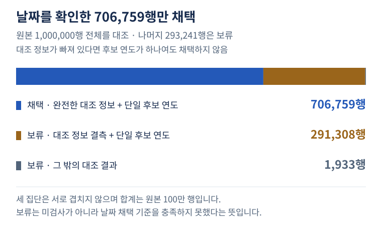

**그림 1. 채택과 보류를 구분한 날짜 귀속.** 막대는 모두 같은 원본 100만 행의 서로 겹치지 않는 집단입니다. 후보 연도가 하나여도 키가 결측이면 채택하지 않습니다. [원본 집계 CSV](output/baseline_recovery_v2_row_date_attribution_20260918_status_summary.csv) · [그림의 수치·출처 해시](assets/readme/sources.json)

### 분석에서 중요했던 네 가지 문제

**결측 대치의 모호함.** 같은 코드에 여러 항공사명이 대응합니다. 첫 관측값을 채우면 행 순서에 따라 결과가 바뀌므로 유일 대응만 사용합니다.

**시각의 의미.** HHMM의 차이는 시간대가 보정된 비행시간이 아닙니다. 시각이 없다는 사실, 복원한 값, 원래 관측값도 구별해야 합니다.

**연도 누락.** 내부 달력 신호만으로는 실제 연도를 확정하지 못했습니다. 이후 BTS 12개월 대조에서 완전 지문과 단일 후보 연도를 가진 **706,759행(70.68%)**만 날짜 귀속에 채택했습니다. **293,241행(29.32%)은 미검사가 아니라 보류**입니다. 결측 키만으로 후보 하나를 얻은 291,308행도 채택하지 않습니다. [상태 집계](output/baseline_recovery_v2_row_date_attribution_20260918_status_summary.csv), [귀속 manifest](output/baseline_recovery_v2_row_date_attribution_20260918_manifest.json)

**라벨 대표성.** 관측한 주요 주변분포는 라벨·미라벨 사이에 대체로 가깝지만, 무작위 라벨 선정이나 미라벨의 동일 성능을 입증하지 않습니다. 현재 모델 점수의 직접 평가 대상은 라벨 255,001행입니다. [분포 근거](output/label_coverage_review.md)

내부 달력 분석 → BTS Reporting/Marketing 자료 대조 → 12개월 귀속으로 이어진 상세 과정은 [부록 A·B](#appendix-calendar)에 있습니다. 항공사명 `Comair Inc.`를 근거로 전체 연도를 추정하던 과거 주장은 후속 대조에서 철회했습니다. 운항사 식별은 DOT ID를 기준으로 합니다.

<a id="3-전처리결정과근거"></a>
## 3. 전처리 결정과 근거

다음은 `P4_clean`·`P6_clean`에 적용한 규칙입니다. 과거 조건은 비교용 이름으로 보존했습니다.

| 문제 | 변경한 규칙 | 실제 확인 결과 |
|---|---|---|
| 같은 항공사 코드에 여러 이름 | 관측 대응이 하나인 키만 대치 | Airline 대치 97,056→30,608건; 모호한 대치 66,448건 중단 |
| 첫 관측값 선택의 행 순서 의존 | 유일 대응 사전 사용 | 원본 순서 반전 시 변경 27,536행→clean 0행 |
| 0분 시간차에 작은 수를 더해 나눔 | 유한한 양수 분모만 사용; 나머지는 NaN·플래그 | 비율 최대 75,800,000→581; 0분 370행은 보존 |
| 현지 시각차를 비행시간·속도로 표현 | `Local_Time_Gap_Minutes`, `Distance_Per_Local_Minute` | 시간대 미보정이라는 의미를 명시 |
| P6의 남은 미상 시각을 정오로 인코딩 | NaN과 결측 플래그 | 11,688행을 실제 정오와 구분 |
| 시간 복원 후 원래 결측 이력 소실 | 원래 출발·도착·시간차 결측 플래그 | 관측과 추정의 이력 보존 |

`TRAIN_000007`은 코드가 UA이고 Airline이 원래 결측입니다. 기존 규칙은 SkyWest Airlines Inc.를 채웠지만, clean은 대응이 모호해 결측을 유지합니다. 결측률을 낮추는 것 자체가 목적은 아닙니다. [실제 대치 예시](output/current_imputation_examples.csv), [구현·전수 검사](output/preprocessing_clean_implementation.md)

유지한 처리는 다음과 같습니다. HHMM을 시·분으로 나누고 도착 시각이 작으면 1,440분을 더해 **현지 시각차**를 만듭니다. P6은 노선 중앙값→전역 중앙값으로 시간차를 대치하고 한쪽 시각이 있을 때 다른 쪽을 추정합니다. 양쪽 시각을 실제로 알아낸 것은 아닙니다. Traffic은 월·일·공항·시간대별 **표본 행 수**이며 미상 시간대는 제외합니다. 실제 공항 전체 혼잡도가 아닙니다.

원본 범주형과 평활 타깃 인코딩(TE)을 함께 사용합니다. 극단값·0분만을 이유로 행을 삭제하지 않고, ID·상수·Phase별 불필요 열을 제거합니다. 이 트리 모델 경로에서는 표준화를 적용하지 않습니다.

<a id="4-현재파이프라인"></a>
## 4. 현재 파이프라인

### 전체 작업을 한 장으로 보기

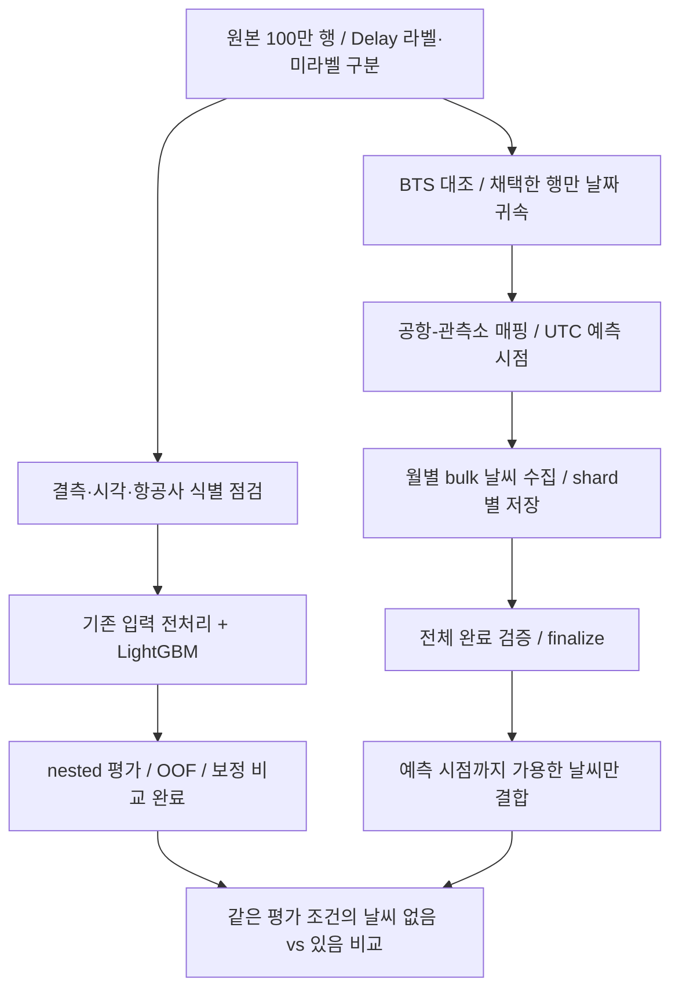

**핵심 질문은 다운로드 속도가 아니라 새 정보가 지연 분류에 도움이 되는가입니다.** 상단의 기존 입력 분석과 하단의 날씨 확장은 별도 경로이며, 마지막 동일 조건 비교로 연결합니다. `finalize`는 수집 완료 검사이지 모델 실험의 완료가 아닙니다.

### 라벨 누수를 막는 평가 경계

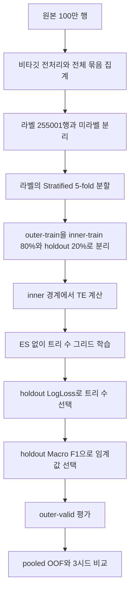

`outer-valid`는 최종 채점용이고 `inner-holdout`은 선택용입니다. **분할 전에 TE를 만들지 않습니다.** 선택한 모델을 그대로 채점하므로 실제 학습량은 전체 라벨의 약 64%(80% × 80%)입니다.

| 항목 | 현행 평가 경로 |
|---|---|
| 모델 | LightGBM 이진 분류; learning_rate=0.05, num_leaves=63, max_depth=8 |
| 트리 수 후보 | `[10, 25, 50, 75, 100, 150, 300, 600]` |
| 조기 종료 / scale_pos_weight | 현행 선택 경로에서 둘 다 미사용 |
| 임계값 후보 | 0.10~0.70, 간격 0.01 |
| 반복 | seed 42 / 1 / 7, 각각 5-fold |
| 집계 | 각 시드의 pooled OOF 지표 → 평균·표본 표준편차 |

**전체 입력 묶음 가정은 남아 있습니다.** 노선 중앙값·코드 대응 사전·Traffic·범주 목록은 원본 전체 묶음의 비타깃 입력을 활용합니다. 라벨 누수가 없다는 것과 미래 예측 시점에 입력을 확보할 수 있다는 것은 다릅니다. 미래 운영을 주장하려면 통계를 학습에서 저장하고 새 입력에는 적용만 하는 경계, 예측 시점에 확보 가능한 운항계획 등의 출처가 필요합니다. [데이터 사용 계약](output/pipeline_data_contract.md), [평가 코드](src/cv.py)

Honest pseudo-label의 teacher도 student inner-train 안에서 nested 선택을 수행하지만, 아래 10조건 실험에는 P5가 없습니다. **코드 구조 수정과 전체 Phase 성능 검증을 혼동하지 않습니다.**

<a id="5-최신검증결과"></a>
## 5. 최신 검증 결과

### 전처리는 타당해졌지만 분류 성능 향상은 확인되지 않았습니다

실제 원본 100만 행을 전처리하고 동일한 라벨 255,001행을 채점한 **10조건 × 3시드 × 5-fold = 30회 CV, 150개 outer fold** 결과입니다. P4/P6 전체 변경 외에 대치만·비율만·결측 표현만 바꾼 6개 조건을 포함합니다.

P4는 범주형+TE, P6_fixed는 시간 복원과 미상 시간대 제외 Traffic을 추가한 비교 조건입니다. `clean`은 3절의 변경을 함께 적용한 이름입니다.

| 조건 | Macro F1 평균 ± SD | LogLoss 평균 ↓ | ROC-AUC 평균 ↑ |
|---|---:|---:|---:|
| P4 | 0.574916 ± 0.000964 | 0.448016 | 0.641194 |
| P4_clean | 0.574541 ± 0.000726 | 0.448216 | 0.640596 |
| P6_fixed | 0.576062 ± 0.001491 | 0.447597 | 0.642757 |
| P6_clean | 0.575685 ± 0.001075 | 0.447577 | 0.642804 |

clean의 평균 F1 차이는 P4 −0.000375, P6 −0.000377입니다. 작은 차이로 통계적 동등성이나 확정적 악화를 선언하지 않습니다. 개별 변경 중 기준보다 평균 F1이 높은 조건은 없었고, P6_clean은 두 시드에서 높고 나머지에서 낮았습니다. 선택 임계값은 150개 fold 모두 0.22~0.24로 탐색 하한 0.10에 걸리지 않았습니다.

**성능 비교 기준은 P6_fixed, 전처리 의미 개선을 설명하는 경로는 P6_clean입니다.** P6_clean을 검증된 성능 향상 모델이나 배포 모델로 부르지 않습니다. 3시드 SD는 새 데이터에 대한 신뢰구간이 아니며, 프로젝트의 0.002 참고값도 유의수준이 아닙니다.

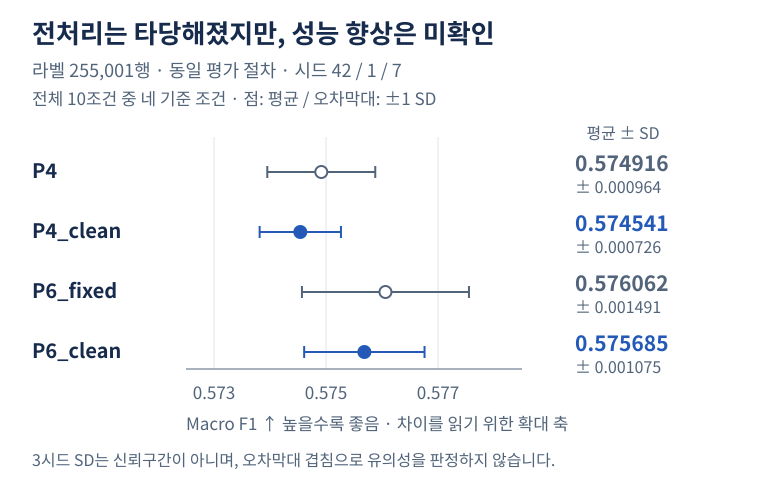

**그림 2. 전처리 10조건 중 네 기준 조건의 Macro F1.** 점은 3시드 평균, 오차막대는 ±1 표본 SD이며 신뢰구간이 아닙니다. 차이를 읽기 위한 확대 축임을 명시했으며, 오차막대 겹침만으로 동등성·유의성을 판정하지 않습니다. 모든 조건과 paired delta는 [기존 개별 변경 효과 그림](output/preprocessing_full_effects.png)에서도 확인합니다. [전체 10조건 결과](output/preprocessing_full_evaluation.md), [요약 CSV](output/preprocessing_full_summary.csv), [시드별 결과](output/preprocessing_full_runs.csv)

### 날씨 추가는 동일조건 paired CV에서 일관된 개선을 보였습니다

전체 날짜 귀속 706,759행 중 라벨이 있는 **180,332행**을 같은 순서로 고정하고, `P6_clean`을 weather-off 기준으로 다시 학습했습니다. weather-on은 모델 결과를 보기 전에 고정한 **14개 수치 피처**만 추가했습니다: 출발·도착 각각 `tmpf`, `dwpf`, `sknt`, `vsby`, `p01i`, 관측 나이, matched flag입니다. `gust`·`snowdepth`·`wxcodes`는 높은 결측, `relh`는 최소 계약에서의 중복성, `skyc1`는 범주 확장, `metar`는 감사 원문이라는 이유로 사전에 제외했습니다.

| 조건 | Macro F1 평균 ± SD ↑ | LogLoss 평균 ± SD ↓ | ROC-AUC 평균 ± SD ↑ |
|---|---:|---:|---:|
| weather-off | 0.573910 ± 0.000707 | 0.448116 ± 0.000045 | 0.640618 ± 0.000277 |
| weather-on | **0.598945 ± 0.000417** | **0.436689 ± 0.000132** | **0.672936 ± 0.000458** |
| paired on−off | **+0.025035 ± 0.000533** | **−0.011428 ± 0.000088** | **+0.032317 ± 0.000321** |

seed 42/1/7 모두 세 지표가 같은 방향으로 움직였습니다. 각 seed에서 off/on은 **동일 180,332행과 동일 outer-fold fingerprint**를 사용했고, 트리 수와 임계값은 각 조건의 outer-train 내부에서 같은 nested 절차로 독립 선택했습니다. 날씨 미결합·결측 행을 평가에서 제거하지 않았고, 모델 실행 중 추가 네트워크 요청도 없었습니다.

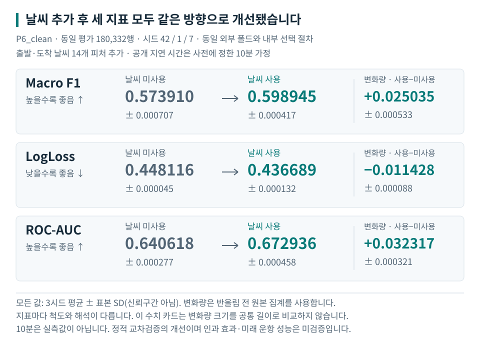

**그림 3. 날씨 추가의 paired 변화량.** 점은 3시드 평균, 오차막대는 ±1 표본 SD이며 신뢰구간이 아닙니다. Macro F1·ROC-AUC는 on−off, LogLoss는 감소량(off−on)을 양수로 표시했습니다. 모델에는 **10분 publication-latency 가정**만 사용했으며 0/30/60분은 coverage sensitivity로만 남겼습니다. [시드별 실행](output/baseline_recovery_v2_weather_model_compare_20260922_weather_model_runs.csv), [paired delta](output/baseline_recovery_v2_weather_model_compare_20260922_weather_model_paired_deltas.csv), [요약](output/baseline_recovery_v2_weather_model_compare_20260922_weather_model_summary.json), [실행 manifest](output/baseline_recovery_v2_weather_model_compare_20260922_weather_model_manifest.json), [그림 출처](assets/readme/sources.json)

**이 결과는 제출 범위에서 관찰한 예측 성능 차이입니다.** 세 seed는 독립 데이터셋이 아니고 SD도 신뢰구간이 아닙니다. 10분은 실측 publication latency가 아닙니다. 날짜 귀속이 가능한 선택 집단의 정적 CV이므로 날씨의 인과 효과나 미래 운항 성능으로 일반화하지 않습니다.

### 확률의 정확성과 지연 탐지 능력은 달랐습니다

P6 두 조건의 행별 OOF를 다시 저장·검증했고, 보정기는 **outer-train 내부**에서만 적합해 독립 outer-valid로 비교했습니다. 보정 결과를 같은 학습 OOF에서 채점한 것이 아닙니다.

| P6_clean·공유형 보정기 | Macro F1 ↑ | LogLoss ↓ | Brier ↓ | ECE (%p) ↓ |
|---|---:|---:|---:|---:|
| 없음 | 0.575685 | 0.447577 | 0.139904 | 0.4588 |
| Platt | 0.575517 | 0.447519 | 0.139890 | 0.3477 |
| Isotonic | 0.575248 | 0.448937 | 0.139915 | 0.1877 |

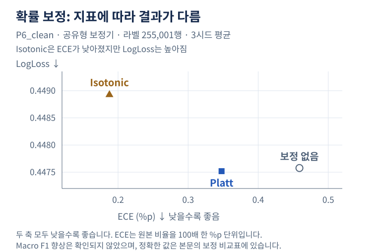

**그림 4. 보정 지표의 상충 관계.** P6_clean·공유형·전체 라벨 집단의 세 보정 조건만 표시했습니다. 두 축 모두 낮을수록 좋고, 정확한 Macro F1은 위 표에서 함께 읽습니다. ECE는 비율을 100배 한 %p 단위입니다. [원본 수준값 CSV](output/baseline_recovery_v2_calibration_20260917_level_summary.csv) · [그림 출처](assets/readme/sources.json)

표는 동일 라벨 255,001행·nested 평가의 3시드 평균입니다. 평균 확률 편향과 ECE는 줄었지만 Macro F1 향상은 확인되지 않았습니다. Isotonic은 ECE 감소와 함께 LogLoss 악화·순위 정보 감소가 관찰됐습니다. 분리형 대조, 12개 실험 셀, 환경 간 미세 차이는 [부록 D](#appendix-model-diagnostics)에 있습니다. [보정 보고서](output/baseline_recovery_v2_calibration_20260917_report.md), [수준값](output/baseline_recovery_v2_calibration_20260917_level_summary.csv)

원본 출발·도착 시각이 모두 결측인 라벨 **3,031행**에서는 P6_clean의 지연 재현율이 **10.02%**였습니다. 보정으로 이 취약성이 해소되지 않았고, 저장된 예측의 기술 분석에서는 모델이 개별 편보다 항공사·공항·계절 같은 맥락의 평균 위험도를 주로 반영하는 양상이 관찰됐습니다. 이는 현재 입력·모델에 한정한 해석이며 결측의 인과 효과나 다른 피처의 무용성을 증명하지 않습니다. [OOF 그룹 결과](output/baseline_recovery_v2_oof_20260916_v2_groups.csv), [오분류 분석](output/baseline_recovery_v2_error_profile_20260917_report.md)

<a id="6-한계와다음단계"></a>
## 6. 날씨 확장 결과와 한계

### 서로 다른 세 표본을 구분합니다

| 표본 | 전체 행 | 수집 가능 | 보류 | 현재 상태 |
|---|---:|---:|---:|---|
| 경계 검증 표본 | 21 | 별도 8공항 규칙 | DST 모호 시각 1행 미결합 | 실제 수집·결합 완료; 양쪽 20/21행 결합 |
| 기존 확대 표본 | 300 | 271 | 29 | 실제 수집·결합·후속 재결합 완료; 선정 편향을 후속 발견 |
| stratafix 표본 | 300 | 268 | 32 | 실제 수집·결합·진단 완료(2026-09-21) |

stratafix는 기존 확대 표본을 덮어쓴 이름이 아니라, 선정 순서를 고쳐 **별도로 만든 표본**입니다. 341개 층 중 300개를 포함하며 제외된 41개 층의 모집단은 3,077행(약 0.44%)입니다. 모든 층을 포함했다거나 대표성이 입증됐다고 표현하지 않습니다. 보류 32행은 시간대 충돌 19·미확인 12·현재만 확인 1행입니다. [stratafix 선정 manifest](output/baseline_recovery_v2_weather_expanded_stratafix_20260918_selection_manifest.json), [선정 CSV](output/baseline_recovery_v2_weather_expanded_stratafix_20260918_selection.csv)

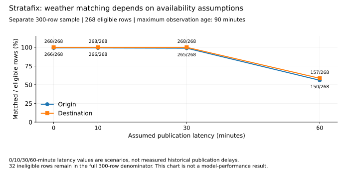

**그림 5. 데이터가 있어도 예측 시점에 가용하지 않으면 사용할 수 없습니다.** 분모는 stratafix의 수집 가능 268행입니다. 보류 32행을 포함한 전체 300행 분모와 구분하며, 0/10/30/60분은 실제 수신 지연의 실측값이 아닌 가정입니다. 이는 결합률 그래프이지 날씨 모델의 성능 그래프가 아닙니다. [민감도 CSV](output/baseline_recovery_v2_weather_expanded_stratafix_20260918_latency_sensitivity.csv)

### 날씨 결합과 비교의 고정 계약

예측 시점은 **예정 출발 60분 전**입니다. 현지 예정 시각을 출발 공항의 IANA 시간대로 UTC 변환한 뒤 60분을 뺍니다. 출발·도착 공항 관측 모두 **이 같은 예측 시점까지 가용한 관측**만 사용하며, 도착 시점의 미래 관측은 사용하지 않습니다.

`observed_at`과 `available_at`을 구분하고 관측 나이 상한은 90분입니다. 실제 수신 이력이 없어 가용성 지연 **0/10/30/60분은 모두 미검증 가정**입니다. `2400`은 다음 날 자정으로, DST 중복·미존재 시각은 `NaT`로 처리합니다. 모호한 매핑·시각은 임의로 채우지 않고, 미결합 행은 분모에서 삭제하지 않습니다.

전체 귀속 집단의 공항 375개 중 `confirmed_period` 355개는 **IEM 현재 목록의 ID·시간대 문자열·기록 보유 기간을 확인한 등급**입니다. 2018~2019년 시설 신원·이전 이력을 공식 자료로 전부 검증했다는 뜻이 아닙니다. 우선 조사 20개도 조회 완료와 역사적 확인 완료를 구분합니다. 대체 ID는 production 매핑에 자동 반영하지 않았습니다. [최신 매핑표](output/baseline_recovery_v2_weather_scope_fix_20260918_mapping_table.csv), [최신 20공항 증거](output/baseline_recovery_v2_station_identity_verification_fix_20260918_evidence.csv), [상세 판정](#appendix-station-identity)

날씨 유무 성능 비교는 **같은 라벨 평가 행·분할·시드·nested 프로토콜**에서 수행합니다. 날씨 결측 처리·범주형/TE·트리 수·임계값 선택은 학습·내부 선택 경계 안에 두고 outer-valid를 선택에 쓰지 않습니다. 날씨 결합 성공 행만 골라 평가 집단을 바꾸지 않습니다. 채택 706,759행은 두 예정 시각 등이 관측된 선택된 부분집합이므로, 그 결과를 원본 전체나 미래 운영 성능으로 일반화하지 않습니다.

### 완료 기준과 현재 상태

1. ~~**기존 로컬 증거 확인**~~ — **완료(2026-09-21).**
2. ~~**stratafix 실수집·결합**~~ — **완료(2026-09-21).**
3. ~~**전체 weather transport**~~ — **완료(2026-09-22).** 27/27 shard, 1,317 request group, cache/hash 및 corrected attempt audit를 고정했습니다.
4. ~~**row-level 전체 결합**~~ — **완료(2026-09-22).** 706,759행 전체 분모와 ID 순서를 유지한 채 0/10/30/60분 가정별 point-in-time join을 완료하고 독립 gzip 감사를 통과했습니다.
5. ~~**날씨 유무 비교**~~ — **완료(2026-09-22).** adopted∩labeled 180,332행에서 P6_clean weather-off/on을 동일 seed·outer fold·nested 프로토콜로 비교했습니다.
6. ~~**GitHub 제출 정리**~~ — **완료(2026-09-22).** join/model evidence, 최종 결론, 재현 명령과 그림 출처를 README에 연결했습니다.

**제출용 핵심 경로는 1~6까지 완료했습니다.** 독립 미래 테스트·실시간 모델 서빙·실측 publication latency 복원·새 데이터 소스·추가 모델군 탐색은 이번 제출의 완료 조건이 아니며 후속 과제입니다.

<a id="full-weather-row-join"></a>
### 전체 행 point-in-time join 완료 근거

**실제 706,759행 full join과 독립 gzip 감사까지 완료했습니다.** 실행 revision은 `0e1495c5f17deb958e6dce623eea78cb96cb54c4`이며, 네 latency 출력 모두 입력 행수·ID 유일성·ID 순서·`row_position`을 보존했습니다.

| 가용성 지연 가정 | origin matched | destination matched | both | one | none |
|---:|---:|---:|---:|---:|---:|
| 0분 | 690,546 | 690,521 | 689,757 | 1,553 | 15,449 |
| **10분** | **690,361** | **690,381** | **689,457** | **1,828** | **15,474** |
| 30분 | 690,065 | 690,130 | 688,936 | 2,323 | 15,500 |
| 60분 | 392,730 | 391,927 | 357,193 | 70,271 | 279,295 |

모든 latency에서 공통으로 mapping 부적격 **15,373행**과 UTC prediction time 미해석 **1행**을 분모에 남겼습니다. 90분 초과는 origin 839·destination 864행이었고, 수집 창 안에 이전 관측 자체가 없던 행은 0입니다. 미래 관측·미래 가용시각·station mismatch·source-window 위반·부적격 행 결합·출력 ID 중복은 모두 **0건**입니다. [join summary](output/baseline_recovery_v2_weather_full_join_20260922_full_weather_join_summary.json), [join manifest](output/baseline_recovery_v2_weather_full_join_20260922_full_weather_join_manifest.json)

10분 가정의 결합행 관측 나이는 median 39분, p90 66분, p99 69분, 최대 90분이었습니다. `snowdepth`는 사실상 전부, `gust`·`wxcodes`는 대부분 결측이어서 최소 모델 피처 계약에서 제외했습니다. 반대로 `tmpf`, `dwpf`, `sknt`, `vsby`, `p01i`와 관측 나이·matched flag를 출발/도착에 각각 사용했습니다. **10분은 실측 publication latency가 아닙니다.** 모델 성능을 보고 고른 값이 아니라 제출 비교 전에 headline 가정으로 고정했습니다.

입력은 기존 adopted-pool loader를 그대로 사용하고 raw train·날짜 귀속·mapping·bulk plan·immutable final·corrected audit의 SHA 계보를 확인합니다. 7.3M 관측을 한꺼번에 올리지 않고 UTC 월별로 cache를 한 번씩 검증·파싱하며, 네 latency를 같은 관측 로드에서 계산했습니다. 결과 partition은 원래 ID 순서로 스트리밍 병합했고 최종 manifest는 모든 무결성 검사가 끝난 뒤 마지막에 작성했습니다.

재현 경로:

```powershell
uv run --locked --offline python -m pytest -q --strict-markers -m "not local_data"
uv run --locked --offline python -u -m notebooks.join_weather_full --name baseline_recovery_v2_weather_full_join_20260922 --transport-name baseline_recovery_v2_weather_full_bulk_20260921 --mapping-name baseline_recovery_v2_weather_scope_fix_20260918
```

`--validate-inputs-only`는 cache join 출력 없이 입력 계보·행 정체성·분모·재생성 plan만 검사합니다. 행별 gzip과 partition은 Git-ignored 로컬 근거이며 Git에는 작은 summary/manifest만 기록합니다.

<a id="full-weather-transport"></a>
### 전체 weather transport 완료 근거

전체 수집은 **2026-09-22 finalization과 corrected attempt audit까지 완료**했습니다. 이 단계 자체가 증명하는 것은 IEM archive transport plan의 요청·캐시 무결성까지이며, row-level 결합과 모델 성능은 별도 근거가 필요합니다. 그 후속 근거는 위 [전체 행 join](#full-weather-row-join)과 5절의 paired 비교에서 각각 별도로 완료했습니다.

| 항목 | 최종 확인값 |
|---|---:|
| adopted rows (전체 결합 대상) | 706,759 |
| confirmed-period 양끝 매핑 가능 | 691,386 |
| UTC prediction time 해석 가능 | 691,385 |
| station / IEM network | 355 / 52 |
| station-month pairs | 7,816 |
| request groups / shards | **1,317 / 27** |
| successful HTTP attempts | **1,317** |
| failed attempts → retry | **26 → 26** |
| corrected provider errors | **HTTP 503 25건 + interrupted unknown 1건** |
| cache files / rows | **1,317 / 7,299,100** |
| cache bytes = measured download bytes | **1,093,058,768 bytes** |
| budget reserved bytes | 1,613,058,768 bytes |
| recovered incomplete checkpoint groups | 1 |

세 파일을 함께 읽습니다.

- [plan manifest](output/baseline_recovery_v2_weather_full_bulk_20260921_full_weather_plan_manifest.json): 706,759행에서 어떤 station-month가 필요한지 materialize한 1,317-request 계약과 분모
- [immutable final fetch manifest](output/baseline_recovery_v2_weather_full_bulk_20260921_full_weather_fetch_manifest.json): 27개 shard·cache/hash/row/attempt accounting의 최종 실행 증거
- [corrected attempt audit sidecar](output/baseline_recovery_v2_weather_full_bulk_20260921_full_weather_fetch_audit.json): final manifest를 수정하지 않고 저장된 `attempts_detail`만 재분류한 정정 증거

final manifest 생성 당시 오류 분류기는 실제 curl 문자열 `The requested URL returned error: 503`을 `other`로 집계했습니다. 원본 final manifest는 실행 증거로 **수정하지 않고 보존**했으며, audit sidecar가 같은 1,343 attempts를 다시 읽어 `http_503=25`, `interrupted_unknown=1`, `other=0`으로 정정합니다. source final manifest SHA-256은 audit에 `e299f0cfbc2b958f2e991cf6e0a850e0ff2f6813a76f7391c5451454b0f0c602`로 고정돼 있습니다.

측정 다운로드 바이트와 현재 최종 cache 파일 크기 합은 모두 **1,093,058,768 bytes**로 일치합니다. reserved−measured 520,000,000 bytes는 26개의 미측정 attempt에 보수적으로 남긴 20MB reservation의 합입니다. 이는 실제로 520MB를 추가 다운로드했다는 뜻이 아닙니다.

후속 row-level join은 **예정 출발 60분 전이라는 동일 prediction point**에서 706,759개 행 전체를 보존해 완료했습니다. transport 월 파일에 관측이 있어도 90분 age·availability 경계를 넘으면 사용하지 않는 계약을 실제 결합 결과에서도 유지했습니다.

<a id="weather-glossary"></a>
### 용어를 작업 단위로 읽기

| 용어 | 이 프로젝트에서의 뜻 |
|---|---|
| request group | 같은 IEM network·UTC 월·최대 20 station으로 만든 한 번의 논리적 요청 |
| HTTP attempt | 실제 호출 한 번; 실패와 재시도도 각각 예산을 소비 |
| shard | request group을 기본 50개씩 나눈 저장·재개 단위; 새로운 모델이나 데이터 종류가 아님 |
| checkpoint | 어디까지 처리했는지와 누적 예산·시도 이력을 저장한 진행 기록 |
| manifest / fingerprint | 결과의 경로·해시·집계 / 입력과 요청 규칙이 같은지 판별하는 식별값 |
| finalize / join | 전체 요청 완료·파일 무결성 검증 / 항공편 행과 가용한 날씨 관측 결합 |
| OOF / TE | 학습에 쓰지 않은 fold의 예측 / 라벨 기반 범주 인코딩; TE는 inner 경계를 지킴 |

<a id="submission-completion"></a>
### 제출 완료 상태

빈 성능 그래프나 예상 수치를 실제 결과처럼 채우지 않았습니다. 아래 항목은 모두 tracked evidence를 확보한 뒤 반영했습니다.

| 제출 결과 | 근거 | 최종 상태 |
|---|---|---|
| 전체 수집 통계 | [plan](output/baseline_recovery_v2_weather_full_bulk_20260921_full_weather_plan_manifest.json), [final](output/baseline_recovery_v2_weather_full_bulk_20260921_full_weather_fetch_manifest.json), [corrected audit](output/baseline_recovery_v2_weather_full_bulk_20260921_full_weather_fetch_audit.json) | **완료:** 27/27 shard, 1,317 groups, cache/hash 및 attempt audit 일치 |
| 전체 행별 결합 | [join summary](output/baseline_recovery_v2_weather_full_join_20260922_full_weather_join_summary.json), [join manifest](output/baseline_recovery_v2_weather_full_join_20260922_full_weather_join_manifest.json) | **완료:** 706,759행 유지; 10분 both matched 689,457; 시간·station invariant 위반 0 |
| 날씨 없음 vs 있음 | [model summary](output/baseline_recovery_v2_weather_model_compare_20260922_weather_model_summary.json), [model manifest](output/baseline_recovery_v2_weather_model_compare_20260922_weather_model_manifest.json) | **완료:** 동일 180,332행; Macro F1 0.573910→0.598945; paired Δ +0.025035 |
| 제출 최종 결론 | 위 근거 + [그림 영수증](assets/readme/sources.json) | **완료:** 결과·한계·재현 명령·그림을 같은 tracked evidence에 연결 |

<a id="7-코드구조와재현"></a>
## 7. 코드 구조와 재현

> **장시간 로컬 실행 원칙:** 실행 중인 프로세스를 문서 반영 때문에 중단하거나 중간에 pull하지 않습니다. 이번 full-weather transport·full join·paired model comparison은 모두 정상 종료와 evidence 검증까지 완료했으며, 후속 로컬 실행도 같은 원칙으로 기존 evidence를 보존한 뒤 동기화합니다.

<a id="reliability-design"></a>
### 실패를 숨기지 않는 수집·복구 구조

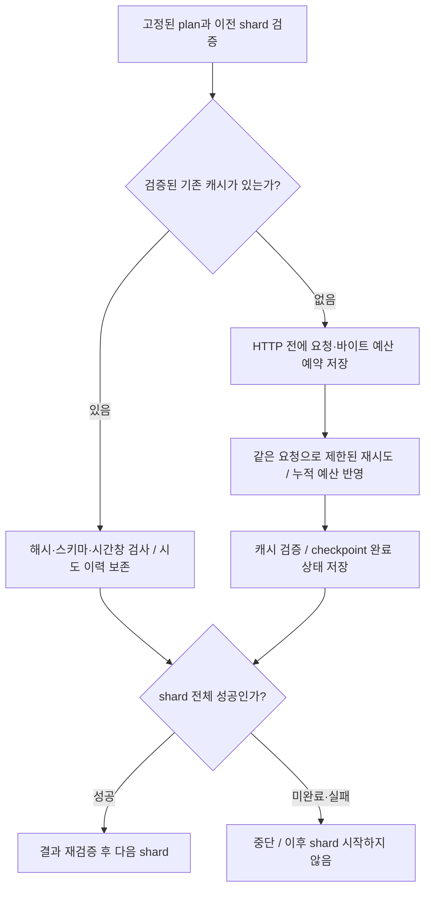

| 보호하는 경계 | 구현과 검증 근거 | 보장하지 않는 것 |
|---|---|---|
| 다른 요청을 같은 작업으로 이어받지 않음 | [고정 plan·fingerprint](notebooks/fetch_weather_full_sharded.py) | 실패한 station을 임의 대체하지 않음 |
| 실패·재시도도 예산에 포함 | [예약·누적 accounting](notebooks/fetch_weather_sample_expanded.py) | 미측정 바이트를 0으로 가정하지 않음 |
| 완료 기록도 다시 확인 | [순차 runner](notebooks/run_weather_full_collection.py), [회귀](tests/test_weather_full_collection_runner.py) | exit 0 하나만으로 전체 완료를 선언하지 않음 |
| HTTP 성공 후 완료 저장이 끊겨도 이력 유지 | [checkpoint 복구 회귀](tests/test_weather_expanded_pipeline.py) | 컨테이너·OS·스토리지 무장애를 주장하지 않음 |

파일 교체 재시도는 **HTTP 재호출과 별개**입니다. 현행 checkpoint 교체는 최초 시도를 포함해 최대 5회, 실패 사이 0.1초 간격이며 계속 실패하면 예외를 전파합니다. 원자적 rename이 전원 장애까지 포함한 영속성 보장을 뜻하지는 않습니다. 원인 프로세스를 특정하지 못한 Windows 접근 거부를 백신 탓으로 단정하지 않습니다.

### 공개 저장소와 로컬 데이터의 경계

GitHub에는 코드·테스트·문서·공개 가능한 집계 근거를 둡니다. 원본 `data/train.csv`, 대용량 날씨 캐시와 사고 snapshot은 로컬에 유지합니다. 인증키·쿠키·개인정보는 커밋하지 않으며, `.gitignore`를 보안 접근제어로 간주하지 않습니다. 이 README와 그림은 **Git에 있는 집계 파일만으로** 생성·검증할 수 있습니다.

### GitHub만으로 확인할 수 있는 것

Python 3.14와 `uv.lock`의 의존성을 사용하며 프로젝트 루트에서 실행합니다. [pyproject.toml](pyproject.toml), [CI 워크플로](.github/workflows/ci.yml)

```powershell
uv sync --locked --python 3.14 --dev
uv run --locked --offline python -m pytest -q
```

기본 pytest와 CI는 `not local_data`를 선택합니다. 실제 원본을 요구하는 `local_data` 검사는 **선택 해제**되며 삭제·자동 성공·조용한 skip이 아닙니다. `--strict-markers`가 marker 오타를 거부합니다. CI는 잠금 파일이 선언과 다르면 설치 단계에서 실패합니다.

**검증 범위:** Git-only 회귀는 Git 파일·임시 입력·대체 함수로 코드 계약을 검사합니다. 원본 HOMR/IEM 재현, 전체 데이터 결합, 모델 성능 재학습은 하지 않습니다. `uv --offline`은 패키지 접근만 제한하므로 Python 코드의 네트워크까지 차단하는 옵션으로 해석하지 않습니다.

문서 개편 전 코드 `d5098f9`의 [master CI](https://github.com/Peter-jackson12/Airplane/actions/runs/35501299330)는 성공했습니다. PR #2 코드·테스트의 기록은 382개 통과·24개 선택 해제이며, 과거 379/403 기록과 다릅니다. 이후 검사 수는 [현재 Actions](https://github.com/Peter-jackson12/Airplane/actions)에서 실행 SHA와 함께 확인합니다. 이 문서 개편 자체는 실데이터 분석 재실행이 아닙니다.

### 로컬 입력과 확보 경계

| 작업 | 필요한 로컬 입력 | 확인할 근거 |
|---|---|---|
| 실제 원본 분석·학습 | `data/train.csv` | 원본 파일의 출처·해시·행/열 수 |
| 날짜 귀속 로컬 검사 | `output/label_coverage/schema.csv` | 실제 원본으로 생성한 스키마; [라벨 보고서](output/label_coverage_review.md) |
| 20공항 원자료 재현 | `data/weather_probe/baseline_recovery_v2_station_identity_investigation_20260918_homr_raw/`의 HOMR JSON 21개 | [증거표](output/baseline_recovery_v2_station_identity_verification_fix_20260918_evidence.csv)의 primary·extra 원자료 경로/해시 |
| IEM 교차검사 | `data/weather_probe/networks/`의 필요한 GeoJSON 9개 | [manifest](output/baseline_recovery_v2_station_identity_verification_fix_20260918_manifest.json)의 `iem_feature_checks` |
| 원래 선정·전체 산정 재현 | 원본, `data/bts/`의 BTS 결과·귀속 `row_dates.csv.gz`, `data/weather_probe/airports_mwgg.json` | 각 실행 manifest의 입력 경로/해시 |
| 날씨 재결합·진단 | `data/weather_probe/sample/`의 원본 관측과 실행별 `_joined/` 결과 | 각 fetch/join manifest |
| OOF 재분석 | 원본과 `output/<run>_seed<seed>_oof/*.csv.gz` | 최신 OOF manifest·run_metadata |

`data/`와 행별 OOF는 추적 제외입니다. **clone/pull로 원본 캐시까지 복원되지 않습니다.** 기존 작업 환경이나 보관본에서 먼저 복원하고, 기록된 해시와 다르면 같은 입력의 재현이라고 하지 않습니다. 새 외부 조회는 새 증거이며 기존 파일을 덮어쓰지 않습니다. 전체 매핑 재현에는 53개 network 캐시가 쓰였지만, 20공항 로컬 검사에 필요한 9개와 혼동해 전부 다시 받지 않습니다.

```powershell
# 실제 입력이 있어야 하는 검사만 실행
uv run --locked --offline python -m pytest -q -m local_data
# 기본 marker 선택을 덮어써 전체 실행
uv run --locked --offline python -m pytest -q -m "local_data or not local_data"
```

입력이 없거나 손상되면 실패해야 합니다. 합성 파일로 원자료를 대체하거나 실패 검사를 약화하지 않습니다. 관측소 검사 23개와 실제 원본 스키마 검사 1개가 현재 로컬 계약이며, 같은 모듈의 순수 회귀는 CI에 남습니다.

<a id="next-local-run"></a>
### 로컬 실행 기록: 캐시 검증 → stratafix 실수집·결합 (완료, 2026-09-21)

`git status --short` → [AGENTS.md](AGENTS.md) → README 확인 후 로컬 `master`가 원격 `f718dd7`과 일치하고 작업 트리가 깨끗함을 확인했습니다. 다른 에이전트 변경은 없었습니다.

HOMR JSON 21개·IEM GeoJSON 9개를 evidence의 SHA-256과 전량 대조해 일치를 확인한 뒤, 새 실행명으로 캐시 전용 재현을 했습니다.

```powershell
uv run --locked --offline python -u -m notebooks.verify_priority_station_identity --name baseline_recovery_v2_station_identity_recheck_20260921
```

`--allow-network`는 사용하지 않았습니다(캐시 전용). `record_verification.passed=true`, `checks_run=22`로 22개 레코드의 ncdcStnId·플랫폼·필수 식별자와 SPN 이외 필수 IEM feature가 원자료에서 그대로 재생산됨을 확인했습니다. 결과는 기존 파일을 덮어쓰지 않고 새 이름으로 저장했습니다. [evidence](output/baseline_recovery_v2_station_identity_recheck_20260921_evidence.csv), [manifest](output/baseline_recovery_v2_station_identity_recheck_20260921_manifest.json)

stratafix 선정(300/268/32, 보류 tz_conflict 19·unconfirmed 12·confirmed_current_only 1)은 다시 뽑지 않고 아래 입력 조합을 그대로 사용했습니다. 실행 전 기존 fetch checkpoint·manifest·joined 결과를 확인했으며 stratafix 이름으로는 아무것도 없어 **최초 수집**으로 진행했습니다.

```powershell
$Sample = "baseline_recovery_v2_weather_expanded_stratafix_20260918"
$Mapping = "baseline_recovery_v2_weather_scope_fix_20260918"

uv run --locked --offline python -u -m notebooks.fetch_weather_sample_expanded --name $Sample --mapping-name $Mapping --max-requests 600 --max-bytes 200000000 --max-seconds 3600
uv run --locked --offline python -u -m notebooks.join_weather_sample_expanded --name $Sample --mapping-name $Mapping
uv run --locked --offline python -u -m notebooks.diagnose_weather_expanded_cache --name $Sample --out-name baseline_recovery_v2_weather_expanded_stratafix_diagnostic_20260921 --mapping-name $Mapping
```

**fetch 결과:** 계획된 530 station-day 그룹 중 530개 모두 처리됨(`skipped_due_to_cap=0`, `failed_groups=0`, `cap_that_stopped_collection=null`). 초기 600요청·200MB·3600초 상한에 걸리지 않아 예산 상향 없이 한 번에 끝났습니다. 캐시 적중 464 · 신규 요청 66, 이번 실행 HTTP 시도 68회 · 측정 바이트 175,144 · 미측정 시도 2건 · 예산 차감용 reserved bytes 4,175,144 · 누적 활성 수집 시간 약 277.1초(경과 281.3초). `budget_limit_history`에 `{max_requests:600, max_bytes:200000000, max_seconds:3600}` 1건이 기록됐습니다. [fetch manifest](output/baseline_recovery_v2_weather_expanded_stratafix_20260918_fetch_manifest.json). 재개용 checkpoint는 `output/baseline_recovery_v2_weather_expanded_stratafix_20260918_fetch_checkpoint.json`의 로컬 전용 파일이며 Git에 추적하지 않습니다.

**메타데이터 주의:** 이 최초 수집은 실행 전에 stratafix checkpoint가 없음을 직접 확인하고 시작했지만, 당시 `resumed_from_checkpoint` 계산이 빈 `groups` dict 자체를 보관해 실행 중 그 dict가 채워지면서 fetch manifest에 boolean 대신 그룹 객체가 직렬화되는 감사 메타데이터 결함이 드러났습니다. 수집·예산·join 수치에는 영향을 주지 않으며 후속 코드에서 stable boolean으로 수정·회귀 고정했습니다. 기존 manifest는 실행 당시 증거로 덮어쓰지 않습니다.

**join 메타데이터 주의:** 실제 결과·latency 표·README는 268 collectible을 사용하지만, 당시 join manifest의 첫 limitation 문장에는 이전 확대 표본의 분모가 하드코딩되어 남았습니다. 계산 결과가 아니라 설명문 생성 결함이며, 후속 코드에서 runtime 분모를 사용하도록 수정·회귀 고정했습니다. 기존 manifest는 실행 당시 증거로 보존합니다.

**join 결과:** 300 ID 유일·행수·순서 보존, 완전 동일 중복 보고 1건 제거, 보류 32행 전부 station·관측 필드 결측(마스킹 확인, 예측 시점만 채움), `unresolved_no_prediction_at=0`. 수집 가능 268 분모의 latency별 결합/최대·중앙값 관측 나이:

| latency | 출발 결합/268 | 도착 결합/268 | 출발 관측 나이 중앙값/최대 |
|---|---:|---:|---:|
| 0분 | 266 (99.25%) | 268 (100.00%) | 27/59분 |
| 10분 | 266 (99.25%) | 268 (100.00%) | 37/69분 |
| 30분 | 265 (98.88%) | 268 (100.00%) | 57/89분 |
| 60분 | 150 (55.97%) | 157 (58.58%) | 71/90분 |

전체 300행 분모로는 10분 기준 출발 266/300(88.67%), 도착 268/300(89.33%)입니다. 이 값은 기존(다른) 300행 표본의 269/300·271/300과 다른 새 표본의 새 결과이며, 비교 목적의 목표값이 아닙니다. [join manifest](output/baseline_recovery_v2_weather_expanded_stratafix_20260918_join_manifest.json), [latency 민감도](output/baseline_recovery_v2_weather_expanded_stratafix_20260918_latency_sensitivity.csv). 원본 결과는 `data/weather_probe/baseline_recovery_v2_weather_expanded_stratafix_20260918_joined/joined_latency{0,10,30,60}min.csv`입니다.

**진단 결과:** `id_row_count_order_preserved_across_all_scenarios=true`. 미결합 사유는 `not_collectible_mapping`(분모 제외 32) · `stale_beyond_max_age`(모든 latency 출발 2건) · `not_yet_available_under_latency_assumption`(30분 출발 1건, 60분 출발 116·도착 111건)뿐이며, **`unexpected_unmatched_despite_available_report`는 0건**으로 코드 결함 신호는 없었습니다. [진단 manifest](output/baseline_recovery_v2_weather_expanded_stratafix_diagnostic_20260921_diagnostic_manifest.json), [사유표](output/baseline_recovery_v2_weather_expanded_stratafix_diagnostic_20260921_diagnostic_unmatched_reasons.csv)

측정 바이트(`bytes_measured`)와 예산 차감용 reserved bytes는 위와 같이 구분해 보고했습니다. **이번 실행에서는 전체 706,759행 수집·재학습을 하지 않았습니다.**

### 전체 수집 전용 실행 경계

300행용 station/day fetcher를 13만+ 그룹에 그대로 확대하지 않습니다. 2026-09-21 확인한 [IEM ASOS backend help](https://mesonet.agron.iastate.edu/cgi-bin/request/asos.py?help)는 한 요청에 여러 `station`/여러 `network`를 받을 수 있고, IP별 1초 throttle과 요청당 실용 상한 1,000 station-years를 명시합니다. 따라서 전체 수집은 [fetch_weather_full_sharded](notebooks/fetch_weather_full_sharded.py)에서 **실제 필요한 station-month를 IEM network × UTC month × 최대 20 station batch**로 먼저 materialize하고, 성공·실패와 무관하게 모든 HTTP attempt 뒤 1.25초 pause를 두는 bulk 경로를 사용합니다. 공급자 계약은 영구 보장이 아니므로 장기간 뒤 재실행할 때는 help를 다시 확인합니다.

Git에 있는 현재 `confirmed_period` 매핑만으로 계산한 구조적 상한은 355 station·52 IEM network입니다. 모든 station이 모든 달에 필요하다는 과대 가정에서도 20 station/batch 기준 월 54요청이므로 24개월은 1,296요청, 2017-12/2020-01 경계월까지 26개월로 잡아도 1,404요청입니다. 이는 실제 로컬 `prediction_at`으로 만든 plan의 요청 수가 아니라 **GitHub-only 상한 산정**입니다. 실제 요청 수·station-month 수·응답 크기는 `--prepare-only` 및 pilot 실행 근거로 확정합니다.

전체 plan은 station 수가 많은 요청부터 결정적으로 정렬해 첫 pilot이 상대적으로 큰 응답을 먼저 시험하게 하고, 기본 50 bulk-request 단위 shard로 나누어 shard별 checkpoint·manifest·cache를 둡니다. 이 경계는 거대한 단일 checkpoint를 매 요청마다 다시 쓰는 비용, 한 번의 실패 도메인, 한 디렉터리에 과도한 파일이 쌓이는 문제를 제한합니다. 같은 run name에서는 plan·shard 크기·station batch 크기를 바꾸지 않습니다.

checkpoint 저장은 임시 파일을 쓴 뒤 원자적으로 교체하며, Windows에서 일시적인 `PermissionError`가 발생하면 **같은 임시 상태를 최대 5회 제한 재시도**합니다. 끝까지 교체하지 못하면 기존 checkpoint와 `.tmp`를 모두 남기고 실패합니다. HTTP 성공·cache 생성 뒤 fetched 상태 승격 전에 중단된 경우, resume은 검증된 기존 cache를 재HTTP 없이 채택하면서 기존 `attempts_detail`과 logical new-fetch provenance를 보존합니다.

기존 21행/300행/stratafix 캐시는 그대로 보존합니다. 이들은 특정 station의 일부 시각 창에 대한 증거이므로 **월 전체 bulk 요청을 이미 수집했다는 근거로 재사용하지 않습니다.** 최신 전체 실행 입력은 `baseline_recovery_v2_weather_scope_fix_20260918` 매핑을 명시적으로 사용합니다.

전체 27-shard 네트워크 실행은 아직 완료되지 않았습니다. 2026-09-21 로컬 실행에서는 stress-first shard 0의 50개 request group이 최종 `complete=true`, `successful=true`로 끝났고, 누적 HTTP attempt 51회 중 503 1회가 재시도로 복구됐습니다. 해당 shard-local checkpoint/manifest/cache는 Git-ignored 로컬 실행 증거이며, 전체 수집이 끝나기 전의 중간 결과입니다. 다음 단계는 한 shard씩 순차 실행하고 어떤 shard라도 미완료·실패하면 즉시 멈추는 [run_weather_full_collection](notebooks/run_weather_full_collection.py) 경로를 사용합니다.

```powershell
$Full = "baseline_recovery_v2_weather_full_bulk_20260921"
$Mapping = "baseline_recovery_v2_weather_scope_fix_20260918"

# 네트워크 호출 없음: 실제 bulk plan과 source hash만 고정
uv run --locked --offline python -u -m notebooks.fetch_weather_full_sharded --name $Full --mapping-name $Mapping --prepare-only --shard-size 50 --max-stations-per-request 20

# plan 검토 뒤 첫 shard를 신규 HTTP attempt 5회까지만 pilot
uv run --locked --offline python -u -m notebooks.fetch_weather_full_sharded --name $Full --mapping-name $Mapping --shard-index 0 --shard-size 50 --max-stations-per-request 20 --max-requests 5 --max-bytes 100000000 --max-seconds 900

# pilot 검토 후 같은 shard를 재개할 때만 누적 cap을 올린다.
# shard 0은 로컬에서 50/50 완료 검증됨.

# 네트워크 없이 현재 shard evidence 상태만 검사
uv run --locked --offline python -u -m notebooks.run_weather_full_collection --name $Full --mapping-name $Mapping --start-shard 1 --end-shard 26 --status-only

# shard 1~26을 순차 실행. 각 shard는 기존 cumulative usage 위에
# pending group + retry headroom 10회, 300MB, 5400초의 추가 headroom만 받는다.
# 한 shard라도 complete/successful이 아니면 즉시 중단하고 뒤 shard는 시작하지 않는다.
uv run --locked --offline python -u -m notebooks.run_weather_full_collection --name $Full --mapping-name $Mapping --start-shard 1 --end-shard 26 --retry-headroom 10 --additional-max-bytes 300000000 --additional-max-seconds 5400

# runner는 finalize를 자동 실행하지 않는다.
# 27개 shard 전부 successful을 검증한 뒤에만 별도로 --finalize를 실행한다.
```

`--prepare-only` 결과가 기존 142,574 station-day 또는 132,783 merged-interval 산정과 일치한다고 주장하지 않습니다. 두 숫자는 과거 sizing 정의이고, 새 plan manifest의 `bulk_request_groups`가 현재 transport 실행 계약입니다. 수집 완료·finalize·row-level join 검증 전에는 weather-on 모델 학습으로 넘어가지 않습니다.

<a id="readme-figures"></a>
### README 그림의 재현과 출처 검증

다음 명령은 공개 집계 CSV만 읽습니다. IEM 호출·원본 데이터 로드·모델 학습을 하지 않습니다. 그림 파일은 정적 SVG이며 한글 설명과 정확한 표를 함께 제공해 이미지 없이도 결론을 읽을 수 있게 했습니다.

```powershell
# 그림·실제 사용값·출처 및 그림 해시 생성
uv run --locked --offline python scripts/build_readme_assets.py

# 읽기 전용: 출처, 필터, 표시 수치, SVG 해시가 바뀌지 않았는지 검사
uv run --locked --offline python scripts/build_readme_assets.py --check

# README 링크·기존 계약·그림 재현성 검사
uv run --locked --offline python -m pytest -q tests/test_readme_contract.py tests/test_readme_presentation.py
```

[그림 생성기](scripts/build_readme_assets.py) · [수치·필터·SHA-256 출처표](assets/readme/sources.json) · [문서 회귀 검사](tests/test_readme_presentation.py)

### 코드 지도

| 경로 | 역할 |
|---|---|
| [src/features.py](src/features.py) | 결측·시간·범주형·TE·pseudo 공통 함수 |
| [src/cv.py](src/cv.py) | 분할, nested grid, 임계값, OOF 평가 |
| [src/run_store.py](src/run_store.py) | 스키마·실험 지문 검사, 원자적 저장 |
| [src/oof.py](src/oof.py) | 행별 OOF·원본 결측 이력·그룹 진단 |
| [src/calibration.py](src/calibration.py) | none/Platt/Isotonic 및 내부 임계값 |
| [src/weather.py](src/weather.py) | 2400·DST·UTC 및 observed/available 시각을 구분하는 asof 결합 |
| [rerun_all_phases.py](rerun_all_phases.py) | Phase 정의·현행 실행 진입점 |
| [run_oof_diagnostics](notebooks/run_oof_diagnostics.py), [run_calibration_experiment](notebooks/run_calibration_experiment.py) | OOF·보정 실험 드라이버 |
| [compare_calibration_runs](notebooks/compare_calibration_runs.py), [analyze_oof_error_profile](notebooks/analyze_oof_error_profile.py) | 저장 결과 비교·기술 분석 |
| [calendar_signature](notebooks/analyze_calendar_signature.py), [calendar_mixture](notebooks/analyze_calendar_mixture.py), [record_integrity](notebooks/analyze_record_integrity.py) | 내부 달력·기록 정합성 분석 |
| [verify_bts_november](notebooks/verify_bts_november.py), [verify_bts_marketing](notebooks/verify_bts_marketing.py), [assign_row_dates](notebooks/assign_row_dates.py) | BTS 대조·행별 날짜 귀속 |
| [select_weather_sample](notebooks/select_weather_sample.py), [fetch_weather_sample](notebooks/fetch_weather_sample.py), [join_weather_sample](notebooks/join_weather_sample.py) | 21행 경계 검증 |
| [map_weather_stations](notebooks/map_weather_stations.py), [verify_priority_station_identity](notebooks/verify_priority_station_identity.py) | IEM 매핑·별도 HOMR 신원 조사 |
| [select_weather_sample_expanded](notebooks/select_weather_sample_expanded.py), [fetch_weather_sample_expanded](notebooks/fetch_weather_sample_expanded.py), [join_weather_sample_expanded](notebooks/join_weather_sample_expanded.py) | 층화 선정·상한 내 수집·지연 민감도 결합 |
| [diagnose_weather_expanded_cache](notebooks/diagnose_weather_expanded_cache.py), [reconcile_weather_cache_recombination](notebooks/reconcile_weather_cache_recombination.py) | 캐시 진단·수정 코드 재결합과 명시적 PASS/FAIL |
| [scope_weather_collection](notebooks/scope_weather_collection.py), [scope_weather_collection_refined](notebooks/scope_weather_collection_refined.py) | 초기 산정·실제 구간 병합/차감 재산정 |
| [fetch_weather_full_sharded](notebooks/fetch_weather_full_sharded.py) | 전체 adopted weather의 network×월×station-batch bulk plan·50요청 shard·checkpoint/cache/finalize |
| [run_weather_full_collection](notebooks/run_weather_full_collection.py) | full-weather shard를 순차 resume하고 성공 shard를 재검증하며 첫 미완료/실패에서 fail-closed 중단 |
| `notebooks/`, `tests/`, `output/` | 재현·회귀·실행 증거. 루트의 다른 `run_*.py`는 과거 경로일 수 있음 |

<a id="8-문서안내"></a>
## 8. 문서와 실행 근거 지도

README는 현재 상태의 기준이고, 구체적인 사실은 연결된 코드·데이터·실행 로그로 확인합니다. 파일명에 `final`·`current`가 있어도 최신을 보장하지 않습니다. 별도 상태 문서를 계속 늘리지 않고, 현재 결론과 다음 작업은 여기서 찾을 수 있게 유지합니다.

| 확인할 내용 | 유효한 근거·읽는 방법 |
|---|---|
| 전처리 실제 변경 | [구현·전수 검사](output/preprocessing_clean_implementation.md), [예시](output/current_imputation_examples.csv) |
| 10조건 성능 | [전체 보고서](output/preprocessing_full_evaluation.md), [요약 CSV](output/preprocessing_full_summary.csv), [시드별 CSV](output/preprocessing_full_runs.csv), [실행 노트북](notebooks/preprocessing_full_evaluation.ipynb) |
| 라벨 대표성 | [보고서](output/label_coverage_review.md), [노트북](notebooks/label_coverage_review.ipynb) |
| 입력·정보 경계 | [데이터 사용 계약](output/pipeline_data_contract.md), [작성 당시 명세](output/current_pipeline_evidence.json) — 후자의 코드 해시는 최신 보증이 아님 |
| 최신 OOF | [v2 manifest](output/baseline_recovery_v2_oof_20260916_v2_manifest.json), [요약](output/baseline_recovery_v2_oof_20260916_v2_summary.csv), [기존 점수 차이](output/baseline_recovery_v2_oof_20260916_v2_historical_deltas.csv) |
| 보정 실험 | [보고서](output/baseline_recovery_v2_calibration_20260917_report.md), [manifest](output/baseline_recovery_v2_calibration_20260917_manifest.json), [환경 간 비교](output/baseline_recovery_v2_calibration_local_20260917_comparison.csv) |
| 반복 오류 | [기술 분석](output/baseline_recovery_v2_error_profile_20260917_report.md), [manifest](output/baseline_recovery_v2_error_profile_20260917_manifest.json) |
| 12개월 날짜 귀속 | [상태 집계](output/baseline_recovery_v2_row_date_attribution_20260918_status_summary.csv), [마스킹 진단](output/baseline_recovery_v2_row_date_attribution_20260918_masking_diagnostic.csv), [manifest](output/baseline_recovery_v2_row_date_attribution_20260918_manifest.json) |
| 21행 경계 검증 | [선정](output/baseline_recovery_v2_weather_sample_20260918_selection_manifest.json), [fetch](output/baseline_recovery_v2_weather_sample_20260918_fetch_manifest.json), [join](output/baseline_recovery_v2_weather_sample_20260918_join_manifest.json) |
| 기존 300행 실수집 | [선정](output/baseline_recovery_v2_weather_expanded_20260918_selection_manifest.json), [fetch](output/baseline_recovery_v2_weather_expanded_20260918_fetch_manifest.json), [join](output/baseline_recovery_v2_weather_expanded_20260918_join_manifest.json), [지연 민감도](output/baseline_recovery_v2_weather_expanded_20260918_latency_sensitivity.csv) |
| 새 stratafix 300행 선정 | [선정](output/baseline_recovery_v2_weather_expanded_stratafix_20260918_selection_manifest.json), [층](output/baseline_recovery_v2_weather_expanded_stratafix_20260918_strata.csv) |
| stratafix 실수집·결합·진단(2026-09-21) | [fetch manifest](output/baseline_recovery_v2_weather_expanded_stratafix_20260918_fetch_manifest.json), [join manifest](output/baseline_recovery_v2_weather_expanded_stratafix_20260918_join_manifest.json), [latency 민감도](output/baseline_recovery_v2_weather_expanded_stratafix_20260918_latency_sensitivity.csv), [진단 manifest](output/baseline_recovery_v2_weather_expanded_stratafix_diagnostic_20260921_diagnostic_manifest.json), [미결합 사유](output/baseline_recovery_v2_weather_expanded_stratafix_diagnostic_20260921_diagnostic_unmatched_reasons.csv) |
| 20공항 신원 cache-only 재현(2026-09-21) | [evidence](output/baseline_recovery_v2_station_identity_recheck_20260921_evidence.csv), [manifest](output/baseline_recovery_v2_station_identity_recheck_20260921_manifest.json) |
| 매핑과 20공항 판정 | [수정 매핑 manifest](output/baseline_recovery_v2_weather_scope_fix_20260918_mapping_manifest.json), [우선 조사 목록](output/baseline_recovery_v2_weather_scope_fix_20260918_mapping_priority_investigation.csv), [최신 신원 증거](output/baseline_recovery_v2_station_identity_verification_fix_20260918_evidence.csv), [manifest](output/baseline_recovery_v2_station_identity_verification_fix_20260918_manifest.json) |
| 수정 코드 실제 재결합 | [5차 비교](output/baseline_recovery_v2_weather_recombination_provenance_20260918_reconciliation_comparisons.json), [manifest](output/baseline_recovery_v2_weather_recombination_provenance_20260918_reconciliation_manifest.json) |
| 전체 수집량 재산정 | [station별 상세](output/baseline_recovery_v2_weather_scope_refined_20260918_refined_scope_per_station.csv), [manifest](output/baseline_recovery_v2_weather_scope_refined_20260918_refined_scope_manifest.json) — 전체 수집 실측이 아님 |
| 미결합 원인 | [세분화된 사유](output/baseline_recovery_v2_weather_expanded_diagnostic_v2_20260918_diagnostic_unmatched_reasons.csv), [manifest](output/baseline_recovery_v2_weather_expanded_diagnostic_v2_20260918_diagnostic_manifest.json) |
| 발표·과거 제출 양식 | [2026-09-16 초안](output/preprocessing_current_report.md), [Word 양식](머신러닝%20모델링%20프로젝트%20보고서%20템플릿.docx) — 현재 필수 제출물이 아님 |

<a id="presentation-route"></a>
### 발표할 때는 이 순서로 설명합니다

**문제 → 판단 → 검증 → 확장.** “결측을 많이 채우면 더 좋은 모델일까?”로 시작해, 모호한 대치를 중단하고 시각의 의미를 바로잡은 이유를 3절에서 보여줍니다. 이어 5절의 같은 조건 비교에서 **의미 개선이 Macro F1 향상으로 이어지지 않았음**을 설명하고, 보정 지표와 탐지 성능의 차이를 짚습니다. 마지막으로 새 정보원인 날씨도 예측 시점의 가용성을 지켜야 한다는 6절로 연결합니다. 수집·복구 구조는 이 실험을 재현 가능하게 만드는 근거로 설명합니다.

**질문에 대한 근거 위치:** “누수는?” → 4절의 inner/outer 경계와 전체 입력 묶음의 한계. “날씨 효과는?” → 아직 미검증, 완료 기준표. “왜 보류했나?” → 2절 날짜 귀속과 6절 매핑 규칙. “중단되면?” → 7절 checkpoint·순차 runner와 회귀 테스트.

기존 분석·명령·실행 회차는 아래 **같은 README 안**에 남아 있습니다. AGENTS와 README를 읽는 기존 컨트롤타워 방식은 유지합니다.

<a id="evidence-appendix"></a>
## 9. 상세 분석·검증·재현 부록

상단은 **현재 판정**, 아래는 그 판정에 이른 근거와 회차별 기록입니다. 과거의 “아직 안 했다”는 문장은 해당 회차의 범위를 뜻하며 현재 미완료를 다시 선언하지 않습니다. 철회된 해석은 철회 상태로 보존합니다. 역사적 테스트 수와 실행명은 최신 테스트 수나 즉시 재실행할 기본값이 아닙니다.

[A. 내부 데이터 분석](#appendix-calendar) · [B. BTS·날짜 귀속](#appendix-bts) · [C. 날씨 표본·규모](#appendix-weather) · [D. OOF·보정·오류](#appendix-model-diagnostics) · [E. 수집·재결합 수정 이력](#appendix-engineering) · [F. 20공항 최신 판정](#appendix-station-identity) · [G. 과거 실행 명령](#appendix-reproduction) · [H. 검증 기록·과거 문서](#appendix-history)

<a id="appendix-calendar"></a>
<details>
<summary>A. 내부 달력 구조, 라벨 대표성과 기록 정합성</summary>

### 날짜는 실제 달력이지만 한 해가 아닙니다

원본의 365개 (월, 일) 조합 행 수만으로 분석했습니다. 외부 자료·모델 학습은 사용하지 않았습니다. 365일 전부 존재하고 2월 29일은 0행입니다. 행 수의 81.7%는 월이 설명하며, 월 효과를 뺀 변동의 36.5%를 7일 주기가 설명했습니다(순열 20,000회 중 관측값 이상 0회, 귀무 99.9% 값 0.0583).

월·요일 효과를 제거한 크리스마스 z=−4.33, 이브 −3.93, 독립기념일 −3.91, 핼러윈 −3.72, 신정 전야 −3.25 등의 신호가 관측됐습니다. 밸런타인데이·재향군인의 날은 z≈0이었습니다. 이를 실제 달력 날짜와 부합하는 신호로 해석하되 행 수를 실제 운항량으로, 신호를 인과로 해석하지 않습니다.

| 1월 1일 배치 | 추수감사절 후보 | 목 z | 금 z | 전날 z | 당시 판정 |
|---|---|---:|---:|---:|---|
| 월 | 11/22 | −4.93 | −3.12 | +1.56 | 급감 쌍 |
| 일 | 11/23 | −3.12 | +1.87 | −4.93 | 11/22 다음 날로 중복 |
| 토 | 11/24 | +1.87 | +1.31 | −3.12 | 없음 |
| 금 | 11/25 | +1.31 | +1.01 | +1.87 | 없음 |
| 목 | 11/26 | +1.01 | +1.42 | +1.31 | 없음 |
| 수 | 11/27 | +1.42 | −3.85 | +1.01 | 금요일은 11/28 본체 |
| 화 | 11/28 | −3.85 | −2.62 | +1.42 | 급감 쌍 |

11/22–23과 11/28–29 두 급감 쌍은 다른 요일 배치의 혼합이라는 설명을 지지했습니다. 같은 배치의 연도(2007·2018, 2013·2019)는 내부 달력만으로 가르지 못했습니다. 과거 가정인 2022년의 11/24에는 z=+1.87로 급감이 없었습니다. **이 내부 분석만으로 정확히 두 연도라고 확정하지 않았으며, 현재 채택 날짜는 후속 BTS 대조에 근거합니다.**

급감 깊이가 배치 비중에 비례한다는 가정하의 추정은 0.5615/0.4385, 단일 배치 급감 깊이는 약 z=8.8이었습니다. 같은 가정의 세 번째 배치 미검출 상한은 z≤1 기준 0.1139, z≤2 기준 0.2278입니다. 측정 비중·부재 증명이 아닙니다. 이후 실측된 2018 비중은 2월 0.3926, 7월 0.4253, 11월 0.5838로 달랐으므로 이 추정을 전체 비율로 쓰지 않습니다.

노동절은 토~월 연휴가 겹쳐 귀속 도구로 쓰지 않았습니다. 9/1 z=−3.47, 9/2 −2.82는 한 배치의 주말과 여러 배치의 중첩으로 모두 설명될 수 있습니다. z 역시 하나의 요일 주기를 제거한 근사로, 절대 깊이보다 날짜 간 비교에 제한해 읽습니다.

근거: [달력 코드](notebooks/analyze_calendar_signature.py), [혼합 코드](notebooks/analyze_calendar_mixture.py), [일별 분해](output/baseline_recovery_v2_calendar_signature_20260917_daily.csv), [후보 날짜](output/baseline_recovery_v2_calendar_signature_20260917_thanksgiving.csv), [배치별 비교](output/baseline_recovery_v2_calendar_mixture_20260917_alignments.csv), [manifest](output/baseline_recovery_v2_calendar_mixture_20260917_manifest.json)

### 라벨이 전체 데이터를 대표하는가

미라벨−라벨의 비타깃 결측률 최대 차이는 Airline +0.1235%p, 월·항공사·공항의 최대 총변동거리(TV)는 출발 공항 0.018086이었습니다. 라벨에 없는 기체번호를 가진 미라벨은 407행(0.054631%)입니다. 도착 EUG의 라벨 보유율은 226/1,088=20.7721%로 전체 25.5001%보다 낮았습니다. 가까운 주변분포는 무작위 선정·같은 지연율·같은 예측 성능의 증거가 아닙니다. [라벨 진단](output/label_coverage_review.md)

### 기록의 필드 정합성

| 검사 | 충족 | 예외 |
|---|---:|---|
| 노선당 거리값 하나 | 6,632/6,709 (98.85%) | 77개 노선이 1~2 차이; ABE→ORD 654/655 |
| 기체번호당 운항사 하나 | 6,250/6,424 (97.29%) | 174대; N12163은 ExpressJet·CommutAir 양쪽 |
| 공항당 주 하나 | 374/374 | 없음 |
| 공항코드↔공항 ID | 374/374, 양방향 | 없음 |
| DOT ID당 항공사명 하나 | 28/28 | 없음 |

거리 정의 변경·기체 이관은 가능한 설명이지 확인된 원인이 아닙니다. 이 표의 공항 검사 범위와 날씨 매핑의 양끝 공항 집합 375개를 혼동하지 않습니다. 필드 정합성은 실제 운항편 동일성의 증명도 아닙니다.

`Carrier_Code(IATA)`에는 AA 10곳·UA 10곳·DL 7곳처럼 여러 이름이 대응합니다. 후속 Marketing 자료 대조에서 판매 항공사 코드와 운항사 DOT ID의 역할을 구분했습니다.

달력 구분 후보로 운항사 24개와 거리값이 둘인 노선의 낮은/높은 값을 검사했습니다. 두 추수감사절 후보에서 반대 방향으로 각각 |z|≥2인 운항사는 없었고, 거리값은 11/22에 −0.06/+0.06, 11/28에 +0.13/−0.13이었습니다. **이 두 열·기준으로는** 귀속 방법을 얻지 못했다는 뜻이지, 모든 방법이 불가능하다는 뜻은 아닙니다. [정합성 코드](notebooks/analyze_record_integrity.py), [제약 검사](output/baseline_recovery_v2_record_integrity_20260917_constraints.csv), [구성 변화](output/baseline_recovery_v2_record_integrity_20260917_separation.csv)

</details>

<a id="appendix-bts"></a>
<details>
<summary>B. BTS Reporting/Marketing 대조, 12개월 귀속과 보류 사유</summary>

### BTS 11월 원본과의 첫 대조 (2026-09-17)

Reporting Carrier 2007·2013·2018·2019년 11월 ZIP 네 개(114,104,772바이트)의 CRC·연도·월을 확인했습니다. 로컬 `data/bts/`에 보관합니다. 원본 11월 96,710행 중 9개 키가 모두 관측된 68,283행을 대조했고, 결측 키 28,427행은 이 단계의 미일치로 세지 않았습니다. 키는 기체·양 공항·월·일·거리·DOT ID·두 시각이며 타깃·지연은 쓰지 않았습니다.

| BTS 연도 | 예정 시각 일치 | 68,283행 대비 | 실제 시각 일치 |
|---|---:|---:|---:|
| 2007 | 0 | 0% | 0 |
| 2013 | 0 | 0% | 0 |
| 2018 | 36,605 | 53.61% | 58 |
| 2019 | 26,184 | 38.35% | 30 |

합집합 일치는 62,777행(91.94%): 단일 후보 연도 62,765, 양쪽 연도 12, 미일치 5,506행입니다. 같은 연도 내 복수 BTS 일치는 없었고 DOT ID를 뺀 진단에서도 일치 수는 같았습니다. 기존 240개 지문 중 이번 범위의 11월 20개는 전부 일치(2018 15·2019 5), 다른 달 220개는 이 회차에서 미검사였습니다.

대상은 DOT ID 26개·노선 5,437개, 2018 일치는 17개·4,753개, 2019 일치는 17개·4,565개에 걸칩니다. 이는 원본 Estimated 시각이 BTS CRS에 대응한다는 근거이지만 미일치 전체의 원인이나 다른 달을 확정하지 않습니다. [요약](output/baseline_recovery_v2_bts_november_20260917_summary.csv), [그룹](output/baseline_recovery_v2_bts_november_20260917_groups.csv), [manifest](output/baseline_recovery_v2_bts_november_20260917_manifest.json). 행별 근거는 `data/bts/baseline_recovery_v2_bts_november_20260917/matches.csv.gz`입니다.

### Reporting 자료의 미일치와 후속 해소

거리·DOT ID·두 시각을 제거해도 미일치에서 새 일치는 0행, 날짜·기체·노선만 남기면 2018 후보 1행, 날짜·노선만 남기면 65.7%가 후보를 얻었습니다. 완화 매치는 진단 후보일 뿐 채택 날짜로 저장하지 않았습니다.

| DOT ID | 원본 이름 | 판매 코드 | 주요 출발 | 완전 지문 미일치 |
|---:|---|---|---|---:|
| 19687 | Horizon Air | AS | SEA, PDX | 968 |
| 20427 | Capital Cargo International | AA | PHL, CLT | 966 |
| 20046 | Air Wisconsin Airlines Corp | UA | ORD, IAD | 894 |
| 21167 | Compass Airlines | AA, DL | LAX, SEA | 768 |
| 20500 | GoJet Airlines | DL, UA | DTW, ORD | 727 |
| 20237 | Trans States Airlines | AA, UA | DEN, ORD | 611 |
| 20445 | Commutair | UA | EWR, IAD | 482 |
| 20263 | Empire Airlines Inc. | HA | HNL, JHM | 69 |
| 20225 | Peninsula Airways Inc. | AS | ANC, DUT | 9 |

5,506행 중 5,494행(99.78%)이 Reporting 네 파일에 없는 이 9개 DOT ID에 집중됐습니다. 당시 확인한 Reporting 수록 운항사는 2007 20·2013 16·2018 17·2019 17곳으로 원본 11월 26곳보다 적었습니다. 당시 설명은 보고 대상 운항사가 직접 운항한 편의 수록 범위 차이였습니다(2018년 보고 대상 18개, 국내 정기 여객 수입 0.5% 기준; 종전 1%와 구별).

남은 12행은 Envoy 5·Endeavor 3·SkyWest 3·ExpressJet 1행으로 당시 원인을 확정하지 못했습니다. **이 12행도 아래 Marketing 대조에서 해소됐습니다. 현재 미해결로 되살리지 않습니다.**

| 결측 키 행의 Reporting 대조 | 후보 없음 | 후보 하나 | 복수 후보 |
|---|---:|---:|---:|
| 보고 대상 운항사 | 0 | 16,326 | 107 |
| 위 9개 운항사 | 1,443 | 0 | 0 |
| DOT ID 결측 | 842 | 9,694 | 15 |

[완화 사다리](output/baseline_recovery_v2_bts_november_mismatch_r2_20260917_ladder.csv), [미일치 그룹](output/baseline_recovery_v2_bts_november_mismatch_r2_20260917_groups.csv), [결측 키 패턴](output/baseline_recovery_v2_bts_november_recovery_r2_20260917_missing_key_patterns.csv), [manifest](output/baseline_recovery_v2_bts_november_mismatch_r2_20260917_manifest.json)

### Marketing Carrier 11월·2월·7월 대조

운항사와 판매 항공사를 함께 담는 Marketing 자료를 같은 키로 대조했습니다. 원본 DOT ID는 BTS의 **운항사** ID에 대응합니다. 11월 완전 지문 68,283행 전부가 2018 또는 2019 후보와 일치했고 미일치는 0행이었습니다. 두 연도 모두 맞는 12행은 여전히 모호합니다.

| 11월 비교 | Reporting | Marketing |
|---|---:|---:|
| 2018 후보 일치(중복 포함) | 36,605 | 39,866 |
| 2019 후보 일치(중복 포함) | 26,184 | 28,429 |
| 합집합 | 62,777 | 68,283 |
| 단일 후보 연도 | 62,765 | 68,271 |
| 두 연도 | 12 | 12 |
| 미일치 | 5,506 | 0 |

원본 판매 코드가 관측된 일치 행에서 BTS 판매 코드 집합과의 일치는 2018 35,452/35,452, 2019 25,375/25,375였습니다. 운항사 기준 9개 키의 연도 내 중복 일치는 0건이었습니다. 결측 키 28,427행도 후보 없음 0·고유 28,299·복수 128로 바뀌었지만 완전 지문 채택과 합산하지 않습니다.

[11월 요약](output/baseline_recovery_v2_bts_november_marketing_20260917_summary.csv), [회복 교차표](output/baseline_recovery_v2_bts_november_marketing_20260917_recovery_crosstab.csv), [판매 코드 확인](output/baseline_recovery_v2_bts_november_marketing_20260917_marketing_code_agreement.csv), [manifest](output/baseline_recovery_v2_bts_november_marketing_20260917_manifest.json)

| 월 | 완전 지문·일치 합집합 | 미일치 | 2018 단독 | 2019 단독 | 두 연도 | 2018 비중 |
|---|---:|---:|---:|---:|---:|---:|
| 2 | 42,362 | 0 | 16,627 | 25,725 | 10 | 39.26% |
| 7 | 54,896 | 0 | 23,337 | 31,544 | 15 | 42.52% |
| 11 | 68,283 | 0 | 39,854 | 28,417 | 12 | 58.38% |
| 합계 | 165,541 | 0 | 79,818 | 85,686 | 37 | — |

세 달의 결측 키 68,572행도 후보 없음 0·고유 68,294·복수 278이었습니다. 일별 연도 구성 SD는 2월 2.8%p·7월 2.5%p·11월 4.9%p였습니다. 165,541은 **세 달의 전체 행 수가 아니라 완전 지문 대조 행 수**이며 원본 100만 행의 16.55%입니다.

11월 2018 비중 중앙값 58.33%에 비해 11/22는 45.13%(−13.20%p), 11/28은 70.33%(+11.99%p)로, 각각 해당 연도의 추수감사절에서 그 연도 비중이 낮아졌습니다. 내부 혼합 설명을 지지하지만 검사하지 않은 모든 연도의 배제 증명은 아닙니다. [월별](output/baseline_recovery_v2_bts_marketing_summary_20260917_months.csv), [일별](output/baseline_recovery_v2_bts_marketing_summary_20260917_daily_composition.csv), [추수감사절](output/baseline_recovery_v2_bts_marketing_summary_20260917_thanksgiving_check.csv), [manifest](output/baseline_recovery_v2_bts_marketing_summary_20260917_manifest.json)

### 항공사 이름과 복수 후보에 관한 정정

원본 `Comair Inc.`의 DOT ID는 20397입니다. BTS 2018·2019 11월에서는 OH/PSA에 대응했고 대상 2,583행은 2018 1,479·2019 1,104행으로 모두 일치했습니다. 2007·2013 파일에는 20397이 없고, 원본 판매 코드는 AA였습니다. OH가 2007에는 DOT 20417, 2018·2019에는 20397에 대응하는 점도 확인했습니다. 따라서 원본 이름과 과거 항공사의 종료 연도로 전체 데이터 연도를 추정하던 주장은 철회합니다. DOT 20427의 원본 이름도 식별 의미에 주의해야 합니다.

2018·2019 양쪽에 맞는 11월 12행은 공항 ID·주·Cancelled·Diverted 어느 열에서도 후보 차이가 없었습니다. BTS 편명은 4행에서 달랐지만 원본에 없고, Marketing 판매 코드 집합도 12행 모두 같아 채택하지 않았습니다. [후보 구분 검사](output/baseline_recovery_v2_bts_november_recovery_r2_20260917_tiebreak_fields.csv)

### 행별 날짜 귀속 규칙과 12개월 결과 (2026-09-18)

기존 `matches.csv.gz`·manifest를 읽어 완전 지문 결과를 재사용하고, 결측 키 행만 새로 행별 후보를 계산합니다. `Month`·`Day_of_Month`의 결측은 0이며 결측 가능한 키는 DOT ID·출발 예정·도착 예정 세 개입니다. 판정 대상은 연도입니다.

| 상태 | 정의 | 날짜 |
|---|---|---|
| `complete_single_candidate_year` | 9개 키 관측, 후보 연도 하나 | 채택 |
| `complete_multi_candidate_year` | 완전 지문, 두 연도 후보 | 보류 |
| `complete_checked_no_candidate` | 완전 지문, 후보 없음 | 보류 |
| `missing_key_single_candidate_year` | 남은 키 기준 BTS 행이 정확히 하나 | 보류 |
| `missing_key_multi_candidate_year` | 남은 키 기준 BTS 행 둘 이상 | 보류 |
| `missing_key_checked_no_candidate` | 결측 키, 후보 없음 | 보류 |
| `not_checked_month_unavailable` | 해당 월 대조 없음 | 보류; 12개월 완료 결과와 구별 |

결측 키의 단일 후보는 연도 수가 아닌 **BTS 행 수** 기준입니다. 완전 지문과 같은 신뢰로 승격하지 않습니다.

| 12개월 상태 | 행 수 |
|---|---:|
| 완전 지문 전체 | 707,317 |
| 단일 연도 채택 | 706,759 = 2018 353,725 + 2019 353,034 |
| 완전 지문 복수 연도 | 141 |
| 완전 지문 후보 없음 | 417 = 1월 6 + 8월 411 |
| 결측 키 전체 | 292,683 |
| 결측 키 BTS 행 하나 | 291,308 |
| 결측 키 BTS 행 둘 이상 | 1,210 |
| 결측 키 후보 없음 | 165 = 1월 2 + 8월 163 |
| 채택 / 보류 | 706,759 / 293,241 |

상태 합계가 100만 행과 일치함을 코드에서 검사합니다. 타깃·지연·모델 예측·날씨는 사용하지 않으며 원본을 채우거나 수정하지 않습니다. 행별 파일 `data/bts/baseline_recovery_v2_row_date_attribution_20260918/row_dates.csv.gz`에 ID·행 위치·사용 키·결측 패턴·검사 연도/자료 계열·후보 개수·유일성 구분·상태·사유·근거 실행을 보존합니다. [상태 집계](output/baseline_recovery_v2_row_date_attribution_20260918_status_summary.csv), [manifest](output/baseline_recovery_v2_row_date_attribution_20260918_manifest.json)

| 완전 지문에서 가린 키 | 같은 연도로 유일 | 틀린 연도로 확정 | 두 연도로 모호 | 후보 없음 |
|---|---:|---:|---:|---:|
| DOT | 706,759 | 0 | 0 | 0 |
| 출발 시각 | 706,630 | 0 | 129 | 0 |
| 도착 시각 | 706,279 | 0 | 480 | 0 |
| DOT+출발 | 706,630 | 0 | 129 | 0 |
| DOT+도착 | 706,277 | 0 | 482 | 0 |
| 출발+도착 | 685,140 | 0 | 21,619 | 0 |
| 세 키 모두 | 685,055 | 0 | 21,704 | 0 |

7가지 마스킹에서 오확정은 0이었고 세 키 모두 가려도 96.93%는 유일했습니다. 이는 **완전 지문 행에 대한 민감도 진단**이며, 실제 결측 행의 오류율 상한이나 정확도 보증은 아닙니다. 실제 결측 키 단일 후보 291,308행은 계속 보류합니다. [마스킹 결과](output/baseline_recovery_v2_row_date_attribution_20260918_masking_diagnostic.csv)

8월 완전 지문 미일치 411행은 모두 DOT 19690이며 해당 항공사 711행 중 57.8%입니다. 2018-08 Marketing 파일에 해당 DOT가 운항사로 0행, 판매 항공사로 753행, 2019-08에는 운항사로 7,364행이라는 것이 직접 관측입니다. 결측 키 163행도 같은 항공사에 집중됩니다. 파일 결손·보고 지연 등 원인은 확정하지 않았고, 2018년이라고 추정 채택하지 않습니다. Reporting 8월 교차검사는 후속 가능성이지 완료 작업이 아닙니다.

1월 6행은 Compass 5·Empire 1행입니다. 두 항공사는 양쪽 연도 1월 파일에 정상적으로 존재해 항공사 전체 누락 패턴은 아니지만 개별 원인은 미확인입니다. **Reporting 11월의 해소된 12행과 같은 원인이라고 단정하지 않습니다.**

2018-08 파일의 9개 키 밖 두 필드에 잘못된 UTF-8 바이트가 있어 `encoding_errors='replace'`를 적용했습니다. 11월 근거를 재실행해 압축을 푼 내용의 바이트 동일성을 확인했습니다. gzip 자체 해시는 압축 메타데이터와 구분합니다. 필요한 Marketing 12개월 확보·대조는 완료했으며, 이 완료 작업을 반복 다운로드하는 것이 다음 단계는 아닙니다. [1월](output/baseline_recovery_v2_bts_marketing_m01_20260918_manifest.json), [8월](output/baseline_recovery_v2_bts_marketing_m08_20260918_manifest.json), [12개월 요약](output/baseline_recovery_v2_bts_marketing_summary_20260918_manifest.json)

</details>

<a id="appendix-weather"></a>
<details>
<summary>C. 21행·기존 300행·stratafix의 구분과 전체 수집 범위 산정</summary>

### 21행 실제 경계 검증 (2026-09-18)

채택 706,759행 중 ATL·ORD·DEN·LAX·PHX·ANC·LAS·AUS, 6개 IANA 시간대의 작은 표본만 검증했습니다. mwgg/Airports 파일 SHA-256은 `f369eaa1c2944280d9678a96d5b477cedea0417f3c12a333c39834bf1c035739`이며, ANC의 실제 조회 ID가 `PANC`임을 확인했습니다. [매핑표](output/baseline_recovery_v2_weather_sample_20260918_airport_stations.csv), [공개 데이터 출처](https://github.com/mwgg/Airports)

선정은 타깃·지연·실제 시각·날씨를 읽지 않는 결정적 규칙입니다. 연도×분기×시간대 8행, 자정 60분 이내의 연도×시간대 12행, 실제 DST 중복/미존재 시각 1행을 담았습니다. `TRAIN_920488`(2019-11-03 LAS 01:40)은 예정 시각 자체가 중복되어 `NaT`로 남았습니다. 2400은 다음 날 자정이라는 명확한 값이므로 이 모호성과 구별합니다.

40건 관측소·일 요청(약 8~10시간 창), 관측 370행을 저장했습니다. 완전 동일 재수집은 제거하고 같은 station·시각의 상충 보고는 예외로 거부하는 정책이며, 이 표본에서는 둘 다 0건이었습니다. [fetch manifest](output/baseline_recovery_v2_weather_sample_20260918_fetch_manifest.json)

21행 중 양쪽 결합은 20행(95.2%)이며 나머지 1행도 분모·결과 파일에서 삭제하지 않았습니다. 출발 관측 나이 중앙값/최대는 48/67분, 도착은 44.5/68분입니다. 가용성은 실제 수신 기록이 아니라 `observed_at + 10분` 가정입니다.

ID·행수·순서, observed/available≤prediction, station 일치, DST→NaT, 타깃 미사용을 검사했습니다. 관측 나이 상한은 90분이지만 이 실제 표본의 최대가 68분이므로 **실제 초과 사례를 관측한 검증과는 구별**합니다. 경계 차단은 코드·회귀 계약으로 확인합니다. 당시 `src/weather.py`는 수정 없이 사용했고, 검증 스크립트가 station echo를 성공으로 오인하던 부분은 `observed_at.notna()`로 수정했습니다. 이후 빈 입력 처리는 별도 수정 이력이 있습니다.

[선정](output/baseline_recovery_v2_weather_sample_20260918_selection_manifest.json), [join manifest](output/baseline_recovery_v2_weather_sample_20260918_join_manifest.json), [요약](output/baseline_recovery_v2_weather_sample_20260918_join_summary.csv), [공항·연도 커버리지](output/baseline_recovery_v2_weather_sample_20260918_join_coverage_by_airport_year.csv). 행별 결과는 `data/weather_probe/baseline_recovery_v2_weather_sample_20260918_joined/joined_sample.csv`입니다.

### 전체 대상의 매핑 등급과 초기 산정

전체 귀속 집단의 공항 375개를 IEM 주·준주 네트워크 53개와 대조했습니다. **ID 존재+시간대 문자열+archive 기간**이 근거이며 물리적 시설·역사적 신원 확인과 다릅니다.

| 등급 | 공항 수 | 양끝 중 나쁜 등급을 적용한 행 수 |
|---|---:|---:|
| confirmed_period | 355 | 691,386 (97.83%) |
| confirmed_current_only | 3 | 586 |
| tz_conflict_needs_resolution | 8 | 6,273 |
| unconfirmed | 9 | 8,514 |

97.83%는 **행 비율**이며 355/375 공항 비율이 아닙니다. 수집 보류는 15,373행, 채택 집단 대비 **2.18%**입니다(과거 2.09% 표기를 정정). 예측 시점 미해결 1행을 빼 초기 산정은 691,385행·355관측소·142,574 station-day 조합이었습니다.

초기 21행 표본의 요청당 평균 2,441바이트를 곱한 약 348MB와 후속 약 368MB는 **과거 단순 외삽**이며 아래 병합·차감 산정으로 대체합니다. 3.21초/요청도 캐시 생성 시각 간격에서 재구성한 추정이지 검증된 요청별 타이밍 로그가 아닙니다. 초기 약 457,663초(127시간·5.3일)를 확정 실행 시간으로 쓰지 않습니다.

[초기 매핑표](output/baseline_recovery_v2_weather_scope_20260918_mapping_table.csv), [초기 매핑 manifest](output/baseline_recovery_v2_weather_scope_20260918_mapping_manifest.json), [초기 범위 manifest](output/baseline_recovery_v2_weather_scope_20260918_scope_manifest.json), [범위 구성](output/baseline_recovery_v2_weather_scope_20260918_scope_coverage.csv)

### 기존 확대 300행의 실제 결과와 선정 한계

연도×기상학적 계절×지역/시간대×출발 공항 규모 3분위로 341개 층을 만들고 ID SHA-256 순으로 선정했습니다. 지역은 Census 4대 권역과 Alaska/Hawaii/비본토 준주를 구별했고, 규모는 외부 교통량 순위가 아니라 채택 집단 내 빈도입니다. 매핑 미확인 행도 표본에서 제외하지 않았습니다.

기존 `baseline_recovery_v2_weather_expanded_20260918`은 300행 중 수집 가능 271·보류 29(시간대 18·미확인 10·현재만 1)입니다. **300행이 341개 모든 층을 포함했다는 과거 표기는 틀렸습니다.** 정렬 편향은 아래 stratafix에서 수정했습니다.

수집은 534 station-day 조합, 캐시 적중 259·신규 요청으로 기록된 그룹 275, 약 690KB였습니다. **259개를 기존 21행과의 중복이라고 단정하지 않습니다.** 캐시 출처는 별도 입증되지 않았습니다. 기존 manifest의 약 1,209초·실패 0 등의 기록은 당시 집계이며, 후속 HTTP 시도별 회계가 없던 실행에서 모든 재시도·중단·시간 누계를 확정할 수는 없습니다.

| 가용성 지연 가정 | 출발 결합/271 | 도착 결합/271 | 출발 관측 나이 중앙값/최대 |
|---|---:|---:|---:|
| 0분 | 99.26% | 100.00% | 27/59분 |
| 10분 | 99.26% | 100.00% | 37/69분 |
| 30분 | 98.89% | 100.00% | 57/89분 |
| 60분 | 56.83% | 58.30% | 72/90분 |

전체 300행 분모의 10분 결합은 출발 269/300(89.67%), 도착 271/300(90.33%)입니다. 수집 가능 분모와 구별합니다. 네 지연값 모두 가정이고 어떤 값을 정답으로 선택하지 않았습니다.

[기존 선정 manifest](output/baseline_recovery_v2_weather_expanded_20260918_selection_manifest.json), [층](output/baseline_recovery_v2_weather_expanded_20260918_strata.csv), [모집단](output/baseline_recovery_v2_weather_expanded_20260918_population_composition.csv), [표본](output/baseline_recovery_v2_weather_expanded_20260918_sample_composition.csv), [join 요약](output/baseline_recovery_v2_weather_expanded_20260918_join_summary.csv), [민감도](output/baseline_recovery_v2_weather_expanded_20260918_latency_sensitivity.csv), [구성별 커버리지](output/baseline_recovery_v2_weather_expanded_20260918_join_coverage_by_year_season_region.csv). 원본 결과는 `data/weather_probe/baseline_recovery_v2_weather_expanded_20260918_joined/joined_latency{0,10,30,60}min.csv`에 있습니다.

### stratafix 선정 회차 (2026-09-18; 실수집·결합은 2026-09-21에 완료)

기존 알파벳 순회는 뒤쪽 41개 층, 특히 2019 겨울 여러 지역을 제외했고, 두 번째 pass의 `iloc[pass_no]`는 이미 뽑은 행을 제거한 상태에서 다음 순위를 건너뛰었습니다. `broad_inclusion_order`의 연도→계절→지역/시간대→규모 중첩 라운드로빈과 남은 행 `iloc[0]`으로 수정했습니다.

같은 상한 300에서 41개 층은 여전히 못 들어갑니다. 제외층은 전부 small 규모이며 두 연도·네 계절·6개 지역/시간대(South:New_York, South:Chicago, West:Boise, West:Denver, West:Los_Angeles, West:Phoenix)에 분산됩니다. 해당 모집단은 3,077/706,759행입니다. 결과·타깃·수집 성공률을 보고 순서를 고르지 않았습니다. **이 수정이 모든 대표성 문제를 제거했다는 뜻은 아닙니다.**

수정 표본 300행은 수집 가능 268·보류 32이며, 이 회차(2026-09-18)에는 실제 수집·결합이 없었습니다. 우선 조사 공항 중 AZA·FCA·KTN·MQT·SDF·SIT·SPN·STT·STX·YUM 10곳이 포함됩니다. 이 사실만으로 collectible로 승격하지 않습니다. [새 선정](output/baseline_recovery_v2_weather_expanded_stratafix_20260918_selection_manifest.json), [새 층](output/baseline_recovery_v2_weather_expanded_stratafix_20260918_strata.csv), [모집단 구성](output/baseline_recovery_v2_weather_expanded_stratafix_20260918_population_composition.csv), [표본 구성](output/baseline_recovery_v2_weather_expanded_stratafix_20260918_sample_composition.csv)

실제 수집·결합·진단은 이후 2026-09-21에 완료했습니다. 결과와 근거는 [7절 실행 기록](#next-local-run)에 있으며, 이 선정 회차의 300/268/32 및 보류 사유 수치는 변경 없이 그대로 유지됩니다.

### 미결합 원인과 구간 기반 규모 재산정

후속 진단은 실패를 station 전체가 아닌 **(station, day)**에 연결하고, 관측 부재·가용성 가정상 미가용·90분 초과를 분리했습니다. 기존 300행의 10분 조건 출발 미결합 2건은 `stale_beyond_max_age`, 60분 조건 출발 115·도착 113건은 `not_yet_available_under_latency_assumption`입니다. 보고 자체 부재와 `unexpected_unmatched_despite_available_report`는 0건이었습니다. 과거 `no_report_within_max_age`를 모두 단순 노후로 읽지 않습니다. [초기 진단 manifest](output/baseline_recovery_v2_weather_expanded_diagnostic_20260918_diagnostic_manifest.json), [세분화된 진단](output/baseline_recovery_v2_weather_expanded_diagnostic_v2_20260918_diagnostic_manifest.json), [사유표](output/baseline_recovery_v2_weather_expanded_diagnostic_v2_20260918_diagnostic_unmatched_reasons.csv)

`scope_weather_collection_refined.py`는 station별 실제 필요 구간을 병합하고 검증된 기존 캐시 구간을 차감합니다. 프로젝트 자체 요청당 2MB 상한으로 분할하기 위한 중앙 전송률 기반 추정 길이는 약 7,392시간이지만 실제 응답 크기의 보장이 아닙니다. 이 분할 계획의 요청 수는 132,783건으로 초기 station-day 142,574건과 정의가 다릅니다. **132,783은 구간 기반 규모 산정값이지 현재 전체수집 transport가 그대로 실행할 요청 수가 아닙니다.** 전체 수집 전용 경로는 IEM의 다중-station 요청을 이용해 network×UTC month×station batch를 materialize하며, 실제 bulk 요청 수는 로컬 원본으로 생성한 plan manifest에서 확정합니다.

기존 21행+300행의 574개 실측 그룹에서 30분 미만 극단값을 제외한 bytes/시간 분포 p10~p90를 신규 필요 시간 전체에 적용한 **시나리오 범위는 약 531~1,049MB, 중앙값 약 596MB**입니다. 신뢰구간·보장된 최소/최대가 아닙니다. station별 개별 비율이 아니라 하나의 공통 비율을 355곳에 적용했고 185곳은 실측 표본을 기여하지 못했습니다. 원본 디스크 약 258.7바이트/행과 pandas 메모리 약 771.3바이트/행은 구별합니다.

3.21초/요청 가정의 대기 미포함 약 42.6만 초, 성공 후 3초 대기 포함 약 82.5만 초 역시 가정 기반 산정이지 전체 수집 실행 결과가 아닙니다. 요청당 2MB는 IEM 공식 제한이라고 주장하지 않습니다. [코드](notebooks/scope_weather_collection_refined.py), [station별 상세](output/baseline_recovery_v2_weather_scope_refined_20260918_refined_scope_per_station.csv), [manifest](output/baseline_recovery_v2_weather_scope_refined_20260918_refined_scope_manifest.json)

</details>

<a id="appendix-model-diagnostics"></a>
<details>
<summary>D. 행별 OOF, 확률 보정, 환경 간 재현과 반복 오류의 세부 근거</summary>

### 행별 OOF 재실행

`baseline_recovery_v2_oof_20260916_v2`는 P6_fixed/P6_clean × seed 42/1/7 × 5-fold, 6회 CV·30 outer fold입니다. 매 실행 동일 라벨 255,001행을 한 번씩 채점했고 행별 확률로 재현한 F1·LogLoss·AUC는 이전 시드 기록과 소수점 6자리까지 일치했습니다. [manifest](output/baseline_recovery_v2_oof_20260916_v2_manifest.json), [기존 기록 차이](output/baseline_recovery_v2_oof_20260916_v2_historical_deltas.csv)

| 조건 | F1 평균 ± SD | Brier | ECE (%p) | 지연 재현율 |
|---|---:|---:|---:|---:|
| P6_fixed | 0.576062 ± 0.001491 | 0.139918 | 0.5068 | 34.44% |
| P6_clean | 0.575685 ± 0.001075 | 0.139904 | 0.4588 | 33.63% |

| P6_clean 원본 시각 상태 | 라벨행 | 지연율 | F1 | 재현율 |
|---|---:|---:|---:|---:|
| 양쪽 관측 | 202,507 | 17.63% | 0.575507 | 33.82% |
| 출발만 결측 | 24,810 | 17.70% | 0.575808 | 33.55% |
| 도착만 결측 | 24,653 | 17.76% | 0.581288 | 34.95% |
| 양쪽 결측 | 3,031 | 17.12% | 0.508516 | 10.02% |

P6_fixed도 양쪽 결측에서 F1 0.506898·재현율 9.31%였습니다. 원본 Airline 결측 27,540행과 대치 후 결측(P6_fixed 3,036·P6_clean 19,876)은 다릅니다. 후자는 구성원이 달라 직접 짝지은 그룹 비교에서 제외합니다. [그룹 결과](output/baseline_recovery_v2_oof_20260916_v2_groups.csv), [평균·SD](output/baseline_recovery_v2_oof_20260916_v2_summary.csv), [짝지은 차이](output/baseline_recovery_v2_oof_20260916_v2_paired_deltas.csv)

P6_clean의 확률 [0.2,0.3) 구간은 평균 예측 약 23.89%·실제 25.08%, [0.4,0.5)는 43.39%·39.21%였습니다. 0.6 이상은 표본이 적고 ECE는 고정 10구간에 의존합니다. 이 OOF 진단 단계에서는 보정기를 적합하지 않았습니다. [확률 구간](output/baseline_recovery_v2_oof_20260916_v2_calibration_bins.csv)

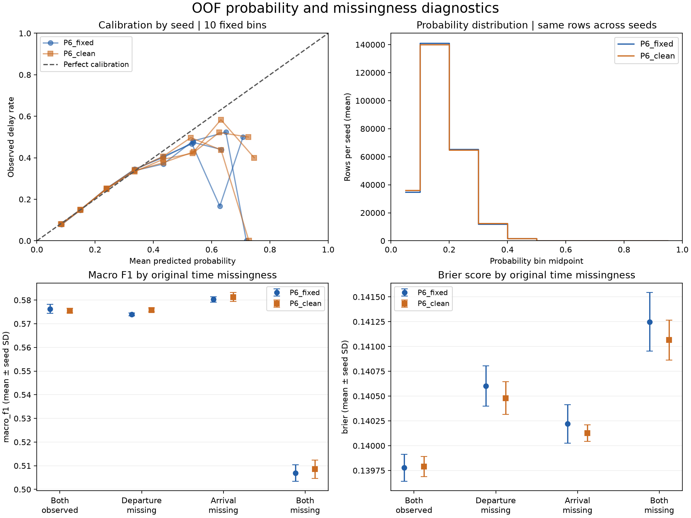

선은 시드별 결과, 점·오차막대는 평균±표본 SD이며 신뢰구간이 아닙니다. P6_clean은 실제 지연 45,000행 중 24,895행을 3시드 공통 FN, 정상 210,001행 중 21,567행을 공통 FP로 분류했습니다. seed 42 사례 `TRAIN_722761`은 정상인데 0.727853≥0.23, `TRAIN_288306`은 지연인데 0.041444<0.22였습니다. 사례만으로 오류 원인을 단정하지 않습니다. [사례 120행](output/baseline_recovery_v2_oof_20260916_v2_error_examples.csv), [반복 오류](output/baseline_recovery_v2_oof_20260916_v2_error_stability_summary.csv)

이전 `current_pipeline_evidence.json`의 코드 해시는 당시 변경 전 코드와도 불일치했고 줄바꿈만으로 설명되지 않았지만 데이터 해시는 일치했습니다. 점수 재현은 과거 코드의 바이트 동일성 증명이 아닙니다. 최신 OOF 근거는 v2 manifest와 시드별 `run_metadata`입니다.

### 보정 실험과 환경 간 비교

`baseline_recovery_v2_calibration_20260917`은 P6 두 조건 × 3시드 × 5-fold × 공유형/분리형, 12회 CV·60 outer fold입니다. 공유형은 inner-holdout 전체로 보정하며 그 행은 트리 수·임계값 선택에도 사용됩니다. 분리형은 그 절반(약 20,400행)을 선택용 조각과 분리해 보정합니다. 두 경로 모두 outer-valid는 적합·선택에 사용하지 않습니다.

보정 없음의 P6_clean seed 42는 기존과 F1 0.576926·LogLoss 0.447225·혼동행렬·fold별 임계값·트리 수가 일치했습니다. 이는 해당 대조에서 보정 외 경로의 일관성을 확인한 것입니다.

작업 환경 Linux/Python 3.11/numpy 2.4.4/scikit-learn 1.9.1 결과를 Windows/Python 3.14.6/numpy 2.5.3/scikit-learn 1.9.0에서 재검증한 기록입니다. 두 환경에서 당시 테스트 193개 통과, 처음에는 P6_clean seed 42 공유형 5그룹×9지표와 6개 코드 파일 해시를 확인했고, 이후 전체 12개 셀을 비교했습니다.

scores 180키·folds 180키, 한쪽에만 있는 키는 0개였습니다. F1·AUC·precision·recall·혼동행렬·fold 임계값·트리 수는 해당 180키에서 같았습니다. **집계 지표 일치만으로 개별 행의 예측이 모두 같다고 증명하지는 않습니다.** LogLoss·Brier·ECE·평균확률−실제의 720셀 중 19셀은 5.55e-17~1.67e-16(1~3 ULP) 차이였고, 그중 Platt 14셀·보정 없음 0셀이었습니다. 누산 순서·라이브러리 차이라는 설명은 가능한 해석이지 검증한 원인 귀속이 아닙니다. 기본 허용치 0의 비교 스크립트는 이런 차이에도 종료 코드 1입니다.

[전체 비교](output/baseline_recovery_v2_calibration_local_20260917_comparison.csv), [로컬 전체 scores](output/baseline_recovery_v2_calibration_local_20260917_scores.csv), [로컬 seed 42 보정](output/baseline_recovery_v2_local_verify_calibration_seed42_scores.csv), [로컬 기준선](output/baseline_recovery_v2_local_verify_p6_clean_seed42.csv), [작업 환경 기준선](output/baseline_recovery_v2_cloud_parity_p6_clean_seed42.csv)

| P6_clean 공유형·3시드 평균 | F1 | LogLoss | AUC | Brier | ECE (%p) | 평균확률−실제 |
|---|---:|---:|---:|---:|---:|---:|
| 없음 | 0.575685 | 0.447577 | 0.642804 | 0.139904 | 0.4588 | −0.002189 |
| Platt | 0.575517 | 0.447519 | 0.642799 | 0.139890 | 0.3477 | −0.000059 |
| Isotonic | 0.575248 | 0.448937 | 0.642120 | 0.139915 | 0.1877 | −0.000077 |

편향·ECE 감소 방향은 2조건×2방식×3시드에서 같았지만 통계적 유의성 검정이 아닙니다. 공유형 ECE 감소는 Isotonic 약 59%·Platt 약 24%, F1 차이는 −0.0004~+0.0002로 부호가 섞였습니다. 평균 임계값은 0.227에서 Platt 0.231, Isotonic 0.236으로 이동했습니다. Isotonic LogLoss 약 +0.00136·AUC 감소는 계단형 동률에 따른 순위 정보 감소와 부합합니다.

분리형의 Isotonic ΔECE는 약 −0.22%p로 공유형 −0.27%p보다 작았습니다. 공유형 낙관 가능성을 고려할 이유지만 그 원인을 단정하지 않습니다. 양쪽 시각 결측 그룹 ΔBrier는 +0.00004~+0.00027이고 F1·재현율 개선은 확인되지 않았습니다. 보정은 현재 목표의 지연 탐지 문제를 해결하지 못했습니다.

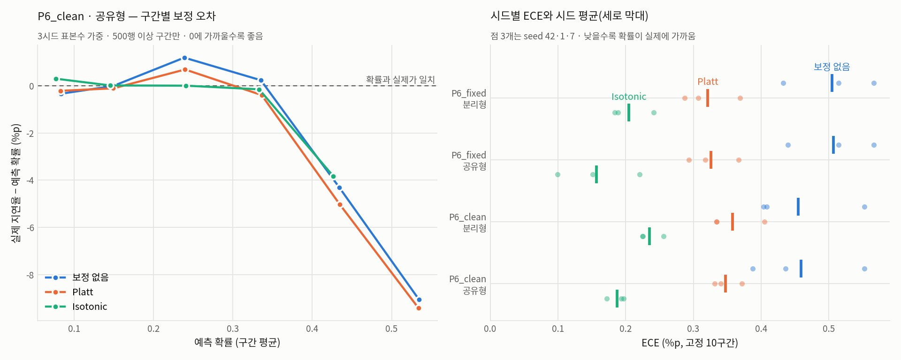

왼쪽은 실제 지연율−예측 확률, 오른쪽 점은 시드 ECE·막대는 평균입니다. 곡선은 3시드 표본수 가중 평균이지 오차막대가 아닙니다. 높은 확률 구간은 표본 수와 함께 읽습니다. [짝지은 차이](output/baseline_recovery_v2_calibration_20260917_paired_deltas.csv), [fold 결과](output/baseline_recovery_v2_calibration_20260917_folds.csv), [구간](output/baseline_recovery_v2_calibration_20260917_calibration_bins.csv), [manifest](output/baseline_recovery_v2_calibration_20260917_manifest.json)

### 오분류 기술 분석 — 재학습 없음

`baseline_recovery_v2_error_profile_20260917`은 P6_clean의 저장된 3시드 OOF와 원본을 대조합니다. 해시·ID·행 위치·정답·결측 플래그를 먼저 확인했습니다.

양쪽 시각 결측 3,031행은 월·항공사·공항·거리·일자 구성비가 관측 그룹 대비 0.89~1.26, 동반 결측은 10.8~11.4%(나머지 10.8~10.9%)였습니다. 살핀 축에서는 특이한 구성 차이를 관측하지 못한 것이며, 모든 점에서 동일한 집단이라는 증명은 아닙니다. 이 그룹 확률의 82.4%가 [0.10,0.20)에 있고 최대는 0.4986(양쪽 관측 0.7279)이었습니다. 양쪽 관측 그룹은 30.9%가 0.20 이상이었습니다. 결측 그룹 안에서도 확률 증가에 따라 실제 지연율이 12.7→22.7→24.2%로 증가해 순위 정보가 완전히 사라진 것은 아닙니다.

2,000행 이상 그룹의 실제 지연율과 평균 확률 상관은 출발 공항 0.988·판매 코드 0.973·항공사 0.961·월 0.848이며, 공항 위험도 범위는 실제 0.078~0.254 대비 예측 0.098~0.221로 좁았습니다.

공통 FN 24,895행(지연의 55.3%)은 9~12월 구성비 2.2~2.5배, SkyWest 4.0·Delta 3.8·Alaska 5.4배, 거리 중앙값 612 대 762였습니다. 공통 FP 21,567행은 5~8월 1.7~1.8배, EWR 4.1·MDW 4.7·LGA 2.8배, JetBlue 3.8·Frontier 3.3배, 거리 738 대 590였습니다. 이는 비교 집단 대비 구성 기술이지 원인 추정이 아닙니다.

공통 FN의 3시드 평균 확률 중앙값/시드 변동폭은 0.1551/0.0227, 공통 FP는 0.2841/0.0456입니다. 1~2시드에서만 오류인 행은 0.217~0.241, 변동폭 0.058~0.063으로 임계값 부근이었습니다. 현재 입력·모델이 맥락 위험도를 반영하는 양상이라는 해석이며, 다른 모델·정보원에서도 같다는 증거는 아닙니다.

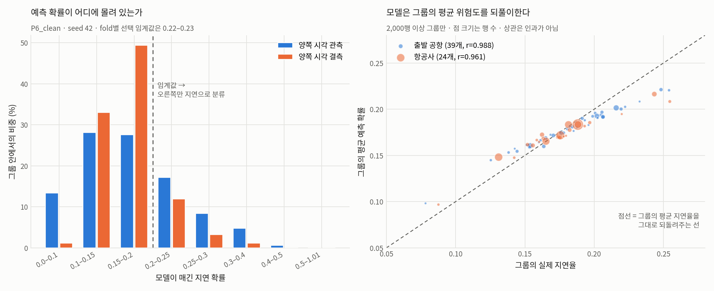

[그룹 구성](output/baseline_recovery_v2_error_profile_20260917_group_profile.csv), [동반 결측](output/baseline_recovery_v2_error_profile_20260917_missing_cooccurrence.csv), [확률 구간](output/baseline_recovery_v2_error_profile_20260917_probability_bands.csv), [평균 위험도](output/baseline_recovery_v2_error_profile_20260917_base_rate_tracking.csv), [점수 재현](output/baseline_recovery_v2_error_profile_20260917_score_reproduction.csv), [manifest](output/baseline_recovery_v2_error_profile_20260917_manifest.json)

</details>

<a id="appendix-engineering"></a>
<details>
<summary>E. 날씨 수집 예산·재개·재결합의 2~5차 수정과 현행 v3 계약</summary>

각 회차는 이전 결함을 보완한 기록입니다. 과거 출력은 덮어쓰지 않았고, **새 stratafix 실수집·전체 날씨 수집·재학습을 수행한 기록으로 해석하지 않습니다.**

### 2차 검증 (2026-09-18)

HTTP 성공 그룹만 예산에 세던 경로를 시도별(성공·실패·재시도) 계상으로 바꿨습니다. 부분 응답 바이트·timeout·backoff·원자적 체크포인트·누계 유지와 캐시 스키마/해시 검사를 추가했습니다. 당시 미측정 바이트를 별도 횟수만 남기던 한계는 4차에서 추가 수정했습니다.

수집 불가·prediction NaT 행은 `build_requests`에서 station을 결측 처리해 결합 후보에서 사전 제외합니다. 같은 관측소·시각의 진짜 관측이 캐시에 있어도 잘못 붙지 않아야 합니다. 빈 관측·전부 NaT 입력의 `MergeError`는 UTC dtype을 `datetime64[ns, UTC]`, station을 object로 고정해 해결했고, `pd.concat([])` 대신 빈 관측 프레임을 반환했습니다. 따라서 초기 “weather 모듈 수정 없이 재사용”은 **초기 회차**에만 해당합니다.

`EVIDENCE_BASIS`, 좌표거리, 유효 부분기간, UTC 오프셋 비교를 추가했습니다. 좌표 근접은 신원 증명이 아니며 시간대 문자열과 실제 오프셋도 별개입니다. 오프셋 비교는 2018~2019 하루 4시점 표본 검사로, 연속 시간 전체를 수학적으로 증명한 것은 아닙니다. IMT·KTN·PSG·SDF·SIT·WRG는 비교 시점에서 같고 STT·STX는 다르지만 8곳 모두 기존 conflict 등급을 유지합니다.

stratafix의 라운드로빈·다음 순위 버그 수정과 기존 캐시 진단을 수행했습니다. 매핑 등급 355/3/8/9, 양쪽 confirmed_period 691,386행, 예측 시점 제외 후 691,385행, 보류 15,373행(2.18%), 기존 10분 결합 269/300·271/300은 유지됐습니다. 총 테스트 298개(262+36) 기록입니다. [수정 매핑 manifest](output/baseline_recovery_v2_weather_scope_fix_20260918_mapping_manifest.json), [진단 manifest](output/baseline_recovery_v2_weather_expanded_diagnostic_20260918_diagnostic_manifest.json)

### 3차 검증 (2026-09-18)

체크포인트의 fetched 상태를 그대로 믿지 않고 캐시 존재·스키마·해시·조회 창을 재검증했습니다. selection/mapping/계획 지문, 네트워크 전 요청 예약, 남은 시간이 1초 미만이어도 부풀리지 않는 timeout, 요청 크기 상한 통일, 성공 후 3초 대기·시도 로그를 보완했습니다. 중단된 요청의 원격 성공 여부에 대한 exactly-once는 주장하지 않고 회계·증거 보존만 보장합니다.

기존 결과의 재집계와 수정 코드의 실제 재결합을 구분하기 위해 `reconcile_weather_cache_recombination.py`를 추가했습니다. 기존 21행은 바이트 동일, 기존 300행은 수집 불가 29행의 station 표기만 달라지고 날씨 값·결합 여부의 미승인 의미 차이는 0이었습니다. 당시 비교 판정의 모호함은 다음 회차에서 수정했습니다.

구간 병합·캐시 차감 산정, 미결합 원인의 station-day 연결·부재/미가용/노후 분리도 수행했습니다. 테스트 323개(298+25) 기록입니다. [3차 비교](output/baseline_recovery_v2_weather_recombination_20260918_reconciliation_comparisons.json), [manifest](output/baseline_recovery_v2_weather_recombination_20260918_reconciliation_manifest.json)

### 4차 검증 (2026-09-18)

중단·미측정 시도의 바이트가 전체 상한을 우회하던 결함을 고쳤습니다. 매 시도 전 `min(MAX_RESPONSE_BYTES, 남은 전체 예산)`을 예약·저장하고 측정되면 실제 바이트로 정산, 측정 불가면 예약을 유지합니다. `bytes_measured`와 보수적 `bytes_used`는 다릅니다. 중단 복구의 시간은 timeout+subprocess 종료유예를 포함하며, 반복 재개로 누계가 누락·중복되지 않아야 합니다.

재결합은 ID 존재·유일성·행수·순서·양방향 열집합을 먼저 검사합니다. 승인된 예외는 **수집 불가 행의 station 값→결측이며 원본·새 결과의 날씨/관측시각이 모두 결측인 경우**뿐입니다. 실제 날씨·시각 변경, 수집 가능 station 변경, 구조 차이는 회귀입니다. 최종 `PASS/FAIL`은 승인된 의미 변경 존재 여부와 별도이며, FAIL이면 증거를 저장한 뒤 비정상 종료합니다.

574캐시+5원본 결과의 579해시 검사, 구조 통과, 승인된 station 마스킹 232셀(29×2×4), 미승인 의미 차이 0, PASS를 기존 실캐시에서 확인했습니다. 재결합 결과는 새 `_rejoined/` 경로에 보존합니다. 테스트 341개(323+18) 기록입니다. [4차 비교](output/baseline_recovery_v2_weather_recombination_fix_20260918_reconciliation_comparisons.json), [manifest](output/baseline_recovery_v2_weather_recombination_fix_20260918_reconciliation_manifest.json)

### 5차 검증 (2026-09-18)

사전 예약 회계가 달라졌는데도 버전 1을 유지하던 문제를 **당시 v2**로 분리했습니다. 구버전이나 필수 필드가 빠진 현재 버전은 네트워크 전에 거부하고 원본을 보존합니다. 바이트 동일 파일이라도 ID 중복·ID 열 누락 등이 같게 망가진 경우를 잡도록 구조 검사를 항상 먼저 수행하게 바꿨습니다.

기존 579해시 검사에 없던 실제 `selection_with_prediction_at.csv` 두 개·mapping 표를 `input_provenance_checks`로 연결했습니다. 이전 300행 fetch manifest에는 지문 메커니즘 도입 전이라 `plan_fingerprint`가 없었습니다. 이때는 `checked_against_prior_recorded_expectation=false`로 현재 해시만 기록하며 과거 동일성을 주장하지 않습니다. prediction_at 추가 파일도 이전 기대 해시가 없으면 같은 경계를 적용합니다. 재결합이 실제 읽는 의존 코드의 지문도 함께 기록했습니다.

`baseline_recovery_v2_weather_recombination_provenance_20260918`은 579해시 검사·추가 provenance 검사 4개, 21행 바이트 동일, 300행 승인 232셀·미승인 0, 구조 통과·PASS입니다. 테스트 354개(341+13) 기록입니다. [5차 비교](output/baseline_recovery_v2_weather_recombination_provenance_20260918_reconciliation_comparisons.json), [manifest](output/baseline_recovery_v2_weather_recombination_provenance_20260918_reconciliation_manifest.json)

### 현행 총예산과 계획 지문 분리 — v3 (2026-09-20)

이전 CLI는 총예산을 계획 지문에 포함해, cap 도달 후 같은 cap으로는 못 진행하고 cap을 늘리면 지문이 달라 재개를 거부하는 모순이 있었습니다. PR #2에서 불변 selection·mapping·station/day 조회 창·요청당 크기/timeout/retry/padding/grace/pause 정책과 변경 가능한 누적 총상한을 분리했습니다.

현재 `CHECKPOINT_SCHEMA_VERSION=3`, 총상한은 `budget_limit_history`에 기록합니다. 같은 계획의 상한을 늘려도 누계는 초기화되지 않고, 상한을 줄여도 과거 사용량을 지우지 않습니다. v2 지문에서 예산만 안전하게 분리할 수 없어 자동 이관하지 않으며 새 논리 실행은 기존 결과와 구분합니다. 이 변경은 Git-only 검증이며 새 실수집 결과가 아닙니다. [PR #2](https://github.com/Peter-jackson12/Airplane/pull/2), [현행 수집 코드](notebooks/fetch_weather_sample_expanded.py), [회귀](tests/test_weather_expanded_pipeline.py)

</details>

<a id="appendix-station-identity"></a>
<details>
<summary>F. 우선 조사 20개 공항: 현재 식별자, 관측 프로그램, 역사적 연속성의 분리</summary>

**판정 기준은 4회차** [증거표](output/baseline_recovery_v2_station_identity_verification_fix_20260918_evidence.csv)·[manifest](output/baseline_recovery_v2_station_identity_verification_fix_20260918_manifest.json)입니다. 이 문서 개편은 저장된 증거·코드의 검토이며 원본 HOMR/IEM 캐시 재현을 새로 수행한 것이 아닙니다.

대상은 confirmed_current_only 3 + tz_conflict 8 + unconfirmed 9 = 20개이고 confirmed_period 355개와 겹치지 않습니다. 최신 증거는 현재 식별자, 2018~2019 근거, 관측 프로그램/위치 연결, `historical_continuity_2018_2019`, 추론/미해결, `identity_determination`을 구분합니다. `verification_tier`나 production 매핑을 자동 승격하지 않습니다.

| 공항·그룹 | 현재 근거와 남은 한계 |
|---|---|
| AZA→IWA | HOMR AWOS ncdcStnId 10000826 사용; 같은 조회의 NEXRAD 30001870은 별개. 개명 remark는 DATE UNKNOWN |
| BKG→BBG, HHH→HXD, MQT→SAW, SCE→UNV, USA→JQF | 현재 식별자 대응은 해소. 이전 remark 부재·열린 POR만으로 2018~2019 연속성을 독립 확인했다고 하지 않음 |
| FCA→GPI | 2005-10-25 개명 remark는 날짜 있는 근거. 이후 연구기간 전체의 무변경 증명은 아님 |
| PBI→DJT | 현재 FAA=DJT·ICAO=KDJT·NWSLI=PBI. `rename_confirmed_by_current_ids_undated_in_record`; 개명이 연구기간 이후라는 원자료 귀속 주장은 철회 |
| IMT·SDF·SIT | 현재 ASOS 프로그램/시설 연결 확인과 연구기간 연속성 미확인을 분리. 시간대 문자열 conflict 유지 |
| KTN | 1997년 사건은 날짜 있는 연구기간 이전의 간접 근거. 2018~2019 전체 직접 확인과 구별 |
| ISN·XWA | 시설 이전·신규 기록 근거. IEM archive 경계·HOMR POR·시설 폐쇄일은 다른 의미. XWA IEM 2019-10-12와 HOMR 2019-10-25의 13일 차이 미해결 |
| YUM | HOMR FAA:YUM과 ICAO:KNYL, IEM YUM·NYL을 함께 봐야 함. 폐쇄 YUM의 좌표 출처 충돌이 남아 `identifier_mismatch_partially_resolved_source_conflict` 유지 |
| WRG·PSG | 인용 HOMR 레코드는 COOP 전용, ASOS/AWOS 연결 부족. `unconfirmed_program_linkage_insufficient` 유지 |
| STT·STX | IEM Atlantic/Bermuda와 mwgg America/St_Thomas 충돌 미해결. 추론만으로 tz 등급을 승격하지 않음 |
| SPN | HOMR 관측소는 있으나 기존 GU_ASOS 캐시에서 GSN/SPN/PGSN 모두 없음. 관측소 부재가 아닌 파이프라인 수집 경로 공백 |

ISN HOMR ncdcStnId 10007500의 POR 끝 2024-02-27은 시설 폐쇄일이 아닙니다. 마지막 LCD 2019년 9월·XWA 이전 remark가 부분기간 근거입니다. XWA는 새 기록이며 기존 ISN과 기후학적으로 호환하지 않는다는 remark를 같은 시설 연속성으로 바꾸지 않습니다.

YUM의 폐쇄 FAA:YUM ncdcStnId 20000933은 COOP·1946~2007 기록이며 실제 공항 KNYL/NYL ncdcStnId 20000934와 별개입니다. HOMR 두 좌표는 약 2.3km 떨어지지만 IEM의 폐쇄 YUM 좌표는 NYL과 같고 ncei91/climate_site 코드도 공유합니다. 양 출처 충돌을 해소한 것처럼 쓰지 않습니다. KNYL의 2021-12-16 ASOS 메타데이터 추가일은 설치일이 아니며 COOP POR 1960~Present는 ASOS 운영기간이 아닙니다. IEM NYL archive가 1977-01-27부터라는 것은 별도 근거입니다.

WRG의 2012-10-23 비활성 remark와 “SRG 좌표를 AWOS와 구별해 수정” remark는 COOP 레코드에 관한 것입니다. 주변 AWOS의 자체 식별자·플랫폼·기간 연결을 입증하지 않습니다. PSG도 COOP 전용 레코드를 자동관측 이력으로 쓰지 않습니다.

PBI는 현재 식별자 확인과 개명일을 구별합니다. enteredDate는 메타데이터 편집일이며 실제 사건일 근거가 아닙니다. 외부 배경지식을 원자료 remark인 것처럼 기록했던 부분을 철회했습니다. FCA·KTN의 실제 날짜 remark는 이 정정과 구별됩니다.

생성 코드는 HOMR JSON에서 ncdcStnId·필수/금지 플랫폼을 선택하고 `EXPECTED_IDENTIFIERS`의 FAA/ICAO/NWSLI/NEXRAD 값도 대조합니다. AZA의 2레코드·YUM의 2파일을 포함합니다. 원자료가 없거나 지지하지 않으면 증거표 생성 전에 실패합니다. 이 검사는 고정된 판단문과 인용 레코드의 연결 검사이며, 영문 remark를 자동 해석해 역사적 연속성을 판정하는 알고리즘은 아닙니다.

과거 회차의 출력은 덮어쓰지 않습니다. [첫 조사 증거](output/baseline_recovery_v2_station_identity_investigation_20260918_evidence.csv)·[manifest](output/baseline_recovery_v2_station_identity_investigation_20260918_manifest.json), [해석 재검토 증거](output/baseline_recovery_v2_station_identity_review_20260918_evidence.csv)·[manifest](output/baseline_recovery_v2_station_identity_review_20260918_manifest.json), [생성 경로 검증 증거](output/baseline_recovery_v2_station_identity_verification_20260918_evidence.csv)·[manifest](output/baseline_recovery_v2_station_identity_verification_20260918_manifest.json)를 보존합니다. 원자료 누락 상태에서 이 기록만 읽은 것을 실제 캐시 재현으로 보고하지 않습니다.

</details>

<a id="appendix-reproduction"></a>
<details>
<summary>G. 학습·OOF·BTS·날씨의 재현 명령과 입력 계약</summary>

아래 날짜 포함 이름은 **당시 실행을 찾기 위한 기록**입니다. 기존 출력에 그대로 재실행하라는 뜻이 아닙니다. 데이터·코드·설정 지문이 다르면 새 이름을 쓰고, 출력 간 의존 실행명도 일관되게 연결합니다. 정상 재개인지 확인하기 전 기존 결과를 덮어쓰지 않습니다. 과거 v1/v2 체크포인트는 현행 v3 수집 명령으로 자동 이관되지 않습니다.

장시간 실행은 `python -u`로 로그를 남깁니다. 아래 명령은 루트 임포트 문제를 피하도록 `-m notebooks.<module>` 형식으로 통일했습니다. 과거 `.venv/Scripts/python.exe`와 `uv run` 진입은 같은 해당 환경을 사용하는지 확인합니다. 모듈 파일의 존재는 문서 회귀로 검사하지만, 이 문서 정리에서 아래 실데이터 명령을 실행한 것은 아닙니다. `uv --offline`은 스크립트 네트워크 차단이 아닙니다.

### 원본 라벨 진단·전처리 실험

`build_label_coverage_review`에는 원본이 필요하며 노트북 생성용 nbformat·nbclient·nbconvert·ipykernel은 현재 pyproject 선언에 포함되지 않습니다. 필요한 환경을 확인하고 잠금 파일을 임의로 바꾸지 않습니다.

```powershell
uv run --locked --offline python -u -m notebooks.build_label_coverage_review
uv run --locked --offline python -u rerun_all_phases.py --sample 2000 --seed 42 --phases P4_clean,P6_clean --output-prefix baseline_recovery_v2_readme_smoke
uv run --locked --offline python -u rerun_all_phases.py --seed 42 --phases P6_clean --output-prefix baseline_recovery_v2_p6_clean_reproduction_seed42
```

앞 2,000행 스모크는 실행 경로 확인이지 성능 근거가 아닙니다. 10조건×3시드의 조합은 [실험 드라이버](notebooks/run_preprocessing_experiments.py)에 있으며 고정 출력명 재개를 사용하므로 지문 변경 시 별도 이름의 실행이 필요합니다. `--force`는 검증 우회 옵션이 아닙니다.

### OOF 저장·진단 계약

`--save-oof`는 행 위치·ID·정답·Phase·seed·0기반 fold·확률·내부 임계값·예측·트리 수를 보존합니다. `raw_missing__*`는 대치 전 원본 isna, `feature_missing__*`는 인코딩 후 미상 토큰/시각이며 ID·타깃은 결측 개수에서 제외합니다.

OOF를 원자 저장한 뒤 해시·스키마·경로를 집계에 연결합니다. 파일명은 내용 해시를 포함하고 재개 시 스키마·입력 지문·해시·행수·ID 중복·fold를 검사합니다. 행별 압축 파일은 로컬 전용입니다. 최신 OOF는 v2(스키마 2)이며 초기 v1의 Airline 결측 토큰 검사 오류가 있는 후처리 결측 분석은 채택하지 않습니다. 초기 확률·원본 결측 이력이 영향 없었다는 것과 후처리 결측 분석의 유효성은 구별합니다.

그룹은 원본 결측/관측·입력 결측 개수·시각 4조합을 사용합니다. 빈 그룹·단일 클래스 AUC는 미정의, 그룹 F1은 `[0,1]` 고정입니다. 10구간 ECE·Brier·precision/recall·FP/FN·FPR/FNR을 계산하고, 사례는 Phase/seed/FP·FN별 오차가 큰 10행(ID로 동률 해소)입니다. 시드별 지표를 먼저 계산한 뒤 평균·표본 SD를 구하며 같은 행의 3시드를 독립 표본으로 합치지 않습니다.

```powershell
uv run --locked --offline python -u -m notebooks.run_oof_diagnostics --sample 2000 --seeds 42 --name baseline_recovery_v2_oof_smoke_20260916_v2
uv run --locked --offline python -u -m notebooks.run_oof_diagnostics --name baseline_recovery_v2_oof_20260916_v2
uv run --locked --offline python -u -m notebooks.run_oof_diagnostics --name baseline_recovery_v2_oof_20260916_v2 --analyze-only
uv run --locked --offline python -u -m notebooks.analyze_oof_error_profile --source baseline_recovery_v2_oof_20260916_v2 --name baseline_recovery_v2_error_profile_20260917
uv run --locked --offline python -u -m notebooks.plot_oof_error_profile --name baseline_recovery_v2_error_profile_20260917
```

`--analyze-only`는 `run_oof_diagnostics`의 저장 예측 분석 옵션이며 재학습은 없지만 원본은 필요합니다. 실행 로그는 이름별·시드별로 보존합니다.

### 확률 보정·환경 간 재현

```powershell
uv run --locked --offline python -u -m notebooks.run_calibration_experiment --sample 2000 --seeds 42 --name baseline_recovery_v2_calibration_smoke_20260917
uv run --locked --offline python -u -m notebooks.run_calibration_experiment --name baseline_recovery_v2_calibration_20260917
uv run --locked --offline python -u -m notebooks.report_calibration_experiment --name baseline_recovery_v2_calibration_20260917
uv run --locked --offline python -u -m notebooks.plot_calibration_experiment --name baseline_recovery_v2_calibration_20260917
uv run --locked --offline python -u rerun_all_phases.py --seed 42 --phases P6_clean --output-prefix baseline_recovery_v2_calibration_equivalence_baseline
uv run --locked --offline python -u -m notebooks.run_calibration_experiment --seeds 42 --phases P6_clean --arms shared --name baseline_recovery_v2_calibration_equivalence_20260917
uv run --locked --offline python -u -m notebooks.run_calibration_experiment --name baseline_recovery_v2_calibration_local_20260917
uv run --locked --offline python -u -m notebooks.compare_calibration_runs --left baseline_recovery_v2_calibration_20260917 --right baseline_recovery_v2_calibration_local_20260917 --out baseline_recovery_v2_calibration_local_20260917
```

`--arms split`은 inner-holdout을 분리합니다. 보정 인자가 없으면 기존 학습 경로를 유지합니다. 비교 키는 조건·시드·방식·보정기·그룹이며 누락 키 또는 허용차 초과는 종료 1입니다. 표시 `동일/거의 같음/불일치`의 `--near` 기본 1e-12와 종료 판정 `--tolerance` 기본 0을 구별합니다.

### 내부 달력·Reporting 대조

```powershell
uv run --locked --offline python -u -m notebooks.analyze_calendar_signature --name baseline_recovery_v2_calendar_signature_20260917
uv run --locked --offline python -u -m notebooks.analyze_calendar_mixture --name baseline_recovery_v2_calendar_mixture_20260917
uv run --locked --offline python -u -m notebooks.analyze_record_integrity --name baseline_recovery_v2_record_integrity_20260917
uv run --locked --offline python -u -m notebooks.verify_bts_november --name baseline_recovery_v2_bts_november_20260917
uv run --locked --offline python -u -m notebooks.diagnose_bts_november_mismatch --name baseline_recovery_v2_bts_november_mismatch_r2_20260917
uv run --locked --offline python -u -m notebooks.assess_bts_november_recovery --name baseline_recovery_v2_bts_november_recovery_r2_20260917
```

내부 달력에는 원본만, Reporting에는 `data/bts/`의 4개 ZIP이 추가로 필요합니다. 압축을 미리 풀 필요는 없습니다. 순열 횟수는 `--draws`로 조절합니다. 2026-09-17 로컬 재검증의 CSV 3개는 LF/CRLF 정규화 후 일치했고 의존 코드 해시 차이도 줄바꿈으로 확인했습니다. [혼합 재검증](output/baseline_recovery_v2_calendar_mixture_verify_20260917_manifest.json), [정합성 재검증](output/baseline_recovery_v2_record_integrity_verify_20260917_manifest.json)

### Marketing 월별 대조·12개월 귀속

```powershell
uv run --locked --offline python -u -m notebooks.verify_bts_marketing --month 2 --name baseline_recovery_v2_bts_marketing_m02_20260917
uv run --locked --offline python -u -m notebooks.verify_bts_marketing --month 7 --name baseline_recovery_v2_bts_marketing_m07_20260917
uv run --locked --offline python -u -m notebooks.verify_bts_marketing --month 11 --name baseline_recovery_v2_bts_marketing_m11_20260917
uv run --locked --offline python -u -m notebooks.summarize_bts_marketing_months --name baseline_recovery_v2_bts_marketing_summary_20260917 --runs baseline_recovery_v2_bts_marketing_m02_20260917 baseline_recovery_v2_bts_marketing_m07_20260917 baseline_recovery_v2_bts_marketing_m11_20260917
uv run --locked --offline python -u -m notebooks.assign_row_dates --name baseline_recovery_v2_row_date_attribution_20260918 `
  --runs baseline_recovery_v2_bts_marketing_m01_20260918 baseline_recovery_v2_bts_marketing_m02_20260917 baseline_recovery_v2_bts_marketing_m03_20260918 `
  baseline_recovery_v2_bts_marketing_m04_20260918 baseline_recovery_v2_bts_marketing_m05_20260918 baseline_recovery_v2_bts_marketing_m06_20260918 `
  baseline_recovery_v2_bts_marketing_m07_20260917 baseline_recovery_v2_bts_marketing_m08_20260918 baseline_recovery_v2_bts_marketing_m09_20260918 `
  baseline_recovery_v2_bts_marketing_m10_20260918 baseline_recovery_v2_bts_marketing_m11_20260917 baseline_recovery_v2_bts_marketing_m12_20260918
```

각 월 Marketing ZIP 두 개와 원본이 필요하며 귀속은 기존 월별 결과를 읽습니다. `--runs` 생략 기본은 2·7·11월이므로 전체 재현에는 12개를 명시합니다. 원본 DOT는 운항사 ID에 대응하고 판매사 ID로 바꾸지 않습니다. 11월 전용 코드를 월 인자로 일반화한 뒤 압축 해제 근거의 동일성을 확인했으며 이전 11월 결과를 보존했습니다.

과거 Python 3.10/pandas 2.3.3와 Python 3.14/pandas 3.0.5의 재현 차이는 결측 이름 그룹 처리에서 발견됐습니다. pandas 2의 문자열 nan과 pandas 3의 결측 제외로 590행 그룹 집계가 달라지는 문제를 구별했고, gzip 메타데이터와 압축 해제 내용 비교도 구별합니다. 실행 근거·현재 코드를 기준으로 판정합니다.

### 전체 weather join·paired model comparison — 최종 제출 경로

아래 두 실행은 새 수집을 하지 않습니다. 첫 명령은 finalized 1,317 cache를 읽어 full join을 만들고, 둘째 명령은 검증된 10분 gzip과 원본을 해시 확인한 뒤 `P6_clean` weather-off/on 6 cells를 실행합니다. 기존 이름의 최종 evidence가 존재하면 덮어쓰지 않습니다.

```powershell
uv run --locked --offline python -u -m notebooks.join_weather_full --name baseline_recovery_v2_weather_full_join_20260922 --transport-name baseline_recovery_v2_weather_full_bulk_20260921 --mapping-name baseline_recovery_v2_weather_scope_fix_20260918
uv run --locked --offline python -u -m notebooks.run_weather_model_comparison --name baseline_recovery_v2_weather_model_compare_20260922
```

모델 실행의 `--validate-inputs-only`는 fit/checkpoint/final output 없이 180,332 평가행, 31,805 양성, base 25열·weather-on 39열, 고정 14개 weather feature와 입력 해시를 확인합니다. 실제 모델은 seeds 42/1/7에서 off/on 동일 outer fold를 사용하며, 각 조건의 트리 수·임계값은 outer-train 내부 nested 절차로 선택합니다. [실행 코드](notebooks/run_weather_model_comparison.py), [feature 계약](src/weather_model.py)

### 초기 날씨 표본·초기 수집 산정 — 역사적 실행

아래 선정/매핑/fetch는 필요한 경우 외부 데이터를 조회합니다. 원본·귀속 결과·mwgg 캐시와 관련 캐시가 필요합니다. 초기 실행명과 현재 stratafix를 섞지 않습니다.

```powershell
uv run --locked --offline python -u -m notebooks.select_weather_sample --name baseline_recovery_v2_weather_sample_20260918
uv run --locked --offline python -u -m notebooks.fetch_weather_sample --name baseline_recovery_v2_weather_sample_20260918
uv run --locked --offline python -u -m notebooks.join_weather_sample --name baseline_recovery_v2_weather_sample_20260918
uv run --locked --offline python -u -m notebooks.map_weather_stations --name baseline_recovery_v2_weather_scope_20260918
uv run --locked --offline python -u -m notebooks.scope_weather_collection --name baseline_recovery_v2_weather_scope_20260918 --mapping-name baseline_recovery_v2_weather_scope_20260918 --measured-bytes-per-request 2441.275 --measured-seconds-per-request 3.21
uv run --locked --offline python -u -m notebooks.select_weather_sample_expanded --name baseline_recovery_v2_weather_expanded_20260918 --mapping-name baseline_recovery_v2_weather_scope_20260918 --max-rows 300
uv run --locked --offline python -u -m notebooks.fetch_weather_sample_expanded --name baseline_recovery_v2_weather_expanded_20260918 --mapping-name baseline_recovery_v2_weather_scope_20260918 --max-requests 600 --max-bytes 200000000 --max-seconds 3600
uv run --locked --offline python -u -m notebooks.join_weather_sample_expanded --name baseline_recovery_v2_weather_expanded_20260918 --mapping-name baseline_recovery_v2_weather_scope_20260918
```

`--measured-seconds-per-request 3.21`은 인자명과 달리 검증된 요청별 실측이 아닌 과거 추정입니다. 이 외삽 명령을 최신 규모 산정으로 쓰지 않습니다. 현행 선정 코드로 옛 이름을 재실행하면 옛 선정이 재현된다고 가정할 수 없으므로 원본 결과·당시 코드 지문을 보존합니다.

### 수정 표본 선정·캐시 진단·재결합 — 당시 명령

```powershell
uv run --locked --offline python -u -m notebooks.map_weather_stations --name baseline_recovery_v2_weather_scope_fix_20260918
uv run --locked --offline python -u -m notebooks.select_weather_sample_expanded --name baseline_recovery_v2_weather_expanded_stratafix_20260918 --mapping-name baseline_recovery_v2_weather_scope_fix_20260918 --max-rows 300
uv run --locked --offline python -u -m notebooks.diagnose_weather_expanded_cache --name baseline_recovery_v2_weather_expanded_20260918 --out-name baseline_recovery_v2_weather_expanded_diagnostic_20260918 --mapping-name baseline_recovery_v2_weather_scope_20260918
uv run --locked --offline python -u -m notebooks.reconcile_weather_cache_recombination --name baseline_recovery_v2_weather_recombination_20260918
uv run --locked --offline python -u -m notebooks.scope_weather_collection_refined --name baseline_recovery_v2_weather_scope_refined_20260918 --mapping-name baseline_recovery_v2_weather_scope_20260918
uv run --locked --offline python -u -m notebooks.diagnose_weather_expanded_cache --name baseline_recovery_v2_weather_expanded_20260918 --out-name baseline_recovery_v2_weather_expanded_diagnostic_v2_20260918 --mapping-name baseline_recovery_v2_weather_scope_20260918
uv run --locked --offline python -u -m notebooks.reconcile_weather_cache_recombination --name baseline_recovery_v2_weather_recombination_fix_20260918
uv run --locked --offline python -u -m notebooks.reconcile_weather_cache_recombination --name baseline_recovery_v2_weather_recombination_provenance_20260918
```

기존 캐시가 있는 상태의 매핑 재계산·선정·진단은 새 수집을 하지 않는 경로입니다. 재결합은 수정된 결합 코드를 실제 캐시로 호출한 것이고, 과거 join 결과를 단순 재집계한 것과 다릅니다. 재결합 스크립트는 네트워크 호출을 감시하고, FAIL이면 manifest/비교표 저장 후 비정상 종료합니다. 기존 결과와 `_rejoined/` 파일은 보존합니다.

### HOMR 캐시 전용 재현

HOMR JSON 21개·IEM GeoJSON 9개를 기존 증거 해시로 복원한 후 [7절 명령](#next-local-run)을 사용합니다. 다른 HOMR 경로는 `--cache-dir`로 지정하며 IEM 경로와 구별합니다. 미존재 HOMR 조회는 기본 실패하고 `--allow-network`가 있어야 새 조회가 허용됩니다. 새 조회는 과거 동일 입력 재현이라고 하지 않습니다.

</details>

<a id="appendix-history"></a>
<details>
<summary>H. 과거 테스트 수, 철회된 해석과 보존 문서</summary>

### 테스트 기록은 실행 시점별입니다

| 시점·작업 | 당시 기록 | 현재 읽는 방법 |
|---|---|---|
| 전처리 README 정리 | 158개 통과 | 과거 구현 검증 |
| OOF v2 | 182개 통과; 앞 2,000행/라벨 501행 스모크 | 스모크는 성능 근거 아님 |
| 보정·내부 달력 | 193개 통과 | 보정 경계 11개 추가. 양 환경 실데이터 재현과 검사 수는 별개 |
| 최초 BTS 11월 | 기존 193개와 신규 4개 별도 실행 | 한 실행의 총통과 수로 합쳐 쓰지 않음 |
| 날짜 귀속 | 228개 통과(217+11) | 완전/결측 키·공동운항·마스킹·인코딩 검사 |
| 날씨 21행 / 기존 300행 | 242 / 262개 통과 | 당시 실제 표본 검증과 회귀의 범위를 구별 |
| 날씨 2/3/4/5차 | 298 / 323 / 341 / 354개 통과 | 후속 결함과 수정이 있는 역사적 회차 |
| 20공항 증거 재검토 | 374 / 395 / 402개 통과 | 원자료 캐시가 있던 검사 기록; 현재 Git-only 수와 다름 |
| 2026-09-18 코드 6806551의 캐시 없는 환경 | 379개 통과·23개 실패 | 모두 HOMR/IEM 관측소 원본 캐시 누락으로 보고된 과거 로컬 재현 기록 |
| 2026-09-20 PR #1 | 379개 통과·24개 선택 해제, 총 403개 | 관측소 23+스키마 1을 명시적 local_data로 분리 |
| 2026-09-20 PR #2 | 382개 통과·24개 선택 해제, 총 406개 | v3 재개 계약 회귀 추가; 실데이터 재현 아님 |
| 2026-09-22 full row join 구현 | 495개 통과·24개 선택 해제 | 706,759행 실제 join 전 Git-only 계약 고정 |
| 2026-09-22 weather paired 비교 구현 | **507개 통과·24개 선택 해제** | 실제 6-cell 모델 실행은 별도 로컬 evidence로 검증 |

현재 문서 개편은 이 과거 테스트를 재실행했다고 주장하지 않습니다. 최종 CI는 Actions의 해당 커밋으로 확인합니다. 문서 검사는 링크·구조·기록된 숫자의 정합성 검사이지 외부 원자료 확인이나 성능 재현이 아닙니다.

이전 OOF 회귀의 캐시 비활성 검사 명령도 보존합니다. 테스트 범위는 현행 pytest 설정의 기본 `not local_data`를 따르므로 과거 전체 검사와 같다고 해석하지 않습니다.

```powershell
uv run --locked --offline python -u -m pytest -q -p no:cacheprovider --basetemp=output/pytest_oof_tmp5
```

### 현재 사양으로 되살리지 않는 문서

| 기록 | 역할과 한계 |
|---|---|
| [PLAN](PLAN.md), [AUDIT](AUDIT.md) | 초기 계획·감사; 현재 완료 여부는 README를 따름 |
| [초기 기준선 복구](output/baseline_recovery.md) | ES 붕괴 프로토콜 기록; Phase 우열 근거에서 제외 |
| [ES 진단](output/es_diagnosis.md) | 초기 학습 붕괴; 권고는 후속 검증에서 수정 |
| [프로토콜 검토](output/es_protocol_final.md), [TE 추가 감사](output/audit_addendum_te_leak.md) | nested 선택 근거·원인 설명 정정 이력 |
| [nested 구현](output/nested_grid_implementation.md), [구조 감사](output/pipeline_architecture_review.md) | 당시 구현·잔여 문제; 현행 정보 경계와 구별 |

기존 7개 스크립트 8개 학습 루프의 best iteration 2~3 문제, 목적함수 가중/비가중 LogLoss 불일치, 사전 TE의 inner 라벨 유입은 후속 수정의 배경입니다. 과거 ES 표를 현재 Phase 순위로 사용하지 않습니다. 과거 다른 fold OOF로 임계값을 고르는 경로와 현재 fold 내부 holdout 선택도 구별합니다.

최종 제출 README는 tracked full-join·paired-model evidence를 반영해 상단 상태와 결론을 동기화했습니다. 문서 정리 과정에서는 새 모델 실험이나 날씨 수집을 수행하지 않았고, 이미 고정된 결과를 다시 선택하거나 재튜닝하지 않았습니다. 과거 표현 중 모든 층 포함, 캐시 적중 출처 단정, 마스킹 오류율 상한, 집계 일치에서 행별 동일성 추론, 해소된 11월 미일치의 재등장을 바로잡았습니다.

</details>

새 결과가 나오면 현재 상태·관련 결론·근거 링크를 먼저 갱신합니다. 상세 회차는 해당 부록에 연결하고 상단을 다시 작업 로그로 늘리지 않습니다. 지속적인 에이전트 규칙은 [AGENTS.md](AGENTS.md), 프로젝트의 현재 설명은 이 README가 담당합니다.
