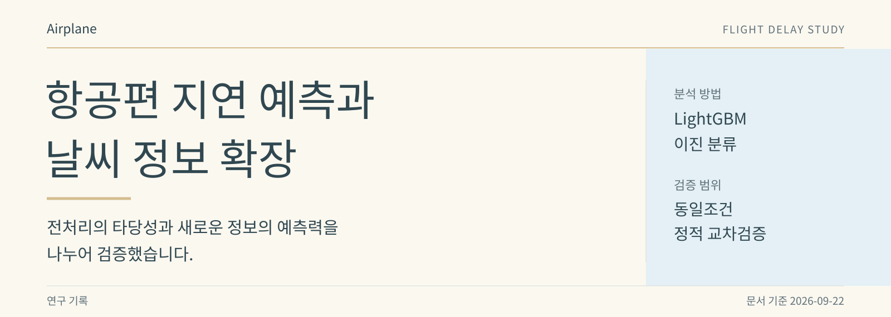
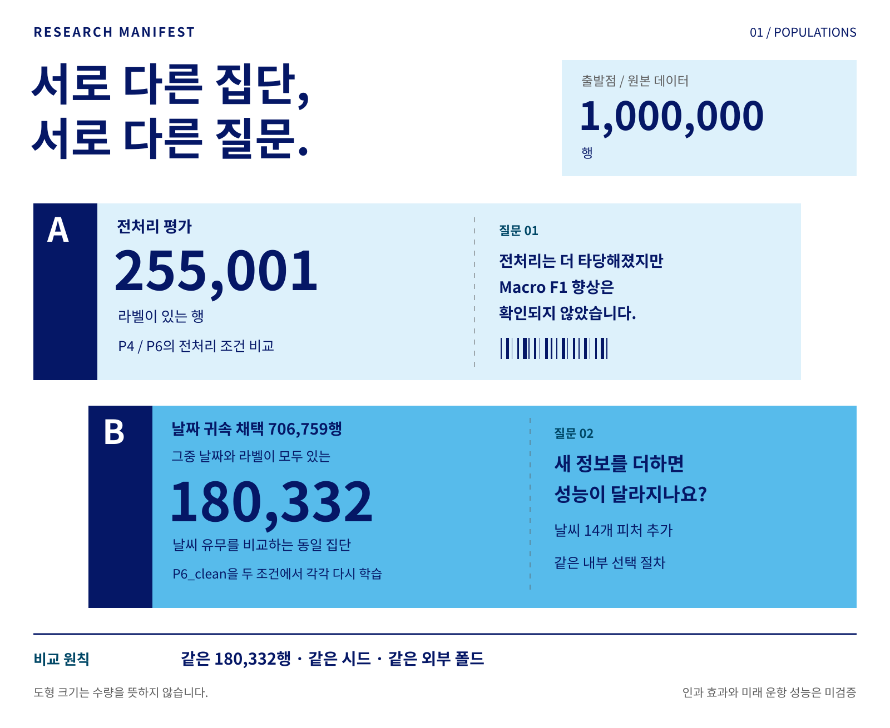
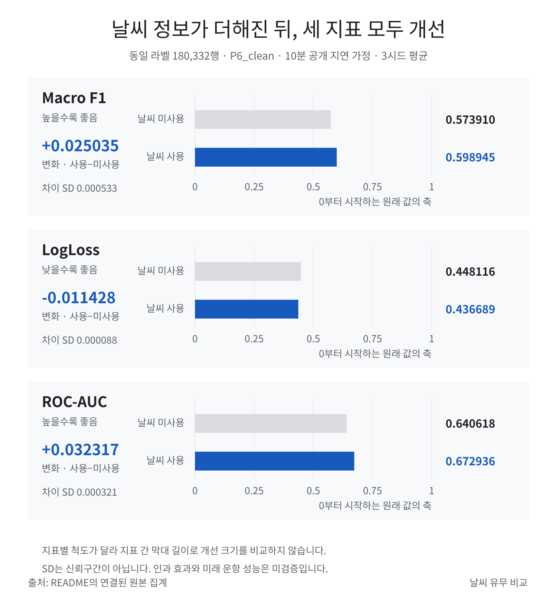
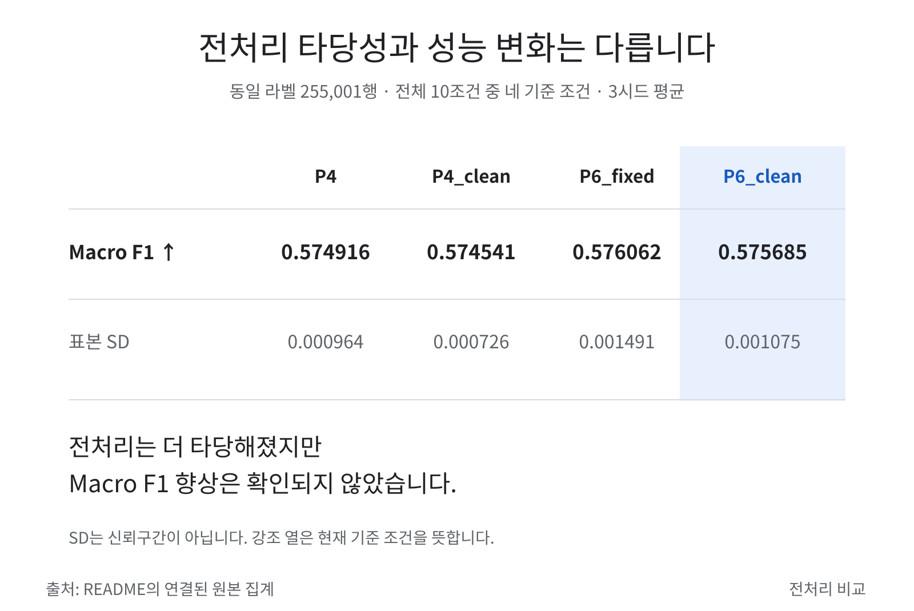
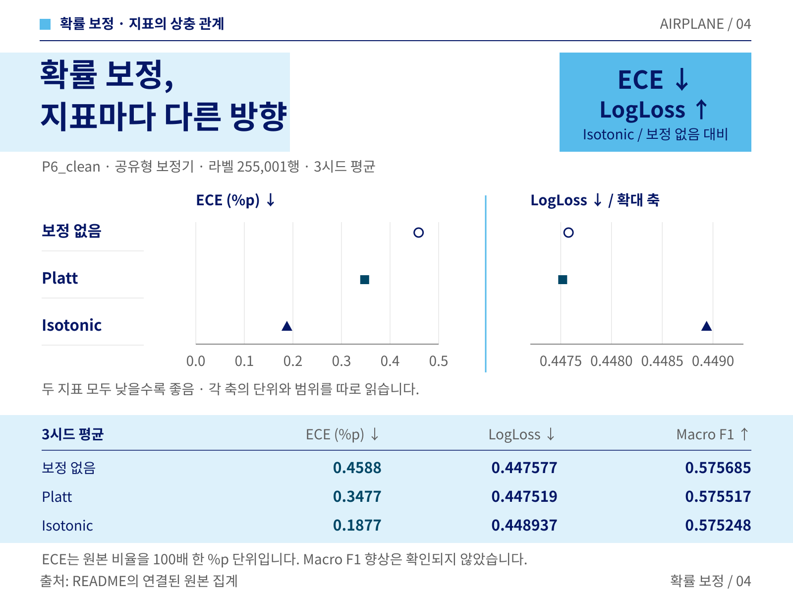
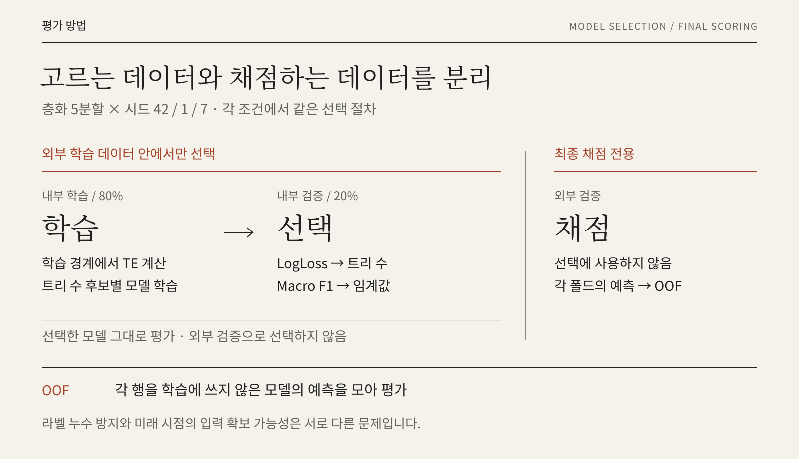
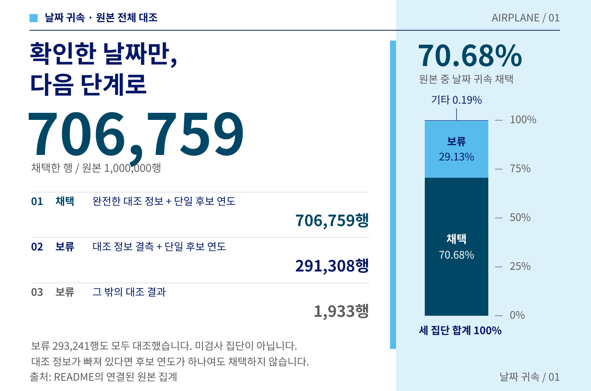
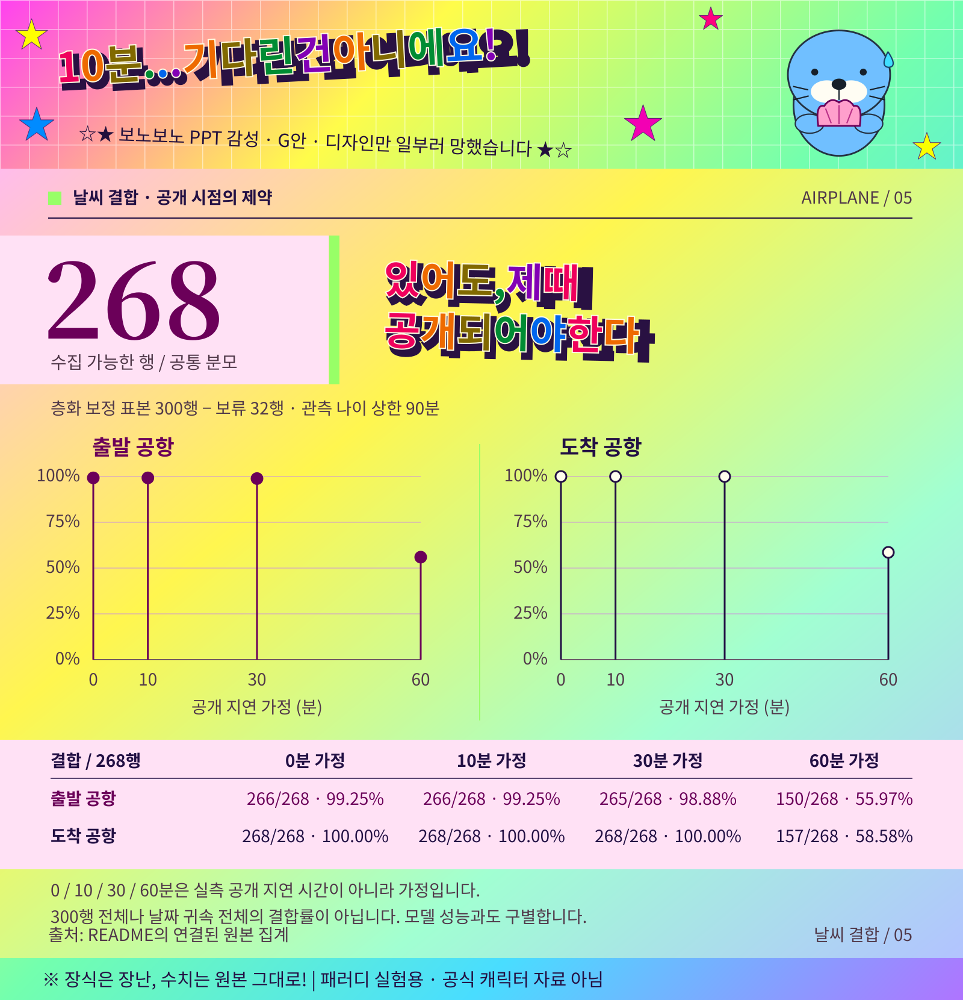

# Airplane · 항공편 지연 예측과 날씨 정보 확장

[](https://github.com/Peter-jackson12/Airplane/actions/workflows/ci.yml?query=branch%3Amaster)

**항공편 한 건의 지연 여부(`Delay`)를 LightGBM으로 예측하고, 라벨 누수 없는 교차검증 위에서 “전처리 수정”과 “출발·도착 공항 날씨 추가”가 성능을 바꾸는지 따로 검증한 머신러닝 프로젝트입니다.**

[한눈에 보기](#overview) · [핵심 결과](#results) · [문제 해결 과정](#engineering) · [한계와 다음 단계](#limits) · [재현 방법](#reproduce) · [문서·근거](#docs)

<a id="overview"></a>
## 1. 프로젝트 한눈에

| 항목 | 내용 |
|---|---|
| 문제 | CSV 한 행(항공편 한 건)의 `Delay` 이진 분류. `Not_Delayed=0`, `Delayed=1`. 타깃 결측은 **미라벨**이며 정상 정답으로 쓰지 않음 |
| 데이터 규모 | 원본 **1,000,000행 × 19열**, 라벨 **255,001행**(정상 210,001 / 지연 45,000, 지연율 17.6470%) |
| 추가 데이터 | 미국 BTS 운항 자료로 누락된 연도를 대조해 **706,759행**의 날짜 귀속 → IEM ASOS 공항 관측으로 출발·도착 날씨 결합 |
| 핵심 결과 | 동일 **180,332행**·동일 시드·동일 외부 폴드에서 날씨 14개 피처 추가 시 Macro F1 **0.573910 → 0.598945**, 세 시드(동일 행 재분할 3회) 모두 세 지표가 같은 방향으로 개선 |
| 주요 판단 | 결측을 더 많이 채우기보다 **아는 값과 추정한 값을 구분**. 전처리의 의미 개선과 성능 향상을 별도로 판정 |
| 평가 지표 | 주 지표 Macro F1·LogLoss, 보조 지표 ROC-AUC |
| 기술 스택 | Python 3.14 · LightGBM · scikit-learn · pandas · matplotlib · uv(잠금 파일 기반 환경) · pytest · GitHub Actions |

**맡은 일과 접근.** 데이터 품질 진단 → 누수 없는 평가 경로 설계 → 전처리 규칙 수정과 효과 검증 → 외부 자료(BTS·IEM)를 이용한 날짜 귀속과 시점 기준 날씨 결합 → 동일조건 비교와 결과 해석의 범위 설정까지 수행했습니다. 모든 수치는 저장소에 추적된 실행 근거(`output/`)와 연결되어 있고, 문서 내용 자체도 테스트로 검사합니다.



전체 흐름은 두 갈래입니다. **(1)** 기존 입력을 더 타당하게 처리했을 때 성능이 바뀌는지, **(2)** 새 정보(날씨)를 추가했을 때 성능이 바뀌는지를 서로 다른 실험으로 나눠 검증했습니다.

<a id="results"></a>
## 2. 핵심 결과

### 날씨 추가: 동일조건 교차검증에서 세 지표 모두 개선

| 최종 비교 지표 | 날씨 미사용 | 날씨 사용 | 변화(사용−미사용) |
|---|---:|---:|---:|
| Macro F1 ↑ | 0.573910 | **0.598945** | **+0.025035** |
| LogLoss ↓ | 0.448116 | **0.436689** | **−0.011428** |
| ROC-AUC ↑ | 0.640618 | **0.672936** | **+0.032317** |

**평가 범위.** 날짜가 귀속되고 라벨이 있는 **180,332행**(지연 31,805행)을 `P6_clean` 전처리로 학습했습니다. 두 조건은 **동일 평가행·동일 시드(42/1/7)·동일 외부 5폴드**를 사용했고, 트리 수와 임계값은 각 조건 안에서 같은 내부 선택 절차로 독립적으로 정했습니다. 값은 3시드 평균이며 평균과 변화량은 [원본 요약](output/baseline_recovery_v2_weather_model_compare_20260922_weather_model_summary.json)에서 각각 반올림했습니다. 날씨 미결합·결측 행도 평가에서 제외하지 않았습니다.



**클래스별로 보면 “지연 경보의 정확성이 개선됐다”가 정확한 표현입니다.** 지연을 훨씬 많이 잡아낸 것이 아닙니다. 아래는 같은 실행의 시드별 혼동행렬(TN/FP/FN/TP)에서 클래스별 지표를 각각 계산한 뒤 3시드 산술평균한 값입니다(새 학습 없음).

| 클래스별 지표 (3시드 평균) | 날씨 미사용 | 날씨 사용 |
|---|---:|---:|
| Delayed precision | 0.286890 | 0.333208 |
| Delayed recall | 0.346382 | 0.355919 |
| Delayed F1 | 0.313735 | 0.344182 |
| Not_Delayed F1 | 0.834084 | 0.853708 |

지연 precision은 약 28.69%→33.32%로 올랐지만 recall은 약 34.64%→35.59%(+0.95%p)에 그쳤고, 그 증가도 시드별로 고르지 않았습니다(시드 42/1/7에서 +0.30/+2.38/+0.18%p, 시드별 TP/FN 기준). Macro F1 개선의 주된 구성은 **날씨 사용 조건(내부 선택 임계값 변화 포함)에서 오경보(FP)가 감소한 것**입니다. 내부 선택된 임계값은 미사용 0.22~0.23, 사용 0.22~0.24, 트리 수는 미사용 50, 사용 75~150이었습니다(조건당 3시드 × 5폴드 = 15개 선택값). [시드별 실행 CSV](output/baseline_recovery_v2_weather_model_compare_20260922_weather_model_runs.csv) · [동일조건 차이](output/baseline_recovery_v2_weather_model_compare_20260922_weather_model_paired_deltas.csv) · [실행 기록](output/baseline_recovery_v2_weather_model_compare_20260922_weather_model_manifest.json) · [도출 과정](docs/TUTOR_FEEDBACK_HANDOFF_KO.md)

**해석 범위.** 날짜를 확인할 수 있었던 선택 집단의 **정적 교차검증** 결과입니다. 날씨의 인과 효과나 미래 운항 성능으로 일반화하지 않습니다. 모델에는 **날씨 공개 지연 10분 가정**을 사용했으며, **10분은 실측 공개 지연 시간이 아닙니다.** 세 시드는 독립 데이터셋이 아니고 3시드 표준편차(SD)는 신뢰구간이 아닙니다.

<a id="classifier-comparison"></a>
### 분류기 3종 비교: 작은 사전 선언 후보 범위에서 Random Forest가 세 지표 모두 앞섬

위 날씨 사용 조건과 **같은 180,332행·같은 외부 5폴드(분할 지문 대조)·같은 시드(42/1/7)** 에서 Logistic Regression과 Random Forest를 LightGBM과 비교했습니다. 모델마다 자기 전처리(Logistic Regression은 대치·표준화·원-핫, 트리 모델은 결측 그대로)를 내부 학습 행에만 적합하고, 작은 사전 선언 후보 중 하나를 내부 검증 LogLoss로, 임계값을 내부 검증 Macro F1로 골랐습니다. 후보는 LightGBM 트리 수 8개, Logistic Regression 규제 강도 `C` 5개, Random Forest(300그루) `min_samples_leaf` 3개 × `max_features` 2개입니다.

| 분류기 (3시드 평균) | Macro F1 평균 ± SD ↑ | LogLoss 평균 ↓ | ROC-AUC 평균 ↑ |
|---|---:|---:|---:|
| LightGBM | 0.598945 ± 0.000417 | 0.436689 | 0.672936 |
| Logistic Regression | 0.596816 ± 0.000442 | 0.437144 | 0.674405 |
| Random Forest | 0.608557 ± 0.001033 | 0.431664 | 0.687514 |

Random Forest−LightGBM 차이는 Macro F1 +0.009612, LogLoss −0.005025, ROC-AUC +0.014578이며 **세 시드 모두 세 지표에서 Random Forest가 앞섰습니다.** Logistic Regression은 LightGBM 대비 Macro F1 −0.002129, LogLoss +0.000455(낮을수록 좋음)로 조금 뒤졌고 ROC-AUC는 +0.001469로 조금 앞섰습니다(세 시드 같은 방향). 이번 LightGBM 재실행은 위 날씨 사용 결과를 시드별로 정확히 재현했습니다.

**해석.** 트리 수만 탐색하고 `learning_rate=0.05`·`num_leaves=63`·`max_depth=8`을 손으로 고정한 **현재 LightGBM 고정 설정은 이 후보 범위에서 최선이 아니었습니다.** 이 비교만으로는 LightGBM도 다른 설정을 탐색했을 때 이 차이가 줄어드는지는 **미검증**이었습니다(아래 후속 확인에서 넓힌 예산으로 다시 비교). 탐색 예산이 같지 않았기 때문입니다(LightGBM은 트리 수 1축 8개 후보, Random Forest는 2축 6개 후보). 모델별 작은 후보 안의 비교이지 전역 하이퍼파라미터 탐색이 아니므로 **Random Forest가 일반적으로 더 나은 알고리즘이라는 증거는 아닙니다.** Random Forest는 15개 폴드 모두 같은 조합을 골랐습니다. `min_samples_leaf=25`(후보 5/25/100의 가운데)와 15개 폴드 모두 후보의 끝값(`max_features=0.5`)이므로, `max_features` 범위를 넓히면 결과가 달라질 수 있습니다(후속 확인에서 0.7·1.0까지 넓혔고 결과는 거의 같았습니다). 확률 보정은 하지 않았고(LogLoss에는 보정 품질도 섞임), 시드는 같은 행의 재분할이며 Random Forest·LightGBM의 모델 시드는 42로 고정했습니다. **날씨 사용/미사용 결론은 바뀌지 않습니다.** 그 결론은 LightGBM 안에서 날씨 유무만 바꾼 동일조건 쌍비교이기 때문입니다.

[비교 요약](output/baseline_recovery_v2_classifier_compare_20261008_summary.json) · [시드별 실행 CSV](output/baseline_recovery_v2_classifier_compare_20261008_runs.csv) · [폴드별 선택값](output/baseline_recovery_v2_classifier_compare_20261008_folds.csv) · [동일조건 차이](output/baseline_recovery_v2_classifier_compare_20261008_paired_deltas.csv) · [실행 기록](output/baseline_recovery_v2_classifier_compare_20261008_manifest.json) · [비교 코드](src/classifier_compare.py) · [실행 드라이버](notebooks/run_classifier_comparison.py)

<a id="classifier-tuning"></a>
#### 후속 확인: 탐색 예산을 넓혀도 순서는 유지, 다만 여전히 정해진 예산 안의 결과

같은 180,332행·외부 폴드(분할 지문 일치)·시드에서 후보를 넓혀 같은 내부 선택 경계로 다시 골랐습니다. LightGBM은 학습률 {0.03, 0.05, 0.1} × 잎 수 {31, 63, 127} × `min_child_samples` {20, 100}에 행 배깅 변형 6개를 더한 24개 설정 × 트리 수 8개, Random Forest(300그루)는 `min_samples_leaf` {10, 25, 50} × `max_features` {0.5, 0.7, 1.0}의 9개 설정입니다. Logistic Regression은 다시 실행하지 않았습니다.

| 날씨 사용 조건, 넓힌 후보 (3시드 평균) | Macro F1 ↑ | LogLoss ↓ | ROC-AUC ↑ |
|---|---:|---:|---:|
| LightGBM (24개 설정 탐색) | 0.600468 | 0.435977 | 0.674845 |
| Random Forest (9개 설정 탐색) | 0.608478 | 0.431720 | 0.687281 |
| 차이 (Random Forest − LightGBM) | +0.008011 | −0.004257 | +0.012436 |

- **세 시드 모두 세 지표에서 Random Forest가 앞섰습니다**(시드별 Macro F1 차이 +0.0075~+0.0091). 넓힌 LightGBM은 위 고정 설정 대비 Macro F1 +0.001522, LogLoss −0.000712, ROC-AUC +0.001910으로 세 시드 같은 방향이지만 소폭 개선에 그쳤습니다. 넓힌 Random Forest는 기존 6개 후보 결과와 사실상 같았습니다(Macro F1 −0.000079, 시드별 방향 혼재).
- **선택값이 아직 후보 끝에 몰려 있습니다.** LightGBM은 15개 폴드 중 14개에서 학습률 최솟값 0.03, 9개에서 잎 수 최댓값 127을 골랐습니다. 날씨 사용 Random Forest는 11개 폴드에서 `max_features` 최솟값 0.5(나머지 4개는 0.7)를, 날씨 미사용 Random Forest는 15개 폴드 모두 `min_samples_leaf` 최댓값 50을 골랐습니다. 따라서 이 결과도 **사전 선언한 유한 예산 안의 비교**이며, LightGBM 범위를 더 넓혔을 때 차이가 줄어드는지는 여전히 열려 있습니다. Random Forest가 일반적으로 더 나은 알고리즘이라는 뜻으로 확장하지 않습니다.
- **날씨 효과의 방향은 Random Forest에서도 같았습니다.** 같은 행·폴드에서 Random Forest의 날씨 사용−미사용 차이는 Macro F1 +0.026173, LogLoss −0.011790, ROC-AUC +0.032814(세 시드 같은 방향)로, 위 LightGBM 고정 설정의 날씨 차이(+0.025035 / −0.011428 / +0.032317)와 방향과 크기가 비슷합니다. Random Forest는 두 조건 모두 9개 설정을 탐색했고 LightGBM 쪽은 고정 설정이므로 두 차이를 같은 조건의 비교로 읽지 않으며, 이것도 정적 교차검증의 예측력 차이이지 인과 효과가 아닙니다.

[후속 요약](output/baseline_recovery_v2_classifier_tuning_20261008_summary.json) · [시드별 실행 CSV](output/baseline_recovery_v2_classifier_tuning_20261008_runs.csv) · [폴드별 선택값](output/baseline_recovery_v2_classifier_tuning_20261008_folds.csv) · [동일조건 차이](output/baseline_recovery_v2_classifier_tuning_20261008_paired_deltas.csv) · [실행 기록](output/baseline_recovery_v2_classifier_tuning_20261008_manifest.json) · [실행 드라이버](notebooks/run_classifier_tuning.py)

**기록 참고.** 분류기 비교 실행 이후 `src/features.py`는 문서 문자열만 바뀌어([`db117ed`](https://github.com/Peter-jackson12/Airplane/commit/db117edcfaf71109ea748066786422be27a9f302), 코드 동작 동일) 실행 기록의 `code_sha256_lf`와 현재 파일 해시가 다릅니다. 이후 비교 코드에 추가된 기록 필드도 선택·지표를 바꾸지 않습니다. 기존 실행 근거 파일은 수정하지 않았습니다. 파일별 내역은 [코드 해시 정오표](docs/FEEDBACK_MODEL_WEATHER_KO.md#code-hash-errata)에 있습니다.

### 전처리 수정: 의미는 타당해졌지만 Macro F1 향상은 확인하지 못함

라벨 **255,001행** 전체에서 **10조건 × 3시드 × 5폴드(150개 외부 폴드)** 를 비교했습니다. 아래는 그중 네 기준 조건입니다. 이 집단은 위 날씨 비교의 180,332행과 **서로 다른 평가 집단**이므로 두 표의 점수를 직접 비교하지 않습니다.

| 조건 | Macro F1 평균 ± SD | LogLoss 평균 ↓ | ROC-AUC 평균 ↑ |
|---|---:|---:|---:|
| P4 | 0.574916 ± 0.000964 | 0.448016 | 0.641194 |
| P4_clean | 0.574541 ± 0.000726 | 0.448216 | 0.640596 |
| P6_fixed | 0.576062 ± 0.001491 | 0.447597 | 0.642757 |
| P6_clean | 0.575685 ± 0.001075 | 0.447577 | 0.642804 |

`clean` 조건(아래 3절의 전처리 수정)은 평균 Macro F1이 P4에서 −0.000375, P6에서 −0.000377 달랐습니다. 이 작은 차이로 동등성이나 확정적 악화를 선언하지 않습니다. 결론은 **“전처리를 더 타당하게 고치는 것만으로는 Macro F1 향상을 확인하지 못했다”** 이며, 그래서 다음 실험으로 새 정보(날씨) 추가를 택했습니다.



점은 3시드 평균, 오차막대는 ±1 표본 SD이며 차이를 읽기 위한 확대 축입니다. [10조건 보고서](output/preprocessing_full_evaluation.md) · [요약 CSV](output/preprocessing_full_summary.csv) · [시드별 CSV](output/preprocessing_full_runs.csv)

<details>
<summary>추가 분석 · 확률 보정은 ECE를 줄였지만 Macro F1은 개선하지 않았습니다</summary>

`P6_clean`의 OOF 예측에 Platt·Isotonic 보정을 외부 학습 데이터 내부에서만 적합해 비교했습니다(라벨 255,001행, 3시드). 평균 확률 편향과 ECE는 줄었지만 Macro F1 향상은 확인되지 않았고, Isotonic은 ECE 감소와 함께 LogLoss가 나빠졌습니다. 확률의 정확성과 분류 성능은 별개의 목표라는 점을 확인한 실험입니다.



[보정 보고서](output/baseline_recovery_v2_calibration_20260917_report.md) · [수준값 CSV](output/baseline_recovery_v2_calibration_20260917_level_summary.csv)

</details>

<a id="engineering"></a>
## 3. 문제 해결 과정과 기술적 의사결정

### ① 라벨 누수를 막는 내부 선택 교차검증



- **문제:** 채점용 폴드로 조기 종료나 임계값을 고르면 점수가 낙관적으로 부풀려집니다.
- **결정:** 외부 학습 데이터를 다시 내부 학습 80% / 내부 검증 20%로 나누고, 트리 수(`[10, 25, 50, 75, 100, 150, 300, 600]`)는 내부 LogLoss, 분류 임계값(0.10~0.70, 0.01 간격)은 내부 Macro F1으로 선택합니다. 외부 검증 데이터는 **최종 채점 전용**입니다.
- **설정:** LightGBM 이진 분류, `learning_rate=0.05`, `num_leaves=63`, `max_depth=8`, `colsample_bytree=0.8` 고정. 트리 수·임계값 외의 전역 하이퍼파라미터 탐색은 하지 않았습니다. 설정표의 `subsample=0.8`은 `subsample_freq=0`(기본값)이라 실제 행 샘플링이 적용되지 않았고, 날씨 비교의 세 시드(42/1/7)는 폴드 분할만 바꿨으며 LightGBM 모델 시드는 42로 고정이었습니다. [설정표와 정오표](docs/FEEDBACK_MODEL_WEATHER_KO.md)
- **근거:** [src/cv.py](src/cv.py) · [rerun_all_phases.py](rerun_all_phases.py) · [데이터 사용 계약](output/pipeline_data_contract.md)

### ② 타깃 인코딩을 내부 학습 경계 안에서만 계산

- **문제:** 분할 전에 범주별 지연율(TE)을 계산하면 검증 행의 라벨이 피처에 섞입니다.
- **결정:** 평활 타깃 인코딩은 **내부 학습 경계 안에서만** 적합하고 검증 행에는 적용만 합니다. 원본 범주형과 TE를 함께 사용합니다.
- **근거:** [src/features.py](src/features.py)의 `smoothed_target_encode`·`oof_target_encode` · 미리 인코딩된 TE 입력과 외부 `eval_set` 전달을 거부하는 [회귀 테스트](tests/test_pipeline_regressions.py)

### ③ 결측 대치: “더 많이 채우기”보다 “정확히 구별하기”

| 발견한 문제 | 변경한 규칙 | 확인 결과 |
|---|---|---|
| 같은 항공사 코드에 여러 이름이 대응 | 관측 대응이 하나인 키만 대치 | 원본 1,000,000행 기준 항공사명 원래 결측 108,920건 = 복원 30,608건 + 잔여 78,312건. 이전 규칙의 복원 97,056건 중 모호한 대응 66,448건을 중단 |
| 첫 관측값 선택이 행 순서에 의존 | 유일 대응 사전 사용 | 원본 순서 반전 시 바뀌는 행 27,536→0 |
| 0분 시간차에 작은 수를 더해 나눔 | 유한한 양수 분모만 사용, 나머지는 NaN·결측 표시값 | 비율 최대값 75,800,000→581 |
| 남은 미상 시각을 정오로 인코딩 | NaN과 결측 표시값 | 원본 전체 11,688행(라벨 행 3,031행)을 실제 정오와 구분 |
| 현지 시각차를 비행시간·속도로 표현 | `Local_Time_Gap_Minutes` 등으로 이름 변경 | 시간대 미보정이라는 의미를 명시 |

결측률을 낮추는 것 자체를 목표로 삼지 않았고, 원래 결측 이력도 별도 표시값으로 보존했습니다. 앞 절의 결과처럼 이 변경은 **의미상 타당성 개선**이지 성능 향상으로 주장하지 않습니다. [집단별 결측 복원표](docs/FEEDBACK_PREPROCESSING_KO.md) · [구현·전수 검사](output/preprocessing_clean_implementation.md) · [실제 대치 예시](output/current_imputation_examples.csv) · [src/features.py](src/features.py) · [테스트](tests/test_preprocessing_clean.py)

### ④ 누락된 연도 복원: 외부 운항 자료와 행 단위 대조



- **문제:** 원본에 연도가 없어 날씨를 결합할 수 없었고, 내부 달력 신호만으로는 연도를 확정하지 못했습니다.
- **결정:** BTS 2018·2019년 12개월 운항 자료와 기체·공항·월·일·거리·운항사·예정 시각 키를 대조해, **키가 모두 존재하고 후보 연도가 하나인 706,759행(70.68%)만 채택**했습니다. 키 일부가 결측인 채로 후보 하나를 얻은 291,308행은 일치를 확정할 수 없어 채택하지 않았습니다(보류는 미검사가 아님).
- **근거:** [notebooks/assign_row_dates.py](notebooks/assign_row_dates.py) · [상태 집계](output/baseline_recovery_v2_row_date_attribution_20260918_status_summary.csv) · [실행 기록](output/baseline_recovery_v2_row_date_attribution_20260918_manifest.json)

<a id="full-weather-row-join"></a>
### ⑤ 시점 기준 날씨 결합: 예측 시점 이후의 관측은 쓰지 않음

**실제 706,759행 전체 행 날씨 결합과 독립 gzip 감사까지 완료했습니다.** 저장소에 추적된 근거는 [결합 실행 기록](output/baseline_recovery_v2_weather_full_join_20260922_full_weather_join_manifest.json)의 네 지연 가정별 출력 gzip 행수·SHA-256·불변식 집계와, 날씨 비교 [실행 기록](output/baseline_recovery_v2_weather_model_compare_20260922_weather_model_manifest.json)이 학습 전에 다시 대조한 10분 가정 gzip 해시이며, 당시 감사 서술은 [이전 README 부록](https://github.com/Peter-jackson12/Airplane/blob/349f688eb1867391e6e504f6f50a92645d104f96/README.md#full-weather-row-join)에 보존되어 있습니다. 예측 시점은 **예정 출발 60분 전**(현지 예정 시각을 공항 시간대로 UTC 변환)이며, 출발·도착 공항 모두 이 시점까지 **이용 가능했다고 가정한** 관측만, 관측 나이 90분 이하에서 사용합니다. 관측 시각과 이용 가능 시각을 분리하고, `2400`·DST 중복/미존재 시각도 명시적으로 처리합니다.

- 10분 공개 지연 가정에서 양쪽 공항 결합 **689,457행**, 한쪽만 결합 1,828행, 미결합 15,474행(합계 706,759행)이며, 한쪽만 결합·미결합 행도 분모에 그대로 남겼습니다.
- 미래 관측·미래 가용 시각·관측소 불일치·수집 시간창 위반·출력 ID 중복은 모두 **0건**입니다.
- **10분은 실측 날씨 공개 지연 시간이 아닙니다.** 실제 수신 이력이 없어, 위반 0건은 가정한 규칙을 지켰다는 뜻이지 과거에 실제로 받을 수 있었다는 검증이 아닙니다.
- 근거: [결합 요약](output/baseline_recovery_v2_weather_full_join_20260922_full_weather_join_summary.json) · [결합 실행 기록](output/baseline_recovery_v2_weather_full_join_20260922_full_weather_join_manifest.json) · [src/weather.py](src/weather.py) · [src/weather_full.py](src/weather_full.py) · [재현 명령](#join-reproduction)

<a id="full-weather-transport"></a>
### ⑥ 실패를 숨기지 않는 대용량 수집

IEM에서 관측소 355개·관측소-월 7,816개 조합을 **1,317개 요청 묶음, 27개 분할**로 수집했습니다(관측 7,299,100행, 1,093,058,768 bytes). 요청 전 예산을 예약하고, 분할마다 해시·스키마·시간창을 다시 검증하며, 실패하면 다음 분할로 넘어가지 않고 멈춥니다(검증 실패 시 중단). 수집 후 오류 분류기의 집계 오류(HTTP 503이 `other`로 분류됨)를 발견했을 때는 원본 실행 기록을 고치지 않고 **별도 정정 감사 기록**으로 HTTP 503 25건 + 중단 상태 불명 1건을 재분류했습니다. 공항 375개 중 IEM 목록의 ID·시간대·기록 기간을 확인한 `confirmed_period` 등급 355개만 결합 매핑에 사용했고, 대체 관측소 ID는 자동 반영하지 않았습니다.

[수집 계획](output/baseline_recovery_v2_weather_full_bulk_20260921_full_weather_plan_manifest.json) · [최종 수집 기록](output/baseline_recovery_v2_weather_full_bulk_20260921_full_weather_fetch_manifest.json) · [정정 감사](output/baseline_recovery_v2_weather_full_bulk_20260921_full_weather_fetch_audit.json) · [순차 실행기](notebooks/run_weather_full_collection.py) · [테스트](tests/test_weather_full_collection_runner.py)

<details>
<summary>추가 분석 · 가용성 가정이 바뀌면 결합률이 크게 달라집니다 (사전 표본)</summary>

전체 결합에 앞서 층화 표본 300행(수집 가능 268행)에서 공개 지연 가정 0/10/30/60분별 결합률을 확인했습니다. 60분 가정에서는 출발 150행·도착 157행만 결합됐습니다. **이 그림은 결합률이지 날씨 모델의 성능이 아닙니다.** 모델 비교는 사전에 고정한 10분 가정만 사용했습니다.



[민감도 CSV](output/baseline_recovery_v2_weather_expanded_stratafix_20260918_latency_sensitivity.csv) · [표본 선정 기록](output/baseline_recovery_v2_weather_expanded_stratafix_20260918_selection_manifest.json)

</details>

### ⑦ 재현성과 문서 정합성

- 새 결과는 항상 새 실행 이름으로 저장하고, 스키마·실험 지문 검사로 다른 설정의 결과가 섞이지 않게 했습니다. [src/run_store.py](src/run_store.py)
- 원본 데이터 없이도 CI에서 코드 계약과 README의 링크·수치·그림 출처를 검사합니다. README 그림은 추적된 집계 CSV·JSON에서 생성되며 [출처·해시 기록](assets/readme/sources.json)으로 대조합니다. [CI 워크플로](.github/workflows/ci.yml)

<a id="limits"></a>
## 4. 한계와 다음 단계

### 결과를 어디까지 말할 수 있는가

- **예측력 개선이지 인과 효과의 증명이 아닙니다.** 날씨가 지연을 일으켰다거나, 날씨 사용 모델을 배포 모델로 확정한 것이 아닙니다.
- **선택 집단의 정적 교차검증입니다.** 날짜를 귀속한 행만 평가했으므로 원본 전체·미라벨·미래 항공편에서 같은 성능을 낸다는 뜻이 아닙니다. 독립 미래 테스트와 실시간 운영은 수행하지 않았습니다.
- **전체 입력 묶음 가정이 남아 있습니다.** 노선 중앙값·코드 대응 사전·혼잡도(`Traffic`, 실제 공항 혼잡도가 아닌 표본 행 수) 등은 입력 묶음 전체의 비타깃 정보로 만듭니다. 전처리 비교는 원본 1,000,000행, 날씨 비교는 날짜 귀속 706,759행 묶음에서 다시 만들며, `Traffic` 집계 키에는 연도가 없습니다. 라벨 누수가 없다는 것과 미래 예측 시점에 그 입력을 확보할 수 있다는 것은 다릅니다. [데이터 사용 계약](output/pipeline_data_contract.md)
- **취약 집단이 있습니다.** 원본 출발·도착 시각이 모두 결측인 라벨 3,031행(실제 지연 519행)에서 `P6_clean`의 지연 recall은 3시드 평균 10.02%였습니다. 이 집단은 날짜 귀속 키가 불완전해 날씨 평가 집단에 포함되지 않으므로, 날씨 개선을 이 집단의 개선 근거로 쓰지 않습니다. [OOF 그룹 CSV](output/baseline_recovery_v2_oof_20260916_v2_groups.csv) · [오분류 분석](output/baseline_recovery_v2_error_profile_20260917_report.md)

### 튜터 피드백 반영 현황

강의 튜터의 피드백 11개 항목은 모두 반영했습니다. 항목별 원 요청과 반영 위치는 [피드백 보존 문서](docs/TUTOR_FEEDBACK_HANDOFF_KO.md)의 0절 표에 정리했습니다.

| 피드백 항목 | 현재 상태 |
|---|---|
| 1) Logistic Regression / Random Forest / LightGBM 비교 | **완료.** 같은 180,332행·폴드·시드와 모델별 내부 선택 후보로 비교했습니다(위 [2절 분류기 3종 비교](#classifier-comparison), [비교 요약](output/baseline_recovery_v2_classifier_compare_20261008_summary.json)). 탐색 예산을 넓힌 후속 확인과 Random Forest 날씨 사용/미사용 비교도 했습니다([후속 요약](output/baseline_recovery_v2_classifier_tuning_20261008_summary.json)). |
| 2) 결측 대치 수치의 분모·전후 관계 | 완료. 같은 집단 기준 "원래 결측 = 복원 + 잔여" 표 — [전처리 피드백 문서 1절](docs/FEEDBACK_PREPROCESSING_KO.md#1-피드백-2-결측-대치의-분모와-전후) |
| 3) 시각 복원 규칙 | 완료. 노선 키·0 처리·중앙값 순서·`% 1440`·양쪽 결측 — [같은 문서 2절](docs/FEEDBACK_PREPROCESSING_KO.md#2-피드백-3-시각-복원-규칙) |
| 4) `Traffic`의 의미와 집계 경계 | 완료. 표본 레코드 수이며 연도 혼합·자기 행 포함 — [같은 문서 3절](docs/FEEDBACK_PREPROCESSING_KO.md#3-피드백-4-traffic의-의미와-집계-경계) |
| 5) 날씨 피처의 단위·결측·미량 강수 표기 | 완료(원천에서 확인하지 못한 부분은 미확인으로 표시) — [모델·날씨 피드백 문서 2절](docs/FEEDBACK_MODEL_WEATHER_KO.md#weather) |
| 6) LightGBM 고정/탐색 설정 | 완료. 설정표·버전·기록 라벨 정오표 — [같은 문서 3절](docs/FEEDBACK_MODEL_WEATHER_KO.md#lightgbm) |
| 7) Macro F1과 Delayed F1 표기 | 완료 — [같은 문서 1절](docs/FEEDBACK_MODEL_WEATHER_KO.md#metrics) |
| 8)·9) 날씨 비교의 클래스별 지표·혼동행렬·선택값 | 완료. 기존 CSV에서 도출 가능(재학습 불필요)했으며 위 2절에 반영, 시드별 전체 표는 [피드백 보존 문서 3절](docs/TUTOR_FEEDBACK_HANDOFF_KO.md#3-기존-결과에서-확인-가능한-값-새-실험-아님) |
| 10) 양쪽 시각 결측 3,031행 | 완료. 날씨 평가 집단 포함 0행 확인 — [전처리 피드백 문서 4절](docs/FEEDBACK_PREPROCESSING_KO.md#4-피드백-10-양쪽-시각-결측-3031행) |
| 11) 가정한 가용성과 실제 수신 이력 | 이미 반영(유지). 실측 날씨 공개 지연 시간은 수신 이력이 없어 확인할 수 없으며 10분은 사전에 고정한 가정입니다 — [해설 6절](docs/README_EXPLAINED_KO.md#availability) |

### 다음 단계 후보

더 넓은 탐색 예산, Random Forest `max_features` 후보 확장, Random Forest의 날씨 사용/미사용 비교는 수행했습니다(위 [2절 후속 확인](#classifier-tuning)). 그 결과에서 남은 후보는 다음과 같습니다.

- **LightGBM 후보를 끝값 너머로 확장.** 학습률 0.03보다 작은 값과 잎 수 127보다 큰 값까지 넓힙니다. 15개 폴드 중 14개가 학습률 최솟값, 9개가 잎 수 최댓값을 골랐습니다.
- **날씨 미사용 Random Forest의 `min_samples_leaf` 50 초과 후보.** 15개 폴드 모두 최댓값 50을 골랐습니다.
- **분류기별 확률 보정.** 분류기 비교와 후속 확인의 LogLoss는 모두 보정 전 값입니다. 보정기는 외부 학습 데이터 내부에서만 적합합니다.

<a id="reproduce"></a>
## 5. 재현 방법

Python 3.14와 [`uv.lock`](uv.lock)의 의존성을 사용하며 프로젝트 루트에서 실행합니다. **테스트와 README 그림 검증에는 원본 데이터가 필요하지 않습니다.**

```powershell
uv sync --locked --python 3.14 --dev
uv run --locked --offline python -m pytest -q
```

기본 pytest와 CI는 `not local_data` 검사만 선택합니다. 원본을 요구하는 `local_data` 검사는 선택 해제될 뿐 삭제되거나 자동 성공 처리되지 않습니다. 원본 `data/train.csv`와 날씨 캐시는 Git에 포함되지 않으므로 clone만으로 실데이터 학습을 재현할 수는 없습니다.

```powershell
# README 그림·출처 해시 재생성과 읽기 전용 검사 (추적된 집계 파일만 사용)
uv run --locked --offline python scripts/build_readme_assets.py
uv run --locked --offline python scripts/build_readme_story.py
uv run --locked --offline python scripts/build_readme_assets.py --check
```

<a id="join-reproduction"></a>
<details>
<summary>실데이터 재현 명령 · 전체 행 날씨 결합, 날씨 유무 모델 비교, 분류기 3종 비교와 탐색 확장</summary>

아래 명령은 로컬 원본·날짜 귀속·검증된 날씨 캐시가 있어야 하며 새 수집은 하지 않습니다. 기존 이름의 최종 실행 근거가 있으면 덮어쓰지 않습니다.

```powershell
uv run --locked --offline python -u -m notebooks.join_weather_full --name baseline_recovery_v2_weather_full_join_20260922 --transport-name baseline_recovery_v2_weather_full_bulk_20260921 --mapping-name baseline_recovery_v2_weather_scope_fix_20260918
uv run --locked --offline python -u -m notebooks.run_weather_model_comparison --name baseline_recovery_v2_weather_model_compare_20260922
uv run --locked --offline python -u notebooks/run_classifier_comparison.py --name baseline_recovery_v2_classifier_compare_20261008
uv run --locked --offline python -u notebooks/run_classifier_tuning.py --name baseline_recovery_v2_classifier_tuning_20261008
```

두 드라이버의 `--validate-inputs-only`는 학습·결합 출력을 만들지 않고 입력 출처·행 식별·해시만 검사합니다. 전처리 10조건 실험은 [실험 드라이버](notebooks/run_preprocessing_experiments.py)와 [rerun_all_phases.py](rerun_all_phases.py)에서 실행합니다.

</details>

### 코드 지도

| 경로 | 역할 |
|---|---|
| [src/features.py](src/features.py) | 결측·시간·범주형·타깃 인코딩 등 전처리 공통 함수 |
| [src/cv.py](src/cv.py) | 분할·내부 트리 수 선택·임계값 선택·OOF 평가 |
| [src/run_store.py](src/run_store.py) | 스키마·실험 지문 검사, 원자적 저장 |
| [src/oof.py](src/oof.py), [src/calibration.py](src/calibration.py) | 행별 OOF 진단, 확률 보정 |
| [src/weather.py](src/weather.py), [src/weather_full.py](src/weather_full.py), [src/weather_model.py](src/weather_model.py) | 시점 기준 날씨 결합, 전체 결합, 날씨 피처 계약 |
| [src/classifier_compare.py](src/classifier_compare.py) | 분류기 3종 동일조건 비교(모델별 전처리·내부 선택 후보) |
| [rerun_all_phases.py](rerun_all_phases.py) | 전처리 단계 정의와 학습 진입점 |
| [notebooks/](notebooks/) | 날짜 귀속·날씨 수집/결합·모델 비교 드라이버 |
| [tests/](tests/) | 코드 계약·README 정합성 회귀 테스트 |

<a id="docs"></a>
## 6. 문서·근거 안내

| 문서 | 내용 |
|---|---|
| [docs/README_EXPLAINED_KO.md](docs/README_EXPLAINED_KO.md) | 용어·평가 경계·날씨 결합 규칙을 풀어 쓴 한국어 심화 해설 |
| [docs/TUTOR_FEEDBACK_HANDOFF_KO.md](docs/TUTOR_FEEDBACK_HANDOFF_KO.md) | 튜터 피드백 11개 항목, 반영 현황표(0절), 클래스별 지표 도출표 |
| [docs/FEEDBACK_PREPROCESSING_KO.md](docs/FEEDBACK_PREPROCESSING_KO.md) | 피드백 2·3·4·10: 결측 복원의 집단·분모, 시각 복원 규칙, `Traffic` 집계 경계, 양쪽 시각 결측 3,031행 |
| [docs/FEEDBACK_MODEL_WEATHER_KO.md](docs/FEEDBACK_MODEL_WEATHER_KO.md) | 피드백 5·6·7: 날씨 피처 계약, LightGBM 고정/탐색 설정과 정오표, Macro F1 정의 |
| [AGENTS.md](AGENTS.md) | 작업용 위키/문서 지도 — 저장소 작업 규칙과 문서 위치 |
| [날씨 비교 요약](output/baseline_recovery_v2_weather_model_compare_20260922_weather_model_summary.json) | 최종 날씨 유무 비교의 평균·SD·시드별 차이 |
| [분류기 비교 요약](output/baseline_recovery_v2_classifier_compare_20261008_summary.json) | 분류기 3종 비교의 후보·평균·SD·LightGBM 대비 차이·재현 대조 |
| [분류기 탐색 확장 요약](output/baseline_recovery_v2_classifier_tuning_20261008_summary.json) | LightGBM 24개·Random Forest 9개 설정 후속 비교, 폴드별 선택값의 후보 끝값 집계, Random Forest 날씨 사용/미사용 쌍비교 |
| [결측 재집계 결과](output/feedback_missing_audit_20261008.json) | 피드백 2·4·10 수치의 원자료 읽기 전용 재집계 |
| [전처리 10조건 보고서](output/preprocessing_full_evaluation.md) | 전처리 조건별 전체 결과 |
| [라벨 분포 보고서](output/label_coverage_review.md) | 라벨·미라벨 집단의 분포 비교 |
| [그림 출처 기록](assets/readme/sources.json) | README 그림의 입력 파일·필터·SHA-256 |

<a id="evidence-appendix"></a>
**과거 회차 기록.** 내부 달력 분석, BTS 월별 대조, 날씨 표본 검증, 수집 재시도 이력 등 회차별 상세 기록은 발표용으로 작성했던 [이전 README(커밋 349f688)의 상세 부록](https://github.com/Peter-jackson12/Airplane/blob/349f688eb1867391e6e504f6f50a92645d104f96/README.md#evidence-appendix)에 보존되어 있습니다. 발표용 디자인 비교안은 별도 브랜치(예: [C안 보존 브랜치](https://github.com/Peter-jackson12/Airplane/tree/design/gigi-flight-magazine-c))에 남아 있습니다.
