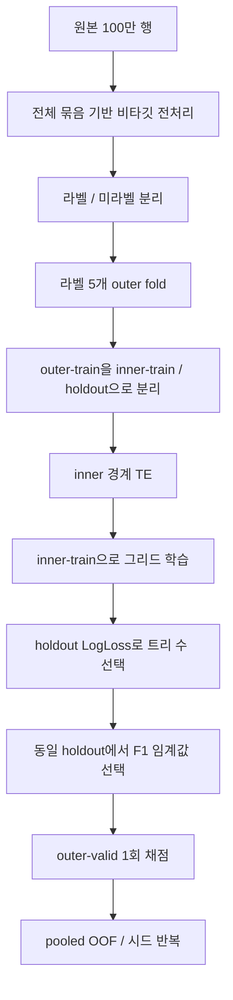

# 현재 파이프라인의 데이터 사용 계약

2026-09-16. 현재 코드 확인에 근거한 범위 명세와 설계 판단이다. 과거 진단 문서는 보존한다.

## 적용 목적

현재 결과는 **주어진 정적 데이터 묶음의 특성을 함께 활용한 라벨행 교차검증** 결과다.
실시간 항공편 예측, 미래 기간 테스트, 독립 외부 테스트 성능을 의미하지 않는다.
전처리는 원본 100만 행에서 수행하고, 학습·평가는 라벨 255,001행에서 한다.
미라벨의 Delay를 0으로 채우지 않는다. P4/P6에는 pseudo-label을 사용하지 않는다.

## 계산 종류별 정보 범위

| 연산 | 현재 참조 범위 | 현재 해석 | 미래 입력에 적용할 때 필요한 계약 |
|---|---|---|---|
| 공항/항공사 코드 대응 사전 | 원본 전체 관측 쌍 | clean은 관측 대응이 유일한 키만 대치 | 학습 시 사전 저장; 새/충돌 키는 결측 유지 |
| HHMM·순환·거리/시간차 변환 | 해당 행 | 행 단위 변환; 시간대·연도는 복원하지 않음 | 같은 파싱 규약과 결측 플래그 적용 |
| Route/전역 시간차 중앙값 | 원본 전체 | 검증 입력의 분포도 반영하는 집계 | 학습에서 fit, 적용에서는 저장값만 조회; 미관측 Route는 저장 전역값 사용 |
| Traffic | 전체 묶음의 월·일·공항·시각별 건수 | 표본 내 행 수 proxy | 예측 시점에 확보된 운항계획 등 출처 정의부터 필요. 단순 저장 사전으로 미래 혼잡을 대체할 수 없음 |
| 범주 vocabulary | 라벨+미라벨 전체 | 공동 범주 공간 | 학습 category 목록 저장, 미관측 범주 처리와 열 순서 고정 |
| Target encoding | outer-train 내부 inner-train 라벨 | inner-train은 OOF, holdout/outer-valid는 inner-train 기준 | TE 사전·prior·평활 설정을 모델과 함께 저장 |
| 트리 수·F1 임계값 | inner-holdout | 같은 holdout으로 두 선택 가능; 그 점수는 성능 추정치가 아님 | 모델·임계값 함께 버전 관리 |
| Honest teacher/pseudo | student inner-train 안 | student holdout 라벨 제외 | teacher 입력 범위와 pseudo 선정 기록 필요 |
| 최종 점수 | outer-valid | 선택에 쓰지 않은 행에서 pooled OOF | 독립 미래 검증으로 확대하려면 날짜 규약과 분할을 새로 확정 |

전체 데이터의 X를 보는 집계는 정답 누수와 구별되지만, 미래 예측 정보 가용성을 보장하지 않는다.
지금의 80% inner-train 모델을 outer-train 100%로 재학습하는 것은 별도 프로토콜 변경이다.
현재는 선택된 모델을 그대로 채점한다. 임의로 재학습해 기존 결과와 같은 실험이라고 부르지 않는다.

## 실제 순서

## 구조 검토 결과

**현재 규모에는 기존 모듈 구성이 충분하다.** `features.py`는 변환, `cv.py`는 분할·선택·평가,
`run_store.py`는 결과 저장 검증, `rerun_all_phases.py`는 실험 조합과 실행을 담당한다.
새 프레임워크나 서비스 레이어를 추가하지 않는다. 보고서 분석은 `notebooks/report_preprocessing_experiments.py`
등 별도 스크립트로 이미 분리되어 있다. 실행 스크립트의 과거 비교 보고서 함수를 옮기는 것은
현재 동작상 결함을 해결하지 않으므로 이번에는 유지했다. 이는 미완료 수정이 아니라 검토 후 변경 불필요 판단이다.

| 과거 감사 항목 | 현재 코드에서 확인한 상태 | 남은 제한 |
|---|---|---|
| 구 CSV 재개/스키마 오염 | `read_rows`의 스키마·run_id 검사, `upsert_row`의 임시파일 교체 | 단일 writer 전제. 같은 경로에 병렬 실행 금지 |
| teacher의 TE/holdout 경계 | teacher도 nested grid; factory가 student inner-train만 받음 | 최신 전수 성능 실험에 P5는 포함하지 않음 |
| cross-fold 임계값 의존 | runner가 inner-holdout 임계값을 `evaluate_oof`에 전달 | legacy API는 과거 호환용. 이름만 보고 동일 평가라고 가정 금지 |
| 과거 원인 설명 오독 | 이후 addendum과 최신 구현 보고서를 연결 | 과거 문서는 역사 기록이며 현행 사양 아님 |

## 입력 및 실행 조건

- 실제 `data/train.csv` 필요. 파일 SHA256·코드·설정·라이브러리 버전을 결과와 연결한다.
- 알려진 Delay는 `Delayed`/`Not_Delayed`만 허용. target 결측은 미라벨이다.
- ID는 행 추적에 사용하고 모델에서 제거한다. 원본의 고유 ID를 실제 운항편 키로 단정하지 않는다.
- 저장된 스키마/지문이 다르면 새 출력 이름을 쓴다. `--force`도 검증을 우회하지 않는다.
- 과거 실험과 clean 묶음·개별 변경 조건을 다른 phase_key로 보존한다.
- 이번 분석은 원본·기존 실험 산출물을 수정하지 않고 신규 파일만 작성한다.

## 배포가 실제 요구될 때의 최소 변경

그때는 `fit(raw_train)`/`transform(raw_new, state)` 경계를 추가하고 state에 코드 매핑,
Route/전역 통계, category 목록, 최종 열 목록을 저장한다. Traffic은 출처 계약 확정 전 제외 후보로 둔다.
새 배치의 구성이나 다른 행을 바꿔도 한 행의 변환이 변하지 않는지, 미관측 범주·모두 결측인 노선이
오류 없이 처리되는지 테스트한다. 최종 모델 저장·로드, 예측 출력 ID 정렬, 임계값 보존도 필요하다.
이 변경은 새로운 일반화 조건이므로 현행 결과의 단순 코드 정리로 취급하지 않고 다시 평가한다.

## 근거

- `rerun_all_phases.py::build_features`, `_teacher_fit_predict`, `_honest_pseudo_factory`, `configure_run`
- `src/cv.py::run_fold_nested_grid`, `evaluate_oof`
- `src/run_store.py::read_rows`, `upsert_row`
- [전체 데이터 재평가](preprocessing_full_evaluation.md), [라벨 분포 진단](label_coverage_review.md)
