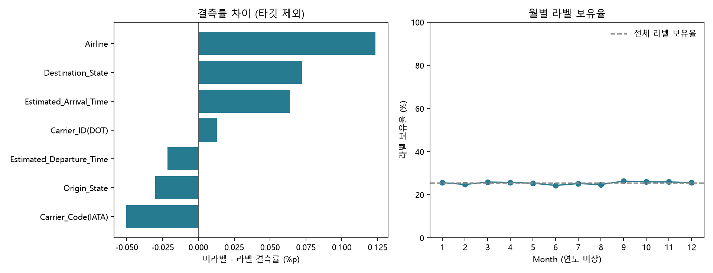

# 항공편 지연 분류 — 전처리 중심 모델링 보고서

## 0. 표지

프로젝트: 항공편 지연 분류와 재현 가능한 전처리. 작성일: 2026-09-16. 버전: 현행 검증 정리 v1.
작성자/팀명: 제출자가 기입. 원본 `머신러닝 모델링 프로젝트 보고서 템플릿.docx`의 0~7번 구성을 참고했다.
이 문서는 양식을 반영한 Markdown 초안이며 원본 Word 양식은 수정하지 않았다.

## 1. 목적 및 개요

주어진 항공편 레코드의 지연 여부를 분류하되, 결측·시간·범주 정보를 타당하게 처리하고
검증 라벨 유입을 막는 재현 가능한 실험을 만드는 것이 목적이다. 전처리 변경의 성공을
점수 상승만으로 정의하지 않는다. 불확실한 값을 사실처럼 채우지 않는 것이 이번 변경의 핵심이다.

### 1-1. 추진 배경

기존 코드는 항공사 코드의 첫 관측값으로 결측을 대치하고, 0분 시간차에 작은 값을 더해
나누며, 일부 미상 시각을 순환 피처에서 정오로 표현했다. 이런 처리는 결측률을 낮추더라도
데이터의 의미를 보장하지 않는다. 과거 ES 붕괴·TE 경계 문제도 별도로 확인되어 평가 경로를 수정했다.

### 1-2. 문제 정의

CSV 한 행을 단위로 `Delay`를 이진 분류한다. ID 유일성만으로 실제 운항편 중복이 없다고 단정하지 않는다.
프로젝트 PLAN은 Macro F1·LogLoss, 보조 ROC-AUC를 명시한다. 이 보고서는 F1을 먼저 비교하고
LogLoss/AUC를 병기한다. 트리 수는 내부 LogLoss, 임계값은 내부 Macro F1으로 선택한다.
0.002는 프로젝트의 실무 참고값이며 통계적 유의수준이 아니다.

## 2. 데이터 구조 파악

### 2-1. 데이터 개요

원본은 프로젝트가 보유한 `data/train.csv` 1,000,000행 × 19열이다. 라벨 255,001행,
미라벨 744,999행이며 라벨 중 지연은 45,000건(17.6470%)이다.
Month는 1~12지만 연도·시간대·정확한 수집기간 및 갱신주기는 이 파일로 확정할 수 없다.
외부 날씨와 일별 실제 날짜를 연결하지 않았으며 날씨 피처를 현재 결과에 사용하지 않았다.
데이터 원 출처·재배포 권한·업무 운영 권한은 별도 원천 계약 확인 항목이다.

원본 컬럼별 타입·결측·고유값은 [스키마 전수표](label_coverage/schema.csv),
기존 설명은 [원본 컬럼 프로파일](preprocessing_review/raw_column_profile.csv)에 있다.
관측 타입/범위와 업무상 허용 규약은 구별한다. ID·기체번호 등 식별자는 분석에 필요 범위만 사용하며
개인정보 해당 여부나 외부 공개 권한을 자동으로 단정하지 않는다.

### 2-2. 데이터 특징

설명변수는 항공사·공항·노선·거리·월·시각 및 파생 피처다. 타깃은 미라벨과 음성을 구분한다.
원본 ID 중복·완전 행 중복은 이번 전수 검사에서 모두 0건이다.
시간대 미보정 시간차를 비행시간으로 부르지 않고, 거리/시간차를 실제 속도로 해석하지 않는다.
0분이나 긴 시간차가 있다는 이유만으로 행을 삭제하지 않는다.
누수는 정답의 정보 경계와 예측 시점의 입력 가용성으로 나눠 확인한다.

## 3. 데이터 전처리

원본 → 코드 간 결측 대치 → Route·시각·시간차 → P6 시간 복원/Traffic →
순환·비율 피처 → 불필요 열 제거 → 라벨/미라벨 분리·범주 코드 → outer/inner 분할 → inner TE.
전체 묶음 집계의 한계는 [데이터 사용 계약](pipeline_data_contract.md)에 따로 명시했다.

### 3-1. 현행 clean 전처리 결정표

| 항목 | 채택 규칙 | 확인한 결과 | 해석 한계 |
|---|---|---|---|
| 항공사·코드 결측 | 관측 대응이 유일한 키만 채움 | Airline 대치 97,056→30,608건; 모호한 대치 66,448건 중단 | 관측상 유일함이 외부 정답을 보장하지 않음 |
| 순서 의존 | 첫 행 선택 제거 | 기존 순서 반전 27,536행 차이→clean 0행 | 기존 전수 검증 기록에 근거 |
| 시간차 | `Local_Time_Gap_Minutes`로 의미 표시 | 0분 370행 보존 | 시간대 미보정 |
| 거리/시간차 | 유한한 양수 분모만 나눔 | 최대 비율 75,800,000→581 | 581도 실제 속도가 아님 |
| 시각 미상 | NaN·missing flag | P6 미상 11,688행을 정오와 구별 | 시각을 복원했다는 의미 아님 |
| 복원 이력 | 원래 시각/시간차 결측 플래그 | 실제 관측과 대치 구별 | 중앙값 대치는 추정값 |
| 중복·이상치 | 이번 이유로 행 삭제 없음 | 라벨/양성 수 유지 | 실제 운항 중복은 별도 확인 필요 |
| 스케일링 | 트리 모델 경로에서 미적용 | 기존과 동일 | 다른 모델에 일반화하지 않음 |

근거: [clean 구현·전수 검증](preprocessing_clean_implementation.md).
결측을 덜 채운 것은 정보 부족을 숨기지 않기 위한 결정이다. 원본 관측 항공사명은 변경하지 않는다.

실제 행 예시: `TRAIN_000007`은 IATA가 UA이고 Airline은 원래 결측이다. 기존 규칙은
SkyWest Airlines Inc.를 채우지만 clean은 결측을 유지한다. UA 코드만으로 이 행의 실제 항공사를
확정할 수 없기 때문이다. `TRAIN_000056`의 DL 코드도 기존에는 Delta Air Lines Inc.를 채우지만
관측 대응이 모호해 clean은 결측으로 남긴다. [실제 대치 전후 8행](current_imputation_examples.csv)에 원본 ID와 값을 보존했다.

### 3-2. 타깃 준비

`Not_Delayed=0`, `Delayed=1`; 결측 타깃은 학습 정답으로 쓰지 않는다.
spw는 적용하지 않고 inner-holdout에서 분류 임계값을 고른다.
라벨의 대표성은 별도 검사 대상이며 양성률 17.6470%를 미라벨의 실제 양성률로 옮겨 쓰지 않는다.

### 3-3. 피처 엔지니어링·누수 방지

Route, 시각·순환값, 현지 시각차와 거리 비율, 결측 이력, P6 표본 Traffic을 사용한다.
상수 Cancelled/Diverted 및 ID와 Phase별 중복·불필요 피처를 제거한다.
P4_clean은 TE 전 21개, P6_clean은 25개 피처다. TE는 inner-train 라벨로만 계산하며
inner-train OOF와 holdout/outer-valid용 변환을 구분한다.
최종 입력 열 목록은 [현행 입력 명세](current_pipeline_evidence.json)에 실행 결과로 저장했다.
피처 선택은 고정 Phase 정의이며 최신 점수를 보고 조합을 새로 최적화하지 않았다.

## 4. EDA

이번에는 라벨 유무에 따른 원본 데이터 분포를 전수 비교했다.
Airline 결측률의 차이는 미라벨−라벨 **+0.1235%p**로 타깃 제외 컬럼 중 절대 차이가 가장 컸다.
월·항공사·출발/도착 공항 중 최대 TV는 출발 공항 **0.018086**이었다.
TV는 구성비 차이 크기이며 통계적 합격선이 아니다. 관측된 주요 주변분포는 대체로 가깝지만 동일하지 않다.
Distance 평균은 라벨 779.95, 미라벨 785.49이고 표준화 평균 차이는 0.00939였다(거리 단위는 원천 규약 확인 필요).

Tail_Number의 TV는 0.071678로 더 크고, 미라벨 407행(0.054631%)의 기체번호가 라벨에 없었다.
고유값이 많은 변수는 표본 크기·희소성 영향을 받으므로 이 수치를 그대로 선택 편향이라 부르지 않는다.
예를 들어 도착 EUG의 라벨 보유율은 20.7721%(226/1,088)로 전체 25.5001%와 차이가 있다.
많은 그룹 중 극단값을 추린 표이며 단일 그룹 차이로 라벨 선정 원인을 주장하지 않는다.

월별 비교는 연도 미상의 구성 비교다. 시간 추세 또는 미래 검증이 아니다.
타깃과 그룹의 관계는 라벨행 내부 `observed_delay_rate`로만 계산했다.
인과 분석·다변량 대표성·무작위 라벨 결측은 입증하지 않았다.
[실행 노트북](../notebooks/label_coverage_review.ipynb)과 [진단 보고서](label_coverage_review.md)에 전체 표와 근거가 있다.

## 5. 모델링

공통 모델은 LightGBM 이진 분류다. 범주·비선형 관계를 처리하는 현재 기준 모델을 유지했고,
양식에 세 모델 칸이 있다는 이유로 미실행 알고리즘을 추가하지 않았다.
환경·파라미터는 [실행 명세](current_pipeline_evidence.json) 및 기존 실행 CSV의 run_metadata에 기록했다.
주요 값은 learning_rate=0.05, num_leaves=63, max_depth=8, colsample_bytree=0.8이다.
`subsample=0.8` 설정도 기록돼 있으나 이것만으로 행 서브샘플링이 활성화됐다고 주장하지 않는다.

### 5-1. P4 / P4_clean

동일 Phase 4 정의에서 clean 전처리 묶음의 효과를 비교한다. 시간 복원/Traffic은 없다.

### 5-2. P6_fixed / P6_clean

시간 복원과 미상 시각을 제외한 Traffic을 포함한다. 두 조건에서 공통 검증 프로토콜을 사용한다.

### 5-3. 개별 변경 실험

대치만·비율만·결측 표현만 바꾼 6개 조건을 추가했다. 총 10개 조건 × 3시드 × 5-fold다.
각 outer-train의 80%를 실제 모델 학습에 쓰고 20%를 트리 수/임계값 선택에 사용한다.
그리드 `[10,25,50,75,100,150,300,600]`를 ES 없이 학습하며 outer-valid에서 선택하지 않는다.

## 6. 모델 평가 및 개선

### 6-1. 비교 결과

아래는 3시드 pooled OOF 지표의 평균이다. 독립 테스트 점수는 아직 없다.

| 조건 | Macro F1 | LogLoss | ROC-AUC |
|---|---:|---:|---:|
| P4 | 0.574916 | 0.448016 | 0.641194 |
| P4_clean | 0.574541 | 0.448216 | 0.640596 |
| P6_fixed | 0.576062 | 0.447597 | 0.642757 |
| P6_clean | 0.575685 | 0.447577 | 0.642804 |

새 전처리의 F1 평균 차이는 P4 −0.000375, P6 −0.000377이다.
성능 향상을 확인하지 못했으며 작은 차이가 통계적 동등성 또는 확정적 악화를 의미하지 않는다.
전체 조건·시드별 학습 시간·표준편차·임계값·혼동행렬은 [현행 실행 명세](current_pipeline_evidence.json)와
[전수 실험 보고서](preprocessing_full_evaluation.md)에 연결했다.

### 6-2. 선택 모델 상세 평가

성능 비교 기준은 평균 F1이 가장 높은 P6_fixed로 기록한다. 전처리 설명의 권장 경로는 P6_clean이며
이를 성능 개선 모델 또는 최종 배포 모델로 승격하지 않는다. 두 기준의 목적을 구별한다.
150개 outer fold의 임계값은 0.22~0.24로 하한 0.10에 걸리지 않았다.
피처 중요도에 관한 새로운 인과·설명가능성 주장은 이번에 추가하지 않았다.

### 6-3. 예측 오차 사례

현재 집계 CSV에는 혼동행렬이 있지만 행별 OOF 예측은 없어 특정 ID의 오분류를 검증할 수 없다.
실제값·예측값·원인을 지어내 양식에 채우지 않는다. 다음 모델 실행에서 ID/fold/seed/probability/threshold를
저장하면 오분류 사례를 추적할 수 있다. 이 자료를 위해 이번에 30회 학습을 반복하지 않았다.

### 6-4. 개선 과정과 잔여 한계

목적함수 불일치 수정 → inner TE 경계 차단 → nested grid·내부 임계값 → teacher 경계 수정 →
결측·시간차 의미 개선 → 동일 조건 3시드 재검증 순으로 진행했다.
과거 붕괴 프로토콜의 Phase 순위는 이번 일부 재평가로 되살아나지 않는다.
데이터 의미 개선은 유지할 근거가 있으나 미라벨·미래 환경의 성능은 미확인이다.

## 7. 활용 방안

현재 활용은 전처리 의사결정과 검증 설계를 설명하는 교육용 배치 분석이다.
실제 항공 운영에서의 의사결정 효과·비용 절감은 측정하지 않았다.

### 7-1. 운영 및 서빙

현재 실시간 API·최종 모델 서빙은 없다. 전체 데이터 집계는 정적 묶음이라는 가정을 전제로 한다.
미래 예측이 필요해질 때 통계 fit/transform, 미관측 범주, Traffic 원천, 모델 저장 계약을 추가한다.
현재 규모에서 서비스 계층·워크플로 엔진을 도입하지 않는다.

### 7-2. BI / 리포트 연계

실행된 노트북/HTML과 CSV 증거로 충분하다. 별도 BI 서비스는 현재 범위에서 해당 없음이다.

### 7-3. 모니터링·리스크 관리

새 데이터가 들어올 때 스키마·타깃 값·결측률·미관측 범주·라벨 보유율을 비교한다.
이번 분포 수치를 고정 경보 임계값으로 바로 쓰지 않는다. 시드 표준편차를 드리프트 경보로 오용하지 않는다.
운영 담당자·갱신 주기·장애 대응·접근권한은 배포 요구가 생길 때 정의할 항목이다.
코드/데이터/설정 지문과 신규 출력 이름으로 실험을 구분하고 단일 writer로 저장한다.

## 제출 전 확인할 항목과 읽는 순서

작성자/팀명, 원천 수집/이용 권한, 예정/실제 시각의 정의는 제출자가 원 자료로 확인해야 한다.
새 알고리즘·외부 테스트·오분류 사례·서빙은 미수행/해당 없음으로 남겼다.
발표 순서: 이 문서 1~3절 → [전처리 실행 설명](preprocessing_walkthrough.html)(수정 전 진단임에 유의)
→ [clean 변경 증거](preprocessing_clean_implementation.md) → 4절 분포 진단 → 6절 재학습 결과.
과거 문서의 “미실행/수정 검토”는 작성 시점 기록이며 현행 상태는 이 문서와 최신 실행 증거를 따른다.
